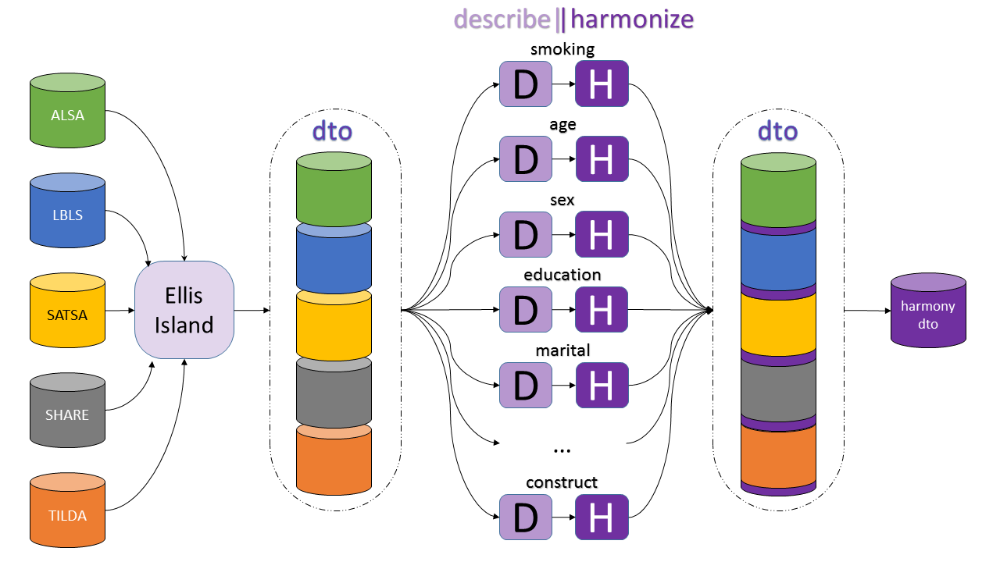

# ialsa-2016-groningen 
*Maelstrom Harmonization Workshop. Assessing the impact of different harmonization procedures on the analysis results from several real datasets.*

**Welcome** - [letter of invitation](./documentation/log/invite.pdf) - [list of participants](./documentation/log/participants.pdf) - [summary of the agenda](./documentation/log/agenda.pdf) - [directions and locations](./documentation/log/directions.pdf) 

**Documentation** : - [Maelstrom Obiba Wiki](http://wiki.obiba.org/display/MHSA2016/Common+datasets+to+be+analyzed) - [source data objects](./data/contents.md)  - [resources and references](./documentation/resources-references.md) - [reproducibility instructions](./utility/reproducibility-instructions.md) - [general instructions](./documentation/general-instructions.md) 

### Focus
> Habits, prevalence of, and factors associated with smoking among older adults.  

### Overview
- Data provisioning documentation : the [Ellis Island](https://rawgit.com/IALSA/ialsa-2016-groningen-public/master/0-ellis-island.html) report.
- Full list of [variables and their labels ](https://github.com/IALSA/ialsa-2016-groningen/blob/master/data/meta/names-labels-live/names-labels-live.csv) used in the exercise, as extracted from the raw source files. This file was augmented on Ellis Island with [additional meta-data](https://rawgit.com/IALSA/ialsa-2016-groningen-public/master/view-meta-data.html).     

- [Harmonization rules](https://github.com/IALSA/ialsa-2016-groningen/tree/master/data/meta/h-rules) : mapping pattern of responses to values of the harmonized variables.

### Measures and Harmonization

- Current smoking status  ([describe](https://rawgit.com/IALSA/ialsa-2016-groningen-public/master/describe-smoking.html), [harmonize](https://rawgit.com/IALSA/ialsa-2016-groningen-public/master/harmonize-smoking.html))  
- age  ([describe](https://rawgit.com/IALSA/ialsa-2016-groningen-public/master/describe-age.html), [harmonize](https://rawgit.com/IALSA/ialsa-2016-groningen-public/master/harmonize-age.html))   
- sex  ([describe](https://rawgit.com/IALSA/ialsa-2016-groningen-public/master/describe-sex.html), [harmonize](https://rawgit.com/IALSA/ialsa-2016-groningen-public/master/harmonize-sex.html))  
- marital status   ([describe](https://rawgit.com/IALSA/ialsa-2016-groningen-public/master/describe-marital.html), [harmonize](https://rawgit.com/IALSA/ialsa-2016-groningen-public/master/harmonize-marital.html))  
- educational level  ([describe](https://rawgit.com/IALSA/ialsa-2016-groningen-public/master/describe-education.html), [harmonize](https://rawgit.com/IALSA/ialsa-2016-groningen-public/master/harmonize-education.html))    
- working status  ([describe](https://rawgit.com/IALSA/ialsa-2016-groningen-public/master/describe-work.html), [harmonize](https://rawgit.com/IALSA/ialsa-2016-groningen-public/master/harmonize-work.html)) 
- alcohol consumption ([describe](https://rawgit.com/IALSA/ialsa-2016-groningen-public/master/describe-alcohol.html), [harmonize](https://rawgit.com/IALSA/ialsa-2016-groningen-public/master/harmonize-alcohol.html))   
- level of physical activity  ([describe](https://rawgit.com/IALSA/ialsa-2016-groningen-public/master/describe-physact.html), [harmonize](https://rawgit.com/IALSA/ialsa-2016-groningen-public/master/harmonize-physact.html))  
- perceived health  ([describe](https://rawgit.com/IALSA/ialsa-2016-groningen-public/master/describe-health.html), [harmonize](https://rawgit.com/IALSA/ialsa-2016-groningen-public/master/harmonize-health.html))     
- physique  ([describe](https://rawgit.com/IALSA/ialsa-2016-groningen-public/master/describe-physique.html), [harmonize](https://rawgit.com/IALSA/ialsa-2016-groningen-public/master/harmonize-physique.html))     
	
#### Harmonized data
- review currenlty available harmonized variables in a [combined dataset](https://rawgit.com/IALSA/ialsa-2016-groningen-public/master/harmonized-data.html)

#### Procedure map

### Results
- [2016-04-21 Groningen](https://rawgit.com/IALSA/ialsa-2016-groningen-public/master/2016-04-21-groningen-exercise-brief.pdf) ( [detailed transitions](https://rawgit.com/IALSA/ialsa-2016-groningen-public/master/2016-04-21-groningen-exercise.pdf)) - presentation during the workshop in Groningen.  
- [Groningen exercise report](https://rawgit.com/IALSA/ialsa-2016-groningen-public/master/exercise-report.html) (updated 2016-06-06)
- [Tables of results](https://rawgit.com/IALSA/ialsa-2016-groningen-public/master/results-tables.html) - stand alone report. Appendix containing a table for every estimated model. ([no sidebar](https://rawgit.com/IALSA/ialsa-2016-groningen/55497162623d68a9c41313a48cfc71a9535657ee/models/exercise-report-3/results-tables-nosidbar.html), [pdf](https://rawgit.com/IALSA/ialsa-2016-groningen/55497162623d68a9c41313a48cfc71a9535657ee/models/exercise-report-3/results-tables.pdf), [docx](https://rawgit.com/IALSA/ialsa-2016-groningen/55497162623d68a9c41313a48cfc71a9535657ee/models/exercise-report-3/results-tables.docx))

#### Presentations

