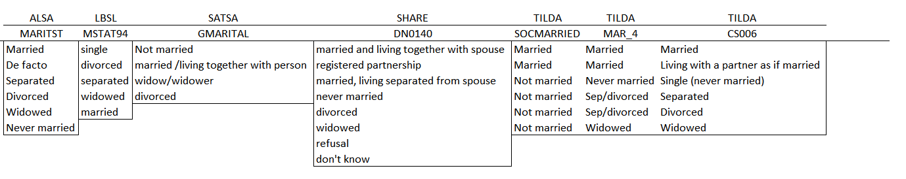
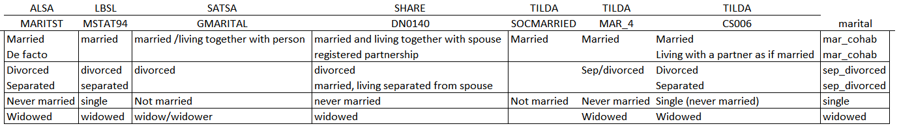

<!-- These two chunks should be added in the beginning of every .Rmd that you want to source an .R script -->
<!--  The 1st mandatory chunck  -->
<!--  Set the working directory to the repository's base directory -->
```{r, echo=F, message=F} 
#Don't combine this call with any other chunk 
# cat("Working directory: ", getwd()) # check where you are
  library(knitr)
# Rmd is in "./reports/reportA/reportA.Rmd", but now the root is "./"
  knitr::opts_knit$set(root.dir='../../') 
```

<!--  The 2nd mandatory chunck  -->
<!-- Set the report-wide options, and point to the external code file. -->
```{r set_options, echo=F}
# set options shared by all chunks
opts_chunk$set(
  results='show', 
  message = TRUE,
  comment = NA, 
  tidy = FALSE,
  fig.height = 9, 
  fig.width = 13, 
  out.width = "700px",
  fig.path = 'smoke_now/',     
  dev = "png",
  dpi = 400
  # fig.path = 'figure_pdf/',     
  # dev = "pdf"#,
  # dev.args=list(pdf = list(colormodel = 'cmyk'))
)
echoChunks <- TRUE
options(width=120) #So the output is 50% wider than the default.
# connect to the file with the underlying R script  
read_chunk("./models/exercise-report-2/exercise-report.R") 
```

This reports narrates the results of modeling in the Groningen Harmonization Exercise


<!-- Load 'sourced' R files.  Suppress the output when loading packages. --> 
```{r load-packages, echo=echoChunks, message=FALSE}
```


<!-- Load the sources.  Suppress the output when loading sources. --> 
```{r load-sources, echo=echoChunks, message=FALSE}
```


<!-- Load any Global functions and variables declared in the R file.  Suppress the output. --> 
```{r declare-globals, echo=echoChunks, results='show', message=FALSE}
```

<!-- Declare any global functions specific to a Rmd output.  Suppress the output. --> 
```{r, echo=echoChunks, message=FALSE}
#Put code in here.  It doesn't call a chunk in the codebehind file.
```
> This report is a record of interaction with a data transfer object (dto) produced by `./manipulation/0-ellis-island.R`. 

The next section recaps this script, exposes the architecture of the DTO, and demonstrates the language of interacting with it.   

# Exposition

## Ellis Island

> All data land on Ellis Island.

The script `0-ellis-island.R` is the first script in the analytic workflow. It accomplished the following: 

- (1) Reads in raw data files from the candidate studies   
- (2) Extract, combines, and exports their metadata (specifically, variable names and labels, if provided) into `./data/shared/derived/meta-data-live.csv`, which is updated every time Ellis Island script is executed.   
- (3) Augments raw metadata with instructions for renaming and classifying variables. The instructions are provided as manually entered values in `./data/shared/meta-data-map.csv`. They are used by automatic scripts in later harmonization and analysis.  
- (4) Combines unit and metadata into a single DTO to serve as a starting point to all subsequent analyses.   

<!-- Load the datasets.   -->
```{r load-data, echo=T, results='asis', message=FALSE}
```

<!-- Inspect the datasets.   -->
```{r inspect-data, echo=T, results='show', message=FALSE}
```


## Meta
```{r meta-table, echo=TRUE, results='show', message=FALSE}
```

<!-- Tweak the datasets.   -->
```{r tweak-data, echo=echoChunks, results='show', message=FALSE}
```

<!-- Basic table view.   -->
```{r basic-table, echo=TRUE, results='show', message=FALSE}
```


## Assembly
 The dto containing harmonized operationalizations is queried to assemble analysis-ready dataset.

```{r assemble, echo=TRUE, results='show', message=FALSE}
```

This dataset, which includes harmonized variables, will be used to fit the models. 

# Harmonization rules

This section narrates the harmonization rules applied to candidate variables from each study and provides the descriptives of harmonized variables


## Smoking 
View [descriptives : smoking](/https://rawgit.com/IALSA/ialsa-2016-groningen-public/master/describe-smoking.html) for closer examination of each variable that contributed to the computation of the harmonized variable. 

#### **Are you a smoker presently?**  - `smoke_now`

  - `0` - `FALSE` - *healthy* - Reference group  
  - `1` - `TRUE` - *unhealthy* - Risk factor


```{r basic-frequencies-criteria-dv-1, echo=echoChunks}
```


#### **Have you ever smoked?**  - `smoked_ever`

  - `0` - `FALSE` - *healthy* - Reference group  
  - `1` - `TRUE` - *unhealthy* - Risk factor

The specific [harmonization rules](https://github.com/IALSA/ialsa-2016-groningen/tree/master/data/meta/h-rules) have been encoded over the [observed frequencies](https://github.com/IALSA/ialsa-2016-groningen/tree/master/data/meta/response-profiles-live) of unique response vectors.  

  
```{r basic-frequencies-criteria-dv-2, echo=echoChunks}
```

## Age

View [descriptives : age](https://rawgit.com/IALSA/ialsa-2016-groningen-public/master/describe-age.html) for closer examination of raw variables. For each study, three variables have been formulated and computed:  

* `year_of_wave` - Calendar year in which the measurement wave occured. These data values are added manually, after consulting respective study's documentation.     
* `year_born` - Calendar year in which the respondent was born    
* `age_in_years` - Age of respondent in years    

```{r basic-frequencies-predictors-1, echo=TRUE}
```


## Sex
View [descriptives : sex](https://rawgit.com/IALSA/ialsa-2016-groningen-public/master/describe-sex.html) for closer examination of each variable that contributed to the computation of the harmonized variable. f unique response vectors.  

#### **Is respondent female?**  - `female`

  - `0` - `FALSE` - male - Reference group  
  - `1` - `TRUE` - female  

The specific [harmonization rules](https://github.com/IALSA/ialsa-2016-groningen/tree/master/data/meta/h-rules) have been encoded over the [observed frequencies](https://github.com/IALSA/ialsa-2016-groningen/tree/master/data/meta/response-profiles-live) 

```{r basic-frequencies-predictors-2, echo=echoChunks}
```


## Education
View [descriptives : education](https://rawgit.com/IALSA/ialsa-2016-groningen-public/master/describe-education.html) for closer examination of each variable that contributed to the computation of the harmonized variable. 

#### **Highest level of education achieved**  - `educ3`
  - `-1` - `less then high school` 
  - `0` - `high school` -  Reference group 
  - `1` - `more than high school`

The specific [harmonization rules](https://github.com/IALSA/ialsa-2016-groningen/tree/master/data/meta/h-rules) have been encoded over the [observed frequencies](https://github.com/IALSA/ialsa-2016-groningen/tree/master/data/meta/response-profiles-live) of unique response vectors.     
  
```{r basic-frequencies-predictors-3, echo=echoChunks}
```


## Marital status
View [descriptives : marital](https://rawgit.com/IALSA/ialsa-2016-groningen-public/master/describe-marital.html) for closer examination of each variable that contributed to the computation of the harmonized variable. 

The responses to variables loading on the construct `marital` are as such:


After reorganizing the possible repsonses, the following clustering has emerged



After reviewing descriptives and relevant codebooks, the following operationalization of the harmonized variables have been adopted:

#### **Current marital status**  - `marital`

  - `-1` - `mar_cohab` - married or cohabiting  
  - `0` - `single`- not married - REFERENCE group  
  - `1` - `widowed` - widowed  
  - `2` - `sep_divorced` - separated or divorced  

However, such categorization resulted in data sparseness: some categories were not populated heavily enough to allow for convergence during estimation. To address this, a simpler harmonization rule has been adopted :
  
#### **Current marital status**  - `single`

  - `0` - `FALSE` - married / living together - Reference group  
  - `1` - `TRUE` - single / lining along 
  
The specific [harmonization rules](https://github.com/IALSA/ialsa-2016-groningen/tree/master/data/meta/h-rules) have been encoded over the [observed frequencies](https://github.com/IALSA/ialsa-2016-groningen/tree/master/data/meta/response-profiles-live) of unique response vectors.   
  
```{r basic-frequencies-predictors-4, echo=echoChunks}
```


## Health (SR)
View [descriptives : health](https://rawgit.com/IALSA/ialsa-2016-groningen-public/master/describe-physact.html) for closer examination of each variable that contributed to the computation of the harmonized variable. 

#### **Does respondent report poor health?**  - `poor_health`
  - `0` - `FALSE` - Reference group
  - `1` - `TRUE` - Risk factor
  
The specific [harmonization rules](https://github.com/IALSA/ialsa-2016-groningen/tree/master/data/meta/h-rules) have been encoded over the [observed frequencies](https://github.com/IALSA/ialsa-2016-groningen/tree/master/data/meta/response-profiles-live) of unique response vectors. 

```{r basic-frequencies-predictors-5, echo=echoChunks}
```

## Physical activity
View [descriptives : physact](https://rawgit.com/IALSA/ialsa-2016-groningen-public/master/describe-physact.html) for closer examination of each variable that contributed to the computation of the harmonized variable. 

#### **Does respondent lead a sendentary lifestyle?**  - `sedentary`
  - `0` - `FALSE` - Reference group
  - `1` - `TRUE` - Risk factor
  
The specific [harmonization rules](https://github.com/IALSA/ialsa-2016-groningen/tree/master/data/meta/h-rules) have been encoded over the [observed frequencies](https://github.com/IALSA/ialsa-2016-groningen/tree/master/data/meta/response-profiles-live) of unique response vectors. 

The operationalization of this variable ***is not*** sensitive to the intensity of exercise. Any reponses indicating an activity at least as vigorous as ***walking*** generated values `TRUE` on the harmonized variable. 

```{r basic-frequencies-predictors-6, echo=echoChunks}
```


## Employment status
View [descriptives : work](https://rawgit.com/IALSA/ialsa-2016-groningen-public/master/describe-work.html) for closer examination of each variable that contributed to the computation of the harmonized variable. 

#### **Is respondent currently in the work force?**  - `current_work_2`
- `0` - `FALSE` - Reference group
- `1` - `TRUE` - Risk factor

The specific [harmonization rules](https://github.com/IALSA/ialsa-2016-groningen/tree/master/data/meta/h-rules) have been encoded over the [observed frequencies](https://github.com/IALSA/ialsa-2016-groningen/tree/master/data/meta/response-profiles-live) of unique response vectors.  

The operationalization of this variable ***does not*** distinguish between retired and unemployed statuses. 

```{r basic-frequencies-predictors-7, echo=echoChunks}
```

## Alcohol
View [descriptives : alcohol](https://rawgit.com/IALSA/ialsa-2016-groningen-public/master/describe-alcohol.html) for closer examination of each variable that contributed to the computation of the harmonized variable. 

#### **Does respondent currently consume alcohol?**  - `current_drink`
  - `0` - `FALSE`- Reference group
  - `1` - `TRUE`- Risk factor 

The specific [harmonization rules](https://github.com/IALSA/ialsa-2016-groningen/tree/master/data/meta/h-rules) have been encoded over the [observed frequencies](https://github.com/IALSA/ialsa-2016-groningen/tree/master/data/meta/response-profiles-live) of unique response vectors. 

The operationalization of this variable ***is not*** sensitive to the intensity of consumption: any indications of non-abstaining generated `TRUE` values on the harmonizaed variable. It also doesn't account for the history of consumption, reflecting only the present habits. 

```{r basic-frequencies-predictors-8, echo=echoChunks}
```


```{r load-estimated-models, echo=FALSE}
```

```{r define-modeling-functions, echo=FALSE}
```

```{r functions-to-make-results-table, echo=FALSE}
```

# Guide to Models

Each of the following models (`A`, `B`, `AA`, and `BB`) are fitted to the data from each study separately. When fitted to the pooled data, an additional predictor, `study_name` is added after the intercept. 


|predictors/model   | A | B |AA |BB |
|---|---|---|---|---|
|age              |age_in_years |age_in_years   |age_in_years   |age_in_years   |
|sex              |female       |female         |female         |female         |
|education        |educ3        |educ3          |educ3          |educ3          |
|marital status   |single       |single         |single         |single         |
|health           |             |poor_health    |               |poor_health    |
|physical activity|             |sedentary      |               |sedentary      |
|employment       |             |current_work   |               |current_work   |
|alcohol use      |             |current_drink_2|               |current_drink_2|
|interactions     |  --         | --            |all pairwise   |all pairwise   |


Odds-ratios with 95% confidence intervals are reported. 

# Within models
```{r report-results-within-models, echo=FALSE, results='hold', eval=T}
```

# Between models
```{r  report-results-between-models , echo=FALSE, results='hold', eval=T}
```


# Separate
```{r local-results-tables, echo=FALSE, results='hold', eval=T}
```

```{r compare-custom-and-subset-local, echo=FALSE, results='hold', eval=T}
```

## ALSA 
```{r local-results-alsa, echo=FALSE,  results='asis', eval=T}
```

```{r local-results-alsa-2, echo=FALSE,  results='show', eval=T}
```

## LBLS 
```{r local-results-lbsl, echo=FALSE,  results='asis', eval=T}
```

```{r local-results-lbsl-2, echo=FALSE,  results='show', eval=T}
```

## SATSA 
```{r local-results-satsa, echo=FALSE, results='asis', eval=T}
```

```{r local-results-satsa-2, echo=FALSE, results='show', eval=T}
```


## SHARE 
```{r local-results-share, echo=FALSE,  results='asis', eval=T}
```

```{r local-results-share-2, echo=FALSE,  results='show', eval=T}
```

## TILDA 
```{r local-results-tilda, echo=FALSE, results='asis', eval=T}
```

```{r local-results-tilda-2, echo=FALSE, results='show', eval=T}
```


# Pooled 
`study_name` is entered as a factor.  The data are pooled into the same dataset

```{r pooled-results-table-1, echo=F, eval=TRUE, results='asis'}
```

```{r pooled-results-table-2, echo=F, eval=TRUE, results='asis'}
```

```{r compare-custom-and-subset-pooled, echo=T, eval=TRUE, results='show'}
```


