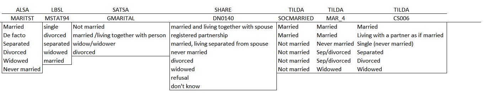

# Groningen Exercise Report

<!-- These two chunks should be added in the beginning of every .Rmd that you want to source an .R script -->
<!--  The 1st mandatory chunck  -->
<!--  Set the working directory to the repository's base directory -->


<!--  The 2nd mandatory chunck  -->
<!-- Set the report-wide options, and point to the external code file. -->


This reports narrates the results of modeling in the Groningen Harmonization Exercise


<!-- Load 'sourced' R files.  Suppress the output when loading packages. --> 

```r
# Attach these packages so their functions don't need to be qualified: http://r-pkgs.had.co.nz/namespace.html#search-path
library(magrittr) # enables piping : %>% 
# library(ggplot2)
# library(glmulti)
# library(rJava)
# require(MASS)

# Verify these packages are available on the machine, but their functions need to be qualified: http://r-pkgs.had.co.nz/namespace.html#search-path
requireNamespace("testit")# For asserting conditions meet expected patterns.
requireNamespace("ggplot2") # graphing
requireNamespace("tidyr") # data manipulation
requireNamespace("dplyr") # Avoid attaching dplyr, b/c its function names conflict with a lot of packages (esp base, stats, and plyr).
requireNamespace("plyr")
```


<!-- Load the sources.  Suppress the output when loading sources. --> 

```r
# Call `base::source()` on any repo file that defines functions needed below.  Ideally, no real operations are performed.
source("./scripts/common-functions.R") # used in multiple reports
source("./scripts/graph-presets.R") # fonts, colors, themes 
source("./scripts/graph-logistic.R")
```


<!-- Load any Global functions and variables declared in the R file.  Suppress the output. --> 


<!-- Declare any global functions specific to a Rmd output.  Suppress the output. --> 

```r
#Put code in here.  It doesn't call a chunk in the codebehind file.
```
> This report is a record of interaction with a data transfer object (dto) produced by `./manipulation/0-ellis-island.R`. 

The next section recaps this script, exposes the architecture of the DTO, and demonstrates the language of interacting with it.   

# Exposition

## Ellis Island

> All data land on Ellis Island.

The script `0-ellis-island.R` is the first script in the analytic workflow. It accomplished the following: 

- (1) Reads in raw data files from the candidate studies   
- (2) Extract, combines, and exports their metadata (specifically, variable names and labels, if provided) into `./data/shared/derived/meta-data-live.csv`, which is updated every time Ellis Island script is executed.   
- (3) Augments raw metadata with instructions for renaming and classifying variables. The instructions are provided as manually entered values in `./data/shared/meta-data-map.csv`. They are used by automatic scripts in later harmonization and analysis.  
- (4) Combines unit and metadata into a single DTO to serve as a starting point to all subsequent analyses.   

<!-- Load the datasets.   -->

```r
# load the product of 0-ellis-island.R,  a list object containing data and metadata
dto <- readRDS("./data/unshared/derived/dto_h.rds")
```

<!-- Inspect the datasets.   -->

```r
# the list is composed of the following elements
names(dto)
```

```
[1] "studyName" "filePath"  "unitData"  "metaData" 
```

```r
# 1st element - names of the studies as character vector
dto[["studyName"]]
```

```
[1] "alsa"  "lbsl"  "satsa" "share" "tilda"
```

```r
# 2nd element - file paths of the data files for each study as character vector
dto[["filePath"]]
```

```
[1] "./data/unshared/raw/ALSA-Wave1.Final.sav"         "./data/unshared/raw/LBSL-Panel2-Wave1.Final.sav" 
[3] "./data/unshared/raw/SATSA-Q3.Final.sav"           "./data/unshared/raw/SHARE-Israel-Wave1.Final.sav"
[5] "./data/unshared/raw/TILDA-Wave1.Final.sav"       
```

```r
# 3rd element - is a list object containing the following elements
names(dto[["unitData"]])
```

```
[1] "alsa"  "lbsl"  "satsa" "share" "tilda"
```

```r
# each of these elements is a raw data set of a corresponding study, for example
dplyr::tbl_df(dto[["unitData"]][["lbsl"]]) 
```

```
Source: local data frame [656 x 39]

        id AGE94 SEX94  MSTAT94 EDUC94     NOWRK94  SMK94                                         SMOKE
     (int) (int) (int)   (fctr)  (int)      (fctr) (fctr)                                        (fctr)
1  4001026    68     1 divorced     16 no, retired     no                                  never smoked
2  4012015    94     2  widowed     12 no, retired     no                                  never smoked
3  4012032    94     2  widowed     20 no, retired     no don't smoke at present but smoked in the past
4  4022004    93     2       NA     NA          NA     NA                                  never smoked
5  4022026    93     2  widowed     12 no, retired     no                                  never smoked
6  4031031    92     1  married      8 no, retired     no don't smoke at present but smoked in the past
7  4031035    92     1  widowed     13 no, retired     no don't smoke at present but smoked in the past
8  4032201    92     2       NA     NA          NA     NA don't smoke at present but smoked in the past
9  4041062    91     1  widowed      7          NA     no don't smoke at present but smoked in the past
10 4042057    91     2       NA     NA          NA     NA                                            NA
..     ...   ...   ...      ...    ...         ...    ...                                           ...
Variables not shown: ALCOHOL (fctr), WINE (int), BEER (int), HARDLIQ (int), SPORT94 (int), FIT94 (int), WALK94 (int),
  SPEC94 (int), DANCE94 (int), CHORE94 (int), EXCERTOT (int), EXCERWK (int), HEIGHT94 (int), WEIGHT94 (int), HWEIGHT
  (int), HHEIGHT (int), SRHEALTH (fctr), smoke_now (lgl), smoked_ever (lgl), year_of_wave (dbl), age_in_years (dbl),
  year_born (dbl), female (lgl), marital (chr), single (lgl), educ3 (chr), current_work_2 (lgl), current_drink (lgl),
  sedentary (lgl), poor_health (lgl), bmi (dbl)
```


## Meta

```r
# 4th element - a dataset names and labels of raw variables + added metadata for all studies
dto[["metaData"]] %>%
  dplyr::select(study_name, name, item, construct, type, categories, label_short, label) %>%
  DT::datatable(
    class   = 'cell-border stripe',
    caption = "This is the primary metadata file. Edit at `./data/shared/meta-data-map.csv",
    filter  = "top",
    options = list(pageLength = 6, autoWidth = TRUE)
  )
```

<!--html_preserve--><div id="htmlwidget-3184" style="width:100%;height:auto;" class="datatables html-widget"></div>
<script type="application/json" data-for="htmlwidget-3184">{"x":{"filter":"top","filterHTML":"<tr>\n  <td>\u003c/td>\n  <td data-type=\"factor\" style=\"vertical-align: top;\">\n    <div class=\"form-group has-feedback\" style=\"margin-bottom: auto;\">\n      <input type=\"search\" placeholder=\"All\" class=\"form-control\" style=\"width: 100%;\"/>\n      <span class=\"glyphicon glyphicon-remove-circle form-control-feedback\">\u003c/span>\n    \u003c/div>\n    <div style=\"width: 100%; display: none;\">\n      <select multiple=\"multiple\" style=\"width: 100%;\">\n        <option value=\"alsa\">alsa\u003c/option>\n        <option value=\"lbsl\">lbsl\u003c/option>\n        <option value=\"satsa\">satsa\u003c/option>\n        <option value=\"share\">share\u003c/option>\n        <option value=\"tilda\">tilda\u003c/option>\n      \u003c/select>\n    \u003c/div>\n  \u003c/td>\n  <td data-type=\"factor\" style=\"vertical-align: top;\">\n    <div class=\"form-group has-feedback\" style=\"margin-bottom: auto;\">\n      <input type=\"search\" placeholder=\"All\" class=\"form-control\" style=\"width: 100%;\"/>\n      <span class=\"glyphicon glyphicon-remove-circle form-control-feedback\">\u003c/span>\n    \u003c/div>\n    <div style=\"width: 100%; display: none;\">\n      <select multiple=\"multiple\" style=\"width: 100%;\">\n        <option value=\"AGE\">AGE\u003c/option>\n        <option value=\"AGE94\">AGE94\u003c/option>\n        <option value=\"ALCOHOL\">ALCOHOL\u003c/option>\n        <option value=\"BEER\">BEER\u003c/option>\n        <option value=\"BEHALC.DRINKSPERDAY\">BEHALC.DRINKSPERDAY\u003c/option>\n        <option value=\"BEHALC.DRINKSPERWEEK\">BEHALC.DRINKSPERWEEK\u003c/option>\n        <option value=\"BEHALC.FREQ.WEEK\">BEHALC.FREQ.WEEK\u003c/option>\n        <option value=\"BEHSMOKER\">BEHSMOKER\u003c/option>\n        <option value=\"BH001\">BH001\u003c/option>\n        <option value=\"BH002\">BH002\u003c/option>\n        <option value=\"BH003\">BH003\u003c/option>\n        <option value=\"BH101\">BH101\u003c/option>\n        <option value=\"BH102\">BH102\u003c/option>\n        <option value=\"BH102A\">BH102A\u003c/option>\n        <option value=\"BH103\">BH103\u003c/option>\n        <option value=\"BH104\">BH104\u003c/option>\n        <option value=\"BH104A\">BH104A\u003c/option>\n        <option value=\"BH105\">BH105\u003c/option>\n        <option value=\"BH106\">BH106\u003c/option>\n        <option value=\"BH106A\">BH106A\u003c/option>\n        <option value=\"BH107\">BH107\u003c/option>\n        <option value=\"BH107A\">BH107A\u003c/option>\n        <option value=\"BR0010\">BR0010\u003c/option>\n        <option value=\"BR0020\">BR0020\u003c/option>\n        <option value=\"BR0030\">BR0030\u003c/option>\n        <option value=\"BR0100\">BR0100\u003c/option>\n        <option value=\"BR0110\">BR0110\u003c/option>\n        <option value=\"BR0120\">BR0120\u003c/option>\n        <option value=\"BR0130\">BR0130\u003c/option>\n        <option value=\"BR0150\">BR0150\u003c/option>\n        <option value=\"BR0160\">BR0160\u003c/option>\n        <option value=\"BTSM12MN\">BTSM12MN\u003c/option>\n        <option value=\"CHORE94\">CHORE94\u003c/option>\n        <option value=\"CS006\">CS006\u003c/option>\n        <option value=\"CURRWORK\">CURRWORK\u003c/option>\n        <option value=\"DANCE94\">DANCE94\u003c/option>\n        <option value=\"DM001\">DM001\u003c/option>\n        <option value=\"DN0030\">DN0030\u003c/option>\n        <option value=\"DN0100\">DN0100\u003c/option>\n        <option value=\"DN012D01\">DN012D01\u003c/option>\n        <option value=\"DN012D02\">DN012D02\u003c/option>\n        <option value=\"DN012D03\">DN012D03\u003c/option>\n        <option value=\"DN012D04\">DN012D04\u003c/option>\n        <option value=\"DN012D05\">DN012D05\u003c/option>\n        <option value=\"DN012D09\">DN012D09\u003c/option>\n        <option value=\"DN012DDK\">DN012DDK\u003c/option>\n        <option value=\"DN012DNO\">DN012DNO\u003c/option>\n        <option value=\"DN012DOT\">DN012DOT\u003c/option>\n        <option value=\"DN012DRF\">DN012DRF\u003c/option>\n        <option value=\"DN0140\">DN0140\u003c/option>\n        <option value=\"EDUC\">EDUC\u003c/option>\n        <option value=\"EDUC94\">EDUC94\u003c/option>\n        <option value=\"EP0050\">EP0050\u003c/option>\n        <option value=\"EXCERTOT\">EXCERTOT\u003c/option>\n        <option value=\"EXCERWK\">EXCERWK\u003c/option>\n        <option value=\"EXRTHOUS\">EXRTHOUS\u003c/option>\n        <option value=\"FIT94\">FIT94\u003c/option>\n        <option value=\"FR6ORMOR\">FR6ORMOR\u003c/option>\n        <option value=\"FREQALCH\">FREQALCH\u003c/option>\n        <option value=\"GALCOHOL\">GALCOHOL\u003c/option>\n        <option value=\"GAMTWORK\">GAMTWORK\u003c/option>\n        <option value=\"GBEERX\">GBEERX\u003c/option>\n        <option value=\"GBOTVIN\">GBOTVIN\u003c/option>\n        <option value=\"GD002\">GD002\u003c/option>\n        <option value=\"GDRLOTS\">GDRLOTS\u003c/option>\n        <option value=\"GENDER\">GENDER\u003c/option>\n        <option value=\"GEVRALK\">GEVRALK\u003c/option>\n        <option value=\"GEVRSMK\">GEVRSMK\u003c/option>\n        <option value=\"GEVRSNS\">GEVRSNS\u003c/option>\n        <option value=\"GEXERCIS\">GEXERCIS\u003c/option>\n        <option value=\"GFREQBER\">GFREQBER\u003c/option>\n        <option value=\"GFREQLIQ\">GFREQLIQ\u003c/option>\n        <option value=\"GFREQVIN\">GFREQVIN\u003c/option>\n        <option value=\"GGENHLTH\">GGENHLTH\u003c/option>\n        <option value=\"GHLTHOTH\">GHLTHOTH\u003c/option>\n        <option value=\"GHTCM\">GHTCM\u003c/option>\n        <option value=\"GLIQX\">GLIQX\u003c/option>\n        <option value=\"GMARITAL\">GMARITAL\u003c/option>\n        <option value=\"GPI\">GPI\u003c/option>\n        <option value=\"GSMOKNOW\">GSMOKNOW\u003c/option>\n        <option value=\"GSTOPALK\">GSTOPALK\u003c/option>\n        <option value=\"GVINX\">GVINX\u003c/option>\n        <option value=\"GWTKG\">GWTKG\u003c/option>\n        <option value=\"HARDLIQ\">HARDLIQ\u003c/option>\n        <option value=\"HEIGHT\">HEIGHT\u003c/option>\n        <option value=\"HEIGHT94\">HEIGHT94\u003c/option>\n        <option value=\"HHEIGHT\">HHEIGHT\u003c/option>\n        <option value=\"HLTHBTSM\">HLTHBTSM\u003c/option>\n        <option value=\"HLTHLIFE\">HLTHLIFE\u003c/option>\n        <option value=\"HWEIGHT\">HWEIGHT\u003c/option>\n        <option value=\"HWMNWK2W\">HWMNWK2W\u003c/option>\n        <option value=\"ID\">ID\u003c/option>\n        <option value=\"INT.YEAR\">INT.YEAR\u003c/option>\n        <option value=\"IPAQEXERCISE3\">IPAQEXERCISE3\u003c/option>\n        <option value=\"IPAQMETMINUTES\">IPAQMETMINUTES\u003c/option>\n        <option value=\"LSVEXC2W\">LSVEXC2W\u003c/option>\n        <option value=\"LSVIGEXC\">LSVIGEXC\u003c/option>\n        <option value=\"MAR_4\">MAR_4\u003c/option>\n        <option value=\"MARITST\">MARITST\u003c/option>\n        <option value=\"MSTAT94\">MSTAT94\u003c/option>\n        <option value=\"NOSTDRNK\">NOSTDRNK\u003c/option>\n        <option value=\"NOWRK94\">NOWRK94\u003c/option>\n        <option value=\"PH001\">PH001\u003c/option>\n        <option value=\"PH0020\">PH0020\u003c/option>\n        <option value=\"PH0030\">PH0030\u003c/option>\n        <option value=\"PH009\">PH009\u003c/option>\n        <option value=\"PH0120\">PH0120\u003c/option>\n        <option value=\"PH0130\">PH0130\u003c/option>\n        <option value=\"PH0520\">PH0520\u003c/option>\n        <option value=\"PH0530\">PH0530\u003c/option>\n        <option value=\"PIPCIGAR\">PIPCIGAR\u003c/option>\n        <option value=\"QAGE3\">QAGE3\u003c/option>\n        <option value=\"RETIRED\">RETIRED\u003c/option>\n        <option value=\"SAMPID.rec\">SAMPID.rec\u003c/option>\n        <option value=\"SCHOOL\">SCHOOL\u003c/option>\n        <option value=\"SCQALCOFREQ\">SCQALCOFREQ\u003c/option>\n        <option value=\"SCQALCOHOL\">SCQALCOHOL\u003c/option>\n        <option value=\"SCQALCONO1\">SCQALCONO1\u003c/option>\n        <option value=\"SCQALCONO2\">SCQALCONO2\u003c/option>\n        <option value=\"SEQNUM\">SEQNUM\u003c/option>\n        <option value=\"SEX\">SEX\u003c/option>\n        <option value=\"SEX94\">SEX94\u003c/option>\n        <option value=\"SMK94\">SMK94\u003c/option>\n        <option value=\"SMOKE\">SMOKE\u003c/option>\n        <option value=\"SMOKER\">SMOKER\u003c/option>\n        <option value=\"SOCMARRIED\">SOCMARRIED\u003c/option>\n        <option value=\"SPEC94\">SPEC94\u003c/option>\n        <option value=\"SPORT94\">SPORT94\u003c/option>\n        <option value=\"SR.HEIGHT.CENTIMETRES\">SR.HEIGHT.CENTIMETRES\u003c/option>\n        <option value=\"SR.WEIGHT.KILOGRAMMES\">SR.WEIGHT.KILOGRAMMES\u003c/option>\n        <option value=\"SRHEALTH\">SRHEALTH\u003c/option>\n        <option value=\"TMHVYEXR\">TMHVYEXR\u003c/option>\n        <option value=\"TMVEXC2W\">TMVEXC2W\u003c/option>\n        <option value=\"TYPQUAL\">TYPQUAL\u003c/option>\n        <option value=\"VIGEXC2W\">VIGEXC2W\u003c/option>\n        <option value=\"VIGEXCS\">VIGEXCS\u003c/option>\n        <option value=\"WALK2WKS\">WALK2WKS\u003c/option>\n        <option value=\"WALK94\">WALK94\u003c/option>\n        <option value=\"WE001\">WE001\u003c/option>\n        <option value=\"WE003\">WE003\u003c/option>\n        <option value=\"WEIGHT\">WEIGHT\u003c/option>\n        <option value=\"WEIGHT94\">WEIGHT94\u003c/option>\n        <option value=\"WINE\">WINE\u003c/option>\n        <option value=\"YRBORN\">YRBORN\u003c/option>\n      \u003c/select>\n    \u003c/div>\n  \u003c/td>\n  <td data-type=\"factor\" style=\"vertical-align: top;\">\n    <div class=\"form-group has-feedback\" style=\"margin-bottom: auto;\">\n      <input type=\"search\" placeholder=\"All\" class=\"form-control\" style=\"width: 100%;\"/>\n      <span class=\"glyphicon glyphicon-remove-circle form-control-feedback\">\u003c/span>\n    \u003c/div>\n    <div style=\"width: 100%; display: none;\">\n      <select multiple=\"multiple\" style=\"width: 100%;\">\n        <option value=\"\">\u003c/option>\n        <option value=\"age\">age\u003c/option>\n        <option value=\"age_1994\">age_1994\u003c/option>\n        <option value=\"age_interview\">age_interview\u003c/option>\n        <option value=\"age_left_school\">age_left_school\u003c/option>\n        <option value=\"age_q3\">age_q3\u003c/option>\n        <option value=\"born_year\">born_year\u003c/option>\n        <option value=\"current_job\">current_job\u003c/option>\n        <option value=\"edu\">edu\u003c/option>\n        <option value=\"edu_highest\">edu_highest\u003c/option>\n        <option value=\"edu_hight\">edu_hight\u003c/option>\n        <option value=\"employed\">employed\u003c/option>\n        <option value=\"healt_self\">healt_self\u003c/option>\n        <option value=\"health_12ago\">health_12ago\u003c/option>\n        <option value=\"health_others\">health_others\u003c/option>\n        <option value=\"height_in\">height_in\u003c/option>\n        <option value=\"height_in_sr\">height_in_sr\u003c/option>\n        <option value=\"id\">id\u003c/option>\n        <option value=\"marital\">marital\u003c/option>\n        <option value=\"marital_2\">marital_2\u003c/option>\n        <option value=\"marital_4\">marital_4\u003c/option>\n        <option value=\"marital_6\">marital_6\u003c/option>\n        <option value=\"retired\">retired\u003c/option>\n        <option value=\"school_years\">school_years\u003c/option>\n        <option value=\"sex\">sex\u003c/option>\n        <option value=\"sex_gender\">sex_gender\u003c/option>\n        <option value=\"smoke_age\">smoke_age\u003c/option>\n        <option value=\"smoke_history\">smoke_history\u003c/option>\n        <option value=\"smoke_history2\">smoke_history2\u003c/option>\n        <option value=\"smoke_now\">smoke_now\u003c/option>\n        <option value=\"smoke_pipecigar\">smoke_pipecigar\u003c/option>\n        <option value=\"smoke_years\">smoke_years\u003c/option>\n        <option value=\"snuff_history\">snuff_history\u003c/option>\n        <option value=\"twin_id\">twin_id\u003c/option>\n        <option value=\"weight_kg\">weight_kg\u003c/option>\n        <option value=\"weight_lb\">weight_lb\u003c/option>\n        <option value=\"weight_lb_sr\">weight_lb_sr\u003c/option>\n        <option value=\"work_extra\">work_extra\u003c/option>\n        <option value=\"work_status\">work_status\u003c/option>\n        <option value=\"year_born\">year_born\u003c/option>\n      \u003c/select>\n    \u003c/div>\n  \u003c/td>\n  <td data-type=\"factor\" style=\"vertical-align: top;\">\n    <div class=\"form-group has-feedback\" style=\"margin-bottom: auto;\">\n      <input type=\"search\" placeholder=\"All\" class=\"form-control\" style=\"width: 100%;\"/>\n      <span class=\"glyphicon glyphicon-remove-circle form-control-feedback\">\u003c/span>\n    \u003c/div>\n    <div style=\"width: 100%; display: none;\">\n      <select multiple=\"multiple\" style=\"width: 100%;\">\n        <option value=\"age\">age\u003c/option>\n        <option value=\"alcohol\">alcohol\u003c/option>\n        <option value=\"education\">education\u003c/option>\n        <option value=\"health\">health\u003c/option>\n        <option value=\"id\">id\u003c/option>\n        <option value=\"marital\">marital\u003c/option>\n        <option value=\"physact\">physact\u003c/option>\n        <option value=\"physique\">physique\u003c/option>\n        <option value=\"sex\">sex\u003c/option>\n        <option value=\"smoking\">smoking\u003c/option>\n        <option value=\"work_status\">work_status\u003c/option>\n        <option value=\"year\">year\u003c/option>\n      \u003c/select>\n    \u003c/div>\n  \u003c/td>\n  <td data-type=\"factor\" style=\"vertical-align: top;\">\n    <div class=\"form-group has-feedback\" style=\"margin-bottom: auto;\">\n      <input type=\"search\" placeholder=\"All\" class=\"form-control\" style=\"width: 100%;\"/>\n      <span class=\"glyphicon glyphicon-remove-circle form-control-feedback\">\u003c/span>\n    \u003c/div>\n    <div style=\"width: 100%; display: none;\">\n      <select multiple=\"multiple\" style=\"width: 100%;\">\n        <option value=\"activity\">activity\u003c/option>\n        <option value=\"demo\">demo\u003c/option>\n        <option value=\"physical\">physical\u003c/option>\n        <option value=\"substance\">substance\u003c/option>\n      \u003c/select>\n    \u003c/div>\n  \u003c/td>\n  <td data-type=\"integer\" style=\"vertical-align: top;\">\n    <div class=\"form-group has-feedback\" style=\"margin-bottom: auto;\">\n      <input type=\"search\" placeholder=\"All\" class=\"form-control\" style=\"width: 100%;\"/>\n      <span class=\"glyphicon glyphicon-remove-circle form-control-feedback\">\u003c/span>\n    \u003c/div>\n    <div style=\"display: none; position: absolute; width: 200px;\">\n      <div data-min=\"2\" data-max=\"8504\">\u003c/div>\n      <span style=\"float: left;\">\u003c/span>\n      <span style=\"float: right;\">\u003c/span>\n    \u003c/div>\n  \u003c/td>\n  <td data-type=\"factor\" style=\"vertical-align: top;\">\n    <div class=\"form-group has-feedback\" style=\"margin-bottom: auto;\">\n      <input type=\"search\" placeholder=\"All\" class=\"form-control\" style=\"width: 100%;\"/>\n      <span class=\"glyphicon glyphicon-remove-circle form-control-feedback\">\u003c/span>\n    \u003c/div>\n    <div style=\"width: 100%; display: none;\">\n      <select multiple=\"multiple\" style=\"width: 100%;\">\n        <option value=\"\">\u003c/option>\n        <option value=\"…more than 1 bottle\">…more than 1 bottle\u003c/option>\n        <option value=\"activities requiring a moderate level of energy\">activities requiring a moderate level of energy\u003c/option>\n        <option value=\"Age\">Age\u003c/option>\n        <option value=\"Age at current wave\">Age at current wave\u003c/option>\n        <option value=\"Age in 1994\">Age in 1994\u003c/option>\n        <option value=\"Age left school\">Age left school\u003c/option>\n        <option value=\"Age when stopped smoking\">Age when stopped smoking\u003c/option>\n        <option value=\"Alcohol use\">Alcohol use\u003c/option>\n        <option value=\"Alcoholic drinks\">Alcoholic drinks\u003c/option>\n        <option value=\"Anonymised ID\">Anonymised ID\u003c/option>\n        <option value=\"Any paid work last week?\">Any paid work last week?\u003c/option>\n        <option value=\"Are you retired from your last job?\">Are you retired from your last job?\u003c/option>\n        <option value=\"Average times drinking per week\">Average times drinking per week\u003c/option>\n        <option value=\"beverages consumed last 6 months\">beverages consumed last 6 months\u003c/option>\n        <option value=\"Compared to others  your age,  your health is\">Compared to others  your age,  your health is\u003c/option>\n        <option value=\"Current job situation\">Current job situation\u003c/option>\n        <option value=\"Currently smoke?\">Currently smoke?\u003c/option>\n        <option value=\"Currently working\">Currently working\u003c/option>\n        <option value=\"Dancing\">Dancing\u003c/option>\n        <option value=\"Describe current job situation\">Describe current job situation\u003c/option>\n        <option value=\"Describe current work/retirement situation\">Describe current work/retirement situation\u003c/option>\n        <option value=\"Do you currently smoke cigarettes?\">Do you currently smoke cigarettes?\u003c/option>\n        <option value=\"Do you ever drink alcoholic beverages?\">Do you ever drink alcoholic beverages?\u003c/option>\n        <option value=\"Do you ever drink alcoholic drinks? - Yes\">Do you ever drink alcoholic drinks? - Yes\u003c/option>\n        <option value=\"Do you ever drink alcoholic drinks? -No I quit. When? 19__\">Do you ever drink alcoholic drinks? -No I quit. When? 19__\u003c/option>\n        <option value=\"Do you regularly smoke pipe or cigar?\">Do you regularly smoke pipe or cigar?\u003c/option>\n        <option value=\"Do you smoke tobacco?\">Do you smoke tobacco?\u003c/option>\n        <option value=\"Do you take snuff?\">Do you take snuff?\u003c/option>\n        <option value=\"Doing household chores (hrs/wk)\">Doing household chores (hrs/wk)\u003c/option>\n        <option value=\"dont know\">dont know\u003c/option>\n        <option value=\"During the last 7 days, how much time did you spend sitting on a week day? HO?\">During the last 7 days, how much time did you spend sitting on a week day? HO?\u003c/option>\n        <option value=\"During the last 7 days, how much time did you spend sitting on a week day? MINS\">During the last 7 days, how much time did you spend sitting on a week day? MINS\u003c/option>\n        <option value=\"During the last 7 days, on how many days did you do moderate physical activit?\">During the last 7 days, on how many days did you do moderate physical activit?\u003c/option>\n        <option value=\"During the last 7 days, on how many days did you do vigorous physical activit?\">During the last 7 days, on how many days did you do vigorous physical activit?\u003c/option>\n        <option value=\"During the last 7 days, on how many days did you walk for at least 10 minutes?\">During the last 7 days, on how many days did you walk for at least 10 minutes?\u003c/option>\n        <option value=\"Edcuation\">Edcuation\u003c/option>\n        <option value=\"Education\">Education\u003c/option>\n        <option value=\"Ever smoked tobacco daily for a year?\">Ever smoked tobacco daily for a year?\u003c/option>\n        <option value=\"Exercised or played sports (oc/wk)\">Exercised or played sports (oc/wk)\u003c/option>\n        <option value=\"Exercising for shape/fun (hrs/wk)\">Exercising for shape/fun (hrs/wk)\u003c/option>\n        <option value=\"Exertion around house\">Exertion around house\u003c/option>\n        <option value=\"freq more than 2 glasses beer in a day\">freq more than 2 glasses beer in a day\u003c/option>\n        <option value=\"freq more than 2 glasses wine in a day\">freq more than 2 glasses wine in a day\u003c/option>\n        <option value=\"freq more than 2 hard liquor in a day\">freq more than 2 hard liquor in a day\u003c/option>\n        <option value=\"Frequency alcohol\">Frequency alcohol\u003c/option>\n        <option value=\"Frequency of drinking alcohol\">Frequency of drinking alcohol\u003c/option>\n        <option value=\"Frequency six or more drinks\">Frequency six or more drinks\u003c/option>\n        <option value=\"Gender\">Gender\u003c/option>\n        <option value=\"Health comp with 12mths ago\">Health comp with 12mths ago\u003c/option>\n        <option value=\"Health compared to others\">Health compared to others\u003c/option>\n        <option value=\"health in general question v 1\">health in general question v 1\u003c/option>\n        <option value=\"health in general question v 2\">health in general question v 2\u003c/option>\n        <option value=\"Height Centimetres\">Height Centimetres\u003c/option>\n        <option value=\"Height in Inches\">Height in Inches\u003c/option>\n        <option value=\"Highest qualification\">Highest qualification\u003c/option>\n        <option value=\"How do you judge your general state of health?\">How do you judge your general state of health?\u003c/option>\n        <option value=\"How many drinks consumed on days drink taken\">How many drinks consumed on days drink taken\u003c/option>\n        <option value=\"How many years smoked?\">How many years smoked?\u003c/option>\n        <option value=\"How much beer do you usually drink at a time?\">How much beer do you usually drink at a time?\u003c/option>\n        <option value=\"How much hard liquot do you usually drink at time?\">How much hard liquot do you usually drink at time?\u003c/option>\n        <option value=\"How much time did you usually spend doing moderate physical activities on one?\">How much time did you usually spend doing moderate physical activities on one?\u003c/option>\n        <option value=\"How much time did you usually spend doing vigorous physical activities on one?\">How much time did you usually spend doing vigorous physical activities on one?\u003c/option>\n        <option value=\"How much time did you usually spend walking on one of those days? HOURS\">How much time did you usually spend walking on one of those days? HOURS\u003c/option>\n        <option value=\"How much time did you usually spend walking on one of those days? MINS\">How much time did you usually spend walking on one of those days? MINS\u003c/option>\n        <option value=\"How much wine do you usually drink at a time?\">How much wine do you usually drink at a time?\u003c/option>\n        <option value=\"How often do you drink beer (not light beer)?\">How often do you drink beer (not light beer)?\u003c/option>\n        <option value=\"How often do you usually drink hard liquor?\">How often do you usually drink hard liquor?\u003c/option>\n        <option value=\"How often do you usually drink wine (red or white)?\">How often do you usually drink wine (red or white)?\u003c/option>\n        <option value=\"How often more than 5 beers?\">How often more than 5 beers?\u003c/option>\n        <option value=\"how tall are you?\">how tall are you?\u003c/option>\n        <option value=\"id\">id\u003c/option>\n        <option value=\"Id\">Id\u003c/option>\n        <option value=\"interview year\">interview year\u003c/option>\n        <option value=\"Judge your health compared to others your age?\">Judge your health compared to others your age?\u003c/option>\n        <option value=\"Less vigor past 2 weeks\">Less vigor past 2 weeks\u003c/option>\n        <option value=\"Less vigor sessions last 2 weeks\">Less vigor sessions last 2 weeks\u003c/option>\n        <option value=\"Male or Female?\">Male or Female?\u003c/option>\n        <option value=\"Marital status\">Marital status\u003c/option>\n        <option value=\"Marital Status\">Marital Status\u003c/option>\n        <option value=\"Marital Status in 1994\">Marital Status in 1994\u003c/option>\n        <option value=\"More than 2 drinks/day\">More than 2 drinks/day\u003c/option>\n        <option value=\"no further education\">no further education\u003c/option>\n        <option value=\"Number of cans/bottles of beer last week\">Number of cans/bottles of beer last week\u003c/option>\n        <option value=\"Number of drinks containing hard liquor last week\">Number of drinks containing hard liquor last week\u003c/option>\n        <option value=\"Number of glasses of wine last week\">Number of glasses of wine last week\u003c/option>\n        <option value=\"Number of standard drinks\">Number of standard drinks\u003c/option>\n        <option value=\"nursing school\">nursing school\u003c/option>\n        <option value=\"other further education\">other further education\u003c/option>\n        <option value=\"Participant sports, number of hours\">Participant sports, number of hours\u003c/option>\n        <option value=\"Physical activity met (minutes)\">Physical activity met (minutes)\u003c/option>\n        <option value=\"Physical fitness, number of hours each week\">Physical fitness, number of hours each week\u003c/option>\n        <option value=\"polytechnic\">polytechnic\u003c/option>\n        <option value=\"refused\">refused\u003c/option>\n        <option value=\"Respondent height\">Respondent height\u003c/option>\n        <option value=\"Respondent is a smoker\">Respondent is a smoker\u003c/option>\n        <option value=\"Respondent weight\">Respondent weight\u003c/option>\n        <option value=\"Self-rated health\">Self-rated health\u003c/option>\n        <option value=\"Self-reported health compared to age peers\">Self-reported health compared to age peers\u003c/option>\n        <option value=\"Self-reported height in inches\">Self-reported height in inches\u003c/option>\n        <option value=\"Self-reported weight in pounds\">Self-reported weight in pounds\u003c/option>\n        <option value=\"Sequence Number\">Sequence Number\u003c/option>\n        <option value=\"Sex\">Sex\u003c/option>\n        <option value=\"Smoke at present?\">Smoke at present?\u003c/option>\n        <option value=\"Smoke, tobacco use\">Smoke, tobacco use\u003c/option>\n        <option value=\"Smoked some last month?\">Smoked some last month?\u003c/option>\n        <option value=\"Spectator sports, number of hours spent per week\">Spectator sports, number of hours spent per week\u003c/option>\n        <option value=\"sports or activities that are vigorous\">sports or activities that are vigorous\u003c/option>\n        <option value=\"Standard drinks a week\">Standard drinks a week\u003c/option>\n        <option value=\"Standard drinks per day\">Standard drinks per day\u003c/option>\n        <option value=\"still in further education or training\">still in further education or training\u003c/option>\n        <option value=\"Time heavy physical exertion\">Time heavy physical exertion\u003c/option>\n        <option value=\"Times walked in past two weeks\">Times walked in past two weeks\u003c/option>\n        <option value=\"Twin number\">Twin number\u003c/option>\n        <option value=\"university, Bachelors degree\">university, Bachelors degree\u003c/option>\n        <option value=\"university, graduate degree\">university, graduate degree\u003c/option>\n        <option value=\"Vigor Sessions in past 2 weeks\">Vigor Sessions in past 2 weeks\u003c/option>\n        <option value=\"Vigor Time past 2 weeks\">Vigor Time past 2 weeks\u003c/option>\n        <option value=\"Vigorous exercise\">Vigorous exercise\u003c/option>\n        <option value=\"Walking past 2 weeks\">Walking past 2 weeks\u003c/option>\n        <option value=\"Walking, number of hours per week\">Walking, number of hours per week\u003c/option>\n        <option value=\"Weight in kilograms\">Weight in kilograms\u003c/option>\n        <option value=\"Weight in Pounds\">Weight in Pounds\u003c/option>\n        <option value=\"Weight Kilogrammes\">Weight Kilogrammes\u003c/option>\n        <option value=\"weight of respondent\">weight of respondent\u003c/option>\n        <option value=\"What about your health.  Would you say ?\">What about your health.  Would you say ?\u003c/option>\n        <option value=\"What is your marital status?\">What is your marital status?\u003c/option>\n        <option value=\"What option best describes your exercise on a yearly basis?\">What option best describes your exercise on a yearly basis?\u003c/option>\n        <option value=\"Working at present time?\">Working at present time?\u003c/option>\n        <option value=\"Year born\">Year born\u003c/option>\n        <option value=\"Years of school completed\">Years of school completed\u003c/option>\n        <option value=\"yeshiva, religious high institution\">yeshiva, religious high institution\u003c/option>\n      \u003c/select>\n    \u003c/div>\n  \u003c/td>\n  <td data-type=\"factor\" style=\"vertical-align: top;\">\n    <div class=\"form-group has-feedback\" style=\"margin-bottom: auto;\">\n      <input type=\"search\" placeholder=\"All\" class=\"form-control\" style=\"width: 100%;\"/>\n      <span class=\"glyphicon glyphicon-remove-circle form-control-feedback\">\u003c/span>\n    \u003c/div>\n    <div style=\"width: 100%; display: none;\">\n      <select multiple=\"multiple\" style=\"width: 100%;\">\n        <option value=\"..more than 1 bottle, i.e.____bottles (state number of bottles): GBOTVIN\">..more than 1 bottle, i.e.____bottles (state number of bottles): GBOTVIN\u003c/option>\n        <option value=\"activities requiring a moderate level of energy\">activities requiring a moderate level of energy\u003c/option>\n        <option value=\"Age\">Age\u003c/option>\n        <option value=\"Age at interview assuming DOB is 1st of specified month\">Age at interview assuming DOB is 1st of specified month\u003c/option>\n        <option value=\"age at Q3\">age at Q3\u003c/option>\n        <option value=\"Age in 1994\">Age in 1994\u003c/option>\n        <option value=\"Age left school\">Age left school\u003c/option>\n        <option value=\"Alcohol use\">Alcohol use\u003c/option>\n        <option value=\"Anonymised ID\">Anonymised ID\u003c/option>\n        <option value=\"Are you retired from your last job?\">Are you retired from your last job?\u003c/option>\n        <option value=\"BEHalc_drinksperday  Standard drinks per day\">BEHalc_drinksperday  Standard drinks per day\u003c/option>\n        <option value=\"BEHalc_drinksperweek  Standard drinks a week\">BEHalc_drinksperweek  Standard drinks a week\u003c/option>\n        <option value=\"BEHalc_freq_week  Average times drinking per week\">BEHalc_freq_week  Average times drinking per week\u003c/option>\n        <option value=\"BEHsmoker  Smoker\">BEHsmoker  Smoker\u003c/option>\n        <option value=\"beverages consumed last 6 months\">beverages consumed last 6 months\u003c/option>\n        <option value=\"bh001  Have you ever smoked cigarettes, cigars, cigarillos or a pipe daily for a per?\">bh001  Have you ever smoked cigarettes, cigars, cigarillos or a pipe daily for a per?\u003c/option>\n        <option value=\"bh002  Do you smoke at the present time?\">bh002  Do you smoke at the present time?\u003c/option>\n        <option value=\"bh003  How old were you when you stopped smoking?\">bh003  How old were you when you stopped smoking?\u003c/option>\n        <option value=\"bh101  During the last 7 days, on how many days did you do vigorous physical activit?\">bh101  During the last 7 days, on how many days did you do vigorous physical activit?\u003c/option>\n        <option value=\"bh102  How much time did you usually spend doing vigorous physical activities on one?\">bh102  How much time did you usually spend doing vigorous physical activities on one?\u003c/option>\n        <option value=\"bh102a  How much time did you usually spend doing vigorous physical activities on one?\">bh102a  How much time did you usually spend doing vigorous physical activities on one?\u003c/option>\n        <option value=\"bh103  During the last 7 days, on how many days did you do moderate physical activit?\">bh103  During the last 7 days, on how many days did you do moderate physical activit?\u003c/option>\n        <option value=\"bh104  How much time did you usually spend doing moderate physical activities on one?\">bh104  How much time did you usually spend doing moderate physical activities on one?\u003c/option>\n        <option value=\"bh104a  How much time did you usually spend doing moderate physical activities on one?\">bh104a  How much time did you usually spend doing moderate physical activities on one?\u003c/option>\n        <option value=\"bh105  During the last 7 days, on how many days did you walk for at least 10 minutes?\">bh105  During the last 7 days, on how many days did you walk for at least 10 minutes?\u003c/option>\n        <option value=\"bh106  How much time did you usually spend walking on one of those days? HOURS\">bh106  How much time did you usually spend walking on one of those days? HOURS\u003c/option>\n        <option value=\"bh106a  How much time did you usually spend walking on one of those days? MINS\">bh106a  How much time did you usually spend walking on one of those days? MINS\u003c/option>\n        <option value=\"bh107  During the last 7 days, how much time did you spend sitting on a week day? HO?\">bh107  During the last 7 days, how much time did you spend sitting on a week day? HO?\u003c/option>\n        <option value=\"bh107a  During the last 7 days, how much time did you spend sitting on a week day? MINS\">bh107a  During the last 7 days, how much time did you spend sitting on a week day? MINS\u003c/option>\n        <option value=\"BMI ((htcm/100)^2)\">BMI ((htcm/100)^2)\u003c/option>\n        <option value=\"cs006  Are you...?\">cs006  Are you...?\u003c/option>\n        <option value=\"current job situation\">current job situation\u003c/option>\n        <option value=\"Currently smoke?\">Currently smoke?\u003c/option>\n        <option value=\"Currently working\">Currently working\u003c/option>\n        <option value=\"Dancing\">Dancing\u003c/option>\n        <option value=\"Did you, nevertheless, do any paid work during the last week, either as an em?\">Did you, nevertheless, do any paid work during the last week, either as an em?\u003c/option>\n        <option value=\"dm001  What is the highest level of education you have completed\">dm001  What is the highest level of education you have completed\u003c/option>\n        <option value=\"Do you currently smoke cigarettes?\">Do you currently smoke cigarettes?\u003c/option>\n        <option value=\"Do you ever drink alcoholic beverages?\">Do you ever drink alcoholic beverages?\u003c/option>\n        <option value=\"Do you ever drink alcoholic drinks? - Yes\">Do you ever drink alcoholic drinks? - Yes\u003c/option>\n        <option value=\"Do you ever drink alcoholic drinks? -No I quit. When? 19__\">Do you ever drink alcoholic drinks? -No I quit. When? 19__\u003c/option>\n        <option value=\"Do you regularly smoke pipe or cigar?\">Do you regularly smoke pipe or cigar?\u003c/option>\n        <option value=\"Do you smoke cigarettes, cigars or a pipe? - Yes\">Do you smoke cigarettes, cigars or a pipe? - Yes\u003c/option>\n        <option value=\"Do you take snuff? - Yes\">Do you take snuff? - Yes\u003c/option>\n        <option value=\"Doing household chores, number of hours spent per week\">Doing household chores, number of hours spent per week\u003c/option>\n        <option value=\"dont know\">dont know\u003c/option>\n        <option value=\"Education\">Education\u003c/option>\n        <option value=\"ever smoked daily\">ever smoked daily\u003c/option>\n        <option value=\"Exertion around house\">Exertion around house\u003c/option>\n        <option value=\"freq more than 2 glasses beer in a day\">freq more than 2 glasses beer in a day\u003c/option>\n        <option value=\"freq more than 2 glasses wine in a day\">freq more than 2 glasses wine in a day\u003c/option>\n        <option value=\"freq more than 2 hard liquor in a day\">freq more than 2 hard liquor in a day\u003c/option>\n        <option value=\"Frequency alcohol\">Frequency alcohol\u003c/option>\n        <option value=\"Frequency six or more drinks\">Frequency six or more drinks\u003c/option>\n        <option value=\"gd002 - Is this respondent male or female?\">gd002 - Is this respondent male or female?\u003c/option>\n        <option value=\"Gender\">Gender\u003c/option>\n        <option value=\"Have you smoked more than 6 cigarettes, 4 cigars or used pipe tobacco or snuff during the last month?\">Have you smoked more than 6 cigarettes, 4 cigars or used pipe tobacco or snuff during the last month?\u003c/option>\n        <option value=\"Health comp with 12mths ago\">Health comp with 12mths ago\u003c/option>\n        <option value=\"Health compared to others\">Health compared to others\u003c/option>\n        <option value=\"health in general question v 1\">health in general question v 1\u003c/option>\n        <option value=\"health in general question v 2\">health in general question v 2\u003c/option>\n        <option value=\"Height in Inches\">Height in Inches\u003c/option>\n        <option value=\"Here are seven different options concerning exercise during your leisure time. Which one of these options best fits how you yourself exercise on a yearly basis?\">Here are seven different options concerning exercise during your leisure time. Which one of these options best fits how you yourself exercise on a yearly basis?\u003c/option>\n        <option value=\"highest educational degree obtained\">highest educational degree obtained\u003c/option>\n        <option value=\"Highest qualification\">Highest qualification\u003c/option>\n        <option value=\"How do you judge your general state of health compared to other people your age?\">How do you judge your general state of health compared to other people your age?\u003c/option>\n        <option value=\"How do you judge your general state of health?\">How do you judge your general state of health?\u003c/option>\n        <option value=\"how many years smoked\">how many years smoked\u003c/option>\n        <option value=\"How much beer do you usually drink at a time?\">How much beer do you usually drink at a time?\u003c/option>\n        <option value=\"How much do you weigh? (kg)\">How much do you weigh? (kg)\u003c/option>\n        <option value=\"How much hard liquot do you usually drink at time?\">How much hard liquot do you usually drink at time?\u003c/option>\n        <option value=\"How much wine do you usually drink at a time?\">How much wine do you usually drink at a time?\u003c/option>\n        <option value=\"How often do you consume more than five bottles of beer or more than one bottle of wine or more than 1/2 bottle liquot at one occasion?\">How often do you consume more than five bottles of beer or more than one bottle of wine or more than 1/2 bottle liquot at one occasion?\u003c/option>\n        <option value=\"How often do you drink beer (not light beer)?\">How often do you drink beer (not light beer)?\u003c/option>\n        <option value=\"How often do you usually drink hard liquor? (e.g. aquavit, whiskey, gin, brandy, punsch. Also liquot in cocktails and long drinks)\">How often do you usually drink hard liquor? (e.g. aquavit, whiskey, gin, brandy, punsch. Also liquot in cocktails and long drinks)\u003c/option>\n        <option value=\"How often do you usually drink wine (red or white)?\">How often do you usually drink wine (red or white)?\u003c/option>\n        <option value=\"how tall are you?\">how tall are you?\u003c/option>\n        <option value=\"How tall are you? (cm)\">How tall are you? (cm)\u003c/option>\n        <option value=\"interview year\">interview year\u003c/option>\n        <option value=\"IPAQmetminutes  Phsyical activity met-minutes\">IPAQmetminutes  Phsyical activity met-minutes\u003c/option>\n        <option value=\"Less vigor past 2 weeks\">Less vigor past 2 weeks\u003c/option>\n        <option value=\"Less vigor sessions last 2 weeks\">Less vigor sessions last 2 weeks\u003c/option>\n        <option value=\"male or female\">male or female\u003c/option>\n        <option value=\"mar4  Marital Status\">mar4  Marital Status\u003c/option>\n        <option value=\"marital status\">marital status\u003c/option>\n        <option value=\"Marital status\">Marital status\u003c/option>\n        <option value=\"Marital Status in 1994\">Marital Status in 1994\u003c/option>\n        <option value=\"no further education\">no further education\u003c/option>\n        <option value=\"Number of cans/bottles of beer last week\">Number of cans/bottles of beer last week\u003c/option>\n        <option value=\"Number of drinks containing hard liquor last week\">Number of drinks containing hard liquor last week\u003c/option>\n        <option value=\"Number of glasses of wine last week\">Number of glasses of wine last week\u003c/option>\n        <option value=\"Number of standard drinks\">Number of standard drinks\u003c/option>\n        <option value=\"Number of times in past week exercised or played sports\">Number of times in past week exercised or played sports\u003c/option>\n        <option value=\"Number of total hours in an average week exercising for shape/fun (not housework)\">Number of total hours in an average week exercising for shape/fun (not housework)\u003c/option>\n        <option value=\"Number of Years of school completed (1-20)\">Number of Years of school completed (1-20)\u003c/option>\n        <option value=\"nursing school\">nursing school\u003c/option>\n        <option value=\"other further education\">other further education\u003c/option>\n        <option value=\"Participant sports, number of hours\">Participant sports, number of hours\u003c/option>\n        <option value=\"ph001  Now I would like to ask you some questions about your health.  Would you say ?\">ph001  Now I would like to ask you some questions about your health.  Would you say ?\u003c/option>\n        <option value=\"ph009  In general, compared to other people your age, would you say your health is\">ph009  In general, compared to other people your age, would you say your health is\u003c/option>\n        <option value=\"Physical fitness, number of hours each week\">Physical fitness, number of hours each week\u003c/option>\n        <option value=\"polytechnic\">polytechnic\u003c/option>\n        <option value=\"refused\">refused\u003c/option>\n        <option value=\"Respondent height\">Respondent height\u003c/option>\n        <option value=\"Respondent weight\">Respondent weight\u003c/option>\n        <option value=\"SCQalcofreq  frequency of drinking alcohol\">SCQalcofreq  frequency of drinking alcohol\u003c/option>\n        <option value=\"SCQalcohol  drink alcohol\">SCQalcohol  drink alcohol\u003c/option>\n        <option value=\"SCQalcono1  more than two drinks in a single day\">SCQalcono1  more than two drinks in a single day\u003c/option>\n        <option value=\"SCQalcono2  How many drinks consumed on days drink taken\">SCQalcono2  How many drinks consumed on days drink taken\u003c/option>\n        <option value=\"Self-rated health\">Self-rated health\u003c/option>\n        <option value=\"Self-reported health compared to age peers\">Self-reported health compared to age peers\u003c/option>\n        <option value=\"Self-reported height in inches\">Self-reported height in inches\u003c/option>\n        <option value=\"Self-reported weight in pounds\">Self-reported weight in pounds\u003c/option>\n        <option value=\"Sequence Number\">Sequence Number\u003c/option>\n        <option value=\"Sex\">Sex\u003c/option>\n        <option value=\"smoke at the present time\">smoke at the present time\u003c/option>\n        <option value=\"Smoke, tobacco use\">Smoke, tobacco use\u003c/option>\n        <option value=\"SOCmarried  Currently married\">SOCmarried  Currently married\u003c/option>\n        <option value=\"Spectator sports, number of hours spent per week\">Spectator sports, number of hours spent per week\u003c/option>\n        <option value=\"sports or activities that are vigorous\">sports or activities that are vigorous\u003c/option>\n        <option value=\"SR_Height_Centimetres\">SR_Height_Centimetres\u003c/option>\n        <option value=\"SR_Weight_Kilogrammes\">SR_Weight_Kilogrammes\u003c/option>\n        <option value=\"still in further education or training\">still in further education or training\u003c/option>\n        <option value=\"Time heavy physical exertion\">Time heavy physical exertion\u003c/option>\n        <option value=\"Times walked in past two weeks\">Times walked in past two weeks\u003c/option>\n        <option value=\"Twin number\">Twin number\u003c/option>\n        <option value=\"university, Bachelors degree\">university, Bachelors degree\u003c/option>\n        <option value=\"university, graduate degree\">university, graduate degree\u003c/option>\n        <option value=\"Vigor Sessions in past 2 weeks\">Vigor Sessions in past 2 weeks\u003c/option>\n        <option value=\"Vigor Time past 2 weeks\">Vigor Time past 2 weeks\u003c/option>\n        <option value=\"Vigorous exercise\">Vigorous exercise\u003c/option>\n        <option value=\"Walking past 2 weeks\">Walking past 2 weeks\u003c/option>\n        <option value=\"Walking, number of hours per week\">Walking, number of hours per week\u003c/option>\n        <option value=\"Weight in kilograms\">Weight in kilograms\u003c/option>\n        <option value=\"Weight in Pounds\">Weight in Pounds\u003c/option>\n        <option value=\"weight of respondent\">weight of respondent\u003c/option>\n        <option value=\"What is your marital status?\">What is your marital status?\u003c/option>\n        <option value=\"Which of the following alternatives best describes your current work/retirement situation?\">Which of the following alternatives best describes your current work/retirement situation?\u003c/option>\n        <option value=\"Which one of these would you say best describes your current situation?\">Which one of these would you say best describes your current situation?\u003c/option>\n        <option value=\"Working at present time?\">Working at present time?\u003c/option>\n        <option value=\"year of birth\">year of birth\u003c/option>\n        <option value=\"yeshiva, religious high institution\">yeshiva, religious high institution\u003c/option>\n      \u003c/select>\n    \u003c/div>\n  \u003c/td>\n\u003c/tr>","caption":"<caption>This is the primary metadata file. Edit at `./data/shared/meta-data-map.csv\u003c/caption>","data":[["1","2","3","4","5","6","7","8","9","10","11","12","13","14","15","16","17","18","19","20","21","22","23","24","25","26","27","28","29","30","31","32","33","34","35","36","37","38","39","40","41","42","43","44","45","46","47","48","49","50","51","52","53","54","55","56","57","58","59","60","61","62","63","64","65","66","67","68","69","70","71","72","73","74","75","76","77","78","79","80","81","82","83","84","85","86","87","88","89","90","91","92","93","94","95","96","97","98","99","100","101","102","103","104","105","106","107","108","109","110","111","112","113","114","115","116","117","118","119","120","121","122","123","124","125","126","127","128","129","130","131","132","133","134","135","136","137","138","139","140","141","142","143","144","145","146","147","148","149","150"],["alsa","alsa","alsa","alsa","alsa","alsa","alsa","alsa","alsa","alsa","alsa","alsa","alsa","alsa","alsa","alsa","alsa","alsa","alsa","alsa","alsa","alsa","alsa","alsa","alsa","alsa","lbsl","lbsl","lbsl","lbsl","lbsl","lbsl","lbsl","lbsl","lbsl","lbsl","lbsl","lbsl","lbsl","lbsl","lbsl","lbsl","lbsl","lbsl","lbsl","lbsl","lbsl","lbsl","lbsl","lbsl","lbsl","satsa","satsa","satsa","satsa","satsa","satsa","satsa","satsa","satsa","satsa","satsa","satsa","satsa","satsa","satsa","satsa","satsa","satsa","satsa","satsa","satsa","satsa","satsa","satsa","satsa","satsa","satsa","share","share","share","share","share","share","share","share","share","share","share","share","share","share","share","share","share","share","share","share","share","share","share","share","share","share","share","share","share","share","share","share","tilda","tilda","tilda","tilda","tilda","tilda","tilda","tilda","tilda","tilda","tilda","tilda","tilda","tilda","tilda","tilda","tilda","tilda","tilda","tilda","tilda","tilda","tilda","tilda","tilda","tilda","tilda","tilda","tilda","tilda","tilda","tilda","tilda","tilda","tilda","tilda","tilda","tilda","tilda","tilda"],["SEQNUM","EXRTHOUS","HWMNWK2W","LSVEXC2W","LSVIGEXC","TMHVYEXR","TMVEXC2W","VIGEXC2W","VIGEXCS","WALK2WKS","BTSM12MN","HLTHBTSM","HLTHLIFE","AGE","SEX","MARITST","SCHOOL","TYPQUAL","RETIRED","SMOKER","FR6ORMOR","NOSTDRNK","FREQALCH","WEIGHT","PIPCIGAR","CURRWORK","ID","AGE94","SEX94","MSTAT94","EDUC94","NOWRK94","SMK94","SMOKE","ALCOHOL","WINE","BEER","HARDLIQ","SPORT94","FIT94","WALK94","SPEC94","DANCE94","CHORE94","EXCERTOT","EXCERWK","HEIGHT94","WEIGHT94","HWEIGHT","HHEIGHT","SRHEALTH","ID","GMARITAL","GAMTWORK","GEVRSMK","GEVRSNS","GSMOKNOW","GALCOHOL","GBEERX","GBOTVIN","GDRLOTS","GEVRALK","GFREQBER","GFREQLIQ","GFREQVIN","GLIQX","GSTOPALK","GVINX","GEXERCIS","GHTCM","GWTKG","GHLTHOTH","GGENHLTH","GPI","SEX","YRBORN","QAGE3","EDUC","SAMPID.rec","DN0030","GENDER","DN0140","DN0100","EP0050","BR0010","BR0020","BR0030","BR0100","BR0110","BR0120","BR0130","BR0150","BR0160","PH0130","PH0120","PH0020","PH0030","PH0520","PH0530","INT.YEAR","DN012D01","DN012D02","DN012D03","DN012D04","DN012D05","DN012D09","DN012DNO","DN012DOT","DN012DRF","DN012DDK","ID","AGE","SEX","GD002","SOCMARRIED","CS006","MAR_4","DM001","WE001","WE003","BH001","BH002","BH003","BEHSMOKER","BEHALC.DRINKSPERDAY","BEHALC.DRINKSPERWEEK","BEHALC.FREQ.WEEK","SCQALCOFREQ","SCQALCOHOL","SCQALCONO1","SCQALCONO2","BH101","BH102","BH102A","BH103","BH104","BH104A","BH105","BH106","BH106A","BH107","BH107A","IPAQMETMINUTES","IPAQEXERCISE3","SR.HEIGHT.CENTIMETRES","HEIGHT","SR.WEIGHT.KILOGRAMMES","WEIGHT","PH001","PH009"],["id","","","","","","","","","","health_12ago","health_others","healt_self","age","sex","marital","age_left_school","edu_hight","retired","smoke_now","","","","weight_kg","smoke_pipecigar","employed","id","age_1994","sex","marital","school_years","employed","smoke_now","smoke_history","","","","","","","","","","","","","height_in","weight_lb","weight_lb_sr","height_in_sr","","twin_id","marital","work_status","smoke_history","snuff_history","smoke_now","","","","","","","","","","","","","height_in","weight_kg","","","","sex","year_born","age_q3","edu","id","born_year","sex","marital","edu","current_job","smoke_history","smoke_now","smoke_years","","","","","","","","","","","","","","","","","","","","","","","","id","age_interview","sex","sex_gender","marital_2","marital_6","marital_4","edu_highest","work_status","work_extra","smoke_history","smoke_now","smoke_age","smoke_history2","","","","","","","","","","","","","","","","","","","","","","","","","",""],["id","physact","physact","physact","physact","physact","physact","physact","physact","physact","health","health","health","age","sex","marital","education","education","work_status","smoking","alcohol","alcohol","alcohol","physique","smoking","work_status","id","age","sex","marital","education","work_status","smoking","smoking","alcohol","alcohol","alcohol","alcohol","physact","physact","physact","physact","physact","physact","physact","physact","physique","physique","physique","physique","health","id","marital","work_status","smoking","smoking","smoking","alcohol","alcohol","alcohol","alcohol","alcohol","alcohol","alcohol","alcohol","alcohol","alcohol","alcohol","physact","physique","physique","health","health","physique","sex","age","age","education","id","age","sex","marital","education","work_status","smoking","smoking","smoking","alcohol","alcohol","alcohol","alcohol","physact","physact","physique","physique","health","health","health","health","year","education","education","education","education","education","education","education","education","education","education","id","age","sex","sex","marital","marital","marital","education","work_status","work_status","smoking","smoking","smoking","smoking","alcohol","alcohol","alcohol","alcohol","alcohol","alcohol","alcohol","physact","physact","physact","physact","physact","physact","physact","physact","physact","physact","physact","physact","physact","physique","physique","physique","physique","health","health"],["demo","activity","activity","activity","activity","activity","activity","activity","activity","activity","physical","physical","physical","demo","demo","demo","demo","demo","demo","substance","substance","substance","substance","physical","substance","demo","demo","demo","demo","demo","demo","demo","substance","substance","substance","substance","substance","substance","activity","activity","activity","activity","activity","activity","activity","activity","physical","physical","physical","physical","physical","demo","demo","demo","substance","substance","substance","substance","substance","substance","substance","substance","substance","substance","substance","substance","substance","substance","activity","physical","physical","physical","physical","physical","demo","demo","demo","demo","demo","demo","demo","demo","demo","demo","substance","substance","substance","substance","substance","substance","substance","activity","activity","physical","physical","physical","physical","physical","physical","demo","demo","demo","demo","demo","demo","demo","demo","demo","demo","demo","demo","demo","demo","demo","demo","demo","demo","demo","demo","demo","substance","substance","substance","substance","substance","substance","substance","substance","substance","substance","substance","activity","activity","activity","activity","activity","activity","activity","activity","activity","activity","activity","activity","activity","physical","physical","physical","physical","physical","physical"],[2087,null,null,null,null,null,null,null,null,null,null,null,null,38,2,7,8,10,2,2,5,5,5,null,2,null,656,65,2,6,18,9,2,3,7,17,16,15,null,null,null,null,null,null,null,null,null,null,null,null,null,1498,5,11,3,3,2,2,7,4,8,3,9,9,9,8,32,6,null,null,null,null,null,null,2,62,879,4,2598,57,2,9,13,10,2,2,null,7,7,8,8,null,null,null,null,null,null,null,null,null,null,null,null,null,null,null,null,null,null,null,8504,33,2,2,2,6,4,4,9,9,2,2,null,3,35,120,7,7,2,7,19,null,null,null,null,null,null,null,null,null,null,null,null,null,null,null,null,null,null,null],["Sequence Number","Exertion around house","Times walked in past two weeks","Less vigor sessions last 2 weeks","Less vigor past 2 weeks","Time heavy physical exertion","Vigor Time past 2 weeks","Vigor Sessions in past 2 weeks","Vigorous exercise","Walking past 2 weeks","Health comp with 12mths ago","Health compared to others","Self-rated health","Age","Sex","Marital status","Age left school","Highest qualification","Are you retired from your last job?","Do you currently smoke cigarettes?","Frequency six or more drinks","Number of standard drinks","Frequency alcohol","Weight in kilograms","Do you regularly smoke pipe or cigar?","Currently working","Id","Age in 1994","Sex","Marital Status in 1994","Years of school completed","Working at present time?","Currently smoke?","Smoke, tobacco use","Alcohol use","Number of glasses of wine last week","Number of cans/bottles of beer last week","Number of drinks containing hard liquor last week","Participant sports, number of hours","Physical fitness, number of hours each week","Walking, number of hours per week","Spectator sports, number of hours spent per week","Dancing","Doing household chores (hrs/wk)","Exercising for shape/fun (hrs/wk)","Exercised or played sports (oc/wk)","Height in Inches","Weight in Pounds","Self-reported weight in pounds","Self-reported height in inches","Self-reported health compared to age peers","Twin number","What is your marital status?","Describe current work/retirement situation","Do you smoke tobacco?","Do you take snuff?","Smoked some last month?","Do you ever drink alcoholic beverages?","How much beer do you usually drink at a time?","…more than 1 bottle","How often more than 5 beers?","Do you ever drink alcoholic drinks? - Yes","How often do you drink beer (not light beer)?","How often do you usually drink hard liquor?","How often do you usually drink wine (red or white)?","How much hard liquot do you usually drink at time?","Do you ever drink alcoholic drinks? -No I quit. When? 19__","How much wine do you usually drink at a time?","What option best describes your exercise on a yearly basis?","","","Judge your health compared to others your age?","How do you judge your general state of health?","","Sex","Year born","Age at current wave","Education","id","Year born","Sex","Marital Status","Edcuation","Current job situation","Ever smoked tobacco daily for a year?","Smoke at present?","How many years smoked?","beverages consumed last 6 months","freq more than 2 glasses beer in a day","freq more than 2 glasses wine in a day","freq more than 2 hard liquor in a day","sports or activities that are vigorous","activities requiring a moderate level of energy","how tall are you?","weight of respondent","health in general question v 1","health in general question v 2","health in general question v 2","health in general question v 1","interview year","yeshiva, religious high institution","nursing school","polytechnic","university, Bachelors degree","university, graduate degree","still in further education or training","no further education","other further education","refused","dont know","Anonymised ID","","Gender","Male or Female?","","","","","Describe current job situation","Any paid work last week?","Ever smoked tobacco daily for a year?","Smoke at present?","Age when stopped smoking","Respondent is a smoker","Standard drinks per day","Standard drinks a week","Average times drinking per week","Frequency of drinking alcohol","Alcoholic drinks","More than 2 drinks/day","How many drinks consumed on days drink taken","During the last 7 days, on how many days did you do vigorous physical activit?","How much time did you usually spend doing vigorous physical activities on one?","How much time did you usually spend doing vigorous physical activities on one?","During the last 7 days, on how many days did you do moderate physical activit?","How much time did you usually spend doing moderate physical activities on one?","How much time did you usually spend doing moderate physical activities on one?","During the last 7 days, on how many days did you walk for at least 10 minutes?","How much time did you usually spend walking on one of those days? HOURS","How much time did you usually spend walking on one of those days? MINS","During the last 7 days, how much time did you spend sitting on a week day? HO?","During the last 7 days, how much time did you spend sitting on a week day? MINS","Physical activity met (minutes)","Physical activity met (minutes)","Height Centimetres","Respondent height","Weight Kilogrammes","Respondent weight","What about your health.  Would you say ?","Compared to others  your age,  your health is"],["Sequence Number","Exertion around house","Times walked in past two weeks","Less vigor sessions last 2 weeks","Less vigor past 2 weeks","Time heavy physical exertion","Vigor Time past 2 weeks","Vigor Sessions in past 2 weeks","Vigorous exercise","Walking past 2 weeks","Health comp with 12mths ago","Health compared to others","Self-rated health","Age","Sex","Marital status","Age left school","Highest qualification","Are you retired from your last job?","Do you currently smoke cigarettes?","Frequency six or more drinks","Number of standard drinks","Frequency alcohol","Weight in kilograms","Do you regularly smoke pipe or cigar?","Currently working",null,"Age in 1994","Sex","Marital Status in 1994","Number of Years of school completed (1-20)","Working at present time?","Currently smoke?","Smoke, tobacco use","Alcohol use","Number of glasses of wine last week","Number of cans/bottles of beer last week","Number of drinks containing hard liquor last week","Participant sports, number of hours","Physical fitness, number of hours each week","Walking, number of hours per week","Spectator sports, number of hours spent per week","Dancing","Doing household chores, number of hours spent per week","Number of total hours in an average week exercising for shape/fun (not housework)","Number of times in past week exercised or played sports","Height in Inches","Weight in Pounds","Self-reported weight in pounds","Self-reported height in inches","Self-reported health compared to age peers","Twin number","What is your marital status?","Which of the following alternatives best describes your current work/retirement situation?","Do you smoke cigarettes, cigars or a pipe? - Yes","Do you take snuff? - Yes","Have you smoked more than 6 cigarettes, 4 cigars or used pipe tobacco or snuff during the last month?","Do you ever drink alcoholic beverages?","How much beer do you usually drink at a time?","..more than 1 bottle, i.e.____bottles (state number of bottles): GBOTVIN","How often do you consume more than five bottles of beer or more than one bottle of wine or more than 1/2 bottle liquot at one occasion?","Do you ever drink alcoholic drinks? - Yes","How often do you drink beer (not light beer)?","How often do you usually drink hard liquor? (e.g. aquavit, whiskey, gin, brandy, punsch. Also liquot in cocktails and long drinks)","How often do you usually drink wine (red or white)?","How much hard liquot do you usually drink at time?","Do you ever drink alcoholic drinks? -No I quit. When? 19__","How much wine do you usually drink at a time?","Here are seven different options concerning exercise during your leisure time. Which one of these options best fits how you yourself exercise on a yearly basis?","How tall are you? (cm)","How much do you weigh? (kg)","How do you judge your general state of health compared to other people your age?","How do you judge your general state of health?","BMI ((htcm/100)^2)",null,null,"age at Q3","Education",null,"year of birth","male or female","marital status","highest educational degree obtained","current job situation","ever smoked daily","smoke at the present time","how many years smoked","beverages consumed last 6 months","freq more than 2 glasses beer in a day","freq more than 2 glasses wine in a day","freq more than 2 hard liquor in a day","sports or activities that are vigorous","activities requiring a moderate level of energy","how tall are you?","weight of respondent","health in general question v 1","health in general question v 2","health in general question v 2","health in general question v 1","interview year","yeshiva, religious high institution","nursing school","polytechnic","university, Bachelors degree","university, graduate degree","still in further education or training","no further education","other further education","refused","dont know","Anonymised ID","Age at interview assuming DOB is 1st of specified month","Gender","gd002 - Is this respondent male or female?","SOCmarried  Currently married","cs006  Are you...?","mar4  Marital Status","dm001  What is the highest level of education you have completed","Which one of these would you say best describes your current situation?","Did you, nevertheless, do any paid work during the last week, either as an em?","bh001  Have you ever smoked cigarettes, cigars, cigarillos or a pipe daily for a per?","bh002  Do you smoke at the present time?","bh003  How old were you when you stopped smoking?","BEHsmoker  Smoker","BEHalc_drinksperday  Standard drinks per day","BEHalc_drinksperweek  Standard drinks a week","BEHalc_freq_week  Average times drinking per week","SCQalcofreq  frequency of drinking alcohol","SCQalcohol  drink alcohol","SCQalcono1  more than two drinks in a single day","SCQalcono2  How many drinks consumed on days drink taken","bh101  During the last 7 days, on how many days did you do vigorous physical activit?","bh102  How much time did you usually spend doing vigorous physical activities on one?","bh102a  How much time did you usually spend doing vigorous physical activities on one?","bh103  During the last 7 days, on how many days did you do moderate physical activit?","bh104  How much time did you usually spend doing moderate physical activities on one?","bh104a  How much time did you usually spend doing moderate physical activities on one?","bh105  During the last 7 days, on how many days did you walk for at least 10 minutes?","bh106  How much time did you usually spend walking on one of those days? HOURS","bh106a  How much time did you usually spend walking on one of those days? MINS","bh107  During the last 7 days, how much time did you spend sitting on a week day? HO?","bh107a  During the last 7 days, how much time did you spend sitting on a week day? MINS","IPAQmetminutes  Phsyical activity met-minutes","IPAQmetminutes  Phsyical activity met-minutes","SR_Height_Centimetres","Respondent height","SR_Weight_Kilogrammes","Respondent weight","ph001  Now I would like to ask you some questions about your health.  Would you say ?","ph009  In general, compared to other people your age, would you say your health is"]],"container":"<table class=\"cell-border stripe\">\n  <thead>\n    <tr>\n      <th> \u003c/th>\n      <th>study_name\u003c/th>\n      <th>name\u003c/th>\n      <th>item\u003c/th>\n      <th>construct\u003c/th>\n      <th>type\u003c/th>\n      <th>categories\u003c/th>\n      <th>label_short\u003c/th>\n      <th>label\u003c/th>\n    \u003c/tr>\n  \u003c/thead>\n\u003c/table>","options":{"pageLength":6,"autoWidth":true,"columnDefs":[{"className":"dt-right","targets":6},{"orderable":false,"targets":0}],"order":[],"orderClasses":false,"orderCellsTop":true,"lengthMenu":[6,10,25,50,100]}},"evals":[],"jsHooks":[]}</script><!--/html_preserve-->

<!-- Tweak the datasets.   -->


<!-- Basic table view.   -->

```r
# t <- table(ds$smoke_now, ds$study_name, useNA="always");t[t==0]<-".";t
```


## Assembly
 The dto containing harmonized operationalizations is queried to assemble analysis-ready dataset.


```r
assemble_dto <- function(dto, get_these_variables){
  
  lsh <- list() #  list object with harmonized data
  for(s in dto[["studyName"]]){
    ds <- dto[["unitData"]][[s]] # get study data from dto
    variables_present <- colnames(ds) %in% get_these_variables # variables on the list
    lsh[[s]] <- ds[, variables_present] # keep only them
  }
  return(lsh)
}
lsh <- assemble_dto(
  dto=dto,
  get_these_variables <- c(
    "id",
    "year_of_wave","age_in_years","year_born",
    "female",
    "educ3",
    "marital", "single", 
    "smoke_now","smoked_ever",
    "poor_health",
    "sedentary",
    "current_work_2",
    "current_drink"
  )
)
lapply(lsh, names) # view the contents of the list object
```

```
$alsa
 [1] "id"             "smoke_now"      "smoked_ever"    "year_of_wave"   "age_in_years"   "year_born"     
 [7] "female"         "marital"        "single"         "educ3"          "current_work_2" "current_drink" 
[13] "sedentary"      "poor_health"   

$lbsl
 [1] "id"             "smoke_now"      "smoked_ever"    "year_of_wave"   "age_in_years"   "year_born"     
 [7] "female"         "marital"        "single"         "educ3"          "current_work_2" "current_drink" 
[13] "sedentary"      "poor_health"   

$satsa
 [1] "id"             "smoke_now"      "smoked_ever"    "year_of_wave"   "age_in_years"   "year_born"     
 [7] "female"         "marital"        "single"         "educ3"          "current_work_2" "current_drink" 
[13] "sedentary"      "poor_health"   

$share
 [1] "id"             "smoke_now"      "smoked_ever"    "year_of_wave"   "year_born"      "age_in_years"  
 [7] "female"         "marital"        "single"         "educ3"          "current_work_2" "current_drink" 
[13] "sedentary"      "poor_health"   

$tilda
 [1] "id"             "smoke_now"      "smoked_ever"    "year_of_wave"   "age_in_years"   "year_born"     
 [7] "female"         "marital"        "single"         "educ3"          "current_work_2" "current_drink" 
[13] "sedentary"      "poor_health"   
```

```r
ds <- plyr::ldply(lsh,data.frame, .id = "study_name")
ds$id <- 1:nrow(ds) # some ids values might be identical, replace
ds %>% names() 
```

```
 [1] "study_name"     "id"             "smoke_now"      "smoked_ever"    "year_of_wave"   "age_in_years"  
 [7] "year_born"      "female"         "marital"        "single"         "educ3"          "current_work_2"
[13] "current_drink"  "sedentary"      "poor_health"   
```

This dataset, which includes harmonized variables, will be used to fit the models. 

According to the rules of the exercise,however, only the participants over the age of 50 were kept for the analysis: 


```r
# restrict analysis to respondents age 50+
ds <- ds %>% 
  dplyr::filter(age_in_years >= 50) 
```


# Harmonization rules

This section narrates the harmonization rules applied to candidate variables from each study and provides the descriptives of harmonized variables


Harmonization has been carried out by sequential execution of the follwoing scripts:


- [`./reports/harmonize-smoking/harmonize-smoking.R`][h1]  
- [`./reports/harmonize-age/harmonize-age.R`][h2]
- [`./reports/harmonize-sex/harmonize-sex.R`][h3]  
- [`./reports/harmonize-marital/harmonize-marital.R`][h4]
- [`./reports/harmonize-education/harmonize-education.R`][h5]  
- [`./reports/harmonize-work/harmonize-work.R`][h6]  
- [`./reports/harmonize-alcohol/harmonize-alcohol.R`][h7]  
- [`./reports/harmonize-physact/harmonize-physact.R`][h8]  
- [`./reports/harmonize-health/harmonize-health.R`][h9]  
- [`./reports/harmonize-physique/harmonize-physique.R`][h10]  


the  reports are produced by knitting their respective `.Rmd` files, located in corresponding folders.  

The following subsections provide summary details on the harmonization implemented to produce each target variable. Please refer to full reports listed above for further details.

## Smoking 
View [descriptives : smoking](/https://rawgit.com/IALSA/ialsa-2016-groningen-public/master/describe-smoking.html) for closer examination of each variable that contributed to the computation of the harmonized variable. 

#### **Are you a smoker presently?**  - `smoke_now`

  - `0` - `FALSE` - *healthy* - Reference group  
  - `1` - `TRUE` - *unhealthy* - Risk factor


```r
t <- table(ds$smoke_now, ds$study_name, useNA="always");t[t==0]<-".";t
```

```
       
        alsa lbsl satsa share tilda <NA>
  FALSE 1851 430  934   2113  6674  .   
  TRUE  217  60   246   390   1488  .   
  <NA>  19   92   60    4     1     .   
```


#### **Have you ever smoked?**  - `smoked_ever`

  - `0` - `FALSE` - *healthy* - Reference group  
  - `1` - `TRUE` - *unhealthy* - Risk factor

The specific [harmonization rules](https://github.com/IALSA/ialsa-2016-groningen/tree/master/data/meta/h-rules) have been encoded over the [observed frequencies](https://github.com/IALSA/ialsa-2016-groningen/tree/master/data/meta/response-profiles-live) of unique response vectors.  

  

```r
t <- table( ds$smoked_ever,ds$study_name, useNA="always");t[t==0]<-".";t
```

```
       
        alsa lbsl satsa share tilda <NA>
  FALSE 1851 173  621   1485  3561  .   
  TRUE  217  324  530   1018  4601  .   
  <NA>  19   85   89    4     1     .   
```

## Age

View [descriptives : age](https://rawgit.com/IALSA/ialsa-2016-groningen-public/master/describe-age.html) for closer examination of raw variables. For each study, three variables have been formulated and computed:  

* `year_of_wave` - Calendar year in which the measurement wave occured. These data values are added manually, after consulting respective study's documentation.     
* `year_born` - Calendar year in which the respondent was born    
* `age_in_years` - Age of respondent in years    


```r
lsh_age <- assemble_dto(dto, c("id","year_of_wave","age_in_years","year_born"))
lapply(lsh_age, head) # view the contents of the list object
```

```
$alsa
   id year_of_wave age_in_years year_born
1  41         1992           86      1906
2  42         1992           78      1914
3  61         1992           89      1903
4  71         1992           78      1914
5  91         1992           85      1907
6 121         1992           92      1900

$lbsl
       id year_of_wave age_in_years year_born
1 4001026         1994           68      1926
2 4012015         1994           94      1900
3 4012032         1994           94      1900
4 4022004         1994           93      1901
5 4022026         1994           93      1901
6 4031031         1994           92      1902

$satsa
     id year_of_wave age_in_years year_born
1  2321         1991     64.81331      1926
2  2322         1991     64.81331      1926
3  2501         1991     64.80330      1926
4  2502         1991     64.80330      1926
5  2621         1991     64.75332      1926
6 11301         1991     90.20333      1900

$share
          id year_of_wave year_born age_in_years
1 2.5052e+12         2006      1942           64
2 2.5052e+12         2006      1945           61
3 2.5052e+12         2006      1947           59
4 2.5052e+12         2006      1946           60
5 2.5052e+12         2006      1937           69
6 2.5052e+12         2006      1940           66

$tilda
                  id year_of_wave age_in_years year_born
1 1091                       2009           80      1929
2 1111                       2009           51      1958
3 1112                       2009           51      1958
4 1151                       2009           60      1949
5 1281                       2009           72      1937
6 1411                       2009           66      1943
```

```r
rm(lsh_age)


  
# age summary across studies
ds %>%  
  dplyr::group_by(study_name) %>%
  na.omit() %>% 
  dplyr::summarize(
    mean_age     = round(mean(age_in_years),1),
    sd_age       = round(sd(age_in_years),2),
    observed     = n(),
    min_born     = min(year_born),
    med_born     = median(year_born),
    max_born     = max(year_born)
  ) %>% 
  dplyr::ungroup()
```

```
Source: local data frame [5 x 7]

  study_name mean_age sd_age observed min_born med_born max_born
      (fctr)    (dbl)  (dbl)    (int)    (dbl)    (dbl)    (dbl)
1       alsa     78.1   6.65     2053     1889     1915     1927
2       lbsl     71.3   9.92      463     1900     1923     1944
3      satsa     67.5   9.31     1087     1900     1922     1998
4      share     64.7   9.67     2467     1911     1943     1956
5      tilda     63.6   9.08     5632     1929     1946     1959
```

```r
# see counts across age groups and studies 
t <- table(
  cut(ds$age_in_years,breaks = c(49,seq(from=45,to=100,by=5), Inf)),
  ds$study_name, 
  useNA="always"
);t[t==0]<-".";t
```

```
           
            alsa lbsl satsa share tilda <NA>
  (45,49]   .    .    .     .     .     .   
  (49,50]   .    6    .     26    334   .   
  (50,55]   .    45   162   475   1637  .   
  (55,60]   .    28   126   543   1590  .   
  (60,65]   13   87   168   361   1388  .   
  (65,70]   258  101  222   415   1138  .   
  (70,75]   552  81   235   274   884   .   
  (75,80]   513  67   198   221   1192  .   
  (80,85]   425  110  96    130   .     .   
  (85,90]   254  43   28    43    .     .   
  (90,95]   58   13   4     19    .     .   
  (95,100]  12   1    1     .     .     .   
  (100,Inf] 2    .    .     .     .     .   
  <NA>      .    .    .     .     .     .   
```

```r
# now after centering
ds$age_in_years_70 <- ds$age_in_years - 70
t <- table(
  cut(ds$age_in_years_70,breaks = c(-Inf,seq(from=-25,to=30,by=5), Inf)),
  ds$study_name, 
  useNA = "always"
); t[t==0] <- "."; t
```

```
            
             alsa lbsl satsa share tilda <NA>
  (-Inf,-25] .    .    .     .     .     .   
  (-25,-20]  .    6    .     26    334   .   
  (-20,-15]  .    45   162   475   1637  .   
  (-15,-10]  .    28   126   543   1590  .   
  (-10,-5]   13   87   168   361   1388  .   
  (-5,0]     258  101  222   415   1138  .   
  (0,5]      552  81   235   274   884   .   
  (5,10]     513  67   198   221   1192  .   
  (10,15]    425  110  96    130   .     .   
  (15,20]    254  43   28    43    .     .   
  (20,25]    58   13   4     19    .     .   
  (25,30]    12   1    1     .     .     .   
  (30, Inf]  2    .    .     .     .     .   
  <NA>       .    .    .     .     .     .   
```


## Sex
View [descriptives : sex](https://rawgit.com/IALSA/ialsa-2016-groningen-public/master/describe-sex.html) for closer examination of each variable that contributed to the computation of the harmonized variable. f unique response vectors.  

#### **Is respondent female?**  - `female`

  - `0` - `FALSE` - male - Reference group  
  - `1` - `TRUE` - female  

The specific [harmonization rules](https://github.com/IALSA/ialsa-2016-groningen/tree/master/data/meta/h-rules) have been encoded over the [observed frequencies](https://github.com/IALSA/ialsa-2016-groningen/tree/master/data/meta/response-profiles-live) 


```r
t <- table( ds$female, ds$study_name, useNA="always");t[t==0]<-".";t
```

```
       
        alsa lbsl satsa share tilda <NA>
  FALSE 1056 292  506   1136  3740  .   
  TRUE  1031 290  734   1371  4423  .   
  <NA>  .    .    .     .     .     .   
```


## Education
View [descriptives : education](https://rawgit.com/IALSA/ialsa-2016-groningen-public/master/describe-education.html) for closer examination of each variable that contributed to the computation of the harmonized variable. 

#### **Highest level of education achieved**  - `educ3`
  - `-1` - `less then high school` 
  - `0` - `high school` -  Reference group 
  - `1` - `more than high school`

The specific [harmonization rules](https://github.com/IALSA/ialsa-2016-groningen/tree/master/data/meta/h-rules) have been encoded over the [observed frequencies](https://github.com/IALSA/ialsa-2016-groningen/tree/master/data/meta/response-profiles-live) of unique response vectors.     
  

```r
t <- table( ds$educ3,ds$study_name, useNA="always");t[t==0]<-".";t
```

```
                       
                        alsa lbsl satsa share tilda <NA>
  high school           819  157  119   853   2607  .   
  less than high school 337  73   999   935   5092  .   
  more than high school 905  263  106   693   460   .   
  <NA>                  26   89   16    26    4     .   
```


## Marital status
View [descriptives : marital](https://rawgit.com/IALSA/ialsa-2016-groningen-public/master/describe-marital.html) for closer examination of each variable that contributed to the computation of the harmonized variable. 

The responses to variables loading on the construct `marital` are as such:


After reorganizing the possible repsonses, the following clustering has emerged


After reviewing descriptives and relevant codebooks, the following operationalization of the harmonized variables have been adopted:

#### **Current marital status**  - `marital`

  - `-1` - `mar_cohab` - married or cohabiting  
  - `0` - `single`- not married - REFERENCE group  
  - `1` - `widowed` - widowed  
  - `2` - `sep_divorced` - separated or divorced  

However, such categorization resulted in data sparseness: some categories were not populated heavily enough to allow for convergence during estimation. To address this, a simpler harmonization rule has been adopted :
  
#### **Current marital status**  - `single`

  - `0` - `FALSE` - married / living together - Reference group  
  - `1` - `TRUE` - single / lining along 
  
The specific [harmonization rules](https://github.com/IALSA/ialsa-2016-groningen/tree/master/data/meta/h-rules) have been encoded over the [observed frequencies](https://github.com/IALSA/ialsa-2016-groningen/tree/master/data/meta/response-profiles-live) of unique response vectors.   
  

```r
t <- table( ds$single,ds$study_name, useNA="always");t[t==0]<-".";t
```

```
       
        alsa lbsl satsa share tilda <NA>
  FALSE 1367 295  771   1961  5631  .   
  TRUE  719  203  454   543   2532  .   
  <NA>  1    84   15    3     .     .   
```


## Health (SR)
View [descriptives : health](https://rawgit.com/IALSA/ialsa-2016-groningen-public/master/describe-physact.html) for closer examination of each variable that contributed to the computation of the harmonized variable. 

#### **Does respondent report poor health?**  - `poor_health`
  - `0` - `FALSE` - Reference group
  - `1` - `TRUE` - Risk factor
  
The specific [harmonization rules](https://github.com/IALSA/ialsa-2016-groningen/tree/master/data/meta/h-rules) have been encoded over the [observed frequencies](https://github.com/IALSA/ialsa-2016-groningen/tree/master/data/meta/response-profiles-live) of unique response vectors. 


```r
t <- table( ds$poor_health, ds$study_name, useNA="always");t[t==0]<-".";t
```

```
       
        alsa lbsl satsa share tilda <NA>
  FALSE 1423 306  676   1336  6263  .   
  TRUE  658  197  550   1168  1899  .   
  <NA>  6    79   14    3     1     .   
```

## Physical activity
View [descriptives : physact](https://rawgit.com/IALSA/ialsa-2016-groningen-public/master/describe-physact.html) for closer examination of each variable that contributed to the computation of the harmonized variable. 

#### **Does respondent lead a sendentary lifestyle?**  - `sedentary`
  - `0` - `FALSE` - Reference group
  - `1` - `TRUE` - Risk factor
  
The specific [harmonization rules](https://github.com/IALSA/ialsa-2016-groningen/tree/master/data/meta/h-rules) have been encoded over the [observed frequencies](https://github.com/IALSA/ialsa-2016-groningen/tree/master/data/meta/response-profiles-live) of unique response vectors. 

The operationalization of this variable ***is not*** sensitive to the intensity of exercise. Any reponses indicating an activity at least as vigorous as ***walking*** generated values `TRUE` on the harmonized variable. 


```r
t <- table( ds$sedentary, ds$study_name, useNA="always");t[t==0]<-".";t
```

```
       
        alsa lbsl satsa share tilda <NA>
  FALSE 1250 422  465   1975  6643  .   
  TRUE  814  73   752   528   1515  .   
  <NA>  23   87   23    4     5     .   
```


## Employment status
View [descriptives : work](https://rawgit.com/IALSA/ialsa-2016-groningen-public/master/describe-work.html) for closer examination of each variable that contributed to the computation of the harmonized variable. 

#### **Is respondent currently in the work force?**  - `current_work_2`
- `0` - `FALSE` - Reference group
- `1` - `TRUE` - Risk factor

The specific [harmonization rules](https://github.com/IALSA/ialsa-2016-groningen/tree/master/data/meta/h-rules) have been encoded over the [observed frequencies](https://github.com/IALSA/ialsa-2016-groningen/tree/master/data/meta/response-profiles-live) of unique response vectors.  

The operationalization of this variable ***does not*** distinguish between retired and unemployed statuses. 


```r
t <- table( ds$current_work_2,ds$study_name,useNA="always");t[t==0]<-".";t
```

```
       
        alsa lbsl satsa share tilda <NA>
  FALSE 2038 372  916   1617  5094  .   
  TRUE  31   118  303   882   3067  .   
  <NA>  18   92   21    8     2     .   
```

## Alcohol
View [descriptives : alcohol](https://rawgit.com/IALSA/ialsa-2016-groningen-public/master/describe-alcohol.html) for closer examination of each variable that contributed to the computation of the harmonized variable. 

#### **Does respondent currently consume alcohol?**  - `current_drink`
  - `0` - `FALSE`- Reference group
  - `1` - `TRUE`- Risk factor 

The specific [harmonization rules](https://github.com/IALSA/ialsa-2016-groningen/tree/master/data/meta/h-rules) have been encoded over the [observed frequencies](https://github.com/IALSA/ialsa-2016-groningen/tree/master/data/meta/response-profiles-live) of unique response vectors. 

The operationalization of this variable ***is not*** sensitive to the intensity of consumption: any indications of non-abstaining generated `TRUE` values on the harmonizaed variable. It also doesn't account for the history of consumption, reflecting only the present habits. 


```r
t <- table( ds$current_drink,ds$study_name, useNA="always");t[t==0]<-".";t
```

```
       
        alsa lbsl satsa share tilda <NA>
  FALSE 774  168  515   1785  1779  .   
  TRUE  1293 334  699   718   3859  .   
  <NA>  20   80   26    4     2525  .   
```


# Harmonized dataset


# Guide to Models

Each of the following models (`A`, `B`, `AA`, and `BB`) are fitted to the data from each study separately. When fitted to the pooled data, an additional predictor, `study_name` is added after the intercept. 


|predictors/model   | A | B |AA |BB | best |
|---|---|---|---|---|---|
|age              |age_in_years |age_in_years   |age_in_years   |age_in_years   | ?|
|sex              |female       |female         |female         |female         | ?|
|education        |educ3        |educ3          |educ3          |educ3          | ?|
|marital status   |single       |single         |single         |single         | ?|
|health           |             |poor_health    |               |poor_health    | ?|
|physical activity|             |sedentary      |               |sedentary      | ?|
|employment       |             |current_work   |               |current_work   | ?|
|alcohol use      |             |current_drink_2|               |current_drink_2| ?|
|interactions     |  *none*         | *none*            |all pairwise   |all pairwise   | ?|


Odds-ratios with 95% confidence intervals are reported. The model labeled "best" represents the solution suggested by the top ranked model from the best subset search propelled by genetic algorithm with AICC as the guiding selection criteria. 

# Between models
The following table reports comparison across five model types (A, B, AA, BB, best) and six datasets (alsa, lbsl, satsa, share, tilda, pooled).   You can think of this as multiple tables of various heights stacked on top of each other. You select a single table by choosing the value for `study_name`.  (you may need to adjust the number of entries to view, at the top left of the dynamic table)
<!--html_preserve--><div id="htmlwidget-4397" style="width:100%;height:auto;" class="datatables html-widget"></div>
<script type="application/json" data-for="htmlwidget-4397">{"x":{"filter":"top","filterHTML":"<tr>\n  <td>\u003c/td>\n  <td data-type=\"factor\" style=\"vertical-align: top;\">\n    <div class=\"form-group has-feedback\" style=\"margin-bottom: auto;\">\n      <input type=\"search\" placeholder=\"All\" class=\"form-control\" style=\"width: 100%;\"/>\n      <span class=\"glyphicon glyphicon-remove-circle form-control-feedback\">\u003c/span>\n    \u003c/div>\n    <div style=\"width: 100%; display: none;\">\n      <select multiple=\"multiple\" style=\"width: 100%;\">\n        <option value=\"alsa\">alsa\u003c/option>\n        <option value=\"lbsl\">lbsl\u003c/option>\n        <option value=\"satsa\">satsa\u003c/option>\n        <option value=\"share\">share\u003c/option>\n        <option value=\"tilda\">tilda\u003c/option>\n        <option value=\"pooled\">pooled\u003c/option>\n      \u003c/select>\n    \u003c/div>\n  \u003c/td>\n  <td data-type=\"character\" style=\"vertical-align: top;\">\n    <div class=\"form-group has-feedback\" style=\"margin-bottom: auto;\">\n      <input type=\"search\" placeholder=\"All\" class=\"form-control\" style=\"width: 100%;\"/>\n      <span class=\"glyphicon glyphicon-remove-circle form-control-feedback\">\u003c/span>\n    \u003c/div>\n  \u003c/td>\n  <td data-type=\"character\" style=\"vertical-align: top;\">\n    <div class=\"form-group has-feedback\" style=\"margin-bottom: auto;\">\n      <input type=\"search\" placeholder=\"All\" class=\"form-control\" style=\"width: 100%;\"/>\n      <span class=\"glyphicon glyphicon-remove-circle form-control-feedback\">\u003c/span>\n    \u003c/div>\n  \u003c/td>\n  <td data-type=\"character\" style=\"vertical-align: top;\">\n    <div class=\"form-group has-feedback\" style=\"margin-bottom: auto;\">\n      <input type=\"search\" placeholder=\"All\" class=\"form-control\" style=\"width: 100%;\"/>\n      <span class=\"glyphicon glyphicon-remove-circle form-control-feedback\">\u003c/span>\n    \u003c/div>\n  \u003c/td>\n  <td data-type=\"character\" style=\"vertical-align: top;\">\n    <div class=\"form-group has-feedback\" style=\"margin-bottom: auto;\">\n      <input type=\"search\" placeholder=\"All\" class=\"form-control\" style=\"width: 100%;\"/>\n      <span class=\"glyphicon glyphicon-remove-circle form-control-feedback\">\u003c/span>\n    \u003c/div>\n  \u003c/td>\n  <td data-type=\"character\" style=\"vertical-align: top;\">\n    <div class=\"form-group has-feedback\" style=\"margin-bottom: auto;\">\n      <input type=\"search\" placeholder=\"All\" class=\"form-control\" style=\"width: 100%;\"/>\n      <span class=\"glyphicon glyphicon-remove-circle form-control-feedback\">\u003c/span>\n    \u003c/div>\n  \u003c/td>\n  <td data-type=\"character\" style=\"vertical-align: top;\">\n    <div class=\"form-group has-feedback\" style=\"margin-bottom: auto;\">\n      <input type=\"search\" placeholder=\"All\" class=\"form-control\" style=\"width: 100%;\"/>\n      <span class=\"glyphicon glyphicon-remove-circle form-control-feedback\">\u003c/span>\n    \u003c/div>\n  \u003c/td>\n\u003c/tr>","caption":"<caption>Comparison across models || fully identifiable by : study_name\u003c/caption>","data":[["1","2","3","4","5","6","7","8","9","10","11","12","13","14","15","16","17","18","19","20","21","22","23","24","25","26","27","28","29","30","31","32","33","34","35","36","37","38","39","40","41","42","43","44","45","46","47","48","49","50","51","52","53","54","55","56","57","58","59","60","61","62","63","64","65","66","67","68","69","70","71","72","73","74","75","76","77","78","79","80","81","82","83","84","85","86","87","88","89","90","91","92","93","94","95","96","97","98","99","100","101","102","103","104","105","106","107","108","109","110","111","112","113","114","115","116","117","118","119","120","121","122","123","124","125","126","127","128","129","130","131","132","133","134","135","136","137","138","139","140","141","142","143","144","145","146","147","148","149","150","151","152","153","154","155","156","157","158","159","160","161","162","163","164","165","166","167","168","169","170","171","172","173","174","175","176","177","178","179","180","181","182","183","184","185","186","187","188","189","190","191","192","193","194","195","196","197","198","199","200","201","202","203","204","205","206","207","208","209","210","211","212","213","214","215","216","217","218","219","220","221","222","223","224","225","226","227","228","229","230","231","232","233","234","235","236","237","238","239","240","241","242","243","244","245","246","247","248","249","250","251","252","253","254","255","256","257","258","259","260","261","262","263","264","265","266","267","268","269","270","271","272","273","274"],["alsa","alsa","alsa","alsa","alsa","alsa","alsa","alsa","alsa","alsa","alsa","alsa","alsa","alsa","alsa","alsa","alsa","alsa","alsa","alsa","alsa","alsa","alsa","alsa","alsa","alsa","alsa","alsa","alsa","alsa","alsa","alsa","alsa","alsa","alsa","alsa","alsa","alsa","alsa","alsa","alsa","alsa","alsa","alsa","alsa","lbsl","lbsl","lbsl","lbsl","lbsl","lbsl","lbsl","lbsl","lbsl","lbsl","lbsl","lbsl","lbsl","lbsl","lbsl","lbsl","lbsl","lbsl","lbsl","lbsl","lbsl","lbsl","lbsl","lbsl","lbsl","lbsl","lbsl","lbsl","lbsl","lbsl","lbsl","lbsl","lbsl","lbsl","lbsl","lbsl","lbsl","lbsl","lbsl","lbsl","lbsl","lbsl","lbsl","lbsl","lbsl","satsa","satsa","satsa","satsa","satsa","satsa","satsa","satsa","satsa","satsa","satsa","satsa","satsa","satsa","satsa","satsa","satsa","satsa","satsa","satsa","satsa","satsa","satsa","satsa","satsa","satsa","satsa","satsa","satsa","satsa","satsa","satsa","satsa","satsa","satsa","satsa","satsa","satsa","satsa","satsa","satsa","satsa","satsa","satsa","satsa","share","share","share","share","share","share","share","share","share","share","share","share","share","share","share","share","share","share","share","share","share","share","share","share","share","share","share","share","share","share","share","share","share","share","share","share","share","share","share","share","share","share","share","share","share","tilda","tilda","tilda","tilda","tilda","tilda","tilda","tilda","tilda","tilda","tilda","tilda","tilda","tilda","tilda","tilda","tilda","tilda","tilda","tilda","tilda","tilda","tilda","tilda","tilda","tilda","tilda","tilda","tilda","tilda","tilda","tilda","tilda","tilda","tilda","tilda","tilda","tilda","tilda","tilda","tilda","tilda","tilda","tilda","tilda","pooled","pooled","pooled","pooled","pooled","pooled","pooled","pooled","pooled","pooled","pooled","pooled","pooled","pooled","pooled","pooled","pooled","pooled","pooled","pooled","pooled","pooled","pooled","pooled","pooled","pooled","pooled","pooled","pooled","pooled","pooled","pooled","pooled","pooled","pooled","pooled","pooled","pooled","pooled","pooled","pooled","pooled","pooled","pooled","pooled","pooled","pooled","pooled","pooled"],["(Intercept)","age_in_years_70","femaleTRUE","educ3_f( &lt; HS )","educ3_f( HS &lt; )","singleTRUE","poor_healthTRUE","sedentaryTRUE","current_work_2TRUE","current_drinkTRUE","age_in_years_70:femaleTRUE","age_in_years_70:educ3_f( &lt; HS )","age_in_years_70:educ3_f( HS &lt; )","age_in_years_70:singleTRUE","age_in_years_70:poor_healthTRUE","age_in_years_70:sedentaryTRUE","age_in_years_70:current_work_2TRUE","age_in_years_70:current_drinkTRUE","femaleTRUE:educ3_f( &lt; HS )","femaleTRUE:educ3_f( HS &lt; )","femaleTRUE:singleTRUE","femaleTRUE:poor_healthTRUE","femaleTRUE:sedentaryTRUE","femaleTRUE:current_work_2TRUE","femaleTRUE:current_drinkTRUE","educ3_f( &lt; HS ):singleTRUE","educ3_f( HS &lt; ):singleTRUE","educ3_f( &lt; HS ):poor_healthTRUE","educ3_f( HS &lt; ):poor_healthTRUE","educ3_f( &lt; HS ):sedentaryTRUE","educ3_f( HS &lt; ):sedentaryTRUE","educ3_f( &lt; HS ):current_work_2TRUE","educ3_f( HS &lt; ):current_work_2TRUE","educ3_f( &lt; HS ):current_drinkTRUE","educ3_f( HS &lt; ):current_drinkTRUE","singleTRUE:poor_healthTRUE","singleTRUE:sedentaryTRUE","singleTRUE:current_work_2TRUE","singleTRUE:current_drinkTRUE","poor_healthTRUE:sedentaryTRUE","poor_healthTRUE:current_work_2TRUE","poor_healthTRUE:current_drinkTRUE","sedentaryTRUE:current_work_2TRUE","sedentaryTRUE:current_drinkTRUE","current_work_2TRUE:current_drinkTRUE","(Intercept)","age_in_years_70","femaleTRUE","educ3_f( &lt; HS )","educ3_f( HS &lt; )","singleTRUE","poor_healthTRUE","sedentaryTRUE","current_work_2TRUE","current_drinkTRUE","age_in_years_70:femaleTRUE","age_in_years_70:educ3_f( &lt; HS )","age_in_years_70:educ3_f( HS &lt; )","age_in_years_70:singleTRUE","age_in_years_70:poor_healthTRUE","age_in_years_70:sedentaryTRUE","age_in_years_70:current_work_2TRUE","age_in_years_70:current_drinkTRUE","femaleTRUE:educ3_f( &lt; HS )","femaleTRUE:educ3_f( HS &lt; )","femaleTRUE:singleTRUE","femaleTRUE:poor_healthTRUE","femaleTRUE:sedentaryTRUE","femaleTRUE:current_work_2TRUE","femaleTRUE:current_drinkTRUE","educ3_f( &lt; HS ):singleTRUE","educ3_f( HS &lt; ):singleTRUE","educ3_f( &lt; HS ):poor_healthTRUE","educ3_f( HS &lt; ):poor_healthTRUE","educ3_f( &lt; HS ):sedentaryTRUE","educ3_f( HS &lt; ):sedentaryTRUE","educ3_f( &lt; HS ):current_work_2TRUE","educ3_f( HS &lt; ):current_work_2TRUE","educ3_f( &lt; HS ):current_drinkTRUE","educ3_f( HS &lt; ):current_drinkTRUE","singleTRUE:poor_healthTRUE","singleTRUE:sedentaryTRUE","singleTRUE:current_work_2TRUE","singleTRUE:current_drinkTRUE","poor_healthTRUE:sedentaryTRUE","poor_healthTRUE:current_work_2TRUE","poor_healthTRUE:current_drinkTRUE","sedentaryTRUE:current_work_2TRUE","sedentaryTRUE:current_drinkTRUE","current_work_2TRUE:current_drinkTRUE","(Intercept)","age_in_years_70","femaleTRUE","educ3_f( &lt; HS )","educ3_f( HS &lt; )","singleTRUE","poor_healthTRUE","sedentaryTRUE","current_work_2TRUE","current_drinkTRUE","age_in_years_70:femaleTRUE","age_in_years_70:educ3_f( &lt; HS )","age_in_years_70:educ3_f( HS &lt; )","age_in_years_70:singleTRUE","age_in_years_70:poor_healthTRUE","age_in_years_70:sedentaryTRUE","age_in_years_70:current_work_2TRUE","age_in_years_70:current_drinkTRUE","femaleTRUE:educ3_f( &lt; HS )","femaleTRUE:educ3_f( HS &lt; )","femaleTRUE:singleTRUE","femaleTRUE:poor_healthTRUE","femaleTRUE:sedentaryTRUE","femaleTRUE:current_work_2TRUE","femaleTRUE:current_drinkTRUE","educ3_f( &lt; HS ):singleTRUE","educ3_f( HS &lt; ):singleTRUE","educ3_f( &lt; HS ):poor_healthTRUE","educ3_f( HS &lt; ):poor_healthTRUE","educ3_f( &lt; HS ):sedentaryTRUE","educ3_f( HS &lt; ):sedentaryTRUE","educ3_f( &lt; HS ):current_work_2TRUE","educ3_f( HS &lt; ):current_work_2TRUE","educ3_f( &lt; HS ):current_drinkTRUE","educ3_f( HS &lt; ):current_drinkTRUE","singleTRUE:poor_healthTRUE","singleTRUE:sedentaryTRUE","singleTRUE:current_work_2TRUE","singleTRUE:current_drinkTRUE","poor_healthTRUE:sedentaryTRUE","poor_healthTRUE:current_work_2TRUE","poor_healthTRUE:current_drinkTRUE","sedentaryTRUE:current_work_2TRUE","sedentaryTRUE:current_drinkTRUE","current_work_2TRUE:current_drinkTRUE","(Intercept)","age_in_years_70","femaleTRUE","educ3_f( &lt; HS )","educ3_f( HS &lt; )","singleTRUE","poor_healthTRUE","sedentaryTRUE","current_work_2TRUE","current_drinkTRUE","age_in_years_70:femaleTRUE","age_in_years_70:educ3_f( &lt; HS )","age_in_years_70:educ3_f( HS &lt; )","age_in_years_70:singleTRUE","age_in_years_70:poor_healthTRUE","age_in_years_70:sedentaryTRUE","age_in_years_70:current_work_2TRUE","age_in_years_70:current_drinkTRUE","femaleTRUE:educ3_f( &lt; HS )","femaleTRUE:educ3_f( HS &lt; )","femaleTRUE:singleTRUE","femaleTRUE:poor_healthTRUE","femaleTRUE:sedentaryTRUE","femaleTRUE:current_work_2TRUE","femaleTRUE:current_drinkTRUE","educ3_f( &lt; HS ):singleTRUE","educ3_f( HS &lt; ):singleTRUE","educ3_f( &lt; HS ):poor_healthTRUE","educ3_f( HS &lt; ):poor_healthTRUE","educ3_f( &lt; HS ):sedentaryTRUE","educ3_f( HS &lt; ):sedentaryTRUE","educ3_f( &lt; HS ):current_work_2TRUE","educ3_f( HS &lt; ):current_work_2TRUE","educ3_f( &lt; HS ):current_drinkTRUE","educ3_f( HS &lt; ):current_drinkTRUE","singleTRUE:poor_healthTRUE","singleTRUE:sedentaryTRUE","singleTRUE:current_work_2TRUE","singleTRUE:current_drinkTRUE","poor_healthTRUE:sedentaryTRUE","poor_healthTRUE:current_work_2TRUE","poor_healthTRUE:current_drinkTRUE","sedentaryTRUE:current_work_2TRUE","sedentaryTRUE:current_drinkTRUE","current_work_2TRUE:current_drinkTRUE","(Intercept)","age_in_years_70","femaleTRUE","educ3_f( &lt; HS )","educ3_f( HS &lt; )","singleTRUE","poor_healthTRUE","sedentaryTRUE","current_work_2TRUE","current_drinkTRUE","age_in_years_70:femaleTRUE","age_in_years_70:educ3_f( &lt; HS )","age_in_years_70:educ3_f( HS &lt; )","age_in_years_70:singleTRUE","age_in_years_70:poor_healthTRUE","age_in_years_70:sedentaryTRUE","age_in_years_70:current_work_2TRUE","age_in_years_70:current_drinkTRUE","femaleTRUE:educ3_f( &lt; HS )","femaleTRUE:educ3_f( HS &lt; )","femaleTRUE:singleTRUE","femaleTRUE:poor_healthTRUE","femaleTRUE:sedentaryTRUE","femaleTRUE:current_work_2TRUE","femaleTRUE:current_drinkTRUE","educ3_f( &lt; HS ):singleTRUE","educ3_f( HS &lt; ):singleTRUE","educ3_f( &lt; HS ):poor_healthTRUE","educ3_f( HS &lt; ):poor_healthTRUE","educ3_f( &lt; HS ):sedentaryTRUE","educ3_f( HS &lt; ):sedentaryTRUE","educ3_f( &lt; HS ):current_work_2TRUE","educ3_f( HS &lt; ):current_work_2TRUE","educ3_f( &lt; HS ):current_drinkTRUE","educ3_f( HS &lt; ):current_drinkTRUE","singleTRUE:poor_healthTRUE","singleTRUE:sedentaryTRUE","singleTRUE:current_work_2TRUE","singleTRUE:current_drinkTRUE","poor_healthTRUE:sedentaryTRUE","poor_healthTRUE:current_work_2TRUE","poor_healthTRUE:current_drinkTRUE","sedentaryTRUE:current_work_2TRUE","sedentaryTRUE:current_drinkTRUE","current_work_2TRUE:current_drinkTRUE","(Intercept)","study_name_f(LBLS)","study_name_f(SATSA)","study_name_f(SHARE)","study_name_f(TILDA)","age_in_years_70","femaleTRUE","educ3_f( &lt; HS )","educ3_f( HS &lt; )","singleTRUE","poor_healthTRUE","sedentaryTRUE","current_work_2TRUE","current_drinkTRUE","age_in_years_70:femaleTRUE","age_in_years_70:educ3_f( &lt; HS )","age_in_years_70:educ3_f( HS &lt; )","age_in_years_70:singleTRUE","age_in_years_70:poor_healthTRUE","age_in_years_70:sedentaryTRUE","age_in_years_70:current_work_2TRUE","age_in_years_70:current_drinkTRUE","femaleTRUE:educ3_f( &lt; HS )","femaleTRUE:educ3_f( HS &lt; )","femaleTRUE:singleTRUE","femaleTRUE:poor_healthTRUE","femaleTRUE:sedentaryTRUE","femaleTRUE:current_work_2TRUE","femaleTRUE:current_drinkTRUE","educ3_f( &lt; HS ):singleTRUE","educ3_f( HS &lt; ):singleTRUE","educ3_f( &lt; HS ):poor_healthTRUE","educ3_f( HS &lt; ):poor_healthTRUE","educ3_f( &lt; HS ):sedentaryTRUE","educ3_f( HS &lt; ):sedentaryTRUE","educ3_f( &lt; HS ):current_work_2TRUE","educ3_f( HS &lt; ):current_work_2TRUE","educ3_f( &lt; HS ):current_drinkTRUE","educ3_f( HS &lt; ):current_drinkTRUE","singleTRUE:poor_healthTRUE","singleTRUE:sedentaryTRUE","singleTRUE:current_work_2TRUE","singleTRUE:current_drinkTRUE","poor_healthTRUE:sedentaryTRUE","poor_healthTRUE:current_work_2TRUE","poor_healthTRUE:current_drinkTRUE","sedentaryTRUE:current_work_2TRUE","sedentaryTRUE:current_drinkTRUE","current_work_2TRUE:current_drinkTRUE"],[".19(.14,.26)***",".95(.93,.97)***",".57(.42,.76)***","1.23(.81,1.84) ","1.06(.77,1.45) ","1.28(.92,1.77) ","","","","","","","","","","","","","","","","","","","","","","","","","","","","","","","","","","","","","","","",".09(.05,.17)***",".97(.95,.99)**","1.45(.84,2.53) ","1.58(.67,3.59) ",".84(.46,1.57) ","1.65(.97,2.81).","","","","","","","","","","","","","","","","","","","","","","","","","","","","","","","","","","","","","","","",".25(.15,.42)***",".95(.94,.96)***",".44(.34,.57)***","1.17(.72,1.98) ","1.03(.51,2.06) ","1.46(1.09,1.94)*","","","","","","","","","","","","","","","","","","","","","","","","","","","","","","","","","","","","","","","",".19(.15,.24)***","1(.99,1.01) ","1.11(.89,1.39) ","1(.78,1.29) ",".84(.64,1.11) ",".86(.64,1.13) ","","","","","","","","","","","","","","","","","","","","","","","","","","","","","","","","","","","","","","","",".11(.09,.13)***",".95(.95,.96)***",".93(.81,1.07) ","1.27(1.09,1.47)**",".39(.25,.58)***","1.82(1.56,2.12)***","","","","","","","","","","","","","","","","","","","","","","","","","","","","","","","","","","","","","","","",".16(.14,.19)***",".86(.63,1.15) ","1.32(1.05,1.65)*",".91(.75,1.11) ",".85(.71,1.03).",".96(.96,.97)***",".81(.73,.89)***","1.22(1.08,1.37)***",".77(.66,.91)**","1.48(1.33,1.65)***","","","","","","","","","","","","","","","","","","","","","","","","","","","","","","","","","","","","","","",""],[".14(.09,.21)***",".95(.93,.97)***",".6(.44,.81)***","1.22(.8,1.82) ","1.05(.76,1.44) ","1.3(.93,1.79) ","1.12(.82,1.53) ","1.16(.85,1.56) ","1.75(.64,4.1) ","1.38(1.01,1.92)*","","","","","","","","","","","","","","","","","","","","","","","","","","","","","","","","","","","",".11(.05,.22)***",".97(.94,.99)**","1.35(.78,2.39) ","1.62(.67,3.77) ",".95(.51,1.8) ","1.68(.97,2.9).",".73(.42,1.27) ","2.97(1.56,5.55)***",".9(.45,1.78) ",".64(.37,1.11) ","","","","","","","","","","","","","","","","","","","","","","","","","","","","","","","","","","","",".08(.04,.15)***",".95(.93,.96)***",".48(.37,.63)***","1.27(.77,2.17) ","1.13(.56,2.28) ","1.59(1.18,2.13)**","1.19(.9,1.57) ","1.58(1.19,2.12)**",".67(.46,.97)*","2.87(2.03,4.12)***","","","","","","","","","","","","","","","","","","","","","","","","","","","","","","","","","","","",".18(.13,.24)***","1(.99,1.01) ","1.09(.87,1.37) ","1.03(.8,1.32) ",".85(.64,1.12) ",".85(.63,1.12) ",".88(.7,1.11) ","1.23(.94,1.58) ",".94(.72,1.23) ","1.45(1.15,1.83)**","","","","","","","","","","","","","","","","","","","","","","","","","","","","","","","","","","","",".08(.07,.11)***",".94(.93,.95)***",".91(.79,1.05) ","1.18(1.01,1.38)*",".42(.27,.63)***","1.8(1.54,2.1)***","1.59(1.35,1.87)***","1.54(1.29,1.83)***",".64(.54,.76)***","1.36(1.16,1.61)***","","","","","","","","","","","","","","","","","","","","","","","","","","","","","","","","","","","",".1(.08,.12)***",".93(.68,1.26) ","1.24(.98,1.55).","1.14(.93,1.41) ",".97(.8,1.18) ",".96(.95,.96)***",".81(.73,.9)***","1.18(1.05,1.32)**",".8(.68,.93)**","1.49(1.33,1.66)***","1.26(1.13,1.4)***","1.45(1.29,1.62)***",".71(.63,.81)***","1.53(1.36,1.71)***","","","","","","","","","","","","","","","","","","","","","","","","","","","","","","","","","","",""],[".15(.09,.24)***",".98(.93,1.03) ",".96(.53,1.71) ","1.43(.64,3.1) ","1.16(.64,2.11) ","1.02(.45,2.19) ","","","","",".92(.87,.98)**","1.02(.95,1.1) ",".98(.93,1.04) ","1(.95,1.05) ","","","","",".45(.16,1.18) ",".78(.39,1.53) ","1.7(.84,3.54) ","","","","",".74(.28,1.93) ","1.37(.67,2.84) ","","","","","","","","","","","","","","","","","","",".1(.04,.23)***",".95(.9,1)*",".86(.25,2.98) ","1.45(.25,6.78) ","1.02(.37,3.14) ","1.2(.27,4.83) ","","","","","1.03(.99,1.08) ",".98(.89,1.07) ","1.03(.99,1.08) ",".97(.93,1.01) ","","","","","2.06(.28,16.57) ","1.71(.43,6.72) ","2.37(.71,8.72) ","","","","",".85(.11,6.93) ",".49(.13,1.83) ","","","","","","","","","","","","","","","","","","",".13(.04,.34)***",".93(.87,.98)*",".66(.22,1.98) ","2.93(1.13,9.05)*","1.39(.36,5.56) ","2.17(.66,7.31) ","","","","",".96(.93,.98)***","1.05(.99,1.12) ","1.02(.95,1.11) ","1(.98,1.02) ","","","","",".4(.13,1.19).",".69(.16,2.95) ",".76(.42,1.36) ","","","","",".8(.24,2.62) ","1.17(.25,5.51) ","","","","","","","","","","","","","","","","","","",".19(.13,.26)***",".99(.97,1.02) ","1.07(.7,1.65) ","1.09(.71,1.67) ",".8(.5,1.29) ",".74(.37,1.42) ","","","","","1(.97,1.02) ","1.02(.99,1.04) ","1.01(.98,1.04) ","1(.97,1.03) ","","","","",".93(.55,1.57) ","1.24(.69,2.22) ",".99(.54,1.89) ","","","","","1.31(.68,2.57) ","1.13(.52,2.42) ","","","","","","","","","","","","","","","","","","",".15(.11,.2)***",".97(.95,.99)**",".65(.47,.9)*",".88(.65,1.2) ",".47(.22,.91)*","1.69(1.17,2.41)**","","","","",".98(.96,1)*",".99(.97,1.01) ","1.02(.97,1.07) ",".99(.98,1.01) ","","","","","1.49(1.1,2.03)*",".94(.36,2.38) ",".81(.59,1.1) ","","","","","1.29(.92,1.82) ","1.16(.46,2.81) ","","","","","","","","","","","","","","","","","","",".16(.13,.19)***",".99(.72,1.35) ","1.47(1.17,1.86)**","1.04(.84,1.28) ",".95(.78,1.17) ",".97(.96,.99)***",".77(.62,.94)*","1.14(.94,1.38) ",".77(.6,.99)*","1.4(1.1,1.78)**","","","","",".98(.97,.99)***","1(.99,1.01) ","1.02(1.01,1.04)**",".99(.98,1)*","","","","",".96(.77,1.21) ","1.2(.87,1.65) ",".85(.68,1.06) ","","","","","1.23(.95,1.58) ","1(.71,1.41) ","","","","","","","","","","","","","","","","","",""],[".18(.07,.42)***",".94(.87,1.01) ",".65(.28,1.56) ","1.44(.41,4.83) ","1.01(.42,2.43) ",".69(.23,1.91) ","1.17(.48,2.83) ",".96(.38,2.35) ","61.72(.52,19638.03) ",".7(.31,1.64) ",".92(.87,.98)**","1(.93,1.08) ",".98(.92,1.04) ","1.01(.95,1.07) ","1(.94,1.06) ","1.01(.96,1.07) ",".75(.47,1.02) ","1.05(.99,1.12).",".31(.1,.89)*",".72(.35,1.47) ","2.1(1,4.55).","1.36(.66,2.79) ","1.35(.67,2.76) ",".14(0,4) ","1.39(.66,2.92) ",".88(.32,2.41) ","1.33(.63,2.86) ",".99(.4,2.46) ",".77(.37,1.57) ","2.71(1.11,6.82)*","1.1(.54,2.24) ","1.09(.03,37.99) ",".46(.02,6.09) ",".67(.26,1.75) ","1.38(.65,2.93) ","1.1(.53,2.28) ",".63(.3,1.28) ","2.3(.17,38.18) ","1.63(.76,3.59) ",".72(.37,1.42) ","8.41(.69,204.5) ","1.01(.5,2.07) ","3.27(.31,51.92) ","1.02(.51,2.05) ",".02(0,.81).",".05(.01,.28)**",".9(.83,.98)*",".31(.04,2.11) ","5.35(.33,70.89) ","2.01(.35,13.01) ","2.27(.29,17.5) ",".66(.11,3.76) ","10.07(1.43,71.57)*","1.53(.16,11.94) ","1(.16,6.62) ","1.02(.97,1.08) ",".92(.81,1.03) ","1.01(.95,1.07) ",".97(.92,1.03) ","1.03(.97,1.09) ","1.04(.97,1.12) ","1.05(.99,1.11).","1.04(.98,1.1) ","1.17(.1,14.18) ","1.89(.37,10.14) ","5.13(1.23,25.99)*","1.73(.43,7.25) ",".98(.18,5.75) ",".81(.17,3.82) ","2.01(.44,9.83) ","3.16(.23,49.8) ",".46(.08,2.41) ",".81(.1,6.52) ",".96(.23,4.04) ",".89(.09,10.33) ",".33(.06,1.78) ",".12(0,2.21) ",".3(.05,1.56) ",".28(.03,2.56) ","1.1(.23,5.45) ",".52(.13,2.15) ",".64(.12,3.32) ","1.78(.35,9.33) ",".26(.05,1.12).","1.33(.3,6.14) ",".85(.16,4.09) ","1.82(.47,7.41) ","6.53(.89,55.81).",".25(.04,1.24) ","1.94(.39,11.33) ",".03(0,.25)**",".76(.64,.87)***",".7(.15,3.2) ","4.14(.47,73.97) ","3.51(.24,85.22) ","4.75(.97,24.56).","1.68(.34,7.77) ",".64(.14,3.08) ",".01(0,.1)***","9.1(1.32,119.98)*",".98(.95,1.02) ","1.23(1.1,1.45)**","1.15(1,1.37).","1.01(.98,1.05) ","1(.97,1.03) ","1(.96,1.03) ",".99(.96,1.03) ","1.04(.99,1.08) ",".44(.12,1.62) ",".6(.11,3.15) ",".78(.42,1.45) ",".73(.4,1.33) ","1.1(.6,2.05) ","2.04(.91,4.59).",".99(.46,2.11) ",".81(.19,3.26) ",".89(.15,5.09) ","1.18(.32,4.77) ","1.29(.24,7.39) ","1.83(.49,6.57) ","2.03(.36,11.93) ","30.16(3.81,392.84)**","10.75(.78,201.89).",".36(.03,2.06) ",".22(.02,2.01) ",".54(.28,1.02).",".66(.35,1.27) ","1.26(.5,3.16) ",".8(.37,1.71) ","1.09(.57,2.11) ","1.38(.61,3.1) ",".62(.29,1.31) ","1.25(.53,2.99) ","1.43(.64,3.15) ","1.56(.54,4.67) ",".23(.14,.39)***",".98(.95,1.02) ",".71(.4,1.26) ",".58(.32,1.07).",".78(.4,1.52) ","1.24(.52,2.81) ",".86(.48,1.54) ","1.02(.49,2.07) ",".82(.4,1.64) ",".75(.39,1.43) ","1(.97,1.03) ","1(.97,1.03) ","1(.96,1.04) ","1(.97,1.03) ","1.03(1,1.05).","1(.97,1.04) ","1.01(.97,1.05) ","1.01(.98,1.04) ",".91(.52,1.59) ","1.22(.68,2.22) ",".95(.5,1.84) ","1.31(.79,2.21) ","1.16(.66,2.04) ","1.46(.81,2.62) ","1.43(.87,2.36) ","1.52(.75,3.12) ","1.1(.49,2.44) ","2.14(1.22,3.79)**","1.01(.52,1.95) ","2.11(1.1,4.09)*","1.13(.54,2.31) ",".76(.38,1.48) ",".57(.28,1.14) ","1.24(.69,2.23) ","1.5(.82,2.74) ",".47(.24,.91)*",".48(.2,1.05).",".75(.33,1.65) ","1.13(.61,2.07) ",".49(.27,.9)*",".91(.49,1.66) ","1.03(.6,1.78) ","1.41(.74,2.72) ","1.36(.7,2.6) ","1.93(1.04,3.6)*",".07(.04,.12)***",".97(.94,1).",".78(.49,1.24) ","1.26(.79,2.05) ",".16(.02,.75)*","1.39(.83,2.31) ","1.85(1.07,3.18)*","2.3(1.28,4.09)**",".88(.49,1.59) ","2.09(1.29,3.46)**",".98(.96,1)*",".99(.97,1.01) ","1.03(.97,1.09) ","1(.98,1.02) ",".98(.96,1) ","1.01(.99,1.04) ","1(.98,1.03) ",".99(.97,1.01) ","1.3(.94,1.79) ",".95(.36,2.47) ",".86(.62,1.19) ","1.01(.71,1.43) ",".94(.65,1.36) ","1.01(.71,1.44) ",".79(.55,1.12) ","1.32(.93,1.89) ","1.34(.51,3.38) ","1.06(.72,1.57) ","1.63(.45,5.1) ",".84(.56,1.26) ","2.02(.67,5.72) ",".88(.62,1.26) ","1.53(.54,4.48) ",".64(.43,.95)*","2.1(.51,14.64) ","1.03(.72,1.48) ","1.08(.72,1.61) ",".98(.67,1.43) ","1.21(.84,1.76) ",".76(.51,1.12) ",".63(.41,.96)*",".78(.54,1.14) ",".96(.61,1.48) ",".88(.59,1.32) ",".91(.6,1.41) ",".11(.08,.16)***","1.06(.76,1.45) ","1.26(.99,1.61).","1.2(.96,1.51) ","1.03(.83,1.27) ",".97(.96,.99)**",".78(.59,1.03).",".97(.72,1.31) ",".87(.59,1.28) ","1.35(.97,1.87).","1.29(.95,1.74).","1.4(1.02,1.92)*",".82(.56,1.2) ","1.26(.96,1.67).",".99(.98,1)*","1(.98,1.01) ","1.02(1,1.03) ",".99(.98,1) ","1(.99,1.01) ","1(.98,1.01) ","1.01(.99,1.02) ",".99(.98,1).",".98(.78,1.24) ","1.18(.85,1.63) ",".9(.72,1.13) ","1.06(.85,1.33) ",".84(.67,1.05) ","1.19(.91,1.54) ",".95(.76,1.18) ","1.26(.97,1.63).",".99(.7,1.41) ","1.33(1.03,1.71)*",".86(.61,1.22) ","1.16(.9,1.51) ","1.05(.73,1.49) ",".88(.67,1.17) ",".82(.54,1.25) ","1.01(.79,1.3) ",".99(.71,1.38) ",".83(.65,1.05) ",".89(.69,1.14) ",".92(.69,1.23) ","1.24(.98,1.58).",".76(.6,.96)*",".82(.62,1.09) ","1.03(.83,1.3) ","1.15(.86,1.53) ","1.2(.95,1.51) ",".99(.76,1.31) "],[".14(.13,.15)***",".98(.97,.99)***","","","","1.39(1.13,1.69)**","","","","",".99(.99,1).","","","","","","",".98(.98,.99)***","","","","","","","","","","","","","","","","","","","","","1.52(1.26,1.83)***","","","","","","",".14(.13,.15)***",".98(.96,.99)***","","","","","","1.6(1.43,1.77)***","","",".99(.99,1) ","","",".99(.98,1) ",".99(.98,1)*","","1.02(1.01,1.03)***",".98(.97,.99)***","","",".82(.71,.95)*","","","","","","","","","","","","","","","","","","1.84(1.59,2.13)***","","","","","","",".13(.11,.15)***",".96(.95,.97)***",".74(.66,.84)***","","","1.6(1.4,1.84)***","1.39(1.22,1.58)***","",".64(.5,.8)***","1.25(1.12,1.4)***","",".99(.98,1.01) ","1.01(.99,1.03) ","","",".99(.98,1)**","","","","","","","","1.36(1.1,1.67)**","","","","","","","","","","","",".85(.68,1.06) ","","","","","","","","","",".13(.11,.15)***","",".64(.56,.74)***","1.08(.94,1.24) ",".83(.69,1).","","1.31(1.04,1.65)*","",".63(.51,.77)***","","","","","","","","","1(.98,1.01) ","","","","","","","1.4(1.2,1.64)***","","","1.37(1.08,1.74)*",".92(.65,1.29) ","","","","","","","","1.5(1.21,1.87)***","","",".71(.57,.88)**","","","","","1.21(.95,1.56) ",".1(.08,.13)***","",".74(.61,.89)**","","","1.51(1.35,1.68)***","1.35(1.19,1.53)***","1.53(1.37,1.7)***",".77(.67,.9)***","1.46(1.21,1.77)***","","","","","","","","","1.17(.95,1.45) ",".85(.63,1.14) ","","","","","","","","","","","","","","","","","","","","",".79(.6,1.04) ","","","","",".12(.08,.19)***",".75(.3,1.8) ",".56(.24,1.26) ","1.33(.77,2.31) ",".61(.36,1.04).",".96(.93,.98)***",".67(.49,.92)*","1.28(.8,2.03) ",".94(.61,1.46) ","1.4(1,1.95)*","1.35(.92,1.96) ","1.28(.94,1.75) ","2.25(.8,5.41).","1.35(.94,1.96) ",".98(.97,.99)***","","","","","","","","","","","","","","","","","1.29(.98,1.69).",".87(.59,1.26) ","","",".89(.68,1.15) ",".63(.42,.94)*",".77(.59,1.02).","1.23(.85,1.79) ",".83(.66,1.05) ","","","",".76(.59,.96)*",".81(.63,1.05) ","","","",""]],"container":"<table class=\"cell-border stripe\">\n  <thead>\n    <tr>\n      <th> \u003c/th>\n      <th>study_name\u003c/th>\n      <th>coef_name\u003c/th>\n      <th>A\u003c/th>\n      <th>B\u003c/th>\n      <th>AA\u003c/th>\n      <th>BB\u003c/th>\n      <th>best\u003c/th>\n    \u003c/tr>\n  \u003c/thead>\n\u003c/table>","options":{"pageLength":6,"autoWidth":true,"order":[],"orderClasses":false,"columnDefs":[{"orderable":false,"targets":0}],"orderCellsTop":true,"lengthMenu":[6,10,25,50,100]}},"evals":[],"jsHooks":[]}</script><!--/html_preserve-->


# Within models
The following table reports estimates and odds from every model that has been fit during the exercise. You can think of this as multiple tables of various heights stacked on top of each other. You select a single table by chosing the values for `study_name` and `model_type`.   (you may need to adjust the number of entries to view, at the top left of the dynamic table)
<!--html_preserve--><div id="htmlwidget-1131" style="width:100%;height:auto;" class="datatables html-widget"></div>
<script type="application/json" data-for="htmlwidget-1131">{"x":{"filter":"top","filterHTML":"<tr>\n  <td>\u003c/td>\n  <td data-type=\"factor\" style=\"vertical-align: top;\">\n    <div class=\"form-group has-feedback\" style=\"margin-bottom: auto;\">\n      <input type=\"search\" placeholder=\"All\" class=\"form-control\" style=\"width: 100%;\"/>\n      <span class=\"glyphicon glyphicon-remove-circle form-control-feedback\">\u003c/span>\n    \u003c/div>\n    <div style=\"width: 100%; display: none;\">\n      <select multiple=\"multiple\" style=\"width: 100%;\">\n        <option value=\"pooled\">pooled\u003c/option>\n        <option value=\"alsa\">alsa\u003c/option>\n        <option value=\"lbsl\">lbsl\u003c/option>\n        <option value=\"satsa\">satsa\u003c/option>\n        <option value=\"share\">share\u003c/option>\n        <option value=\"tilda\">tilda\u003c/option>\n      \u003c/select>\n    \u003c/div>\n  \u003c/td>\n  <td data-type=\"factor\" style=\"vertical-align: top;\">\n    <div class=\"form-group has-feedback\" style=\"margin-bottom: auto;\">\n      <input type=\"search\" placeholder=\"All\" class=\"form-control\" style=\"width: 100%;\"/>\n      <span class=\"glyphicon glyphicon-remove-circle form-control-feedback\">\u003c/span>\n    \u003c/div>\n    <div style=\"width: 100%; display: none;\">\n      <select multiple=\"multiple\" style=\"width: 100%;\">\n        <option value=\"A\">A\u003c/option>\n        <option value=\"B\">B\u003c/option>\n        <option value=\"AA\">AA\u003c/option>\n        <option value=\"BB\">BB\u003c/option>\n        <option value=\"best\">best\u003c/option>\n      \u003c/select>\n    \u003c/div>\n  \u003c/td>\n  <td data-type=\"factor\" style=\"vertical-align: top;\">\n    <div class=\"form-group has-feedback\" style=\"margin-bottom: auto;\">\n      <input type=\"search\" placeholder=\"All\" class=\"form-control\" style=\"width: 100%;\"/>\n      <span class=\"glyphicon glyphicon-remove-circle form-control-feedback\">\u003c/span>\n    \u003c/div>\n    <div style=\"width: 100%; display: none;\">\n      <select multiple=\"multiple\" style=\"width: 100%;\">\n        <option value=\"***\">***\u003c/option>\n        <option value=\"**\">**\u003c/option>\n        <option value=\"*\">*\u003c/option>\n        <option value=\".\">.\u003c/option>\n        <option value=\" \"> \u003c/option>\n      \u003c/select>\n    \u003c/div>\n  \u003c/td>\n  <td data-type=\"character\" style=\"vertical-align: top;\">\n    <div class=\"form-group has-feedback\" style=\"margin-bottom: auto;\">\n      <input type=\"search\" placeholder=\"All\" class=\"form-control\" style=\"width: 100%;\"/>\n      <span class=\"glyphicon glyphicon-remove-circle form-control-feedback\">\u003c/span>\n    \u003c/div>\n  \u003c/td>\n  <td data-type=\"character\" style=\"vertical-align: top;\">\n    <div class=\"form-group has-feedback\" style=\"margin-bottom: auto;\">\n      <input type=\"search\" placeholder=\"All\" class=\"form-control\" style=\"width: 100%;\"/>\n      <span class=\"glyphicon glyphicon-remove-circle form-control-feedback\">\u003c/span>\n    \u003c/div>\n  \u003c/td>\n  <td data-type=\"character\" style=\"vertical-align: top;\">\n    <div class=\"form-group has-feedback\" style=\"margin-bottom: auto;\">\n      <input type=\"search\" placeholder=\"All\" class=\"form-control\" style=\"width: 100%;\"/>\n      <span class=\"glyphicon glyphicon-remove-circle form-control-feedback\">\u003c/span>\n    \u003c/div>\n  \u003c/td>\n  <td data-type=\"character\" style=\"vertical-align: top;\">\n    <div class=\"form-group has-feedback\" style=\"margin-bottom: auto;\">\n      <input type=\"search\" placeholder=\"All\" class=\"form-control\" style=\"width: 100%;\"/>\n      <span class=\"glyphicon glyphicon-remove-circle form-control-feedback\">\u003c/span>\n    \u003c/div>\n  \u003c/td>\n  <td data-type=\"character\" style=\"vertical-align: top;\">\n    <div class=\"form-group has-feedback\" style=\"margin-bottom: auto;\">\n      <input type=\"search\" placeholder=\"All\" class=\"form-control\" style=\"width: 100%;\"/>\n      <span class=\"glyphicon glyphicon-remove-circle form-control-feedback\">\u003c/span>\n    \u003c/div>\n  \u003c/td>\n  <td data-type=\"number\" style=\"vertical-align: top;\">\n    <div class=\"form-group has-feedback\" style=\"margin-bottom: auto;\">\n      <input type=\"search\" placeholder=\"All\" class=\"form-control\" style=\"width: 100%;\"/>\n      <span class=\"glyphicon glyphicon-remove-circle form-control-feedback\">\u003c/span>\n    \u003c/div>\n    <div style=\"display: none; position: absolute; width: 200px;\">\n      <div data-min=\"0\" data-max=\"0.9984\" data-scale=\"4\">\u003c/div>\n      <span style=\"float: left;\">\u003c/span>\n      <span style=\"float: right;\">\u003c/span>\n    \u003c/div>\n  \u003c/td>\n  <td data-type=\"factor\" style=\"vertical-align: top;\">\n    <div class=\"form-group has-feedback\" style=\"margin-bottom: auto;\">\n      <input type=\"search\" placeholder=\"All\" class=\"form-control\" style=\"width: 100%;\"/>\n      <span class=\"glyphicon glyphicon-remove-circle form-control-feedback\">\u003c/span>\n    \u003c/div>\n    <div style=\"width: 100%; display: none;\">\n      <select multiple=\"multiple\" style=\"width: 100%;\">\n        <option value=\"&lt;=.001\">&lt;=.001\u003c/option>\n        <option value=\"&lt;=.01\">&lt;=.01\u003c/option>\n        <option value=\"&lt;=.05\">&lt;=.05\u003c/option>\n        <option value=\"&lt;=.10\">&lt;=.10\u003c/option>\n        <option value=\"&gt; .10\">&gt; .10\u003c/option>\n      \u003c/select>\n    \u003c/div>\n  \u003c/td>\n\u003c/tr>","caption":"<caption>Individual model solution || fully identifiable by : study_name and model_type\u003c/caption>","data":[["1","2","3","4","5","6","7","8","9","10","11","12","13","14","15","16","17","18","19","20","21","22","23","24","25","26","27","28","29","30","31","32","33","34","35","36","37","38","39","40","41","42","43","44","45","46","47","48","49","50","51","52","53","54","55","56","57","58","59","60","61","62","63","64","65","66","67","68","69","70","71","72","73","74","75","76","77","78","79","80","81","82","83","84","85","86","87","88","89","90","91","92","93","94","95","96","97","98","99","100","101","102","103","104","105","106","107","108","109","110","111","112","113","114","115","116","117","118","119","120","121","122","123","124","125","126","127","128","129","130","131","132","133","134","135","136","137","138","139","140","141","142","143","144","145","146","147","148","149","150","151","152","153","154","155","156","157","158","159","160","161","162","163","164","165","166","167","168","169","170","171","172","173","174","175","176","177","178","179","180","181","182","183","184","185","186","187","188","189","190","191","192","193","194","195","196","197","198","199","200","201","202","203","204","205","206","207","208","209","210","211","212","213","214","215","216","217","218","219","220","221","222","223","224","225","226","227","228","229","230","231","232","233","234","235","236","237","238","239","240","241","242","243","244","245","246","247","248","249","250","251","252","253","254","255","256","257","258","259","260","261","262","263","264","265","266","267","268","269","270","271","272","273","274","275","276","277","278","279","280","281","282","283","284","285","286","287","288","289","290","291","292","293","294","295","296","297","298","299","300","301","302","303","304","305","306","307","308","309","310","311","312","313","314","315","316","317","318","319","320","321","322","323","324","325","326","327","328","329","330","331","332","333","334","335","336","337","338","339","340","341","342","343","344","345","346","347","348","349","350","351","352","353","354","355","356","357","358","359","360","361","362","363","364","365","366","367","368","369","370","371","372","373","374","375","376","377","378","379","380","381","382","383","384","385","386","387","388","389","390","391","392","393","394","395","396","397","398","399","400","401","402","403","404","405","406","407","408","409","410","411","412","413","414","415","416","417","418","419","420","421","422","423","424","425","426","427","428","429","430","431","432","433","434","435","436","437","438","439","440","441","442","443","444","445","446","447","448","449","450","451","452","453","454","455","456","457","458","459","460","461","462","463","464","465","466","467","468","469","470","471","472","473","474","475","476","477","478","479","480","481","482","483","484","485","486","487","488","489","490","491","492","493","494","495","496","497","498","499","500","501","502","503","504","505","506","507","508","509","510","511","512","513","514","515","516","517","518","519","520","521","522","523","524","525","526","527","528","529","530","531","532","533","534","535","536","537","538","539","540","541","542","543","544","545","546","547","548","549","550","551","552","553","554","555","556","557","558","559","560","561","562","563","564","565","566","567","568","569","570","571","572","573","574","575","576","577","578","579","580","581","582","583","584","585","586","587","588","589","590","591","592","593","594","595","596","597","598","599"],["pooled","pooled","pooled","pooled","pooled","pooled","pooled","pooled","pooled","pooled","pooled","pooled","pooled","pooled","pooled","pooled","pooled","pooled","pooled","pooled","pooled","pooled","pooled","pooled","pooled","pooled","pooled","pooled","pooled","pooled","pooled","pooled","pooled","pooled","pooled","pooled","pooled","pooled","pooled","pooled","pooled","pooled","pooled","pooled","pooled","pooled","pooled","pooled","pooled","pooled","pooled","pooled","pooled","pooled","pooled","pooled","pooled","pooled","pooled","pooled","pooled","pooled","pooled","pooled","pooled","pooled","pooled","pooled","pooled","pooled","pooled","pooled","pooled","pooled","pooled","pooled","pooled","pooled","pooled","pooled","pooled","pooled","pooled","pooled","pooled","pooled","pooled","pooled","pooled","pooled","pooled","pooled","pooled","pooled","pooled","pooled","pooled","pooled","pooled","pooled","pooled","pooled","pooled","pooled","pooled","pooled","pooled","pooled","pooled","pooled","pooled","pooled","pooled","pooled","pooled","pooled","pooled","pooled","pooled","pooled","pooled","pooled","pooled","pooled","pooled","pooled","pooled","pooled","pooled","pooled","pooled","pooled","pooled","pooled","pooled","pooled","pooled","pooled","pooled","pooled","pooled","pooled","pooled","pooled","pooled","pooled","pooled","pooled","pooled","pooled","pooled","pooled","alsa","alsa","alsa","alsa","alsa","alsa","alsa","alsa","alsa","alsa","alsa","alsa","alsa","alsa","alsa","alsa","alsa","alsa","alsa","alsa","alsa","alsa","alsa","alsa","alsa","alsa","alsa","alsa","alsa","alsa","alsa","alsa","alsa","alsa","alsa","alsa","alsa","alsa","alsa","alsa","alsa","alsa","alsa","alsa","alsa","alsa","alsa","alsa","alsa","alsa","alsa","alsa","alsa","alsa","alsa","alsa","alsa","alsa","alsa","alsa","alsa","alsa","alsa","alsa","alsa","alsa","alsa","alsa","alsa","alsa","alsa","alsa","alsa","alsa","alsa","alsa","alsa","alsa","alsa","alsa","alsa","alsa","alsa","lbsl","lbsl","lbsl","lbsl","lbsl","lbsl","lbsl","lbsl","lbsl","lbsl","lbsl","lbsl","lbsl","lbsl","lbsl","lbsl","lbsl","lbsl","lbsl","lbsl","lbsl","lbsl","lbsl","lbsl","lbsl","lbsl","lbsl","lbsl","lbsl","lbsl","lbsl","lbsl","lbsl","lbsl","lbsl","lbsl","lbsl","lbsl","lbsl","lbsl","lbsl","lbsl","lbsl","lbsl","lbsl","lbsl","lbsl","lbsl","lbsl","lbsl","lbsl","lbsl","lbsl","lbsl","lbsl","lbsl","lbsl","lbsl","lbsl","lbsl","lbsl","lbsl","lbsl","lbsl","lbsl","lbsl","lbsl","lbsl","lbsl","lbsl","lbsl","lbsl","lbsl","lbsl","lbsl","lbsl","lbsl","lbsl","lbsl","lbsl","lbsl","lbsl","lbsl","lbsl","lbsl","lbsl","satsa","satsa","satsa","satsa","satsa","satsa","satsa","satsa","satsa","satsa","satsa","satsa","satsa","satsa","satsa","satsa","satsa","satsa","satsa","satsa","satsa","satsa","satsa","satsa","satsa","satsa","satsa","satsa","satsa","satsa","satsa","satsa","satsa","satsa","satsa","satsa","satsa","satsa","satsa","satsa","satsa","satsa","satsa","satsa","satsa","satsa","satsa","satsa","satsa","satsa","satsa","satsa","satsa","satsa","satsa","satsa","satsa","satsa","satsa","satsa","satsa","satsa","satsa","satsa","satsa","satsa","satsa","satsa","satsa","satsa","satsa","satsa","satsa","satsa","satsa","satsa","satsa","satsa","satsa","satsa","satsa","satsa","satsa","satsa","satsa","satsa","satsa","satsa","satsa","satsa","satsa","share","share","share","share","share","share","share","share","share","share","share","share","share","share","share","share","share","share","share","share","share","share","share","share","share","share","share","share","share","share","share","share","share","share","share","share","share","share","share","share","share","share","share","share","share","share","share","share","share","share","share","share","share","share","share","share","share","share","share","share","share","share","share","share","share","share","share","share","share","share","share","share","share","share","share","share","share","share","share","share","share","share","share","share","share","share","share","share","share","share","share","share","share","share","tilda","tilda","tilda","tilda","tilda","tilda","tilda","tilda","tilda","tilda","tilda","tilda","tilda","tilda","tilda","tilda","tilda","tilda","tilda","tilda","tilda","tilda","tilda","tilda","tilda","tilda","tilda","tilda","tilda","tilda","tilda","tilda","tilda","tilda","tilda","tilda","tilda","tilda","tilda","tilda","tilda","tilda","tilda","tilda","tilda","tilda","tilda","tilda","tilda","tilda","tilda","tilda","tilda","tilda","tilda","tilda","tilda","tilda","tilda","tilda","tilda","tilda","tilda","tilda","tilda","tilda","tilda","tilda","tilda","tilda","tilda","tilda","tilda","tilda","tilda","tilda","tilda","tilda","tilda","tilda","tilda","tilda","tilda","tilda","tilda","tilda","tilda","tilda","tilda","tilda","tilda","tilda","tilda"],["A","A","A","A","A","A","A","A","A","A","B","B","B","B","B","B","B","B","B","B","B","B","B","B","AA","AA","AA","AA","AA","AA","AA","AA","AA","AA","AA","AA","AA","AA","AA","AA","AA","AA","AA","BB","BB","BB","BB","BB","BB","BB","BB","BB","BB","BB","BB","BB","BB","BB","BB","BB","BB","BB","BB","BB","BB","BB","BB","BB","BB","BB","BB","BB","BB","BB","BB","BB","BB","BB","BB","BB","BB","BB","BB","BB","BB","BB","BB","BB","BB","BB","BB","BB","best","best","best","best","best","best","best","best","best","best","best","best","best","best","best","best","best","best","best","best","best","best","best","best","best","best","best","best","best","best","best","best","best","best","best","best","best","best","best","best","best","best","best","best","best","best","best","best","best","best","best","best","best","best","best","best","best","best","best","best","A","A","A","A","A","A","B","B","B","B","B","B","B","B","B","B","AA","AA","AA","AA","AA","AA","AA","AA","AA","AA","AA","AA","AA","AA","AA","BB","BB","BB","BB","BB","BB","BB","BB","BB","BB","BB","BB","BB","BB","BB","BB","BB","BB","BB","BB","BB","BB","BB","BB","BB","BB","BB","BB","BB","BB","BB","BB","BB","BB","BB","BB","BB","BB","BB","BB","BB","BB","BB","BB","BB","best","best","best","best","best","best","best","A","A","A","A","A","A","B","B","B","B","B","B","B","B","B","B","AA","AA","AA","AA","AA","AA","AA","AA","AA","AA","AA","AA","AA","AA","AA","BB","BB","BB","BB","BB","BB","BB","BB","BB","BB","BB","BB","BB","BB","BB","BB","BB","BB","BB","BB","BB","BB","BB","BB","BB","BB","BB","BB","BB","BB","BB","BB","BB","BB","BB","BB","BB","BB","BB","BB","BB","BB","BB","BB","BB","best","best","best","best","best","best","best","best","best","best","A","A","A","A","A","A","B","B","B","B","B","B","B","B","B","B","AA","AA","AA","AA","AA","AA","AA","AA","AA","AA","AA","AA","AA","AA","AA","BB","BB","BB","BB","BB","BB","BB","BB","BB","BB","BB","BB","BB","BB","BB","BB","BB","BB","BB","BB","BB","BB","BB","BB","BB","BB","BB","BB","BB","BB","BB","BB","BB","BB","BB","BB","BB","BB","BB","BB","BB","BB","BB","BB","BB","best","best","best","best","best","best","best","best","best","best","best","best","best","best","best","A","A","A","A","A","A","B","B","B","B","B","B","B","B","B","B","AA","AA","AA","AA","AA","AA","AA","AA","AA","AA","AA","AA","AA","AA","AA","BB","BB","BB","BB","BB","BB","BB","BB","BB","BB","BB","BB","BB","BB","BB","BB","BB","BB","BB","BB","BB","BB","BB","BB","BB","BB","BB","BB","BB","BB","BB","BB","BB","BB","BB","BB","BB","BB","BB","BB","BB","BB","BB","BB","BB","best","best","best","best","best","best","best","best","best","best","best","best","best","best","best","best","best","best","A","A","A","A","A","A","B","B","B","B","B","B","B","B","B","B","AA","AA","AA","AA","AA","AA","AA","AA","AA","AA","AA","AA","AA","AA","AA","BB","BB","BB","BB","BB","BB","BB","BB","BB","BB","BB","BB","BB","BB","BB","BB","BB","BB","BB","BB","BB","BB","BB","BB","BB","BB","BB","BB","BB","BB","BB","BB","BB","BB","BB","BB","BB","BB","BB","BB","BB","BB","BB","BB","BB","best","best","best","best","best","best","best","best","best","best","best","best","best","best","best","best","best"],["***"," ","*"," ",".","***","***","***","**","***","***"," ","."," "," ","***","***","**","**","***","***","***","***","***","***"," ","**"," "," ","***","**"," ",".","**","***"," ","**","*"," "," "," "," "," ","***"," ","."," "," ","***","."," "," ",".",".","*"," "," ","*"," "," "," "," "," "," ","."," "," "," "," "," "," "," ","."," ","*"," "," "," "," "," "," "," "," "," "," ",".","*"," "," "," "," "," ","***"," "," "," ","."," "," ","***","*","*"," "," ","."," "," "," "," "," "," "," "," ","**","***"," ","*"," "," "," ","***"," ",".","*"," "," "," "," ",".","."," "," "," "," ","**"," "," "," "," ","."," ","*","*","***"," "," ","."," "," ","*","."," ","***","***","***"," "," "," ","***","***","***"," "," "," "," "," "," ","*","***"," "," "," "," "," ","**"," "," "," "," "," "," "," "," ","***"," "," "," "," "," "," "," "," "," ","**"," "," "," "," "," "," ",".","*"," ","."," "," "," "," "," "," "," "," ","*"," "," "," "," "," "," "," "," "," "," "," "," "," "," ",".","***","***","**"," ","***","***","***","***","**"," "," "," ",".","***","**"," "," "," ","."," ","***"," "," ","***","*"," "," "," "," "," "," "," "," "," "," "," "," "," ","**","*"," "," "," "," "," ","*"," "," "," "," "," "," "," "," ","."," "," "," ","*"," "," "," "," "," "," "," "," "," "," "," "," "," "," "," "," "," ","."," "," "," ","."," "," ","***","***","***"," "," ","**","*","***","***","***","***","***","***"," "," ","*","***","***","***"," "," ","**"," ","**","*","***","***","*"," ","*"," "," ","***"," "," "," ","."," "," "," "," ","**","***"," "," "," ","."," "," ","***","*"," ","**","."," "," "," "," "," "," "," "," "," "," ","."," "," "," "," "," "," "," ","**","."," "," ","."," "," "," "," "," "," "," "," "," ","***","***","***","***","***","***","***"," ","**","**","***"," "," "," ",".","***"," "," "," "," "," ","***"," "," "," "," "," "," "," "," ","**","***"," "," "," "," "," "," "," "," "," "," "," "," "," "," ","***"," "," ","."," "," "," "," "," "," "," "," "," "," ","."," "," "," "," "," "," "," "," "," "," "," "," ","**"," ","*"," "," "," "," "," ","*","."," "," ","*"," "," "," "," ","*","***"," ","*","***","*","***","***","***","***","***","***","***","**"," ","***"," ","**"," ","***","***"," ","**","***","***","***","***"," ","*","***","***","***","***","***","***","***","**","*"," ","*","**","*"," "," "," ","*"," "," "," "," ","***","."," "," ","*"," ","*","**"," ","**","*"," "," "," "," "," "," "," "," "," "," "," "," "," "," "," "," "," "," "," "," "," "," ","*"," "," "," "," "," "," ","*"," "," "," "," ","***","**","***","***","***","***","***","***","***"," "," ","."," "," "," "," "," "],["(Intercept)","study_name_f(LBLS)","study_name_f(SATSA)","study_name_f(SHARE)","study_name_f(TILDA)","age_in_years_70","femaleTRUE","educ3_f( &lt; HS )","educ3_f( HS &lt; )","singleTRUE","(Intercept)","study_name_f(LBLS)","study_name_f(SATSA)","study_name_f(SHARE)","study_name_f(TILDA)","age_in_years_70","femaleTRUE","educ3_f( &lt; HS )","educ3_f( HS &lt; )","singleTRUE","poor_healthTRUE","sedentaryTRUE","current_work_2TRUE","current_drinkTRUE","(Intercept)","study_name_f(LBLS)","study_name_f(SATSA)","study_name_f(SHARE)","study_name_f(TILDA)","age_in_years_70","femaleTRUE","educ3_f( &lt; HS )","educ3_f( HS &lt; )","singleTRUE","age_in_years_70:femaleTRUE","age_in_years_70:educ3_f( &lt; HS )","age_in_years_70:educ3_f( HS &lt; )","age_in_years_70:singleTRUE","femaleTRUE:educ3_f( &lt; HS )","femaleTRUE:educ3_f( HS &lt; )","femaleTRUE:singleTRUE","educ3_f( &lt; HS ):singleTRUE","educ3_f( HS &lt; ):singleTRUE","(Intercept)","study_name_f(LBLS)","study_name_f(SATSA)","study_name_f(SHARE)","study_name_f(TILDA)","age_in_years_70","femaleTRUE","educ3_f( &lt; HS )","educ3_f( HS &lt; )","singleTRUE","poor_healthTRUE","sedentaryTRUE","current_work_2TRUE","current_drinkTRUE","age_in_years_70:femaleTRUE","age_in_years_70:educ3_f( &lt; HS )","age_in_years_70:educ3_f( HS &lt; )","age_in_years_70:singleTRUE","age_in_years_70:poor_healthTRUE","age_in_years_70:sedentaryTRUE","age_in_years_70:current_work_2TRUE","age_in_years_70:current_drinkTRUE","femaleTRUE:educ3_f( &lt; HS )","femaleTRUE:educ3_f( HS &lt; )","femaleTRUE:singleTRUE","femaleTRUE:poor_healthTRUE","femaleTRUE:sedentaryTRUE","femaleTRUE:current_work_2TRUE","femaleTRUE:current_drinkTRUE","educ3_f( &lt; HS ):singleTRUE","educ3_f( HS &lt; ):singleTRUE","educ3_f( &lt; HS ):poor_healthTRUE","educ3_f( HS &lt; ):poor_healthTRUE","educ3_f( &lt; HS ):sedentaryTRUE","educ3_f( HS &lt; ):sedentaryTRUE","educ3_f( &lt; HS ):current_work_2TRUE","educ3_f( HS &lt; ):current_work_2TRUE","educ3_f( &lt; HS ):current_drinkTRUE","educ3_f( HS &lt; ):current_drinkTRUE","singleTRUE:poor_healthTRUE","singleTRUE:sedentaryTRUE","singleTRUE:current_work_2TRUE","singleTRUE:current_drinkTRUE","poor_healthTRUE:sedentaryTRUE","poor_healthTRUE:current_work_2TRUE","poor_healthTRUE:current_drinkTRUE","sedentaryTRUE:current_work_2TRUE","sedentaryTRUE:current_drinkTRUE","current_work_2TRUE:current_drinkTRUE","(Intercept)","study_name_f(LBLS)","study_name_f(SATSA)","study_name_f(SHARE)","study_name_f(TILDA)","educ3_f( &lt; HS )","educ3_f( HS &lt; )","age_in_years_70","femaleTRUE","singleTRUE","poor_healthTRUE","sedentaryTRUE","current_work_2TRUE","current_drinkTRUE","study_name_f(LBLS):educ3_f( &lt; HS )","study_name_f(SATSA):educ3_f( &lt; HS )","study_name_f(SHARE):educ3_f( &lt; HS )","study_name_f(TILDA):educ3_f( &lt; HS )","study_name_f(LBLS):educ3_f( HS &lt; )","study_name_f(SATSA):educ3_f( HS &lt; )","study_name_f(SHARE):educ3_f( HS &lt; )","study_name_f(TILDA):educ3_f( HS &lt; )","age_in_years_70:femaleTRUE","singleTRUE:poor_healthTRUE","poor_healthTRUE:sedentaryTRUE","poor_healthTRUE:current_work_2TRUE","study_name_f(LBLS):age_in_years_70","study_name_f(SATSA):age_in_years_70","study_name_f(SHARE):age_in_years_70","study_name_f(TILDA):age_in_years_70","study_name_f(LBLS):femaleTRUE","study_name_f(SATSA):femaleTRUE","study_name_f(SHARE):femaleTRUE","study_name_f(TILDA):femaleTRUE","study_name_f(LBLS):singleTRUE","study_name_f(SATSA):singleTRUE","study_name_f(SHARE):singleTRUE","study_name_f(TILDA):singleTRUE","study_name_f(LBLS):poor_healthTRUE","study_name_f(SATSA):poor_healthTRUE","study_name_f(SHARE):poor_healthTRUE","study_name_f(TILDA):poor_healthTRUE","study_name_f(LBLS):sedentaryTRUE","study_name_f(SATSA):sedentaryTRUE","study_name_f(SHARE):sedentaryTRUE","study_name_f(TILDA):sedentaryTRUE","study_name_f(LBLS):current_work_2TRUE","study_name_f(SATSA):current_work_2TRUE","study_name_f(SHARE):current_work_2TRUE","study_name_f(TILDA):current_work_2TRUE","study_name_f(LBLS):current_drinkTRUE","study_name_f(SATSA):current_drinkTRUE","study_name_f(SHARE):current_drinkTRUE","study_name_f(TILDA):current_drinkTRUE","educ3_f( &lt; HS ):poor_healthTRUE","educ3_f( HS &lt; ):poor_healthTRUE","educ3_f( &lt; HS ):current_work_2TRUE","educ3_f( HS &lt; ):current_work_2TRUE","educ3_f( &lt; HS ):current_drinkTRUE","educ3_f( HS &lt; ):current_drinkTRUE","(Intercept)","age_in_years_70","femaleTRUE","educ3_f( &lt; HS )","educ3_f( HS &lt; )","singleTRUE","(Intercept)","age_in_years_70","femaleTRUE","educ3_f( &lt; HS )","educ3_f( HS &lt; )","singleTRUE","poor_healthTRUE","sedentaryTRUE","current_work_2TRUE","current_drinkTRUE","(Intercept)","age_in_years_70","femaleTRUE","educ3_f( &lt; HS )","educ3_f( HS &lt; )","singleTRUE","age_in_years_70:femaleTRUE","age_in_years_70:educ3_f( &lt; HS )","age_in_years_70:educ3_f( HS &lt; )","age_in_years_70:singleTRUE","femaleTRUE:educ3_f( &lt; HS )","femaleTRUE:educ3_f( HS &lt; )","femaleTRUE:singleTRUE","educ3_f( &lt; HS ):singleTRUE","educ3_f( HS &lt; ):singleTRUE","(Intercept)","age_in_years_70","femaleTRUE","educ3_f( &lt; HS )","educ3_f( HS &lt; )","singleTRUE","poor_healthTRUE","sedentaryTRUE","current_work_2TRUE","current_drinkTRUE","age_in_years_70:femaleTRUE","age_in_years_70:educ3_f( &lt; HS )","age_in_years_70:educ3_f( HS &lt; )","age_in_years_70:singleTRUE","age_in_years_70:poor_healthTRUE","age_in_years_70:sedentaryTRUE","age_in_years_70:current_work_2TRUE","age_in_years_70:current_drinkTRUE","femaleTRUE:educ3_f( &lt; HS )","femaleTRUE:educ3_f( HS &lt; )","femaleTRUE:singleTRUE","femaleTRUE:poor_healthTRUE","femaleTRUE:sedentaryTRUE","femaleTRUE:current_work_2TRUE","femaleTRUE:current_drinkTRUE","educ3_f( &lt; HS ):singleTRUE","educ3_f( HS &lt; ):singleTRUE","educ3_f( &lt; HS ):poor_healthTRUE","educ3_f( HS &lt; ):poor_healthTRUE","educ3_f( &lt; HS ):sedentaryTRUE","educ3_f( HS &lt; ):sedentaryTRUE","educ3_f( &lt; HS ):current_work_2TRUE","educ3_f( HS &lt; ):current_work_2TRUE","educ3_f( &lt; HS ):current_drinkTRUE","educ3_f( HS &lt; ):current_drinkTRUE","singleTRUE:poor_healthTRUE","singleTRUE:sedentaryTRUE","singleTRUE:current_work_2TRUE","singleTRUE:current_drinkTRUE","poor_healthTRUE:sedentaryTRUE","poor_healthTRUE:current_work_2TRUE","poor_healthTRUE:current_drinkTRUE","sedentaryTRUE:current_work_2TRUE","sedentaryTRUE:current_drinkTRUE","current_work_2TRUE:current_drinkTRUE","(Intercept)","age_in_years_70","singleTRUE","age_in_years_70:femaleTRUE","singleTRUE:femaleTRUE","age_in_years_70:current_drinkTRUE","singleTRUE:current_drinkTRUE","(Intercept)","age_in_years_70","femaleTRUE","educ3_f( &lt; HS )","educ3_f( HS &lt; )","singleTRUE","(Intercept)","age_in_years_70","femaleTRUE","educ3_f( &lt; HS )","educ3_f( HS &lt; )","singleTRUE","poor_healthTRUE","sedentaryTRUE","current_work_2TRUE","current_drinkTRUE","(Intercept)","age_in_years_70","femaleTRUE","educ3_f( &lt; HS )","educ3_f( HS &lt; )","singleTRUE","age_in_years_70:femaleTRUE","age_in_years_70:educ3_f( &lt; HS )","age_in_years_70:educ3_f( HS &lt; )","age_in_years_70:singleTRUE","femaleTRUE:educ3_f( &lt; HS )","femaleTRUE:educ3_f( HS &lt; )","femaleTRUE:singleTRUE","educ3_f( &lt; HS ):singleTRUE","educ3_f( HS &lt; ):singleTRUE","(Intercept)","age_in_years_70","femaleTRUE","educ3_f( &lt; HS )","educ3_f( HS &lt; )","singleTRUE","poor_healthTRUE","sedentaryTRUE","current_work_2TRUE","current_drinkTRUE","age_in_years_70:femaleTRUE","age_in_years_70:educ3_f( &lt; HS )","age_in_years_70:educ3_f( HS &lt; )","age_in_years_70:singleTRUE","age_in_years_70:poor_healthTRUE","age_in_years_70:sedentaryTRUE","age_in_years_70:current_work_2TRUE","age_in_years_70:current_drinkTRUE","femaleTRUE:educ3_f( &lt; HS )","femaleTRUE:educ3_f( HS &lt; )","femaleTRUE:singleTRUE","femaleTRUE:poor_healthTRUE","femaleTRUE:sedentaryTRUE","femaleTRUE:current_work_2TRUE","femaleTRUE:current_drinkTRUE","educ3_f( &lt; HS ):singleTRUE","educ3_f( HS &lt; ):singleTRUE","educ3_f( &lt; HS ):poor_healthTRUE","educ3_f( HS &lt; ):poor_healthTRUE","educ3_f( &lt; HS ):sedentaryTRUE","educ3_f( HS &lt; ):sedentaryTRUE","educ3_f( &lt; HS ):current_work_2TRUE","educ3_f( HS &lt; ):current_work_2TRUE","educ3_f( &lt; HS ):current_drinkTRUE","educ3_f( HS &lt; ):current_drinkTRUE","singleTRUE:poor_healthTRUE","singleTRUE:sedentaryTRUE","singleTRUE:current_work_2TRUE","singleTRUE:current_drinkTRUE","poor_healthTRUE:sedentaryTRUE","poor_healthTRUE:current_work_2TRUE","poor_healthTRUE:current_drinkTRUE","sedentaryTRUE:current_work_2TRUE","sedentaryTRUE:current_drinkTRUE","current_work_2TRUE:current_drinkTRUE","(Intercept)","age_in_years_70","sedentaryTRUE","age_in_years_70:femaleTRUE","age_in_years_70:singleTRUE","femaleTRUE:singleTRUE","age_in_years_70:poor_healthTRUE","age_in_years_70:current_work_2TRUE","age_in_years_70:current_drinkTRUE","singleTRUE:current_drinkTRUE","(Intercept)","age_in_years_70","femaleTRUE","educ3_f( &lt; HS )","educ3_f( HS &lt; )","singleTRUE","(Intercept)","age_in_years_70","femaleTRUE","educ3_f( &lt; HS )","educ3_f( HS &lt; )","singleTRUE","poor_healthTRUE","sedentaryTRUE","current_work_2TRUE","current_drinkTRUE","(Intercept)","age_in_years_70","femaleTRUE","educ3_f( &lt; HS )","educ3_f( HS &lt; )","singleTRUE","age_in_years_70:femaleTRUE","age_in_years_70:educ3_f( &lt; HS )","age_in_years_70:educ3_f( HS &lt; )","age_in_years_70:singleTRUE","femaleTRUE:educ3_f( &lt; HS )","femaleTRUE:educ3_f( HS &lt; )","femaleTRUE:singleTRUE","educ3_f( &lt; HS ):singleTRUE","educ3_f( HS &lt; ):singleTRUE","(Intercept)","age_in_years_70","femaleTRUE","educ3_f( &lt; HS )","educ3_f( HS &lt; )","singleTRUE","poor_healthTRUE","sedentaryTRUE","current_work_2TRUE","current_drinkTRUE","age_in_years_70:femaleTRUE","age_in_years_70:educ3_f( &lt; HS )","age_in_years_70:educ3_f( HS &lt; )","age_in_years_70:singleTRUE","age_in_years_70:poor_healthTRUE","age_in_years_70:sedentaryTRUE","age_in_years_70:current_work_2TRUE","age_in_years_70:current_drinkTRUE","femaleTRUE:educ3_f( &lt; HS )","femaleTRUE:educ3_f( HS &lt; )","femaleTRUE:singleTRUE","femaleTRUE:poor_healthTRUE","femaleTRUE:sedentaryTRUE","femaleTRUE:current_work_2TRUE","femaleTRUE:current_drinkTRUE","educ3_f( &lt; HS ):singleTRUE","educ3_f( HS &lt; ):singleTRUE","educ3_f( &lt; HS ):poor_healthTRUE","educ3_f( HS &lt; ):poor_healthTRUE","educ3_f( &lt; HS ):sedentaryTRUE","educ3_f( HS &lt; ):sedentaryTRUE","educ3_f( &lt; HS ):current_work_2TRUE","educ3_f( HS &lt; ):current_work_2TRUE","educ3_f( &lt; HS ):current_drinkTRUE","educ3_f( HS &lt; ):current_drinkTRUE","singleTRUE:poor_healthTRUE","singleTRUE:sedentaryTRUE","singleTRUE:current_work_2TRUE","singleTRUE:current_drinkTRUE","poor_healthTRUE:sedentaryTRUE","poor_healthTRUE:current_work_2TRUE","poor_healthTRUE:current_drinkTRUE","sedentaryTRUE:current_work_2TRUE","sedentaryTRUE:current_drinkTRUE","current_work_2TRUE:current_drinkTRUE","(Intercept)","age_in_years_70","femaleTRUE","singleTRUE","poor_healthTRUE","current_work_2TRUE","current_drinkTRUE","singleTRUE:poor_healthTRUE","age_in_years_70:sedentaryTRUE","femaleTRUE:current_work_2TRUE","current_drinkTRUE:sedentaryTRUE","age_in_years_70:educ3_f( &lt; HS )","age_in_years_70:educ3_f( HS &lt; )","current_work_2TRUE:educ3_f( &lt; HS )","current_work_2TRUE:educ3_f( HS &lt; )","(Intercept)","age_in_years_70","femaleTRUE","educ3_f( &lt; HS )","educ3_f( HS &lt; )","singleTRUE","(Intercept)","age_in_years_70","femaleTRUE","educ3_f( &lt; HS )","educ3_f( HS &lt; )","singleTRUE","poor_healthTRUE","sedentaryTRUE","current_work_2TRUE","current_drinkTRUE","(Intercept)","age_in_years_70","femaleTRUE","educ3_f( &lt; HS )","educ3_f( HS &lt; )","singleTRUE","age_in_years_70:femaleTRUE","age_in_years_70:educ3_f( &lt; HS )","age_in_years_70:educ3_f( HS &lt; )","age_in_years_70:singleTRUE","femaleTRUE:educ3_f( &lt; HS )","femaleTRUE:educ3_f( HS &lt; )","femaleTRUE:singleTRUE","educ3_f( &lt; HS ):singleTRUE","educ3_f( HS &lt; ):singleTRUE","(Intercept)","age_in_years_70","femaleTRUE","educ3_f( &lt; HS )","educ3_f( HS &lt; )","singleTRUE","poor_healthTRUE","sedentaryTRUE","current_work_2TRUE","current_drinkTRUE","age_in_years_70:femaleTRUE","age_in_years_70:educ3_f( &lt; HS )","age_in_years_70:educ3_f( HS &lt; )","age_in_years_70:singleTRUE","age_in_years_70:poor_healthTRUE","age_in_years_70:sedentaryTRUE","age_in_years_70:current_work_2TRUE","age_in_years_70:current_drinkTRUE","femaleTRUE:educ3_f( &lt; HS )","femaleTRUE:educ3_f( HS &lt; )","femaleTRUE:singleTRUE","femaleTRUE:poor_healthTRUE","femaleTRUE:sedentaryTRUE","femaleTRUE:current_work_2TRUE","femaleTRUE:current_drinkTRUE","educ3_f( &lt; HS ):singleTRUE","educ3_f( HS &lt; ):singleTRUE","educ3_f( &lt; HS ):poor_healthTRUE","educ3_f( HS &lt; ):poor_healthTRUE","educ3_f( &lt; HS ):sedentaryTRUE","educ3_f( HS &lt; ):sedentaryTRUE","educ3_f( &lt; HS ):current_work_2TRUE","educ3_f( HS &lt; ):current_work_2TRUE","educ3_f( &lt; HS ):current_drinkTRUE","educ3_f( HS &lt; ):current_drinkTRUE","singleTRUE:poor_healthTRUE","singleTRUE:sedentaryTRUE","singleTRUE:current_work_2TRUE","singleTRUE:current_drinkTRUE","poor_healthTRUE:sedentaryTRUE","poor_healthTRUE:current_work_2TRUE","poor_healthTRUE:current_drinkTRUE","sedentaryTRUE:current_work_2TRUE","sedentaryTRUE:current_drinkTRUE","current_work_2TRUE:current_drinkTRUE","(Intercept)","educ3_f( &lt; HS )","educ3_f( HS &lt; )","femaleTRUE","poor_healthTRUE","current_work_2TRUE","poor_healthFALSE:age_in_years_70","poor_healthTRUE:age_in_years_70","poor_healthFALSE:singleTRUE","poor_healthTRUE:singleTRUE","singleFALSE:sedentaryTRUE","singleTRUE:sedentaryTRUE","poor_healthTRUE:sedentaryTRUE","age_in_years_70:current_drinkTRUE","femaleTRUE:current_drinkTRUE","current_work_2TRUE:current_drinkTRUE","educ3_f( &lt; HS ):poor_healthTRUE","educ3_f( HS &lt; ):poor_healthTRUE","(Intercept)","age_in_years_70","femaleTRUE","educ3_f( &lt; HS )","educ3_f( HS &lt; )","singleTRUE","(Intercept)","age_in_years_70","femaleTRUE","educ3_f( &lt; HS )","educ3_f( HS &lt; )","singleTRUE","poor_healthTRUE","sedentaryTRUE","current_work_2TRUE","current_drinkTRUE","(Intercept)","age_in_years_70","femaleTRUE","educ3_f( &lt; HS )","educ3_f( HS &lt; )","singleTRUE","age_in_years_70:femaleTRUE","age_in_years_70:educ3_f( &lt; HS )","age_in_years_70:educ3_f( HS &lt; )","age_in_years_70:singleTRUE","femaleTRUE:educ3_f( &lt; HS )","femaleTRUE:educ3_f( HS &lt; )","femaleTRUE:singleTRUE","educ3_f( &lt; HS ):singleTRUE","educ3_f( HS &lt; ):singleTRUE","(Intercept)","age_in_years_70","femaleTRUE","educ3_f( &lt; HS )","educ3_f( HS &lt; )","singleTRUE","poor_healthTRUE","sedentaryTRUE","current_work_2TRUE","current_drinkTRUE","age_in_years_70:femaleTRUE","age_in_years_70:educ3_f( &lt; HS )","age_in_years_70:educ3_f( HS &lt; )","age_in_years_70:singleTRUE","age_in_years_70:poor_healthTRUE","age_in_years_70:sedentaryTRUE","age_in_years_70:current_work_2TRUE","age_in_years_70:current_drinkTRUE","femaleTRUE:educ3_f( &lt; HS )","femaleTRUE:educ3_f( HS &lt; )","femaleTRUE:singleTRUE","femaleTRUE:poor_healthTRUE","femaleTRUE:sedentaryTRUE","femaleTRUE:current_work_2TRUE","femaleTRUE:current_drinkTRUE","educ3_f( &lt; HS ):singleTRUE","educ3_f( HS &lt; ):singleTRUE","educ3_f( &lt; HS ):poor_healthTRUE","educ3_f( HS &lt; ):poor_healthTRUE","educ3_f( &lt; HS ):sedentaryTRUE","educ3_f( HS &lt; ):sedentaryTRUE","educ3_f( &lt; HS ):current_work_2TRUE","educ3_f( HS &lt; ):current_work_2TRUE","educ3_f( &lt; HS ):current_drinkTRUE","educ3_f( HS &lt; ):current_drinkTRUE","singleTRUE:poor_healthTRUE","singleTRUE:sedentaryTRUE","singleTRUE:current_work_2TRUE","singleTRUE:current_drinkTRUE","poor_healthTRUE:sedentaryTRUE","poor_healthTRUE:current_work_2TRUE","poor_healthTRUE:current_drinkTRUE","sedentaryTRUE:current_work_2TRUE","sedentaryTRUE:current_drinkTRUE","current_work_2TRUE:current_drinkTRUE","(Intercept)","femaleTRUE","singleTRUE","poor_healthTRUE","sedentaryTRUE","current_work_2TRUE","current_drinkTRUE","femaleFALSE:age_in_years_70","femaleTRUE:age_in_years_70","poor_healthTRUE:age_in_years_70","poor_healthTRUE:current_work_2TRUE","femaleFALSE:educ3_f( &lt; HS )","femaleTRUE:educ3_f( &lt; HS )","femaleFALSE:educ3_f( HS &lt; )","femaleTRUE:educ3_f( HS &lt; )","current_drinkTRUE:educ3_f( &lt; HS )","current_drinkTRUE:educ3_f( HS &lt; )"],[".16",".86","1.32",".85",".85",".96",".81","1.22",".77","1.48",".1",".93","1.24","1.04",".97",".96",".81","1.18",".8","1.49","1.26","1.45",".71","1.53",".16",".98","1.48",".97",".95",".97",".76","1.13",".79","1.4",".98","1","1.02",".99",".97","1.19",".85","1.23","1",".11","1.05","1.26","1.1","1.03",".97",".77",".97",".89","1.35","1.3","1.4",".82","1.25",".99","1","1.01",".99","1","1","1.01",".99",".99","1.17",".9","1.06",".84","1.19",".95","1.26",".99","1.33",".86","1.17","1.05",".89",".81","1.02",".98",".82",".89",".93","1.25",".76",".83","1.03","1.15","1.2",".99",".12",".75",".56","1.36",".61","1.28",".94",".96",".67","1.4","1.35","1.28","2.25","1.35","1.33","1.16",".81","1.12","1.11","1.29","1.08",".47",".98",".83",".76",".81","1.02","1","1.06","1","1.83",".57","1.39","1.13","1.4","1.27",".68","1.4",".7","1.02",".72","1.19","2.82","1.37","1.08","1.34",".56",".39",".53",".33",".44","2.59","1.12","1.19","1.29",".87",".89",".63",".77","1.23",".19",".95",".57","1.23","1.06","1.28",".14",".95",".6","1.22","1.05","1.3","1.12","1.16","1.75","1.38",".15",".98",".96","1.43","1.16","1.02",".92","1.02",".98","1",".45",".78","1.7",".74","1.37",".18",".94",".65","1.44","1.01",".69","1.17",".96","61.72",".7",".92","1",".98","1.01","1","1.01",".75","1.05",".31",".72","2.1","1.36","1.35",".14","1.39",".88","1.33",".99",".77","2.71","1.1","1.09",".46",".67","1.38","1.1",".63","2.3","1.63",".72","8.41","1.01","3.27","1.02",".02",".14",".98","1.39",".99",".7",".98","1.52",".09",".97","1.45","1.58",".84","1.65",".11",".97","1.35","1.62",".95","1.68",".73","2.97",".9",".64",".1",".95",".86","1.45","1.02","1.2","1.03",".98","1.03",".97","2.06","1.71","2.37",".85",".49",".05",".9",".31","5.35","2.01","2.27",".66","10.07","1.53","1","1.02",".92","1.01",".97","1.03","1.04","1.05","1.04","1.17","1.89","5.13","1.73",".98",".81","2.01","3.16",".46",".81",".96",".89",".33",".12",".3",".28","1.1",".52",".64","1.78",".26","1.33",".85","1.82","6.53",".25","1.94",".13",".98","1.6","1",".99",".82",".99","1.02",".98","1.85",".25",".95",".44","1.17","1.03","1.46",".08",".95",".48","1.27","1.13","1.59","1.19","1.58",".67","2.87",".13",".93",".66","2.93","1.39","2.17",".96","1.05","1.02","1",".4",".69",".76",".8","1.17",".03",".76",".7","4.14","3.51","4.75","1.68",".64",".01","9.1",".98","1.23","1.15","1.01","1","1",".99","1.04",".44",".6",".78",".73","1.1","2.04",".99",".81",".89","1.18","1.29","1.83","2.03","30.16","10.75",".36",".22",".54",".66","1.26",".8","1.09","1.38",".62","1.25","1.43","1.56",".13",".96",".74","1.62","1.38",".63","1.28",".85",".99","1.36","1.55",".99","1.01","1.02",".71",".19","1","1.11","1",".84",".86",".18","1","1.09","1.03",".85",".85",".88","1.23",".94","1.45",".19",".99","1.06","1.12",".82",".74","1","1.02","1.01","1",".93","1.24",".99","1.31","1.13",".23",".98",".71",".58",".78","1.24",".9","1.03",".83",".77","1","1","1","1","1.03","1","1.01","1.01",".91","1.22",".95","1.31","1.16","1.46","1.43","1.52","1.1","2.14","1.01","2.11","1.13",".76",".57","1.24","1.5",".47",".48",".75","1.13",".49",".91","1.03","1.41","1.36","1.93",".13","1.09",".82",".64","1.29",".62",".96",".96","1.7","1.41","1.83","1.51",".72",".99","1.41","1.22","1.37",".92",".11",".95",".93","1.27",".39","1.82",".08",".94",".91","1.18",".42","1.8","1.59","1.54",".64","1.36",".15",".97",".65",".88",".47","1.69",".98",".99","1.02",".99","1.49",".94",".81","1.29","1.16",".07",".97",".78","1.26",".16","1.39","1.85","2.3",".88","2.09",".98",".99","1.03","1",".98","1.01","1",".99","1.3",".95",".86","1.01",".94","1.01",".79","1.32","1.34","1.06","1.63",".84","2.02",".88","1.53",".64","2.1","1.03","1.08",".98","1.21",".76",".63",".78",".96",".88",".91",".1",".73","1.52","1.34","1.54",".77","1.5",".96",".95","1",".81","1.23","1.19",".8",".84","1.02",".97"],["(.14,.19)","(.63,1.15)","(1.05,1.65)","(.69,1.04)","(.71,1.03)","(.96,.97)","(.73,.89)","(1.08,1.37)","(.66,.91)","(1.33,1.65)","(.08,.12)","(.68,1.26)","(.98,1.55)","(.85,1.29)","(.8,1.18)","(.95,.96)","(.73,.9)","(1.05,1.32)","(.68,.93)","(1.33,1.66)","(1.13,1.4)","(1.29,1.62)","(.63,.81)","(1.36,1.71)","(.13,.19)","(.72,1.34)","(1.17,1.87)","(.78,1.2)","(.78,1.17)","(.96,.98)","(.61,.93)","(.93,1.38)","(.61,1.01)","(1.09,1.78)","(.97,.99)","(.99,1.01)","(1.01,1.03)","(.98,1)","(.77,1.21)","(.87,1.64)","(.68,1.06)","(.95,1.58)","(.7,1.41)","(.08,.16)","(.76,1.43)","(.99,1.61)","(.88,1.39)","(.83,1.27)","(.95,.99)","(.58,1.01)","(.72,1.31)","(.61,1.31)","(.97,1.86)","(.96,1.75)","(1.01,1.92)","(.56,1.2)","(.95,1.65)","(.98,1)","(.98,1.01)","(1,1.03)","(.98,1.01)","(.99,1.01)","(.98,1.01)","(.99,1.02)","(.98,1)","(.78,1.24)","(.85,1.61)","(.72,1.13)","(.85,1.33)","(.67,1.05)","(.91,1.54)","(.77,1.18)","(.97,1.63)","(.7,1.4)","(1.03,1.71)","(.61,1.22)","(.9,1.51)","(.73,1.49)","(.67,1.17)","(.53,1.23)","(.8,1.3)","(.71,1.37)","(.65,1.04)","(.69,1.14)","(.7,1.25)","(.99,1.59)","(.6,.96)","(.63,1.11)","(.82,1.29)","(.86,1.53)","(.96,1.52)","(.75,1.3)","(.08,.19)","(.3,1.8)","(.24,1.26)","(.79,2.37)","(.36,1.04)","(.8,2.03)","(.61,1.46)","(.93,.98)","(.49,.92)","(1,1.95)","(.92,1.96)","(.94,1.75)","(.8,5.41)","(.94,1.96)","(.5,3.46)","(.6,2.31)","(.5,1.35)","(.71,1.77)","(.54,2.32)","(.58,2.87)","(.66,1.75)","(.26,.81)","(.97,.99)","(.66,1.05)","(.59,.96)","(.63,1.05)","(.99,1.06)","(.97,1.03)","(1.03,1.09)","(.97,1.02)","(.95,3.53)","(.37,.89)","(.93,2.1)","(.78,1.64)","(.74,2.66)","(.82,1.98)","(.44,1.05)","(.98,2.02)","(.36,1.34)","(.63,1.64)","(.48,1.08)","(.8,1.77)","(1.39,5.64)","(.9,2.08)","(.72,1.6)","(.94,1.9)","(.18,1.88)","(.15,1.15)","(.22,1.51)","(.13,.92)","(.23,.85)","(1.55,4.35)","(.75,1.67)","(.8,1.77)","(.98,1.69)","(.59,1.26)","(.68,1.15)","(.42,.94)","(.59,1.02)","(.85,1.79)","(.14,.26)","(.93,.97)","(.42,.76)","(.81,1.84)","(.77,1.45)","(.92,1.77)","(.09,.21)","(.93,.97)","(.44,.81)","(.8,1.82)","(.76,1.44)","(.93,1.79)","(.82,1.53)","(.85,1.56)","(.64,4.1)","(1.01,1.92)","(.09,.24)","(.93,1.03)","(.53,1.71)","(.64,3.1)","(.64,2.11)","(.45,2.19)","(.87,.98)","(.95,1.1)","(.93,1.04)","(.95,1.05)","(.16,1.18)","(.39,1.53)","(.84,3.54)","(.28,1.93)","(.67,2.84)","(.07,.42)","(.87,1.01)","(.28,1.56)","(.41,4.83)","(.42,2.43)","(.23,1.91)","(.48,2.83)","(.38,2.35)","(.52,19638.03)","(.31,1.64)","(.87,.98)","(.93,1.08)","(.92,1.04)","(.95,1.07)","(.94,1.06)","(.96,1.07)","(.47,1.02)","(.99,1.12)","(.1,.89)","(.35,1.47)","(1,4.55)","(.66,2.79)","(.67,2.76)","(0,4)","(.66,2.92)","(.32,2.41)","(.63,2.86)","(.4,2.46)","(.37,1.57)","(1.11,6.82)","(.54,2.24)","(.03,37.99)","(.02,6.09)","(.26,1.75)","(.65,2.93)","(.53,2.28)","(.3,1.28)","(.17,38.18)","(.76,3.59)","(.37,1.42)","(.69,204.5)","(.5,2.07)","(.31,51.92)","(.51,2.05)","(0,.81)","(.13,.15)","(.97,.99)","(1.14,1.7)","(.99,1)","(.59,.84)","(.97,.99)","(1.26,1.83)","(.05,.17)","(.95,.99)","(.84,2.53)","(.67,3.59)","(.46,1.57)","(.97,2.81)","(.05,.22)","(.94,.99)","(.78,2.39)","(.67,3.77)","(.51,1.8)","(.97,2.9)","(.42,1.27)","(1.56,5.55)","(.45,1.78)","(.37,1.11)","(.04,.23)","(.9,1)","(.25,2.98)","(.25,6.78)","(.37,3.14)","(.27,4.83)","(.99,1.08)","(.89,1.07)","(.99,1.08)","(.93,1.01)","(.28,16.57)","(.43,6.72)","(.71,8.72)","(.11,6.93)","(.13,1.83)","(.01,.28)","(.83,.98)","(.04,2.11)","(.33,70.89)","(.35,13.01)","(.29,17.5)","(.11,3.76)","(1.43,71.57)","(.16,11.94)","(.16,6.62)","(.97,1.08)","(.81,1.03)","(.95,1.07)","(.92,1.03)","(.97,1.09)","(.97,1.12)","(.99,1.11)","(.98,1.1)","(.1,14.18)","(.37,10.14)","(1.23,25.99)","(.43,7.25)","(.18,5.75)","(.17,3.82)","(.44,9.83)","(.23,49.8)","(.08,2.41)","(.1,6.52)","(.23,4.04)","(.09,10.33)","(.06,1.78)","(0,2.21)","(.05,1.56)","(.03,2.56)","(.23,5.45)","(.13,2.15)","(.12,3.32)","(.35,9.33)","(.05,1.12)","(.3,6.14)","(.16,4.09)","(.47,7.41)","(.89,55.81)","(.04,1.24)","(.39,11.33)","(.12,.15)","(.97,.99)","(1.44,1.78)","(.99,1)","(.98,1)","(.7,.95)","(.98,1)","(1.01,1.03)","(.97,.99)","(1.6,2.15)","(.15,.42)","(.94,.96)","(.34,.57)","(.72,1.98)","(.51,2.06)","(1.09,1.94)","(.04,.15)","(.93,.96)","(.37,.63)","(.77,2.17)","(.56,2.28)","(1.18,2.13)","(.9,1.57)","(1.19,2.12)","(.46,.97)","(2.03,4.12)","(.04,.34)","(.87,.98)","(.22,1.98)","(1.13,9.05)","(.36,5.56)","(.66,7.31)","(.93,.98)","(.99,1.12)","(.95,1.11)","(.98,1.02)","(.13,1.19)","(.16,2.95)","(.42,1.36)","(.24,2.62)","(.25,5.51)","(0,.25)","(.64,.87)","(.15,3.2)","(.47,73.97)","(.24,85.22)","(.97,24.56)","(.34,7.77)","(.14,3.08)","(0,.1)","(1.32,119.98)","(.95,1.02)","(1.1,1.45)","(1,1.37)","(.98,1.05)","(.97,1.03)","(.96,1.03)","(.96,1.03)","(.99,1.08)","(.12,1.62)","(.11,3.15)","(.42,1.45)","(.4,1.33)","(.6,2.05)","(.91,4.59)","(.46,2.11)","(.19,3.26)","(.15,5.09)","(.32,4.77)","(.24,7.39)","(.49,6.57)","(.36,11.93)","(3.81,392.84)","(.78,201.89)","(.03,2.06)","(.02,2.01)","(.28,1.02)","(.35,1.27)","(.5,3.16)","(.37,1.71)","(.57,2.11)","(.61,3.1)","(.29,1.31)","(.53,2.99)","(.64,3.15)","(.54,4.67)","(.11,.14)","(.95,.97)","(.66,.84)","(1.41,1.85)","(1.21,1.56)","(.5,.8)","(1.14,1.43)","(.68,1.06)","(.98,1)","(1.1,1.67)","(1.34,1.8)","(.98,1.01)","(.99,1.02)","(.79,1.31)","(.49,1.01)","(.15,.25)","(.99,1.01)","(.89,1.39)","(.78,1.29)","(.64,1.11)","(.64,1.13)","(.13,.24)","(.99,1.01)","(.87,1.37)","(.8,1.32)","(.64,1.12)","(.63,1.12)","(.7,1.11)","(.94,1.58)","(.72,1.23)","(1.15,1.83)","(.13,.26)","(.97,1.02)","(.68,1.68)","(.72,1.76)","(.5,1.36)","(.37,1.43)","(.97,1.02)","(.99,1.04)","(.98,1.04)","(.97,1.03)","(.55,1.57)","(.69,2.22)","(.54,1.89)","(.68,2.57)","(.52,2.42)","(.13,.39)","(.95,1.02)","(.39,1.29)","(.31,1.08)","(.39,1.55)","(.52,2.82)","(.5,1.64)","(.49,2.11)","(.39,1.73)","(.4,1.48)","(.97,1.03)","(.97,1.03)","(.96,1.04)","(.97,1.03)","(1,1.05)","(.97,1.04)","(.97,1.05)","(.98,1.04)","(.52,1.59)","(.68,2.22)","(.5,1.84)","(.79,2.21)","(.66,2.04)","(.81,2.62)","(.87,2.36)","(.75,3.12)","(.49,2.44)","(1.22,3.79)","(.52,1.95)","(1.1,4.09)","(.54,2.31)","(.38,1.48)","(.28,1.14)","(.69,2.23)","(.82,2.74)","(.24,.91)","(.2,1.05)","(.33,1.65)","(.61,2.07)","(.27,.9)","(.49,1.66)","(.6,1.78)","(.74,2.72)","(.7,2.6)","(1.04,3.6)","(.11,.15)","(.95,1.24)","(.68,.99)","(.56,.73)","(1.02,1.63)","(.5,.77)","(.95,.97)","(.95,.97)","(1.46,1.98)","(1.16,1.72)","(1.58,2.13)","(1.21,1.87)","(.57,.89)","(.98,1)","(1.21,1.65)","(.95,1.57)","(1.08,1.75)","(.66,1.3)","(.09,.13)","(.95,.96)","(.81,1.07)","(1.09,1.47)","(.25,.58)","(1.56,2.12)","(.07,.11)","(.93,.95)","(.79,1.05)","(1.01,1.38)","(.27,.63)","(1.54,2.1)","(1.35,1.87)","(1.29,1.83)","(.54,.76)","(1.16,1.61)","(.11,.2)","(.95,.99)","(.47,.9)","(.65,1.2)","(.22,.91)","(1.17,2.41)","(.96,1)","(.97,1.01)","(.97,1.07)","(.98,1.01)","(1.1,2.03)","(.36,2.38)","(.59,1.1)","(.92,1.82)","(.46,2.81)","(.04,.12)","(.94,1)","(.49,1.24)","(.79,2.05)","(.02,.75)","(.83,2.31)","(1.07,3.18)","(1.28,4.09)","(.49,1.59)","(1.29,3.46)","(.96,1)","(.97,1.01)","(.97,1.09)","(.98,1.02)","(.96,1)","(.99,1.04)","(.98,1.03)","(.97,1.01)","(.94,1.79)","(.36,2.47)","(.62,1.19)","(.71,1.43)","(.65,1.36)","(.71,1.44)","(.55,1.12)","(.93,1.89)","(.51,3.38)","(.72,1.57)","(.45,5.1)","(.56,1.26)","(.67,5.72)","(.62,1.26)","(.54,4.48)","(.43,.95)","(.51,14.64)","(.72,1.48)","(.72,1.61)","(.67,1.43)","(.84,1.76)","(.51,1.12)","(.41,.96)","(.54,1.14)","(.61,1.48)","(.59,1.32)","(.6,1.41)","(.08,.12)","(.6,.88)","(1.36,1.69)","(1.18,1.52)","(1.38,1.71)","(.66,.89)","(1.24,1.82)","(.96,.97)","(.94,.96)","(.99,1.01)","(.61,1.06)","(.97,1.56)","(.97,1.47)","(.58,1.09)","(.62,1.13)","(.8,1.29)","(.7,1.34)"],["-1.82","-.16",".28","-.17","-.16","-.04","-.21",".2","-.26",".39","-2.29","-.07",".21",".04","-.03","-.05","-.21",".16","-.23",".4",".23",".37","-.34",".42","-1.85","-.02",".39","-.03","-.05","-.03","-.28",".13","-.24",".34","-.02","0",".02","-.01","-.03",".17","-.16",".2","0","-2.17",".04",".23",".1",".03","-.03","-.26","-.03","-.11",".3",".26",".33","-.2",".22","-.01","0",".01","-.01","0","0",".01","-.01","-.01",".16","-.1",".06","-.17",".17","-.05",".23","-.01",".28","-.15",".15",".05","-.12","-.21",".02","-.02","-.2","-.12","-.07",".22","-.28","-.18",".03",".14",".19","-.01","-2.1","-.29","-.58",".31","-.5",".25","-.06","-.04","-.39",".34",".3",".25",".81",".3",".29",".15","-.21",".11",".1",".26",".07","-.76","-.02","-.18","-.28","-.21",".02","0",".06","0",".6","-.56",".33",".12",".34",".24","-.39",".34","-.35",".02","-.33",".17","1.04",".31",".08",".29","-.58","-.95","-.63","-1.11","-.82",".95",".11",".18",".25","-.14","-.12","-.46","-.26",".21","-1.65","-.05","-.57",".21",".06",".25","-2","-.05","-.51",".2",".05",".26",".12",".15",".56",".33","-1.9","-.02","-.04",".36",".15",".02","-.08",".02","-.02","0","-.8","-.25",".53","-.3",".31","-1.69","-.06","-.43",".36",".01","-.37",".16","-.04","4.12","-.35","-.08","0","-.02",".01","0",".01","-.28",".05","-1.17","-.33",".74",".31",".3","-1.98",".33","-.13",".29","-.01","-.26","1",".1",".09","-.77","-.4",".32",".1","-.47",".83",".49","-.32","2.13",".01","1.18",".02","-3.77","-1.95","-.02",".33","-.01","-.36","-.02",".42","-2.39","-.03",".37",".46","-.17",".5","-2.22","-.03",".3",".48","-.05",".52","-.31","1.09","-.1","-.45","-2.29","-.05","-.15",".37",".02",".18",".03","-.02",".03","-.03",".72",".54",".86","-.17","-.7","-2.96","-.1","-1.17","1.68",".7",".82","-.41","2.31",".43","0",".02","-.09",".01","-.03",".03",".04",".05",".04",".16",".64","1.63",".55","-.02","-.21",".7","1.15","-.77","-.21","-.04","-.12","-1.11","-2.09","-1.22","-1.29",".1","-.64","-.44",".57","-1.35",".29","-.17",".6","1.88","-1.38",".66","-2","-.02",".47","0","-.01","-.2","-.01",".02","-.02",".62","-1.37","-.06","-.83",".16",".03",".38","-2.5","-.06","-.73",".24",".12",".46",".17",".46","-.4","1.05","-2.02","-.08","-.41","1.08",".33",".78","-.05",".05",".02","0","-.91","-.37","-.28","-.22",".16","-3.63","-.28","-.36","1.42","1.25","1.56",".52","-.44","-4.72","2.21","-.02",".21",".14",".01","0","0","-.01",".03","-.82","-.5","-.25","-.31",".1",".71","-.01","-.2","-.11",".17",".25",".6",".71","3.41","2.38","-1.02","-1.49","-.62","-.41",".24","-.23",".09",".32","-.48",".22",".36",".45","-2.07","-.04","-.3",".48",".32","-.46",".25","-.17","-.01",".31",".44","-.01",".01",".02","-.35","-1.64","0",".1","0","-.17","-.16","-1.72","0",".09",".03","-.17","-.17","-.13",".21","-.06",".37","-1.68","-.01",".06",".12","-.19","-.3","0",".02",".01","0","-.07",".22","-.01",".27",".12","-1.49","-.02","-.34","-.55","-.25",".21","-.1",".03","-.18","-.26","0","0","0","0",".02","0",".01",".01","-.09",".2","-.05",".27",".15",".38",".36",".42",".1",".76",".01",".75",".12","-.28","-.57",".21",".41","-.75","-.74","-.29",".12","-.71","-.09",".03",".35",".31",".66","-2.06",".08","-.19","-.45",".26","-.47","-.04","-.04",".53",".34",".61",".41","-.33","-.01",".35",".2",".32","-.08","-2.19","-.05","-.07",".24","-.94",".6","-2.48","-.06","-.09",".16","-.86",".59",".46",".43","-.44",".31","-1.89","-.03","-.43","-.13","-.76",".52","-.02","-.01",".02","-.01",".4","-.06","-.21",".25",".15","-2.62","-.03","-.25",".23","-1.82",".33",".61",".83","-.12",".74","-.02","-.01",".03","0","-.02",".01","0","-.01",".26","-.05","-.15",".01","-.06",".01","-.24",".28",".29",".06",".49","-.17",".71","-.13",".43","-.45",".74",".03",".08","-.02",".19","-.28","-.46","-.24","-.04","-.13","-.09","-2.29","-.32",".42",".29",".43","-.26",".41","-.04","-.05","0","-.22",".21",".17","-.23","-.17",".02","-.03"],[".09",".16",".11",".1",".1","0",".05",".06",".08",".06",".11",".16",".12",".11",".1","0",".05",".06",".08",".06",".06",".06",".06",".06",".1",".16",".12",".11",".1",".01",".11",".1",".13",".12","0",".01",".01","0",".11",".16",".11",".13",".18",".17",".16",".13",".12",".11",".01",".14",".15",".2",".17",".15",".16",".2",".14",".01",".01",".01",".01",".01",".01",".01",".01",".12",".16",".12",".11",".11",".13",".11",".13",".18",".13",".18",".13",".18",".14",".22",".13",".17",".12",".13",".15",".12",".12",".15",".11",".15",".12",".14",".24",".45",".42",".28",".27",".24",".22",".01",".16",".17",".19",".16",".48",".19",".49",".34",".25",".23",".37",".41",".25",".29",".01",".12",".12",".13",".02",".02",".01",".01",".33",".23",".21",".19",".32",".23",".22",".18",".33",".24",".21",".2",".36",".21",".2",".18",".59",".52",".49",".48",".33",".26",".21",".2",".14",".19",".13",".21",".14",".19",".16",".01",".15",".21",".16",".17",".22",".01",".16",".21",".16",".17",".16",".15",".47",".16",".24",".03",".3",".4",".3",".4",".03",".04",".03",".03",".5",".35",".37",".49",".37",".44",".04",".44",".63",".45",".54",".45",".46","2.53",".42",".03",".04",".03",".03",".03",".03",".19",".03",".55",".36",".39",".37",".36","1.95",".38",".52",".39",".46",".36",".46",".36","1.67","1.38",".49",".38",".37",".37","1.32",".4",".34","1.38",".36","1.24",".35","2.13",".04","0",".1","0",".09","0",".09",".32",".01",".28",".42",".31",".27",".38",".01",".29",".44",".32",".28",".28",".32",".35",".28",".46",".03",".62",".82",".54",".73",".02",".05",".02",".02","1.02",".69",".63","1.05",".67",".94",".04","1","1.34",".91","1.04",".89",".99","1.08",".94",".03",".06",".03",".03",".03",".04",".03",".03","1.25",".83",".77",".72",".87",".79",".78","1.35",".85","1.05",".73","1.2",".87","1.55",".85","1.14",".8",".72",".84",".83",".77",".76",".82",".7","1.04",".84",".85",".04",".01",".05","0","0",".08","0","0","0",".08",".26",".01",".13",".26",".35",".15",".33",".01",".14",".26",".36",".15",".14",".15",".19",".18",".52",".03",".55",".53",".69",".61",".01",".03",".04",".01",".55",".74",".3",".6",".79","1.31",".07",".77","1.25","1.46",".82",".79",".78","1.34","1.11",".02",".07",".08",".02",".02",".02",".02",".02",".66",".84",".32",".3",".31",".41",".39",".71",".89",".68",".87",".66",".89","1.17","1.4","1.02","1.2",".33",".33",".47",".39",".33",".41",".39",".44",".41",".55",".07",".01",".06",".07",".07",".12",".06",".11","0",".11",".08",".01",".01",".13",".18",".12",".01",".11",".13",".14",".15",".15",".01",".12",".13",".14",".15",".12",".13",".14",".12",".18",".01",".23",".23",".26",".34",".01",".01",".02",".01",".27",".3",".32",".34",".39",".28",".02",".3",".32",".35",".43",".3",".37",".38",".34",".01",".02",".02",".02",".01",".02",".02",".02",".29",".3",".33",".26",".29",".3",".26",".36",".41",".29",".34",".33",".37",".35",".36",".3",".31",".34",".42",".41",".31",".31",".31",".28",".33",".33",".32",".07",".07",".09",".07",".12",".11","0",".01",".08",".1",".08",".11",".11",".01",".08",".13",".12",".17",".09","0",".07",".08",".21",".08",".12","0",".07",".08",".21",".08",".08",".09",".08",".08",".14",".01",".17",".16",".36",".18",".01",".01",".03",".01",".16",".48",".16",".17",".46",".27",".02",".24",".24",".88",".26",".28",".3",".3",".25",".01",".01",".03",".01",".01",".01",".01",".01",".16",".49",".16",".18",".19",".18",".18",".18",".48",".2",".61",".21",".54",".18",".54",".2",".82",".18",".21",".19",".19",".2",".22",".19",".22",".21",".22",".11",".1",".06",".06",".05",".08",".1","0","0",".01",".14",".12",".11",".16",".15",".12",".17"],[0,0.3147,0.0162,0.1029,0.0979,0,0,0.001,0.0019,0,0,0.6513,0.0687,0.6868,0.766,0,0,0.0068,0.0054,0,0,0,0,0,0,0.9165,0.0011,0.7592,0.6355,0,0.0085,0.2101,0.0573,0.0068,0.0003,0.5561,0.0055,0.0492,0.7734,0.2837,0.1525,0.1111,0.9885,0,0.7829,0.0659,0.4007,0.8043,0.0007,0.061,0.8408,0.5667,0.0746,0.0882,0.0408,0.302,0.1184,0.0245,0.5821,0.1425,0.2926,0.6316,0.5225,0.3672,0.0899,0.9049,0.3414,0.3702,0.5916,0.133,0.1983,0.6647,0.0817,0.9501,0.0279,0.4105,0.2488,0.7971,0.3982,0.322,0.8742,0.9217,0.1022,0.3496,0.6386,0.0672,0.02,0.2173,0.7887,0.3333,0.1158,0.9172,0,0.5297,0.1644,0.2682,0.0647,0.2933,0.794,0.0008,0.0141,0.0486,0.1241,0.1169,0.0905,0.1113,0.5555,0.657,0.4194,0.6326,0.7807,0.5244,0.7619,0.0079,0.0001,0.1165,0.022,0.1209,0.2339,0.9971,0.0001,0.7631,0.071,0.0143,0.1121,0.527,0.2956,0.2921,0.0803,0.0674,0.2852,0.9382,0.1078,0.3919,0.0037,0.1402,0.7107,0.1021,0.3254,0.0658,0.1961,0.0211,0.0135,0.0003,0.579,0.3901,0.0654,0.46,0.3639,0.0239,0.068,0.2805,0,0,0.0002,0.3191,0.7215,0.1327,0,0.0001,0.0009,0.3455,0.7644,0.1201,0.4687,0.3424,0.23,0.0487,0,0.3972,0.8809,0.3695,0.6276,0.9673,0.0046,0.531,0.5682,0.9437,0.1141,0.4639,0.1477,0.5408,0.395,0.0001,0.1157,0.3311,0.5615,0.9771,0.4889,0.7236,0.9378,0.1036,0.4003,0.0055,0.9132,0.5117,0.7665,0.992,0.6563,0.1321,0.0968,0.0339,0.3642,0.0543,0.3975,0.404,0.3098,0.3824,0.808,0.4551,0.9886,0.477,0.0304,0.7884,0.9584,0.5762,0.4083,0.4004,0.7914,0.2051,0.5278,0.2191,0.3468,0.1217,0.9782,0.3392,0.9583,0.0768,0,0,0.0013,0.1005,0.0001,0,0,0,0.0038,0.1873,0.2823,0.5807,0.0668,0,0.0052,0.2908,0.2667,0.8646,0.0621,0.274,0.0007,0.7647,0.1108,0,0.0383,0.8135,0.6502,0.9733,0.8008,0.1418,0.6083,0.1543,0.159,0.482,0.4388,0.1731,0.8732,0.2953,0.0017,0.0165,0.2404,0.2115,0.4446,0.431,0.6446,0.0192,0.6926,0.9984,0.4195,0.1511,0.7474,0.2938,0.4032,0.2757,0.0909,0.1938,0.8983,0.445,0.0332,0.4437,0.9813,0.7878,0.3717,0.3926,0.3631,0.8411,0.9584,0.9222,0.202,0.1778,0.1531,0.2578,0.9024,0.3689,0.5982,0.4892,0.0793,0.7089,0.8383,0.3917,0.0724,0.102,0.4373,0,0,0,0.2072,0.1648,0.0084,0.0361,0,0,0,0,0,0,0.5407,0.9352,0.0103,0,0,0,0.3553,0.7405,0.0023,0.2304,0.0019,0.0369,0,0.0001,0.0131,0.4559,0.0409,0.6362,0.202,0.0001,0.114,0.5602,0.9965,0.0983,0.618,0.353,0.7145,0.8376,0.0057,0.0002,0.6411,0.2572,0.391,0.0569,0.5146,0.573,0.0004,0.0473,0.345,0.0027,0.072,0.4881,0.9173,0.9352,0.6923,0.122,0.2104,0.5495,0.4375,0.3048,0.7555,0.0836,0.9831,0.774,0.9002,0.805,0.7694,0.3578,0.4266,0.0035,0.0892,0.3147,0.2118,0.057,0.217,0.6142,0.5613,0.7878,0.4389,0.209,0.6182,0.3738,0.4145,0,0,0,0,0,0.0001,0,0.1416,0.0087,0.0037,0,0.3509,0.3134,0.8847,0.0595,0,0.8531,0.3571,0.9787,0.2177,0.2816,0,0.8845,0.4469,0.8397,0.2371,0.2554,0.277,0.12,0.666,0.0017,0,0.5547,0.7871,0.6091,0.4476,0.3883,0.8562,0.2182,0.4082,0.932,0.784,0.4643,0.9814,0.4224,0.7612,0,0.3026,0.2608,0.0848,0.4801,0.6192,0.7354,0.9376,0.6319,0.4456,0.9366,0.8265,0.9352,0.9585,0.085,0.884,0.5474,0.3921,0.7435,0.5041,0.8718,0.2996,0.6111,0.2016,0.1648,0.249,0.8077,0.0084,0.9766,0.0257,0.7489,0.4234,0.1092,0.4766,0.187,0.0251,0.0775,0.4727,0.7046,0.0222,0.7627,0.9063,0.2988,0.3549,0.0371,0,0.2348,0.0395,0,0.0315,0,0,0,0,0.0007,0,0.0002,0.003,0.2842,0,0.1141,0.0097,0.6466,0,0,0.3197,0.0023,0,0,0,0,0.209,0.0362,0,0,0,0,0,0.0003,0,0.0015,0.0102,0.4142,0.0344,0.0045,0.0133,0.415,0.3972,0.5054,0.01,0.895,0.1793,0.1442,0.7476,0,0.0917,0.2971,0.341,0.0393,0.2045,0.0268,0.0048,0.6828,0.0035,0.0156,0.2212,0.3278,0.8225,0.1056,0.2551,0.7688,0.2739,0.1142,0.9189,0.3658,0.9472,0.7424,0.9528,0.1921,0.1226,0.5412,0.7747,0.4254,0.3957,0.1928,0.4885,0.4264,0.0273,0.3667,0.8577,0.7149,0.9173,0.3114,0.1601,0.0325,0.2023,0.8447,0.5315,0.6784,0,0.0012,0,0,0,0.0005,0,0,0,0.6401,0.1264,0.0824,0.1049,0.1518,0.2539,0.8948,0.8453],["&lt;=.001","&gt; .10","&lt;=.05","&gt; .10","&lt;=.10","&lt;=.001","&lt;=.001","&lt;=.001","&lt;=.01","&lt;=.001","&lt;=.001","&gt; .10","&lt;=.10","&gt; .10","&gt; .10","&lt;=.001","&lt;=.001","&lt;=.01","&lt;=.01","&lt;=.001","&lt;=.001","&lt;=.001","&lt;=.001","&lt;=.001","&lt;=.001","&gt; .10","&lt;=.01","&gt; .10","&gt; .10","&lt;=.001","&lt;=.01","&gt; .10","&lt;=.10","&lt;=.01","&lt;=.001","&gt; .10","&lt;=.01","&lt;=.05","&gt; .10","&gt; .10","&gt; .10","&gt; .10","&gt; .10","&lt;=.001","&gt; .10","&lt;=.10","&gt; .10","&gt; .10","&lt;=.001","&lt;=.10","&gt; .10","&gt; .10","&lt;=.10","&lt;=.10","&lt;=.05","&gt; .10","&gt; .10","&lt;=.05","&gt; .10","&gt; .10","&gt; .10","&gt; .10","&gt; .10","&gt; .10","&lt;=.10","&gt; .10","&gt; .10","&gt; .10","&gt; .10","&gt; .10","&gt; .10","&gt; .10","&lt;=.10","&gt; .10","&lt;=.05","&gt; .10","&gt; .10","&gt; .10","&gt; .10","&gt; .10","&gt; .10","&gt; .10","&gt; .10","&gt; .10","&gt; .10","&lt;=.10","&lt;=.05","&gt; .10","&gt; .10","&gt; .10","&gt; .10","&gt; .10","&lt;=.001","&gt; .10","&gt; .10","&gt; .10","&lt;=.10","&gt; .10","&gt; .10","&lt;=.001","&lt;=.05","&lt;=.05","&gt; .10","&gt; .10","&lt;=.10","&gt; .10","&gt; .10","&gt; .10","&gt; .10","&gt; .10","&gt; .10","&gt; .10","&gt; .10","&lt;=.01","&lt;=.001","&gt; .10","&lt;=.05","&gt; .10","&gt; .10","&gt; .10","&lt;=.001","&gt; .10","&lt;=.10","&lt;=.05","&gt; .10","&gt; .10","&gt; .10","&gt; .10","&lt;=.10","&lt;=.10","&gt; .10","&gt; .10","&gt; .10","&gt; .10","&lt;=.01","&gt; .10","&gt; .10","&gt; .10","&gt; .10","&lt;=.10","&gt; .10","&lt;=.05","&lt;=.05","&lt;=.001","&gt; .10","&gt; .10","&lt;=.10","&gt; .10","&gt; .10","&lt;=.05","&lt;=.10","&gt; .10","&lt;=.001","&lt;=.001","&lt;=.001","&gt; .10","&gt; .10","&gt; .10","&lt;=.001","&lt;=.001","&lt;=.001","&gt; .10","&gt; .10","&gt; .10","&gt; .10","&gt; .10","&gt; .10","&lt;=.05","&lt;=.001","&gt; .10","&gt; .10","&gt; .10","&gt; .10","&gt; .10","&lt;=.01","&gt; .10","&gt; .10","&gt; .10","&gt; .10","&gt; .10","&gt; .10","&gt; .10","&gt; .10","&lt;=.001","&gt; .10","&gt; .10","&gt; .10","&gt; .10","&gt; .10","&gt; .10","&gt; .10","&gt; .10","&gt; .10","&lt;=.01","&gt; .10","&gt; .10","&gt; .10","&gt; .10","&gt; .10","&gt; .10","&lt;=.10","&lt;=.05","&gt; .10","&lt;=.10","&gt; .10","&gt; .10","&gt; .10","&gt; .10","&gt; .10","&gt; .10","&gt; .10","&gt; .10","&lt;=.05","&gt; .10","&gt; .10","&gt; .10","&gt; .10","&gt; .10","&gt; .10","&gt; .10","&gt; .10","&gt; .10","&gt; .10","&gt; .10","&gt; .10","&gt; .10","&gt; .10","&lt;=.10","&lt;=.001","&lt;=.001","&lt;=.01","&gt; .10","&lt;=.001","&lt;=.001","&lt;=.001","&lt;=.001","&lt;=.01","&gt; .10","&gt; .10","&gt; .10","&lt;=.10","&lt;=.001","&lt;=.01","&gt; .10","&gt; .10","&gt; .10","&lt;=.10","&gt; .10","&lt;=.001","&gt; .10","&gt; .10","&lt;=.001","&lt;=.05","&gt; .10","&gt; .10","&gt; .10","&gt; .10","&gt; .10","&gt; .10","&gt; .10","&gt; .10","&gt; .10","&gt; .10","&gt; .10","&gt; .10","&gt; .10","&lt;=.01","&lt;=.05","&gt; .10","&gt; .10","&gt; .10","&gt; .10","&gt; .10","&lt;=.05","&gt; .10","&gt; .10","&gt; .10","&gt; .10","&gt; .10","&gt; .10","&gt; .10","&gt; .10","&lt;=.10","&gt; .10","&gt; .10","&gt; .10","&lt;=.05","&gt; .10","&gt; .10","&gt; .10","&gt; .10","&gt; .10","&gt; .10","&gt; .10","&gt; .10","&gt; .10","&gt; .10","&gt; .10","&gt; .10","&gt; .10","&gt; .10","&gt; .10","&gt; .10","&gt; .10","&lt;=.10","&gt; .10","&gt; .10","&gt; .10","&lt;=.10","&gt; .10","&gt; .10","&lt;=.001","&lt;=.001","&lt;=.001","&gt; .10","&gt; .10","&lt;=.01","&lt;=.05","&lt;=.001","&lt;=.001","&lt;=.001","&lt;=.001","&lt;=.001","&lt;=.001","&gt; .10","&gt; .10","&lt;=.05","&lt;=.001","&lt;=.001","&lt;=.001","&gt; .10","&gt; .10","&lt;=.01","&gt; .10","&lt;=.01","&lt;=.05","&lt;=.001","&lt;=.001","&lt;=.05","&gt; .10","&lt;=.05","&gt; .10","&gt; .10","&lt;=.001","&gt; .10","&gt; .10","&gt; .10","&lt;=.10","&gt; .10","&gt; .10","&gt; .10","&gt; .10","&lt;=.01","&lt;=.001","&gt; .10","&gt; .10","&gt; .10","&lt;=.10","&gt; .10","&gt; .10","&lt;=.001","&lt;=.05","&gt; .10","&lt;=.01","&lt;=.10","&gt; .10","&gt; .10","&gt; .10","&gt; .10","&gt; .10","&gt; .10","&gt; .10","&gt; .10","&gt; .10","&gt; .10","&lt;=.10","&gt; .10","&gt; .10","&gt; .10","&gt; .10","&gt; .10","&gt; .10","&gt; .10","&lt;=.01","&lt;=.10","&gt; .10","&gt; .10","&lt;=.10","&gt; .10","&gt; .10","&gt; .10","&gt; .10","&gt; .10","&gt; .10","&gt; .10","&gt; .10","&gt; .10","&lt;=.001","&lt;=.001","&lt;=.001","&lt;=.001","&lt;=.001","&lt;=.001","&lt;=.001","&gt; .10","&lt;=.01","&lt;=.01","&lt;=.001","&gt; .10","&gt; .10","&gt; .10","&lt;=.10","&lt;=.001","&gt; .10","&gt; .10","&gt; .10","&gt; .10","&gt; .10","&lt;=.001","&gt; .10","&gt; .10","&gt; .10","&gt; .10","&gt; .10","&gt; .10","&gt; .10","&gt; .10","&lt;=.01","&lt;=.001","&gt; .10","&gt; .10","&gt; .10","&gt; .10","&gt; .10","&gt; .10","&gt; .10","&gt; .10","&gt; .10","&gt; .10","&gt; .10","&gt; .10","&gt; .10","&gt; .10","&lt;=.001","&gt; .10","&gt; .10","&lt;=.10","&gt; .10","&gt; .10","&gt; .10","&gt; .10","&gt; .10","&gt; .10","&gt; .10","&gt; .10","&gt; .10","&gt; .10","&lt;=.10","&gt; .10","&gt; .10","&gt; .10","&gt; .10","&gt; .10","&gt; .10","&gt; .10","&gt; .10","&gt; .10","&gt; .10","&gt; .10","&gt; .10","&lt;=.01","&gt; .10","&lt;=.05","&gt; .10","&gt; .10","&gt; .10","&gt; .10","&gt; .10","&lt;=.05","&lt;=.10","&gt; .10","&gt; .10","&lt;=.05","&gt; .10","&gt; .10","&gt; .10","&gt; .10","&lt;=.05","&lt;=.001","&gt; .10","&lt;=.05","&lt;=.001","&lt;=.05","&lt;=.001","&lt;=.001","&lt;=.001","&lt;=.001","&lt;=.001","&lt;=.001","&lt;=.001","&lt;=.01","&gt; .10","&lt;=.001","&gt; .10","&lt;=.01","&gt; .10","&lt;=.001","&lt;=.001","&gt; .10","&lt;=.01","&lt;=.001","&lt;=.001","&lt;=.001","&lt;=.001","&gt; .10","&lt;=.05","&lt;=.001","&lt;=.001","&lt;=.001","&lt;=.001","&lt;=.001","&lt;=.001","&lt;=.001","&lt;=.01","&lt;=.05","&gt; .10","&lt;=.05","&lt;=.01","&lt;=.05","&gt; .10","&gt; .10","&gt; .10","&lt;=.05","&gt; .10","&gt; .10","&gt; .10","&gt; .10","&lt;=.001","&lt;=.10","&gt; .10","&gt; .10","&lt;=.05","&gt; .10","&lt;=.05","&lt;=.01","&gt; .10","&lt;=.01","&lt;=.05","&gt; .10","&gt; .10","&gt; .10","&gt; .10","&gt; .10","&gt; .10","&gt; .10","&gt; .10","&gt; .10","&gt; .10","&gt; .10","&gt; .10","&gt; .10","&gt; .10","&gt; .10","&gt; .10","&gt; .10","&gt; .10","&gt; .10","&gt; .10","&gt; .10","&gt; .10","&lt;=.05","&gt; .10","&gt; .10","&gt; .10","&gt; .10","&gt; .10","&gt; .10","&lt;=.05","&gt; .10","&gt; .10","&gt; .10","&gt; .10","&lt;=.001","&lt;=.01","&lt;=.001","&lt;=.001","&lt;=.001","&lt;=.001","&lt;=.001","&lt;=.001","&lt;=.001","&gt; .10","&gt; .10","&lt;=.10","&gt; .10","&gt; .10","&gt; .10","&gt; .10","&gt; .10"]],"container":"<table class=\"cell-border stripe\">\n  <thead>\n    <tr>\n      <th> \u003c/th>\n      <th>study_name\u003c/th>\n      <th>model_type\u003c/th>\n      <th>sign\u003c/th>\n      <th>coef_name\u003c/th>\n      <th>odds\u003c/th>\n      <th>odds_ci\u003c/th>\n      <th>est\u003c/th>\n      <th>se\u003c/th>\n      <th>p\u003c/th>\n      <th>sign_\u003c/th>\n    \u003c/tr>\n  \u003c/thead>\n\u003c/table>","options":{"pageLength":6,"autoWidth":true,"columnDefs":[{"className":"dt-right","targets":9},{"orderable":false,"targets":0}],"order":[],"orderClasses":false,"orderCellsTop":true,"lengthMenu":[6,10,25,50,100]}},"evals":[],"jsHooks":[]}</script><!--/html_preserve-->

# Static tables

You can examine individual static table from the dynamic tables above in a stand-alone [appendix report](https://rawgit.com/IALSA/ialsa-2016-groningen/master/models/exercise-report-3/predictors-in-focus.html)

# session

```r
sessionInfo()
```

```
R version 3.2.5 (2016-04-14)
Platform: x86_64-w64-mingw32/x64 (64-bit)
Running under: Windows >= 8 x64 (build 9200)

locale:
[1] LC_COLLATE=English_United States.1252  LC_CTYPE=English_United States.1252    LC_MONETARY=English_United States.1252
[4] LC_NUMERIC=C                           LC_TIME=English_United States.1252    

attached base packages:
[1] stats     graphics  grDevices utils     datasets  methods   base     

other attached packages:
[1] knitr_1.12.3  MASS_7.3-45   glmulti_1.0.7 rJava_0.9-8   ggplot2_2.1.0 magrittr_1.5 

loaded via a namespace (and not attached):
 [1] Rcpp_0.12.5        RColorBrewer_1.1-2 formatR_1.3        plyr_1.8.3         highr_0.5.1        tools_3.2.5       
 [7] extrafont_0.17     digest_0.6.9       jsonlite_0.9.20    evaluate_0.9       gtable_0.2.0       DBI_0.4-1         
[13] yaml_2.1.13        parallel_3.2.5     Rttf2pt1_1.3.3     dplyr_0.4.3        stringr_1.0.0      htmlwidgets_0.6   
[19] grid_3.2.5         DT_0.1.40          R6_2.1.2           rmarkdown_0.9.6    tidyr_0.4.1        extrafontdb_1.0   
[25] scales_0.4.0       htmltools_0.3.5    rsconnect_0.4.2.1  assertthat_0.1     dichromat_2.0-0    testit_0.5        
[31] colorspace_1.2-6   stringi_1.0-1      lazyeval_0.1.10    munsell_0.4.3     
```

[h1]:https://rawgit.com/IALSA/ialsa-2016-groningen-public/master/harmonize-smoking.html
[h2]:https://rawgit.com/IALSA/ialsa-2016-groningen-public/master/harmonize-age.html
[h3]:https://rawgit.com/IALSA/ialsa-2016-groningen-public/master/harmonize-sex.html 
[h4]:https://rawgit.com/IALSA/ialsa-2016-groningen-public/master/harmonize-marital.html
[h5]:https://rawgit.com/IALSA/ialsa-2016-groningen-public/master/harmonize-education.html
[h6]:https://rawgit.com/IALSA/ialsa-2016-groningen-public/master/harmonize-work.html
[h7]:https://rawgit.com/IALSA/ialsa-2016-groningen-public/master/harmonize-alcohol.html
[h8]:https://rawgit.com/IALSA/ialsa-2016-groningen-public/master/harmonize-physact.html 
[h9]:https://rawgit.com/IALSA/ialsa-2016-groningen-public/master/harmonize-health.html     
[h10]:https://rawgit.com/IALSA/ialsa-2016-groningen-public/master/harmonize-physique.html     


