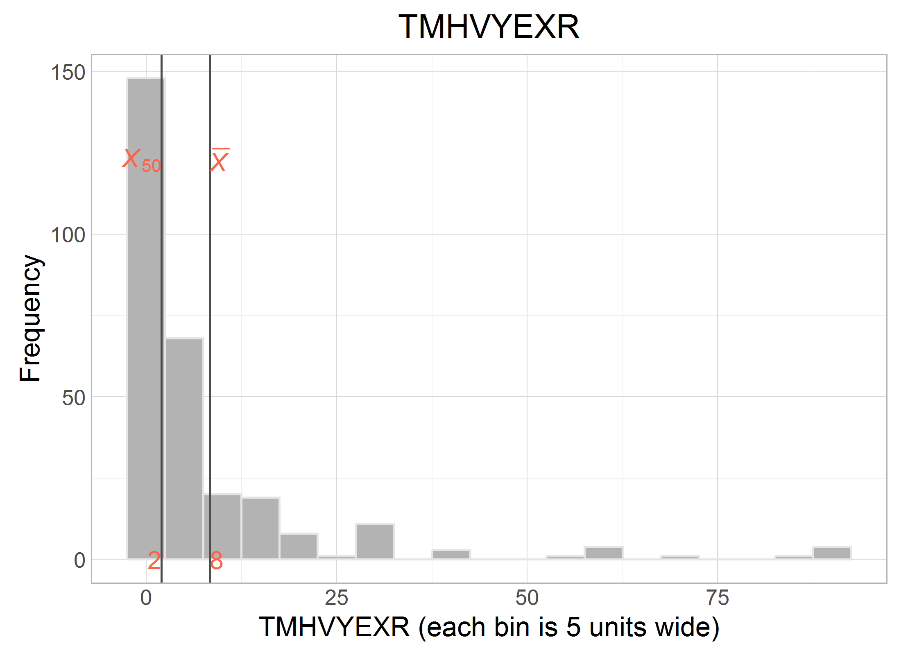
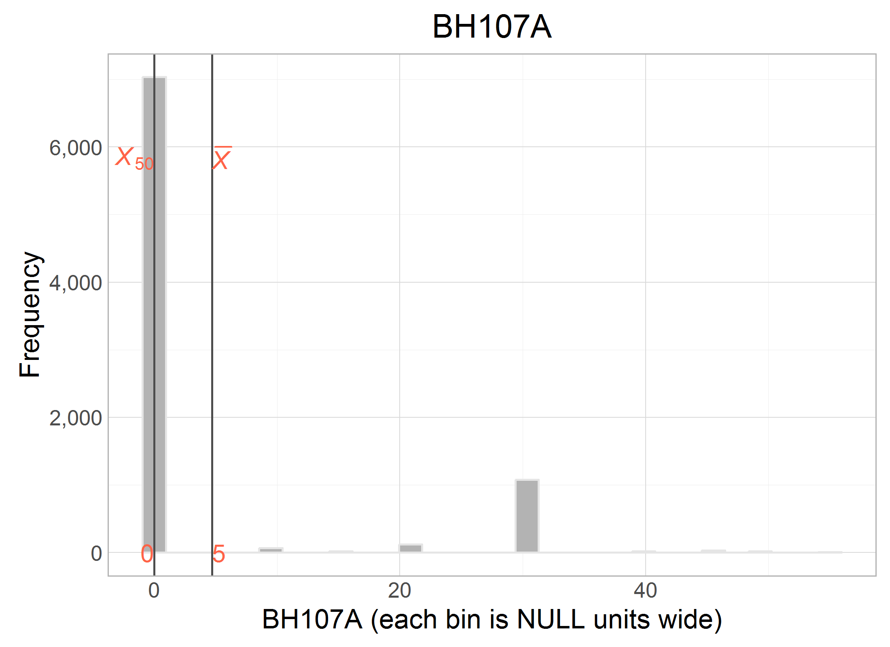

# Describe: physical activity

<!-- These two chunks should be added in the beginning of every .Rmd that you want to source an .R script -->
<!--  The 1st mandatory chunck  -->
<!--  Set the working directory to the repository's base directory -->


<!--  The 2nd mandatory chunck  -->
<!-- Set the report-wide options, and point to the external code file. -->


This report lists the candidate variable for DataScheme variables of the construct **physact**.

<!-- Load 'sourced' R files.  Suppress the output when loading packages. --> 


<!-- Load the sources.  Suppress the output when loading sources. --> 


<!-- Load any Global functions and variables declared in the R file.  Suppress the output. --> 


<!-- Declare any global functions specific to a Rmd output.  Suppress the output. --> 

# Exposition

> This report is meant to be compiled after having executed the script `./manipulation/0-ellis-island.R`, which prepares the necessary data transfer object (DTO). We begin with a brief recap of this script and the DTO it produces.  

## Ellis Island

> All data land on Ellis Island.

The script `0-ellis-island.R` is the first script in the analytic workflow. It accomplished the following: 

- (1) Reads in raw data files from the candidate studies   
- (2) Extract, combines, and exports their metadata (specifically, variable names and labels, if provided) into `./data/shared/derived/meta-data-live.csv`, which is updated every time Ellis Island script is executed.   
- (3) Augments raw metadata with instructions for renaming and classifying variables. The instructions are provided as manually entered values in `./data/shared/meta-data-map.csv`. They are used by automatic scripts in later harmonization and analysis.  
- (4) Combines unit and metadata into a single DTO to serve as a starting point to all subsequent analyses.   

<!-- Load the datasets.   -->

```r
# load the product of 0-ellis-island.R,  a list object containing data and metadata
dto <- readRDS("./data/unshared/derived/dto.rds")
```

<!-- Inspect the datasets.   -->

```r
# the list is composed of the following elements
names(dto)
```

```
[1] "studyName" "filePath"  "unitData"  "metaData" 
```

```r
# 1st element - names of the studies as character vector
dto[["studyName"]]
```

```
[1] "alsa"  "lbsl"  "satsa" "share" "tilda"
```

```r
# 2nd element - file paths of the data files for each study as character vector
dto[["filePath"]]
```

```
[1] "./data/unshared/raw/ALSA-Wave1.Final.sav"         "./data/unshared/raw/LBSL-Panel2-Wave1.Final.sav" 
[3] "./data/unshared/raw/SATSA-Q3.Final.sav"           "./data/unshared/raw/SHARE-Israel-Wave1.Final.sav"
[5] "./data/unshared/raw/TILDA-Wave1.Final.sav"       
```

```r
# 3rd element - list objects with the following elements
names(dto[["unitData"]])
```

```
[1] "alsa"  "lbsl"  "satsa" "share" "tilda"
```

```r
# each of these elements is a raw data set of a corresponding study, for example
dplyr::tbl_df(dto[["unitData"]][["lbsl"]]) 
```

```
Source: local data frame [656 x 25]

        id AGE94 SEX94  MSTAT94 EDUC94     NOWRK94  SMK94                                         SMOKE
     (int) (int) (int)   (fctr)  (int)      (fctr) (fctr)                                        (fctr)
1  4001026    68     1 divorced     16 no, retired     no                                  never smoked
2  4012015    94     2  widowed     12 no, retired     no                                  never smoked
3  4012032    94     2  widowed     20 no, retired     no don't smoke at present but smoked in the past
4  4022004    93     2       NA     NA          NA     NA                                  never smoked
5  4022026    93     2  widowed     12 no, retired     no                                  never smoked
6  4031031    92     1  married      8 no, retired     no don't smoke at present but smoked in the past
7  4031035    92     1  widowed     13 no, retired     no don't smoke at present but smoked in the past
8  4032201    92     2       NA     NA          NA     NA don't smoke at present but smoked in the past
9  4041062    91     1  widowed      7          NA     no don't smoke at present but smoked in the past
10 4042057    91     2       NA     NA          NA     NA                                            NA
..     ...   ...   ...      ...    ...         ...    ...                                           ...
Variables not shown: ALCOHOL (fctr), WINE (int), BEER (int), HARDLIQ (int), SPORT94 (int), FIT94 (int), WALK94 (int),
  SPEC94 (int), DANCE94 (int), CHORE94 (int), EXCERTOT (int), EXCERWK (int), HEIGHT94 (int), WEIGHT94 (int), HWEIGHT
  (int), HHEIGHT (int), SRHEALTH (fctr)
```

### Meta

```r
# 4th element - a dataset names and labels of raw variables + added metadata for all studies
dto[["metaData"]] %>% dplyr::select(study_name, name, item, construct, type, categories, label_short, label) %>% 
  DT::datatable(
    class   = 'cell-border stripe',
    caption = "This is the primary metadata file. Edit at `./data/shared/meta-data-map.csv",
    filter  = "top",
    options = list(pageLength = 6, autoWidth = TRUE)
  )
```

<!--html_preserve--><div id="htmlwidget-4746" style="width:100%;height:auto;" class="datatables html-widget"></div>
<script type="application/json" data-for="htmlwidget-4746">{"x":{"filter":"top","filterHTML":"<tr>\n  <td>\u003c/td>\n  <td data-type=\"factor\" style=\"vertical-align: top;\">\n    <div class=\"form-group has-feedback\" style=\"margin-bottom: auto;\">\n      <input type=\"search\" placeholder=\"All\" class=\"form-control\" style=\"width: 100%;\"/>\n      <span class=\"glyphicon glyphicon-remove-circle form-control-feedback\">\u003c/span>\n    \u003c/div>\n    <div style=\"width: 100%; display: none;\">\n      <select multiple=\"multiple\" style=\"width: 100%;\">\n        <option value=\"alsa\">alsa\u003c/option>\n        <option value=\"lbsl\">lbsl\u003c/option>\n        <option value=\"satsa\">satsa\u003c/option>\n        <option value=\"share\">share\u003c/option>\n        <option value=\"tilda\">tilda\u003c/option>\n      \u003c/select>\n    \u003c/div>\n  \u003c/td>\n  <td data-type=\"factor\" style=\"vertical-align: top;\">\n    <div class=\"form-group has-feedback\" style=\"margin-bottom: auto;\">\n      <input type=\"search\" placeholder=\"All\" class=\"form-control\" style=\"width: 100%;\"/>\n      <span class=\"glyphicon glyphicon-remove-circle form-control-feedback\">\u003c/span>\n    \u003c/div>\n    <div style=\"width: 100%; display: none;\">\n      <select multiple=\"multiple\" style=\"width: 100%;\">\n        <option value=\"AGE\">AGE\u003c/option>\n        <option value=\"AGE94\">AGE94\u003c/option>\n        <option value=\"ALCOHOL\">ALCOHOL\u003c/option>\n        <option value=\"BEER\">BEER\u003c/option>\n        <option value=\"BEHALC.DRINKSPERDAY\">BEHALC.DRINKSPERDAY\u003c/option>\n        <option value=\"BEHALC.DRINKSPERWEEK\">BEHALC.DRINKSPERWEEK\u003c/option>\n        <option value=\"BEHALC.FREQ.WEEK\">BEHALC.FREQ.WEEK\u003c/option>\n        <option value=\"BEHSMOKER\">BEHSMOKER\u003c/option>\n        <option value=\"BH001\">BH001\u003c/option>\n        <option value=\"BH002\">BH002\u003c/option>\n        <option value=\"BH003\">BH003\u003c/option>\n        <option value=\"BH101\">BH101\u003c/option>\n        <option value=\"BH102\">BH102\u003c/option>\n        <option value=\"BH102A\">BH102A\u003c/option>\n        <option value=\"BH103\">BH103\u003c/option>\n        <option value=\"BH104\">BH104\u003c/option>\n        <option value=\"BH104A\">BH104A\u003c/option>\n        <option value=\"BH105\">BH105\u003c/option>\n        <option value=\"BH106\">BH106\u003c/option>\n        <option value=\"BH106A\">BH106A\u003c/option>\n        <option value=\"BH107\">BH107\u003c/option>\n        <option value=\"BH107A\">BH107A\u003c/option>\n        <option value=\"BR0010\">BR0010\u003c/option>\n        <option value=\"BR0020\">BR0020\u003c/option>\n        <option value=\"BR0030\">BR0030\u003c/option>\n        <option value=\"BR0100\">BR0100\u003c/option>\n        <option value=\"BR0110\">BR0110\u003c/option>\n        <option value=\"BR0120\">BR0120\u003c/option>\n        <option value=\"BR0130\">BR0130\u003c/option>\n        <option value=\"BR0150\">BR0150\u003c/option>\n        <option value=\"BR0160\">BR0160\u003c/option>\n        <option value=\"BTSM12MN\">BTSM12MN\u003c/option>\n        <option value=\"CHORE94\">CHORE94\u003c/option>\n        <option value=\"CS006\">CS006\u003c/option>\n        <option value=\"CURRWORK\">CURRWORK\u003c/option>\n        <option value=\"DANCE94\">DANCE94\u003c/option>\n        <option value=\"DM001\">DM001\u003c/option>\n        <option value=\"DN0030\">DN0030\u003c/option>\n        <option value=\"DN0100\">DN0100\u003c/option>\n        <option value=\"DN012D01\">DN012D01\u003c/option>\n        <option value=\"DN012D02\">DN012D02\u003c/option>\n        <option value=\"DN012D03\">DN012D03\u003c/option>\n        <option value=\"DN012D04\">DN012D04\u003c/option>\n        <option value=\"DN012D05\">DN012D05\u003c/option>\n        <option value=\"DN012D09\">DN012D09\u003c/option>\n        <option value=\"DN012DDK\">DN012DDK\u003c/option>\n        <option value=\"DN012DNO\">DN012DNO\u003c/option>\n        <option value=\"DN012DOT\">DN012DOT\u003c/option>\n        <option value=\"DN012DRF\">DN012DRF\u003c/option>\n        <option value=\"DN0140\">DN0140\u003c/option>\n        <option value=\"EDUC\">EDUC\u003c/option>\n        <option value=\"EDUC94\">EDUC94\u003c/option>\n        <option value=\"EP0050\">EP0050\u003c/option>\n        <option value=\"EXCERTOT\">EXCERTOT\u003c/option>\n        <option value=\"EXCERWK\">EXCERWK\u003c/option>\n        <option value=\"EXRTHOUS\">EXRTHOUS\u003c/option>\n        <option value=\"FIT94\">FIT94\u003c/option>\n        <option value=\"FR6ORMOR\">FR6ORMOR\u003c/option>\n        <option value=\"FREQALCH\">FREQALCH\u003c/option>\n        <option value=\"GALCOHOL\">GALCOHOL\u003c/option>\n        <option value=\"GAMTWORK\">GAMTWORK\u003c/option>\n        <option value=\"GBEERX\">GBEERX\u003c/option>\n        <option value=\"GBOTVIN\">GBOTVIN\u003c/option>\n        <option value=\"GD002\">GD002\u003c/option>\n        <option value=\"GDRLOTS\">GDRLOTS\u003c/option>\n        <option value=\"GENDER\">GENDER\u003c/option>\n        <option value=\"GEVRALK\">GEVRALK\u003c/option>\n        <option value=\"GEVRSMK\">GEVRSMK\u003c/option>\n        <option value=\"GEVRSNS\">GEVRSNS\u003c/option>\n        <option value=\"GEXERCIS\">GEXERCIS\u003c/option>\n        <option value=\"GFREQBER\">GFREQBER\u003c/option>\n        <option value=\"GFREQLIQ\">GFREQLIQ\u003c/option>\n        <option value=\"GFREQVIN\">GFREQVIN\u003c/option>\n        <option value=\"GGENHLTH\">GGENHLTH\u003c/option>\n        <option value=\"GHLTHOTH\">GHLTHOTH\u003c/option>\n        <option value=\"GHTCM\">GHTCM\u003c/option>\n        <option value=\"GLIQX\">GLIQX\u003c/option>\n        <option value=\"GMARITAL\">GMARITAL\u003c/option>\n        <option value=\"GPI\">GPI\u003c/option>\n        <option value=\"GSMOKNOW\">GSMOKNOW\u003c/option>\n        <option value=\"GSTOPALK\">GSTOPALK\u003c/option>\n        <option value=\"GVINX\">GVINX\u003c/option>\n        <option value=\"GWTKG\">GWTKG\u003c/option>\n        <option value=\"HARDLIQ\">HARDLIQ\u003c/option>\n        <option value=\"HEIGHT\">HEIGHT\u003c/option>\n        <option value=\"HEIGHT94\">HEIGHT94\u003c/option>\n        <option value=\"HHEIGHT\">HHEIGHT\u003c/option>\n        <option value=\"HLTHBTSM\">HLTHBTSM\u003c/option>\n        <option value=\"HLTHLIFE\">HLTHLIFE\u003c/option>\n        <option value=\"HWEIGHT\">HWEIGHT\u003c/option>\n        <option value=\"HWMNWK2W\">HWMNWK2W\u003c/option>\n        <option value=\"ID\">ID\u003c/option>\n        <option value=\"INT.YEAR\">INT.YEAR\u003c/option>\n        <option value=\"IPAQEXERCISE3\">IPAQEXERCISE3\u003c/option>\n        <option value=\"IPAQMETMINUTES\">IPAQMETMINUTES\u003c/option>\n        <option value=\"LSVEXC2W\">LSVEXC2W\u003c/option>\n        <option value=\"LSVIGEXC\">LSVIGEXC\u003c/option>\n        <option value=\"MAR_4\">MAR_4\u003c/option>\n        <option value=\"MARITST\">MARITST\u003c/option>\n        <option value=\"MSTAT94\">MSTAT94\u003c/option>\n        <option value=\"NOSTDRNK\">NOSTDRNK\u003c/option>\n        <option value=\"NOWRK94\">NOWRK94\u003c/option>\n        <option value=\"PH001\">PH001\u003c/option>\n        <option value=\"PH0020\">PH0020\u003c/option>\n        <option value=\"PH0030\">PH0030\u003c/option>\n        <option value=\"PH009\">PH009\u003c/option>\n        <option value=\"PH0120\">PH0120\u003c/option>\n        <option value=\"PH0130\">PH0130\u003c/option>\n        <option value=\"PH0520\">PH0520\u003c/option>\n        <option value=\"PH0530\">PH0530\u003c/option>\n        <option value=\"PIPCIGAR\">PIPCIGAR\u003c/option>\n        <option value=\"QAGE3\">QAGE3\u003c/option>\n        <option value=\"RETIRED\">RETIRED\u003c/option>\n        <option value=\"SAMPID.rec\">SAMPID.rec\u003c/option>\n        <option value=\"SCHOOL\">SCHOOL\u003c/option>\n        <option value=\"SCQALCOFREQ\">SCQALCOFREQ\u003c/option>\n        <option value=\"SCQALCOHOL\">SCQALCOHOL\u003c/option>\n        <option value=\"SCQALCONO1\">SCQALCONO1\u003c/option>\n        <option value=\"SCQALCONO2\">SCQALCONO2\u003c/option>\n        <option value=\"SEQNUM\">SEQNUM\u003c/option>\n        <option value=\"SEX\">SEX\u003c/option>\n        <option value=\"SEX94\">SEX94\u003c/option>\n        <option value=\"SMK94\">SMK94\u003c/option>\n        <option value=\"SMOKE\">SMOKE\u003c/option>\n        <option value=\"SMOKER\">SMOKER\u003c/option>\n        <option value=\"SOCMARRIED\">SOCMARRIED\u003c/option>\n        <option value=\"SPEC94\">SPEC94\u003c/option>\n        <option value=\"SPORT94\">SPORT94\u003c/option>\n        <option value=\"SR.HEIGHT.CENTIMETRES\">SR.HEIGHT.CENTIMETRES\u003c/option>\n        <option value=\"SR.WEIGHT.KILOGRAMMES\">SR.WEIGHT.KILOGRAMMES\u003c/option>\n        <option value=\"SRHEALTH\">SRHEALTH\u003c/option>\n        <option value=\"TMHVYEXR\">TMHVYEXR\u003c/option>\n        <option value=\"TMVEXC2W\">TMVEXC2W\u003c/option>\n        <option value=\"TYPQUAL\">TYPQUAL\u003c/option>\n        <option value=\"VIGEXC2W\">VIGEXC2W\u003c/option>\n        <option value=\"VIGEXCS\">VIGEXCS\u003c/option>\n        <option value=\"WALK2WKS\">WALK2WKS\u003c/option>\n        <option value=\"WALK94\">WALK94\u003c/option>\n        <option value=\"WE001\">WE001\u003c/option>\n        <option value=\"WE003\">WE003\u003c/option>\n        <option value=\"WEIGHT\">WEIGHT\u003c/option>\n        <option value=\"WEIGHT94\">WEIGHT94\u003c/option>\n        <option value=\"WINE\">WINE\u003c/option>\n        <option value=\"YRBORN\">YRBORN\u003c/option>\n      \u003c/select>\n    \u003c/div>\n  \u003c/td>\n  <td data-type=\"factor\" style=\"vertical-align: top;\">\n    <div class=\"form-group has-feedback\" style=\"margin-bottom: auto;\">\n      <input type=\"search\" placeholder=\"All\" class=\"form-control\" style=\"width: 100%;\"/>\n      <span class=\"glyphicon glyphicon-remove-circle form-control-feedback\">\u003c/span>\n    \u003c/div>\n    <div style=\"width: 100%; display: none;\">\n      <select multiple=\"multiple\" style=\"width: 100%;\">\n        <option value=\"\">\u003c/option>\n        <option value=\"age\">age\u003c/option>\n        <option value=\"age_1994\">age_1994\u003c/option>\n        <option value=\"age_interview\">age_interview\u003c/option>\n        <option value=\"age_left_school\">age_left_school\u003c/option>\n        <option value=\"age_q3\">age_q3\u003c/option>\n        <option value=\"born_year\">born_year\u003c/option>\n        <option value=\"current_job\">current_job\u003c/option>\n        <option value=\"edu\">edu\u003c/option>\n        <option value=\"edu_highest\">edu_highest\u003c/option>\n        <option value=\"edu_hight\">edu_hight\u003c/option>\n        <option value=\"employed\">employed\u003c/option>\n        <option value=\"healt_self\">healt_self\u003c/option>\n        <option value=\"health_12ago\">health_12ago\u003c/option>\n        <option value=\"health_others\">health_others\u003c/option>\n        <option value=\"height_in\">height_in\u003c/option>\n        <option value=\"height_in_sr\">height_in_sr\u003c/option>\n        <option value=\"id\">id\u003c/option>\n        <option value=\"marital\">marital\u003c/option>\n        <option value=\"marital_2\">marital_2\u003c/option>\n        <option value=\"marital_4\">marital_4\u003c/option>\n        <option value=\"marital_6\">marital_6\u003c/option>\n        <option value=\"retired\">retired\u003c/option>\n        <option value=\"school_years\">school_years\u003c/option>\n        <option value=\"sex\">sex\u003c/option>\n        <option value=\"sex_gender\">sex_gender\u003c/option>\n        <option value=\"smoke_age\">smoke_age\u003c/option>\n        <option value=\"smoke_history\">smoke_history\u003c/option>\n        <option value=\"smoke_history2\">smoke_history2\u003c/option>\n        <option value=\"smoke_now\">smoke_now\u003c/option>\n        <option value=\"smoke_pipecigar\">smoke_pipecigar\u003c/option>\n        <option value=\"smoke_years\">smoke_years\u003c/option>\n        <option value=\"snuff_history\">snuff_history\u003c/option>\n        <option value=\"twin_id\">twin_id\u003c/option>\n        <option value=\"weight_kg\">weight_kg\u003c/option>\n        <option value=\"weight_lb\">weight_lb\u003c/option>\n        <option value=\"weight_lb_sr\">weight_lb_sr\u003c/option>\n        <option value=\"work_extra\">work_extra\u003c/option>\n        <option value=\"work_status\">work_status\u003c/option>\n        <option value=\"year_born\">year_born\u003c/option>\n      \u003c/select>\n    \u003c/div>\n  \u003c/td>\n  <td data-type=\"factor\" style=\"vertical-align: top;\">\n    <div class=\"form-group has-feedback\" style=\"margin-bottom: auto;\">\n      <input type=\"search\" placeholder=\"All\" class=\"form-control\" style=\"width: 100%;\"/>\n      <span class=\"glyphicon glyphicon-remove-circle form-control-feedback\">\u003c/span>\n    \u003c/div>\n    <div style=\"width: 100%; display: none;\">\n      <select multiple=\"multiple\" style=\"width: 100%;\">\n        <option value=\"age\">age\u003c/option>\n        <option value=\"alcohol\">alcohol\u003c/option>\n        <option value=\"bmi\">bmi\u003c/option>\n        <option value=\"education\">education\u003c/option>\n        <option value=\"health\">health\u003c/option>\n        <option value=\"height\">height\u003c/option>\n        <option value=\"id\">id\u003c/option>\n        <option value=\"marital\">marital\u003c/option>\n        <option value=\"physact\">physact\u003c/option>\n        <option value=\"physical\">physical\u003c/option>\n        <option value=\"sex\">sex\u003c/option>\n        <option value=\"smoking\">smoking\u003c/option>\n        <option value=\"weight\">weight\u003c/option>\n        <option value=\"work_status\">work_status\u003c/option>\n        <option value=\"year\">year\u003c/option>\n      \u003c/select>\n    \u003c/div>\n  \u003c/td>\n  <td data-type=\"factor\" style=\"vertical-align: top;\">\n    <div class=\"form-group has-feedback\" style=\"margin-bottom: auto;\">\n      <input type=\"search\" placeholder=\"All\" class=\"form-control\" style=\"width: 100%;\"/>\n      <span class=\"glyphicon glyphicon-remove-circle form-control-feedback\">\u003c/span>\n    \u003c/div>\n    <div style=\"width: 100%; display: none;\">\n      <select multiple=\"multiple\" style=\"width: 100%;\">\n        <option value=\"activity\">activity\u003c/option>\n        <option value=\"demo\">demo\u003c/option>\n        <option value=\"physical\">physical\u003c/option>\n        <option value=\"substance\">substance\u003c/option>\n      \u003c/select>\n    \u003c/div>\n  \u003c/td>\n  <td data-type=\"integer\" style=\"vertical-align: top;\">\n    <div class=\"form-group has-feedback\" style=\"margin-bottom: auto;\">\n      <input type=\"search\" placeholder=\"All\" class=\"form-control\" style=\"width: 100%;\"/>\n      <span class=\"glyphicon glyphicon-remove-circle form-control-feedback\">\u003c/span>\n    \u003c/div>\n    <div style=\"display: none; position: absolute; width: 200px;\">\n      <div data-min=\"2\" data-max=\"8504\">\u003c/div>\n      <span style=\"float: left;\">\u003c/span>\n      <span style=\"float: right;\">\u003c/span>\n    \u003c/div>\n  \u003c/td>\n  <td data-type=\"factor\" style=\"vertical-align: top;\">\n    <div class=\"form-group has-feedback\" style=\"margin-bottom: auto;\">\n      <input type=\"search\" placeholder=\"All\" class=\"form-control\" style=\"width: 100%;\"/>\n      <span class=\"glyphicon glyphicon-remove-circle form-control-feedback\">\u003c/span>\n    \u003c/div>\n    <div style=\"width: 100%; display: none;\">\n      <select multiple=\"multiple\" style=\"width: 100%;\">\n        <option value=\"\">\u003c/option>\n        <option value=\"…more than 1 bottle\">…more than 1 bottle\u003c/option>\n        <option value=\"activities requiring a moderate level of energy\">activities requiring a moderate level of energy\u003c/option>\n        <option value=\"Age\">Age\u003c/option>\n        <option value=\"Age at current wave\">Age at current wave\u003c/option>\n        <option value=\"Age in 1994\">Age in 1994\u003c/option>\n        <option value=\"Age left school\">Age left school\u003c/option>\n        <option value=\"Age when stopped smoking\">Age when stopped smoking\u003c/option>\n        <option value=\"Alcohol use\">Alcohol use\u003c/option>\n        <option value=\"Alcoholic drinks\">Alcoholic drinks\u003c/option>\n        <option value=\"Anonymised ID\">Anonymised ID\u003c/option>\n        <option value=\"Any paid work last week?\">Any paid work last week?\u003c/option>\n        <option value=\"Are you retired from your last job?\">Are you retired from your last job?\u003c/option>\n        <option value=\"Average times drinking per week\">Average times drinking per week\u003c/option>\n        <option value=\"beverages consumed last 6 months\">beverages consumed last 6 months\u003c/option>\n        <option value=\"Current job situation\">Current job situation\u003c/option>\n        <option value=\"Currently smoke?\">Currently smoke?\u003c/option>\n        <option value=\"Currently working\">Currently working\u003c/option>\n        <option value=\"Dancing\">Dancing\u003c/option>\n        <option value=\"Describe current job situation\">Describe current job situation\u003c/option>\n        <option value=\"Describe current work/retirement situation\">Describe current work/retirement situation\u003c/option>\n        <option value=\"Do you currently smoke cigarettes?\">Do you currently smoke cigarettes?\u003c/option>\n        <option value=\"Do you ever drink alcoholic beverages?\">Do you ever drink alcoholic beverages?\u003c/option>\n        <option value=\"Do you ever drink alcoholic drinks? - Yes\">Do you ever drink alcoholic drinks? - Yes\u003c/option>\n        <option value=\"Do you ever drink alcoholic drinks? -No I quit. When? 19__\">Do you ever drink alcoholic drinks? -No I quit. When? 19__\u003c/option>\n        <option value=\"Do you regularly smoke pipe or cigar?\">Do you regularly smoke pipe or cigar?\u003c/option>\n        <option value=\"Do you smoke tobacco?\">Do you smoke tobacco?\u003c/option>\n        <option value=\"Do you take snuff?\">Do you take snuff?\u003c/option>\n        <option value=\"Doing household chores (hrs/wk)\">Doing household chores (hrs/wk)\u003c/option>\n        <option value=\"dont know\">dont know\u003c/option>\n        <option value=\"During the last 7 days, how much time did you spend sitting on a week day? HO?\">During the last 7 days, how much time did you spend sitting on a week day? HO?\u003c/option>\n        <option value=\"During the last 7 days, how much time did you spend sitting on a week day? MINS\">During the last 7 days, how much time did you spend sitting on a week day? MINS\u003c/option>\n        <option value=\"During the last 7 days, on how many days did you do moderate physical activit?\">During the last 7 days, on how many days did you do moderate physical activit?\u003c/option>\n        <option value=\"During the last 7 days, on how many days did you do vigorous physical activit?\">During the last 7 days, on how many days did you do vigorous physical activit?\u003c/option>\n        <option value=\"During the last 7 days, on how many days did you walk for at least 10 minutes?\">During the last 7 days, on how many days did you walk for at least 10 minutes?\u003c/option>\n        <option value=\"Edcuation\">Edcuation\u003c/option>\n        <option value=\"Education\">Education\u003c/option>\n        <option value=\"Ever smoked tobacco daily for a year?\">Ever smoked tobacco daily for a year?\u003c/option>\n        <option value=\"Exercised or played sports (oc/wk)\">Exercised or played sports (oc/wk)\u003c/option>\n        <option value=\"Exercising for shape/fun (hrs/wk)\">Exercising for shape/fun (hrs/wk)\u003c/option>\n        <option value=\"Exertion around house\">Exertion around house\u003c/option>\n        <option value=\"freq more than 2 glasses beer in a day\">freq more than 2 glasses beer in a day\u003c/option>\n        <option value=\"freq more than 2 glasses wine in a day\">freq more than 2 glasses wine in a day\u003c/option>\n        <option value=\"freq more than 2 hard liquor in a day\">freq more than 2 hard liquor in a day\u003c/option>\n        <option value=\"Frequency alcohol\">Frequency alcohol\u003c/option>\n        <option value=\"Frequency of drinking alcohol\">Frequency of drinking alcohol\u003c/option>\n        <option value=\"Frequency six or more drinks\">Frequency six or more drinks\u003c/option>\n        <option value=\"Gender\">Gender\u003c/option>\n        <option value=\"Health comp with 12mths ago\">Health comp with 12mths ago\u003c/option>\n        <option value=\"Health compared to others\">Health compared to others\u003c/option>\n        <option value=\"health in general question v 1\">health in general question v 1\u003c/option>\n        <option value=\"health in general question v 2\">health in general question v 2\u003c/option>\n        <option value=\"Height in Inches\">Height in Inches\u003c/option>\n        <option value=\"Highest qualification\">Highest qualification\u003c/option>\n        <option value=\"How many drinks consumed on days drink taken\">How many drinks consumed on days drink taken\u003c/option>\n        <option value=\"How many years smoked?\">How many years smoked?\u003c/option>\n        <option value=\"How much beer do you usually drink at a time?\">How much beer do you usually drink at a time?\u003c/option>\n        <option value=\"How much hard liquot do you usually drink at time?\">How much hard liquot do you usually drink at time?\u003c/option>\n        <option value=\"How much time did you usually spend doing moderate physical activities on one?\">How much time did you usually spend doing moderate physical activities on one?\u003c/option>\n        <option value=\"How much time did you usually spend doing vigorous physical activities on one?\">How much time did you usually spend doing vigorous physical activities on one?\u003c/option>\n        <option value=\"How much time did you usually spend walking on one of those days? HOURS\">How much time did you usually spend walking on one of those days? HOURS\u003c/option>\n        <option value=\"How much time did you usually spend walking on one of those days? MINS\">How much time did you usually spend walking on one of those days? MINS\u003c/option>\n        <option value=\"How much wine do you usually drink at a time?\">How much wine do you usually drink at a time?\u003c/option>\n        <option value=\"How often do you drink beer (not light beer)?\">How often do you drink beer (not light beer)?\u003c/option>\n        <option value=\"How often do you usually drink hard liquor?\">How often do you usually drink hard liquor?\u003c/option>\n        <option value=\"How often do you usually drink wine (red or white)?\">How often do you usually drink wine (red or white)?\u003c/option>\n        <option value=\"How often more than 5 beers?\">How often more than 5 beers?\u003c/option>\n        <option value=\"how tall are you?\">how tall are you?\u003c/option>\n        <option value=\"id\">id\u003c/option>\n        <option value=\"Id\">Id\u003c/option>\n        <option value=\"interview year\">interview year\u003c/option>\n        <option value=\"Less vigor past 2 weeks\">Less vigor past 2 weeks\u003c/option>\n        <option value=\"Less vigor sessions last 2 weeks\">Less vigor sessions last 2 weeks\u003c/option>\n        <option value=\"Male or Female?\">Male or Female?\u003c/option>\n        <option value=\"Marital status\">Marital status\u003c/option>\n        <option value=\"Marital Status\">Marital Status\u003c/option>\n        <option value=\"Marital Status in 1994\">Marital Status in 1994\u003c/option>\n        <option value=\"More than 2 drinks/day\">More than 2 drinks/day\u003c/option>\n        <option value=\"no further education\">no further education\u003c/option>\n        <option value=\"Number of cans/bottles of beer last week\">Number of cans/bottles of beer last week\u003c/option>\n        <option value=\"Number of drinks containing hard liquor last week\">Number of drinks containing hard liquor last week\u003c/option>\n        <option value=\"Number of glasses of wine last week\">Number of glasses of wine last week\u003c/option>\n        <option value=\"Number of standard drinks\">Number of standard drinks\u003c/option>\n        <option value=\"nursing school\">nursing school\u003c/option>\n        <option value=\"other further education\">other further education\u003c/option>\n        <option value=\"Participant sports, number of hours\">Participant sports, number of hours\u003c/option>\n        <option value=\"Physical activity met (minutes)\">Physical activity met (minutes)\u003c/option>\n        <option value=\"Physical fitness, number of hours each week\">Physical fitness, number of hours each week\u003c/option>\n        <option value=\"polytechnic\">polytechnic\u003c/option>\n        <option value=\"refused\">refused\u003c/option>\n        <option value=\"Respondent is a smoker\">Respondent is a smoker\u003c/option>\n        <option value=\"Self-rated health\">Self-rated health\u003c/option>\n        <option value=\"Self-reported health compared to age peers\">Self-reported health compared to age peers\u003c/option>\n        <option value=\"Self-reported height in inches\">Self-reported height in inches\u003c/option>\n        <option value=\"Self-reported weight in pounds\">Self-reported weight in pounds\u003c/option>\n        <option value=\"Sequence Number\">Sequence Number\u003c/option>\n        <option value=\"Sex\">Sex\u003c/option>\n        <option value=\"Smoke at present?\">Smoke at present?\u003c/option>\n        <option value=\"Smoke, tobacco use\">Smoke, tobacco use\u003c/option>\n        <option value=\"Smoked some last month?\">Smoked some last month?\u003c/option>\n        <option value=\"Spectator sports, number of hours spent per week\">Spectator sports, number of hours spent per week\u003c/option>\n        <option value=\"sports or activities that are vigorous\">sports or activities that are vigorous\u003c/option>\n        <option value=\"Standard drinks a week\">Standard drinks a week\u003c/option>\n        <option value=\"Standard drinks per day\">Standard drinks per day\u003c/option>\n        <option value=\"still in further education or training\">still in further education or training\u003c/option>\n        <option value=\"Time heavy physical exertion\">Time heavy physical exertion\u003c/option>\n        <option value=\"Times walked in past two weeks\">Times walked in past two weeks\u003c/option>\n        <option value=\"Twin number\">Twin number\u003c/option>\n        <option value=\"university, Bachelors degree\">university, Bachelors degree\u003c/option>\n        <option value=\"university, graduate degree\">university, graduate degree\u003c/option>\n        <option value=\"Vigor Sessions in past 2 weeks\">Vigor Sessions in past 2 weeks\u003c/option>\n        <option value=\"Vigor Time past 2 weeks\">Vigor Time past 2 weeks\u003c/option>\n        <option value=\"Vigorous exercise\">Vigorous exercise\u003c/option>\n        <option value=\"Walking past 2 weeks\">Walking past 2 weeks\u003c/option>\n        <option value=\"Walking, number of hours per week\">Walking, number of hours per week\u003c/option>\n        <option value=\"Weight in kilograms\">Weight in kilograms\u003c/option>\n        <option value=\"Weight in Pounds\">Weight in Pounds\u003c/option>\n        <option value=\"weight of respondent\">weight of respondent\u003c/option>\n        <option value=\"What is your marital status?\">What is your marital status?\u003c/option>\n        <option value=\"What option best describes your exercise on a yearly basis?\">What option best describes your exercise on a yearly basis?\u003c/option>\n        <option value=\"Working at present time?\">Working at present time?\u003c/option>\n        <option value=\"Year born\">Year born\u003c/option>\n        <option value=\"Years of school completed\">Years of school completed\u003c/option>\n        <option value=\"yeshiva, religious high institution\">yeshiva, religious high institution\u003c/option>\n      \u003c/select>\n    \u003c/div>\n  \u003c/td>\n  <td data-type=\"factor\" style=\"vertical-align: top;\">\n    <div class=\"form-group has-feedback\" style=\"margin-bottom: auto;\">\n      <input type=\"search\" placeholder=\"All\" class=\"form-control\" style=\"width: 100%;\"/>\n      <span class=\"glyphicon glyphicon-remove-circle form-control-feedback\">\u003c/span>\n    \u003c/div>\n    <div style=\"width: 100%; display: none;\">\n      <select multiple=\"multiple\" style=\"width: 100%;\">\n        <option value=\"..more than 1 bottle, i.e.____bottles (state number of bottles): GBOTVIN\">..more than 1 bottle, i.e.____bottles (state number of bottles): GBOTVIN\u003c/option>\n        <option value=\"activities requiring a moderate level of energy\">activities requiring a moderate level of energy\u003c/option>\n        <option value=\"Age\">Age\u003c/option>\n        <option value=\"Age at interview assuming DOB is 1st of specified month\">Age at interview assuming DOB is 1st of specified month\u003c/option>\n        <option value=\"age at Q3\">age at Q3\u003c/option>\n        <option value=\"Age in 1994\">Age in 1994\u003c/option>\n        <option value=\"Age left school\">Age left school\u003c/option>\n        <option value=\"Alcohol use\">Alcohol use\u003c/option>\n        <option value=\"Anonymised ID\">Anonymised ID\u003c/option>\n        <option value=\"Are you retired from your last job?\">Are you retired from your last job?\u003c/option>\n        <option value=\"BEHalc_drinksperday  Standard drinks per day\">BEHalc_drinksperday  Standard drinks per day\u003c/option>\n        <option value=\"BEHalc_drinksperweek  Standard drinks a week\">BEHalc_drinksperweek  Standard drinks a week\u003c/option>\n        <option value=\"BEHalc_freq_week  Average times drinking per week\">BEHalc_freq_week  Average times drinking per week\u003c/option>\n        <option value=\"BEHsmoker  Smoker\">BEHsmoker  Smoker\u003c/option>\n        <option value=\"beverages consumed last 6 months\">beverages consumed last 6 months\u003c/option>\n        <option value=\"bh001  Have you ever smoked cigarettes, cigars, cigarillos or a pipe daily for a per?\">bh001  Have you ever smoked cigarettes, cigars, cigarillos or a pipe daily for a per?\u003c/option>\n        <option value=\"bh002  Do you smoke at the present time?\">bh002  Do you smoke at the present time?\u003c/option>\n        <option value=\"bh003  How old were you when you stopped smoking?\">bh003  How old were you when you stopped smoking?\u003c/option>\n        <option value=\"bh101  During the last 7 days, on how many days did you do vigorous physical activit?\">bh101  During the last 7 days, on how many days did you do vigorous physical activit?\u003c/option>\n        <option value=\"bh102  How much time did you usually spend doing vigorous physical activities on one?\">bh102  How much time did you usually spend doing vigorous physical activities on one?\u003c/option>\n        <option value=\"bh102a  How much time did you usually spend doing vigorous physical activities on one?\">bh102a  How much time did you usually spend doing vigorous physical activities on one?\u003c/option>\n        <option value=\"bh103  During the last 7 days, on how many days did you do moderate physical activit?\">bh103  During the last 7 days, on how many days did you do moderate physical activit?\u003c/option>\n        <option value=\"bh104  How much time did you usually spend doing moderate physical activities on one?\">bh104  How much time did you usually spend doing moderate physical activities on one?\u003c/option>\n        <option value=\"bh104a  How much time did you usually spend doing moderate physical activities on one?\">bh104a  How much time did you usually spend doing moderate physical activities on one?\u003c/option>\n        <option value=\"bh105  During the last 7 days, on how many days did you walk for at least 10 minutes?\">bh105  During the last 7 days, on how many days did you walk for at least 10 minutes?\u003c/option>\n        <option value=\"bh106  How much time did you usually spend walking on one of those days? HOURS\">bh106  How much time did you usually spend walking on one of those days? HOURS\u003c/option>\n        <option value=\"bh106a  How much time did you usually spend walking on one of those days? MINS\">bh106a  How much time did you usually spend walking on one of those days? MINS\u003c/option>\n        <option value=\"bh107  During the last 7 days, how much time did you spend sitting on a week day? HO?\">bh107  During the last 7 days, how much time did you spend sitting on a week day? HO?\u003c/option>\n        <option value=\"bh107a  During the last 7 days, how much time did you spend sitting on a week day? MINS\">bh107a  During the last 7 days, how much time did you spend sitting on a week day? MINS\u003c/option>\n        <option value=\"BMI ((htcm/100)^2)\">BMI ((htcm/100)^2)\u003c/option>\n        <option value=\"cs006  Are you...?\">cs006  Are you...?\u003c/option>\n        <option value=\"current job situation\">current job situation\u003c/option>\n        <option value=\"Currently smoke?\">Currently smoke?\u003c/option>\n        <option value=\"Currently working\">Currently working\u003c/option>\n        <option value=\"Dancing\">Dancing\u003c/option>\n        <option value=\"Did you, nevertheless, do any paid work during the last week, either as an em?\">Did you, nevertheless, do any paid work during the last week, either as an em?\u003c/option>\n        <option value=\"dm001  What is the highest level of education you have completed\">dm001  What is the highest level of education you have completed\u003c/option>\n        <option value=\"Do you currently smoke cigarettes?\">Do you currently smoke cigarettes?\u003c/option>\n        <option value=\"Do you ever drink alcoholic beverages?\">Do you ever drink alcoholic beverages?\u003c/option>\n        <option value=\"Do you ever drink alcoholic drinks? - Yes\">Do you ever drink alcoholic drinks? - Yes\u003c/option>\n        <option value=\"Do you ever drink alcoholic drinks? -No I quit. When? 19__\">Do you ever drink alcoholic drinks? -No I quit. When? 19__\u003c/option>\n        <option value=\"Do you regularly smoke pipe or cigar?\">Do you regularly smoke pipe or cigar?\u003c/option>\n        <option value=\"Do you smoke cigarettes, cigars or a pipe? - Yes\">Do you smoke cigarettes, cigars or a pipe? - Yes\u003c/option>\n        <option value=\"Do you take snuff? - Yes\">Do you take snuff? - Yes\u003c/option>\n        <option value=\"Doing household chores, number of hours spent per week\">Doing household chores, number of hours spent per week\u003c/option>\n        <option value=\"dont know\">dont know\u003c/option>\n        <option value=\"Education\">Education\u003c/option>\n        <option value=\"ever smoked daily\">ever smoked daily\u003c/option>\n        <option value=\"Exertion around house\">Exertion around house\u003c/option>\n        <option value=\"freq more than 2 glasses beer in a day\">freq more than 2 glasses beer in a day\u003c/option>\n        <option value=\"freq more than 2 glasses wine in a day\">freq more than 2 glasses wine in a day\u003c/option>\n        <option value=\"freq more than 2 hard liquor in a day\">freq more than 2 hard liquor in a day\u003c/option>\n        <option value=\"Frequency alcohol\">Frequency alcohol\u003c/option>\n        <option value=\"Frequency six or more drinks\">Frequency six or more drinks\u003c/option>\n        <option value=\"gd002 - Is this respondent male or female?\">gd002 - Is this respondent male or female?\u003c/option>\n        <option value=\"Gender\">Gender\u003c/option>\n        <option value=\"Have you smoked more than 6 cigarettes, 4 cigars or used pipe tobacco or snuff during the last month?\">Have you smoked more than 6 cigarettes, 4 cigars or used pipe tobacco or snuff during the last month?\u003c/option>\n        <option value=\"Health comp with 12mths ago\">Health comp with 12mths ago\u003c/option>\n        <option value=\"Health compared to others\">Health compared to others\u003c/option>\n        <option value=\"health in general question v 1\">health in general question v 1\u003c/option>\n        <option value=\"health in general question v 2\">health in general question v 2\u003c/option>\n        <option value=\"Height in Inches\">Height in Inches\u003c/option>\n        <option value=\"Here are seven different options concerning exercise during your leisure time. Which one of these options best fits how you yourself exercise on a yearly basis?\">Here are seven different options concerning exercise during your leisure time. Which one of these options best fits how you yourself exercise on a yearly basis?\u003c/option>\n        <option value=\"highest educational degree obtained\">highest educational degree obtained\u003c/option>\n        <option value=\"Highest qualification\">Highest qualification\u003c/option>\n        <option value=\"How do you judge your general state of health compared to other people your age?\">How do you judge your general state of health compared to other people your age?\u003c/option>\n        <option value=\"How do you judge your general state of health?\">How do you judge your general state of health?\u003c/option>\n        <option value=\"how many years smoked\">how many years smoked\u003c/option>\n        <option value=\"How much beer do you usually drink at a time?\">How much beer do you usually drink at a time?\u003c/option>\n        <option value=\"How much do you weigh? (kg)\">How much do you weigh? (kg)\u003c/option>\n        <option value=\"How much hard liquot do you usually drink at time?\">How much hard liquot do you usually drink at time?\u003c/option>\n        <option value=\"How much wine do you usually drink at a time?\">How much wine do you usually drink at a time?\u003c/option>\n        <option value=\"How often do you consume more than five bottles of beer or more than one bottle of wine or more than 1/2 bottle liquot at one occasion?\">How often do you consume more than five bottles of beer or more than one bottle of wine or more than 1/2 bottle liquot at one occasion?\u003c/option>\n        <option value=\"How often do you drink beer (not light beer)?\">How often do you drink beer (not light beer)?\u003c/option>\n        <option value=\"How often do you usually drink hard liquor? (e.g. aquavit, whiskey, gin, brandy, punsch. Also liquot in cocktails and long drinks)\">How often do you usually drink hard liquor? (e.g. aquavit, whiskey, gin, brandy, punsch. Also liquot in cocktails and long drinks)\u003c/option>\n        <option value=\"How often do you usually drink wine (red or white)?\">How often do you usually drink wine (red or white)?\u003c/option>\n        <option value=\"how tall are you?\">how tall are you?\u003c/option>\n        <option value=\"How tall are you? (cm)\">How tall are you? (cm)\u003c/option>\n        <option value=\"interview year\">interview year\u003c/option>\n        <option value=\"IPAQmetminutes  Phsyical activity met-minutes\">IPAQmetminutes  Phsyical activity met-minutes\u003c/option>\n        <option value=\"Less vigor past 2 weeks\">Less vigor past 2 weeks\u003c/option>\n        <option value=\"Less vigor sessions last 2 weeks\">Less vigor sessions last 2 weeks\u003c/option>\n        <option value=\"male or female\">male or female\u003c/option>\n        <option value=\"mar4  Marital Status\">mar4  Marital Status\u003c/option>\n        <option value=\"marital status\">marital status\u003c/option>\n        <option value=\"Marital status\">Marital status\u003c/option>\n        <option value=\"Marital Status in 1994\">Marital Status in 1994\u003c/option>\n        <option value=\"no further education\">no further education\u003c/option>\n        <option value=\"Number of cans/bottles of beer last week\">Number of cans/bottles of beer last week\u003c/option>\n        <option value=\"Number of drinks containing hard liquor last week\">Number of drinks containing hard liquor last week\u003c/option>\n        <option value=\"Number of glasses of wine last week\">Number of glasses of wine last week\u003c/option>\n        <option value=\"Number of standard drinks\">Number of standard drinks\u003c/option>\n        <option value=\"Number of times in past week exercised or played sports\">Number of times in past week exercised or played sports\u003c/option>\n        <option value=\"Number of total hours in an average week exercising for shape/fun (not housework)\">Number of total hours in an average week exercising for shape/fun (not housework)\u003c/option>\n        <option value=\"Number of Years of school completed (1-20)\">Number of Years of school completed (1-20)\u003c/option>\n        <option value=\"nursing school\">nursing school\u003c/option>\n        <option value=\"other further education\">other further education\u003c/option>\n        <option value=\"Participant sports, number of hours\">Participant sports, number of hours\u003c/option>\n        <option value=\"ph001  Now I would like to ask you some questions about your health.  Would you say ?\">ph001  Now I would like to ask you some questions about your health.  Would you say ?\u003c/option>\n        <option value=\"ph009  In general, compared to other people your age, would you say your health is\">ph009  In general, compared to other people your age, would you say your health is\u003c/option>\n        <option value=\"Physical fitness, number of hours each week\">Physical fitness, number of hours each week\u003c/option>\n        <option value=\"polytechnic\">polytechnic\u003c/option>\n        <option value=\"refused\">refused\u003c/option>\n        <option value=\"Respondent height\">Respondent height\u003c/option>\n        <option value=\"Respondent weight\">Respondent weight\u003c/option>\n        <option value=\"SCQalcofreq  frequency of drinking alcohol\">SCQalcofreq  frequency of drinking alcohol\u003c/option>\n        <option value=\"SCQalcohol  drink alcohol\">SCQalcohol  drink alcohol\u003c/option>\n        <option value=\"SCQalcono1  more than two drinks in a single day\">SCQalcono1  more than two drinks in a single day\u003c/option>\n        <option value=\"SCQalcono2  How many drinks consumed on days drink taken\">SCQalcono2  How many drinks consumed on days drink taken\u003c/option>\n        <option value=\"Self-rated health\">Self-rated health\u003c/option>\n        <option value=\"Self-reported health compared to age peers\">Self-reported health compared to age peers\u003c/option>\n        <option value=\"Self-reported height in inches\">Self-reported height in inches\u003c/option>\n        <option value=\"Self-reported weight in pounds\">Self-reported weight in pounds\u003c/option>\n        <option value=\"Sequence Number\">Sequence Number\u003c/option>\n        <option value=\"Sex\">Sex\u003c/option>\n        <option value=\"smoke at the present time\">smoke at the present time\u003c/option>\n        <option value=\"Smoke, tobacco use\">Smoke, tobacco use\u003c/option>\n        <option value=\"SOCmarried  Currently married\">SOCmarried  Currently married\u003c/option>\n        <option value=\"Spectator sports, number of hours spent per week\">Spectator sports, number of hours spent per week\u003c/option>\n        <option value=\"sports or activities that are vigorous\">sports or activities that are vigorous\u003c/option>\n        <option value=\"SR_Height_Centimetres\">SR_Height_Centimetres\u003c/option>\n        <option value=\"SR_Weight_Kilogrammes\">SR_Weight_Kilogrammes\u003c/option>\n        <option value=\"still in further education or training\">still in further education or training\u003c/option>\n        <option value=\"Time heavy physical exertion\">Time heavy physical exertion\u003c/option>\n        <option value=\"Times walked in past two weeks\">Times walked in past two weeks\u003c/option>\n        <option value=\"Twin number\">Twin number\u003c/option>\n        <option value=\"university, Bachelors degree\">university, Bachelors degree\u003c/option>\n        <option value=\"university, graduate degree\">university, graduate degree\u003c/option>\n        <option value=\"Vigor Sessions in past 2 weeks\">Vigor Sessions in past 2 weeks\u003c/option>\n        <option value=\"Vigor Time past 2 weeks\">Vigor Time past 2 weeks\u003c/option>\n        <option value=\"Vigorous exercise\">Vigorous exercise\u003c/option>\n        <option value=\"Walking past 2 weeks\">Walking past 2 weeks\u003c/option>\n        <option value=\"Walking, number of hours per week\">Walking, number of hours per week\u003c/option>\n        <option value=\"Weight in kilograms\">Weight in kilograms\u003c/option>\n        <option value=\"Weight in Pounds\">Weight in Pounds\u003c/option>\n        <option value=\"weight of respondent\">weight of respondent\u003c/option>\n        <option value=\"What is your marital status?\">What is your marital status?\u003c/option>\n        <option value=\"Which of the following alternatives best describes your current work/retirement situation?\">Which of the following alternatives best describes your current work/retirement situation?\u003c/option>\n        <option value=\"Which one of these would you say best describes your current situation?\">Which one of these would you say best describes your current situation?\u003c/option>\n        <option value=\"Working at present time?\">Working at present time?\u003c/option>\n        <option value=\"year of birth\">year of birth\u003c/option>\n        <option value=\"yeshiva, religious high institution\">yeshiva, religious high institution\u003c/option>\n      \u003c/select>\n    \u003c/div>\n  \u003c/td>\n\u003c/tr>","caption":"<caption>This is the primary metadata file. Edit at `./data/shared/meta-data-map.csv\u003c/caption>","data":[["1","2","3","4","5","6","7","8","9","10","11","12","13","14","15","16","17","18","19","20","21","22","23","24","25","26","27","28","29","30","31","32","33","34","35","36","37","38","39","40","41","42","43","44","45","46","47","48","49","50","51","52","53","54","55","56","57","58","59","60","61","62","63","64","65","66","67","68","69","70","71","72","73","74","75","76","77","78","79","80","81","82","83","84","85","86","87","88","89","90","91","92","93","94","95","96","97","98","99","100","101","102","103","104","105","106","107","108","109","110","111","112","113","114","115","116","117","118","119","120","121","122","123","124","125","126","127","128","129","130","131","132","133","134","135","136","137","138","139","140","141","142","143","144","145","146","147","148","149","150"],["alsa","alsa","alsa","alsa","alsa","alsa","alsa","alsa","alsa","alsa","alsa","alsa","alsa","alsa","alsa","alsa","alsa","alsa","alsa","alsa","alsa","alsa","alsa","alsa","alsa","alsa","lbsl","lbsl","lbsl","lbsl","lbsl","lbsl","lbsl","lbsl","lbsl","lbsl","lbsl","lbsl","lbsl","lbsl","lbsl","lbsl","lbsl","lbsl","lbsl","lbsl","lbsl","lbsl","lbsl","lbsl","lbsl","satsa","satsa","satsa","satsa","satsa","satsa","satsa","satsa","satsa","satsa","satsa","satsa","satsa","satsa","satsa","satsa","satsa","satsa","satsa","satsa","satsa","satsa","satsa","satsa","satsa","satsa","satsa","share","share","share","share","share","share","share","share","share","share","share","share","share","share","share","share","share","share","share","share","share","share","share","share","share","share","share","share","share","share","share","share","tilda","tilda","tilda","tilda","tilda","tilda","tilda","tilda","tilda","tilda","tilda","tilda","tilda","tilda","tilda","tilda","tilda","tilda","tilda","tilda","tilda","tilda","tilda","tilda","tilda","tilda","tilda","tilda","tilda","tilda","tilda","tilda","tilda","tilda","tilda","tilda","tilda","tilda","tilda","tilda"],["SEQNUM","EXRTHOUS","HWMNWK2W","LSVEXC2W","LSVIGEXC","TMHVYEXR","TMVEXC2W","VIGEXC2W","VIGEXCS","WALK2WKS","BTSM12MN","HLTHBTSM","HLTHLIFE","AGE","SEX","MARITST","SCHOOL","TYPQUAL","RETIRED","SMOKER","FR6ORMOR","NOSTDRNK","FREQALCH","WEIGHT","PIPCIGAR","CURRWORK","ID","AGE94","SEX94","MSTAT94","EDUC94","NOWRK94","SMK94","SMOKE","ALCOHOL","WINE","BEER","HARDLIQ","SPORT94","FIT94","WALK94","SPEC94","DANCE94","CHORE94","EXCERTOT","EXCERWK","HEIGHT94","WEIGHT94","HWEIGHT","HHEIGHT","SRHEALTH","ID","GMARITAL","GAMTWORK","GEVRSMK","GEVRSNS","GSMOKNOW","GALCOHOL","GBEERX","GBOTVIN","GDRLOTS","GEVRALK","GFREQBER","GFREQLIQ","GFREQVIN","GLIQX","GSTOPALK","GVINX","GEXERCIS","GHTCM","GWTKG","GHLTHOTH","GGENHLTH","GPI","SEX","YRBORN","QAGE3","EDUC","SAMPID.rec","DN0030","GENDER","DN0140","DN0100","EP0050","BR0010","BR0020","BR0030","BR0100","BR0110","BR0120","BR0130","BR0150","BR0160","PH0130","PH0120","PH0020","PH0030","PH0520","PH0530","INT.YEAR","DN012D01","DN012D02","DN012D03","DN012D04","DN012D05","DN012D09","DN012DNO","DN012DOT","DN012DRF","DN012DDK","ID","AGE","SEX","GD002","SOCMARRIED","CS006","MAR_4","DM001","WE001","WE003","BH001","BH002","BH003","BEHSMOKER","BEHALC.DRINKSPERDAY","BEHALC.DRINKSPERWEEK","BEHALC.FREQ.WEEK","SCQALCOFREQ","SCQALCOHOL","SCQALCONO1","SCQALCONO2","BH101","BH102","BH102A","BH103","BH104","BH104A","BH105","BH106","BH106A","BH107","BH107A","IPAQMETMINUTES","IPAQEXERCISE3","SR.HEIGHT.CENTIMETRES","HEIGHT","SR.WEIGHT.KILOGRAMMES","WEIGHT","PH001","PH009"],["id","","","","","","","","","","health_12ago","health_others","healt_self","age","sex","marital","age_left_school","edu_hight","retired","smoke_now","","","","weight_kg","smoke_pipecigar","employed","id","age_1994","sex","marital","school_years","employed","smoke_now","smoke_history","","","","","","","","","","","","","height_in","weight_lb","weight_lb_sr","height_in_sr","","twin_id","marital","work_status","smoke_history","snuff_history","smoke_now","","","","","","","","","","","","","height_in","weight_kg","","","","sex","year_born","age_q3","edu","id","born_year","sex","marital","edu","current_job","smoke_history","smoke_now","smoke_years","","","","","","","","","","","","","","","","","","","","","","","","id","age_interview","sex","sex_gender","marital_2","marital_6","marital_4","edu_highest","work_status","work_extra","smoke_history","smoke_now","smoke_age","smoke_history2","","","","","","","","","","","","","","","","","","","","","","","","","",""],["id","physact","physact","physact","physact","physact","physact","physact","physact","physact","health","health","health","age","sex","marital","education","education","work_status","smoking","alcohol","alcohol","alcohol","weight","smoking","work_status","id","age","sex","marital","education","work_status","smoking","smoking","alcohol","alcohol","alcohol","alcohol","physact","physact","physact","physact","physact","physact","physact","physact","height","weight","weight","height","health","id","marital","work_status","smoking","smoking","smoking","alcohol","alcohol","alcohol","alcohol","alcohol","alcohol","alcohol","alcohol","alcohol","alcohol","alcohol","physact","height","weight","health","health","bmi","sex","age","age","education","id","age","sex","marital","education","work_status","smoking","smoking","smoking","alcohol","alcohol","alcohol","alcohol","physact","physact","height","weight","health","health","health","health","year","education","education","education","education","education","education","education","education","education","education","id","age","sex","sex","marital","marital","marital","education","work_status","work_status","smoking","smoking","smoking","smoking","alcohol","alcohol","alcohol","alcohol","alcohol","alcohol","alcohol","physact","physact","physact","physact","physact","physact","physact","physact","physact","physact","physact","physact","physact","physical","physical","physical","physical","health","health"],["demo","activity","activity","activity","activity","activity","activity","activity","activity","activity","physical","physical","physical","demo","demo","demo","demo","demo","demo","substance","substance","substance","substance","physical","substance","demo","demo","demo","demo","demo","demo","demo","substance","substance","substance","substance","substance","substance","activity","activity","activity","activity","activity","activity","activity","activity","physical","physical","physical","physical","physical","demo","demo","demo","substance","substance","substance","substance","substance","substance","substance","substance","substance","substance","substance","substance","substance","substance","activity","physical","physical","physical","physical","physical","demo","demo","demo","demo","demo","demo","demo","demo","demo","demo","substance","substance","substance","substance","substance","substance","substance","activity","activity","physical","physical","physical","physical","physical","physical","demo","demo","demo","demo","demo","demo","demo","demo","demo","demo","demo","demo","demo","demo","demo","demo","demo","demo","demo","demo","demo","substance","substance","substance","substance","substance","substance","substance","substance","substance","substance","substance","activity","activity","activity","activity","activity","activity","activity","activity","activity","activity","activity","activity","activity","physical","physical","physical","physical","physical","physical"],[2087,null,null,null,null,null,null,null,null,null,null,null,null,38,2,7,8,10,2,2,5,5,5,null,2,null,656,65,2,6,18,9,2,3,7,17,16,15,null,null,null,null,null,null,null,null,null,null,null,null,null,1498,5,11,3,3,2,2,7,4,8,3,9,9,9,8,32,6,null,null,null,null,null,null,2,62,879,4,2598,57,2,9,13,10,2,2,null,7,7,8,8,null,null,null,null,null,null,null,null,null,null,null,null,null,null,null,null,null,null,null,8504,33,2,2,2,6,4,4,9,9,2,2,null,3,35,120,7,7,2,7,19,null,null,null,null,null,null,null,null,null,null,null,null,null,null,null,null,null,null,null],["Sequence Number","Exertion around house","Times walked in past two weeks","Less vigor sessions last 2 weeks","Less vigor past 2 weeks","Time heavy physical exertion","Vigor Time past 2 weeks","Vigor Sessions in past 2 weeks","Vigorous exercise","Walking past 2 weeks","Health comp with 12mths ago","Health compared to others","Self-rated health","Age","Sex","Marital status","Age left school","Highest qualification","Are you retired from your last job?","Do you currently smoke cigarettes?","Frequency six or more drinks","Number of standard drinks","Frequency alcohol","Weight in kilograms","Do you regularly smoke pipe or cigar?","Currently working","Id","Age in 1994","Sex","Marital Status in 1994","Years of school completed","Working at present time?","Currently smoke?","Smoke, tobacco use","Alcohol use","Number of glasses of wine last week","Number of cans/bottles of beer last week","Number of drinks containing hard liquor last week","Participant sports, number of hours","Physical fitness, number of hours each week","Walking, number of hours per week","Spectator sports, number of hours spent per week","Dancing","Doing household chores (hrs/wk)","Exercising for shape/fun (hrs/wk)","Exercised or played sports (oc/wk)","Height in Inches","Weight in Pounds","Self-reported weight in pounds","Self-reported height in inches","Self-reported health compared to age peers","Twin number","What is your marital status?","Describe current work/retirement situation","Do you smoke tobacco?","Do you take snuff?","Smoked some last month?","Do you ever drink alcoholic beverages?","How much beer do you usually drink at a time?","…more than 1 bottle","How often more than 5 beers?","Do you ever drink alcoholic drinks? - Yes","How often do you drink beer (not light beer)?","How often do you usually drink hard liquor?","How often do you usually drink wine (red or white)?","How much hard liquot do you usually drink at time?","Do you ever drink alcoholic drinks? -No I quit. When? 19__","How much wine do you usually drink at a time?","What option best describes your exercise on a yearly basis?","","","","","","Sex","Year born","Age at current wave","Education","id","Year born","Sex","Marital Status","Edcuation","Current job situation","Ever smoked tobacco daily for a year?","Smoke at present?","How many years smoked?","beverages consumed last 6 months","freq more than 2 glasses beer in a day","freq more than 2 glasses wine in a day","freq more than 2 hard liquor in a day","sports or activities that are vigorous","activities requiring a moderate level of energy","how tall are you?","weight of respondent","health in general question v 1","health in general question v 2","health in general question v 2","health in general question v 1","interview year","yeshiva, religious high institution","nursing school","polytechnic","university, Bachelors degree","university, graduate degree","still in further education or training","no further education","other further education","refused","dont know","Anonymised ID","","Gender","Male or Female?","","","","","Describe current job situation","Any paid work last week?","Ever smoked tobacco daily for a year?","Smoke at present?","Age when stopped smoking","Respondent is a smoker","Standard drinks per day","Standard drinks a week","Average times drinking per week","Frequency of drinking alcohol","Alcoholic drinks","More than 2 drinks/day","How many drinks consumed on days drink taken","During the last 7 days, on how many days did you do vigorous physical activit?","How much time did you usually spend doing vigorous physical activities on one?","How much time did you usually spend doing vigorous physical activities on one?","During the last 7 days, on how many days did you do moderate physical activit?","How much time did you usually spend doing moderate physical activities on one?","How much time did you usually spend doing moderate physical activities on one?","During the last 7 days, on how many days did you walk for at least 10 minutes?","How much time did you usually spend walking on one of those days? HOURS","How much time did you usually spend walking on one of those days? MINS","During the last 7 days, how much time did you spend sitting on a week day? HO?","During the last 7 days, how much time did you spend sitting on a week day? MINS","Physical activity met (minutes)","Physical activity met (minutes)","","","","","",""],["Sequence Number","Exertion around house","Times walked in past two weeks","Less vigor sessions last 2 weeks","Less vigor past 2 weeks","Time heavy physical exertion","Vigor Time past 2 weeks","Vigor Sessions in past 2 weeks","Vigorous exercise","Walking past 2 weeks","Health comp with 12mths ago","Health compared to others","Self-rated health","Age","Sex","Marital status","Age left school","Highest qualification","Are you retired from your last job?","Do you currently smoke cigarettes?","Frequency six or more drinks","Number of standard drinks","Frequency alcohol","Weight in kilograms","Do you regularly smoke pipe or cigar?","Currently working",null,"Age in 1994","Sex","Marital Status in 1994","Number of Years of school completed (1-20)","Working at present time?","Currently smoke?","Smoke, tobacco use","Alcohol use","Number of glasses of wine last week","Number of cans/bottles of beer last week","Number of drinks containing hard liquor last week","Participant sports, number of hours","Physical fitness, number of hours each week","Walking, number of hours per week","Spectator sports, number of hours spent per week","Dancing","Doing household chores, number of hours spent per week","Number of total hours in an average week exercising for shape/fun (not housework)","Number of times in past week exercised or played sports","Height in Inches","Weight in Pounds","Self-reported weight in pounds","Self-reported height in inches","Self-reported health compared to age peers","Twin number","What is your marital status?","Which of the following alternatives best describes your current work/retirement situation?","Do you smoke cigarettes, cigars or a pipe? - Yes","Do you take snuff? - Yes","Have you smoked more than 6 cigarettes, 4 cigars or used pipe tobacco or snuff during the last month?","Do you ever drink alcoholic beverages?","How much beer do you usually drink at a time?","..more than 1 bottle, i.e.____bottles (state number of bottles): GBOTVIN","How often do you consume more than five bottles of beer or more than one bottle of wine or more than 1/2 bottle liquot at one occasion?","Do you ever drink alcoholic drinks? - Yes","How often do you drink beer (not light beer)?","How often do you usually drink hard liquor? (e.g. aquavit, whiskey, gin, brandy, punsch. Also liquot in cocktails and long drinks)","How often do you usually drink wine (red or white)?","How much hard liquot do you usually drink at time?","Do you ever drink alcoholic drinks? -No I quit. When? 19__","How much wine do you usually drink at a time?","Here are seven different options concerning exercise during your leisure time. Which one of these options best fits how you yourself exercise on a yearly basis?","How tall are you? (cm)","How much do you weigh? (kg)","How do you judge your general state of health compared to other people your age?","How do you judge your general state of health?","BMI ((htcm/100)^2)",null,null,"age at Q3","Education",null,"year of birth","male or female","marital status","highest educational degree obtained","current job situation","ever smoked daily","smoke at the present time","how many years smoked","beverages consumed last 6 months","freq more than 2 glasses beer in a day","freq more than 2 glasses wine in a day","freq more than 2 hard liquor in a day","sports or activities that are vigorous","activities requiring a moderate level of energy","how tall are you?","weight of respondent","health in general question v 1","health in general question v 2","health in general question v 2","health in general question v 1","interview year","yeshiva, religious high institution","nursing school","polytechnic","university, Bachelors degree","university, graduate degree","still in further education or training","no further education","other further education","refused","dont know","Anonymised ID","Age at interview assuming DOB is 1st of specified month","Gender","gd002 - Is this respondent male or female?","SOCmarried  Currently married","cs006  Are you...?","mar4  Marital Status","dm001  What is the highest level of education you have completed","Which one of these would you say best describes your current situation?","Did you, nevertheless, do any paid work during the last week, either as an em?","bh001  Have you ever smoked cigarettes, cigars, cigarillos or a pipe daily for a per?","bh002  Do you smoke at the present time?","bh003  How old were you when you stopped smoking?","BEHsmoker  Smoker","BEHalc_drinksperday  Standard drinks per day","BEHalc_drinksperweek  Standard drinks a week","BEHalc_freq_week  Average times drinking per week","SCQalcofreq  frequency of drinking alcohol","SCQalcohol  drink alcohol","SCQalcono1  more than two drinks in a single day","SCQalcono2  How many drinks consumed on days drink taken","bh101  During the last 7 days, on how many days did you do vigorous physical activit?","bh102  How much time did you usually spend doing vigorous physical activities on one?","bh102a  How much time did you usually spend doing vigorous physical activities on one?","bh103  During the last 7 days, on how many days did you do moderate physical activit?","bh104  How much time did you usually spend doing moderate physical activities on one?","bh104a  How much time did you usually spend doing moderate physical activities on one?","bh105  During the last 7 days, on how many days did you walk for at least 10 minutes?","bh106  How much time did you usually spend walking on one of those days? HOURS","bh106a  How much time did you usually spend walking on one of those days? MINS","bh107  During the last 7 days, how much time did you spend sitting on a week day? HO?","bh107a  During the last 7 days, how much time did you spend sitting on a week day? MINS","IPAQmetminutes  Phsyical activity met-minutes","IPAQmetminutes  Phsyical activity met-minutes","SR_Height_Centimetres","Respondent height","SR_Weight_Kilogrammes","Respondent weight","ph001  Now I would like to ask you some questions about your health.  Would you say ?","ph009  In general, compared to other people your age, would you say your health is"]],"container":"<table class=\"cell-border stripe\">\n  <thead>\n    <tr>\n      <th> \u003c/th>\n      <th>study_name\u003c/th>\n      <th>name\u003c/th>\n      <th>item\u003c/th>\n      <th>construct\u003c/th>\n      <th>type\u003c/th>\n      <th>categories\u003c/th>\n      <th>label_short\u003c/th>\n      <th>label\u003c/th>\n    \u003c/tr>\n  \u003c/thead>\n\u003c/table>","options":{"pageLength":6,"autoWidth":true,"columnDefs":[{"className":"dt-right","targets":6},{"orderable":false,"targets":0}],"order":[],"orderClasses":false,"orderCellsTop":true,"lengthMenu":[6,10,25,50,100]}},"evals":[],"jsHooks":[]}</script><!--/html_preserve-->


<!-- Tweak the datasets.   -->


<!-- Basic table view.   -->


# ALSA

## EXRTHOUS

```r
dto[["metaData"]]%>%dplyr::filter(study_name=="alsa", name=="EXRTHOUS")%>%dplyr::select(name,label)
```

```
      name                 label
1 EXRTHOUS Exertion around house
```

```r
dto[["unitData"]][["alsa"]]%>%histogram_discrete("EXRTHOUS")
```


```r
dto[["unitData"]][["alsa"]]%>%dplyr::group_by_("EXRTHOUS")%>%dplyr::summarize(n=n())
```

```
Source: local data frame [3 x 2]

  EXRTHOUS     n
    (fctr) (int)
1      Yes   290
2       No  1773
3       NA    24
```

## HWMNWK2W

```r
dto[["metaData"]] %>% dplyr::filter(study_name=="alsa", name=="HWMNWK2W") %>% dplyr::select(name,label)
```

```
      name                          label
1 HWMNWK2W Times walked in past two weeks
```

```r
dto[["unitData"]][["alsa"]]%>% histogram_continuous("HWMNWK2W", bin_width=1)
```


```r
dto[["unitData"]][["alsa"]]%>% dplyr::group_by_("HWMNWK2W") %>% dplyr::summarize(n=n())
```

```
Source: local data frame [24 x 2]

   HWMNWK2W     n
      (int) (int)
1         1    58
2         2   117
3         3    46
4         4    96
5         5    36
6         6    67
7         7    34
8         8    33
9         9     4
10       10    53
..      ...   ...
```

## LSVEXC2W

```r
dto[["metaData"]] %>% dplyr::filter(study_name=="alsa", name=="LSVEXC2W") %>% dplyr::select(name,label)
```

```
      name                            label
1 LSVEXC2W Less vigor sessions last 2 weeks
```

```r
dto[["unitData"]][["alsa"]]%>% histogram_continuous("LSVEXC2W", bin_width=1)
```


```r
dto[["unitData"]][["alsa"]]%>% dplyr::group_by_("LSVEXC2W") %>% dplyr::summarize(n=n())
```

```
Source: local data frame [20 x 2]

   LSVEXC2W     n
      (int) (int)
1         1    25
2         2    69
3         3    14
4         4    70
5         5    15
6         6    52
7         7    12
8         8    11
9         9     1
10       10    14
11       11     1
12       12     9
13       14    76
14       18     2
15       22     1
16       24     1
17       28    10
18       30     1
19       42     5
20       NA  1698
```

## LSVIGEXC

```r
dto[["metaData"]]%>%dplyr::filter(study_name=="alsa", name=="LSVIGEXC")%>%dplyr::select(name,label)
```

```
      name                   label
1 LSVIGEXC Less vigor past 2 weeks
```

```r
dto[["unitData"]][["alsa"]]%>%histogram_discrete("LSVIGEXC")
```


```r
dto[["unitData"]][["alsa"]]%>%dplyr::group_by_("LSVIGEXC")%>%dplyr::summarize(n=n())
```

```
Source: local data frame [3 x 2]

  LSVIGEXC     n
    (fctr) (int)
1      Yes   389
2       No  1675
3       NA    23
```

## TMHVYEXR

```r
dto[["metaData"]]%>%dplyr::filter(study_name=="alsa", name=="TMHVYEXR")%>%dplyr::select(name,label)
```

```
      name                        label
1 TMHVYEXR Time heavy physical exertion
```

```r
dto[["unitData"]][["alsa"]]%>%histogram_continuous("TMHVYEXR", bin_width=5)
```



```r
dto[["unitData"]][["alsa"]]%>%dplyr::group_by_("TMHVYEXR")%>%dplyr::summarize(n=n())
```

```
Source: local data frame [27 x 2]

   TMHVYEXR     n
      (int) (int)
1         1    77
2         2    71
3         3    15
4         4    30
5         5    11
6         6     8
7         7     4
8         8     7
9        10    11
10       11     1
..      ...   ...
```

## TMVEXC2W

```r
dto[["metaData"]]%>%dplyr::filter(study_name=="alsa", name=="TMVEXC2W")%>%dplyr::select(name,label)
```

```
      name                   label
1 TMVEXC2W Vigor Time past 2 weeks
```

```r
dto[["unitData"]][["alsa"]]%>%histogram_continuous("TMVEXC2W", bin_width=60)
```


```r
dto[["unitData"]][["alsa"]]%>%dplyr::group_by_("TMVEXC2W")%>%dplyr::summarize(n=n())
```

```
Source: local data frame [37 x 2]

   TMVEXC2W     n
      (int) (int)
1         1     1
2         2     1
3         4     3
4         5     2
5         8     4
6        10     1
7        11     1
8        14     1
9        18     1
10       21     1
..      ...   ...
```

## VIGEXC2W

```r
dto[["metaData"]]%>%dplyr::filter(study_name=="alsa", name=="VIGEXC2W")%>%dplyr::select(name,label)
```

```
      name                          label
1 VIGEXC2W Vigor Sessions in past 2 weeks
```

```r
dto[["unitData"]][["alsa"]]%>%histogram_continuous("VIGEXC2W", bin_width=1)
```


```r
dto[["unitData"]][["alsa"]]%>%dplyr::group_by_("VIGEXC2W")%>%dplyr::summarize(n=n())
```

```
Source: local data frame [13 x 2]

   VIGEXC2W     n
      (int) (int)
1         1    10
2         2    24
3         3     2
4         4    10
5         5     1
6         6     8
7         7     1
8         8     1
9         9     1
10       10     7
11       12     1
12       14    19
13       NA  2002
```

## VIGEXCS

```r
dto[["metaData"]]%>%dplyr::filter(study_name=="alsa", name=="VIGEXCS")%>%dplyr::select(name,label)
```

```
     name             label
1 VIGEXCS Vigorous exercise
```

```r
dto[["unitData"]][["alsa"]]%>%histogram_discrete("VIGEXCS")
```


```r
dto[["unitData"]][["alsa"]]%>%dplyr::group_by_("VIGEXCS")%>%dplyr::summarize(n=n())
```

```
Source: local data frame [3 x 2]

  VIGEXCS     n
   (fctr) (int)
1     Yes    85
2      No  1979
3      NA    23
```

## WALK2WKS

```r
dto[["metaData"]]%>%dplyr::filter(study_name=="alsa", name=="WALK2WKS")%>%dplyr::select(name,label)
```

```
      name                label
1 WALK2WKS Walking past 2 weeks
```

```r
dto[["unitData"]][["alsa"]]%>%histogram_discrete("WALK2WKS")
```


```r
dto[["unitData"]][["alsa"]]%>%dplyr::group_by_("WALK2WKS")%>%dplyr::summarize(n=n())
```

```
Source: local data frame [3 x 2]

  WALK2WKS     n
    (fctr) (int)
1      Yes   973
2       No  1091
3       NA    23
```


# LBSL

## CHORE94

```r
dto[["metaData"]]%>%dplyr::filter(study_name=="lbsl", name=="CHORE94")%>%dplyr::select(name,label)
```

```
     name                                                  label
1 CHORE94 Doing household chores, number of hours spent per week
```

```r
dto[["unitData"]][["lbsl"]]%>%histogram_continuous("CHORE94", bin_width=1)
```


```r
dto[["unitData"]][["lbsl"]]%>%dplyr::group_by_("CHORE94")%>%dplyr::summarize(n=n())
```

```
Source: local data frame [30 x 2]

   CHORE94     n
     (int) (int)
1        0    21
2        1    70
3        2    67
4        3    56
5        4    44
6        5    41
7        6    31
8        7    32
9        8    26
10       9     4
..     ...   ...
```

## DANCE94

```r
dto[["metaData"]]%>%dplyr::filter(study_name=="lbsl", name=="DANCE94")%>%dplyr::select(name,label)
```

```
     name   label
1 DANCE94 Dancing
```

```r
dto[["unitData"]][["lbsl"]]%>%histogram_continuous("DANCE94", bin_width=1)
```


```r
dto[["unitData"]][["lbsl"]]%>%dplyr::group_by_("DANCE94")%>%dplyr::summarize(n=n())
```

```
Source: local data frame [13 x 2]

   DANCE94     n
     (int) (int)
1        0   280
2        1    18
3        2     8
4        3     8
5        4     8
6        5     3
7        6     3
8        8     1
9       10     4
10      12     1
11      15     1
12      20     1
13      NA   320
```

## EXCERTOT

```r
dto[["metaData"]]%>%dplyr::filter(study_name=="lbsl", name=="EXCERTOT")%>%dplyr::select(name,label)
```

```
      name                                                                             label
1 EXCERTOT Number of total hours in an average week exercising for shape/fun (not housework)
```

```r
dto[["unitData"]][["lbsl"]]%>%histogram_continuous("EXCERTOT", bin_width=1)
```


```r
dto[["unitData"]][["lbsl"]]%>%dplyr::group_by_("EXCERTOT")%>%dplyr::summarize(n=n())
```

```
Source: local data frame [24 x 2]

   EXCERTOT     n
      (int) (int)
1         0   131
2         1    43
3         2    63
4         3    67
5         4    50
6         5    38
7         6    33
8         7    37
9         8    16
10        9     4
..      ...   ...
```

## EXCERWK

```r
dto[["metaData"]]%>%dplyr::filter(study_name=="lbsl", name=="EXCERWK")%>%dplyr::select(name,label)
```

```
     name                                                   label
1 EXCERWK Number of times in past week exercised or played sports
```

```r
dto[["unitData"]][["lbsl"]]%>%histogram_continuous("EXCERWK", bin_width=1)
```


```r
dto[["unitData"]][["lbsl"]]%>%dplyr::group_by_("EXCERWK")%>%dplyr::summarize(n=n())
```

```
Source: local data frame [21 x 2]

   EXCERWK     n
     (int) (int)
1        0   171
2        1    36
3        2    52
4        3    52
5        4    53
6        5    54
7        6    31
8        7    63
9        8     4
10       9     2
..     ...   ...
```

## FIT94

```r
dto[["metaData"]]%>%dplyr::filter(study_name=="lbsl", name=="FIT94")%>%dplyr::select(name,label)
```

```
   name                                       label
1 FIT94 Physical fitness, number of hours each week
```

```r
dto[["unitData"]][["lbsl"]]%>%histogram_continuous("FIT94", bin_width=1)
```


```r
dto[["unitData"]][["lbsl"]]%>%dplyr::group_by_("FIT94")%>%dplyr::summarize(n=n())
```

```
Source: local data frame [17 x 2]

   FIT94     n
   (int) (int)
1      0   137
2      1    50
3      2    44
4      3    51
5      4    30
6      5    14
7      6    20
8      7     8
9      8     5
10    10     8
11    12     5
12    15     1
13    18     1
14    20     1
15    21     1
16    25     1
17    NA   279
```

## SPEC94

```r
dto[["metaData"]]%>%dplyr::filter(study_name=="lbsl", name=="SPEC94")%>%dplyr::select(name,label)
```

```
    name                                            label
1 SPEC94 Spectator sports, number of hours spent per week
```

```r
dto[["unitData"]][["lbsl"]]%>%histogram_continuous("SPEC94", bin_width=1)
```


```r
dto[["unitData"]][["lbsl"]]%>%dplyr::group_by_("SPEC94")%>%dplyr::summarize(n=n())
```

```
Source: local data frame [9 x 2]

  SPEC94     n
   (int) (int)
1      0   248
2      1    21
3      2    15
4      3    21
5      4    12
6      5     3
7      8     2
8      9     1
9     NA   333
```

## SPORT94

```r
dto[["metaData"]]%>%dplyr::filter(study_name=="lbsl", name=="SPORT94")%>%dplyr::select(name,label)
```

```
     name                               label
1 SPORT94 Participant sports, number of hours
```

```r
dto[["unitData"]][["lbsl"]]%>%histogram_continuous("SPORT94", bin_width=1)
```


```r
dto[["unitData"]][["lbsl"]]%>%dplyr::group_by_("SPORT94")%>%dplyr::summarize(n=n())
```

```
Source: local data frame [16 x 2]

   SPORT94     n
     (int) (int)
1        0   251
2        1    11
3        2    11
4        3    11
5        4    14
6        5     3
7        6     8
8        7     3
9        8     9
10       9     1
11      10     9
12      12     3
13      15     3
14      16     1
15      20     4
16      NA   314
```

## WALK94

```r
dto[["metaData"]]%>%dplyr::filter(study_name=="lbsl", name=="WALK94")%>%dplyr::select(name,label)
```

```
    name                             label
1 WALK94 Walking, number of hours per week
```

```r
dto[["unitData"]][["lbsl"]]%>%histogram_continuous("WALK94", bin_width=1)
```


```r
dto[["unitData"]][["lbsl"]]%>%dplyr::group_by_("WALK94")%>%dplyr::summarize(n=n())
```

```
Source: local data frame [17 x 2]

   WALK94     n
    (int) (int)
1       0    75
2       1    72
3       2    78
4       3    57
5       4    40
6       5    33
7       6    28
8       7    24
9       8     8
10     10    10
11     11     1
12     12     5
13     14     1
14     15     1
15     20     2
16     30     1
17     NA   220
```


# SATSA

## GEXERCIS

```r
dto[["metaData"]]%>%dplyr::filter(study_name=="satsa", name=="GEXERCIS")%>%dplyr::select(name,label)
```

```
      name
1 GEXERCIS
                                                                                                                                                             label
1 Here are seven different options concerning exercise during your leisure time. Which one of these options best fits how you yourself exercise on a yearly basis?
```

```r
dto[["unitData"]][["satsa"]]%>%histogram_discrete("GEXERCIS")
```


```r
dto[["unitData"]][["satsa"]]%>%dplyr::group_by_("GEXERCIS")%>%dplyr::summarize(n=n())
```

```
Source: local data frame [8 x 2]

                          GEXERCIS     n
                            (fctr) (int)
1 I hardly get any exercise at all   169
2       I get very little exercise   181
3            I get little exercise   193
4   I don't get very much exercise   394
5    I get quite a lot of exercise   430
6          I get a lot of exercise    88
7         I get very much exercise    17
8                               NA    25
```


# SHARE

## BR0150

```r
dto[["metaData"]]%>%dplyr::filter(study_name=="share", name=="BR0150")%>%dplyr::select(name,label)
```

```
    name                                  label
1 BR0150 sports or activities that are vigorous
```

```r
dto[["unitData"]][["share"]]%>%histogram_discrete("BR0150")
```


```r
dto[["unitData"]][["share"]]%>%dplyr::group_by_("BR0150")%>%dplyr::summarize(n=n())
```

```
Source: local data frame [6 x 2]

                      BR0150     n
                      (fctr) (int)
1      more than once a week  1092
2                once a week   322
3 one to three times a month   131
4      hardly ever, or never  1046
5                 don't know     3
6                         NA     4
```

## BR0160

```r
dto[["metaData"]]%>%dplyr::filter(study_name=="share", name=="BR0160")%>%dplyr::select(name,label)
```

```
    name                                           label
1 BR0160 activities requiring a moderate level of energy
```

```r
dto[["unitData"]][["share"]]%>%histogram_discrete("BR0160")
```


```r
dto[["unitData"]][["share"]]%>%dplyr::group_by_("BR0160")%>%dplyr::summarize(n=n())
```

```
Source: local data frame [6 x 2]

                      BR0160     n
                      (fctr) (int)
1      more than once a week  1524
2                once a week   294
3 one to three times a month   116
4      hardly ever, or never   657
5                 don't know     3
6                         NA     4
```


# TILDA

## BH101

```r
dto[["metaData"]]%>%dplyr::filter(study_name=="tilda", name=="BH101")%>%dplyr::select(name,label)
```

```
   name                                                                                 label
1 BH101 bh101  During the last 7 days, on how many days did you do vigorous physical activit?
```

```r
dto[["unitData"]][["tilda"]]%>%histogram_discrete("BH101")
```


```r
dto[["unitData"]][["tilda"]]%>%dplyr::group_by_("BH101")%>%dplyr::summarize(n=n())
```

```
Source: local data frame [9 x 2]

  BH101     n
  (int) (int)
1     0  6303
2     1   454
3     2   409
4     3   346
5     4   208
6     5   272
7     6    97
8     7   403
9    NA    12
```

## BH102

```r
dto[["metaData"]]%>%dplyr::filter(study_name=="tilda", name=="BH102")%>%dplyr::select(name,label)
```

```
   name                                                                                 label
1 BH102 bh102  How much time did you usually spend doing vigorous physical activities on one?
```

```r
dto[["unitData"]][["tilda"]] %>% dplyr::filter(!BH102==-1)%>%histogram_discrete("BH102")
```


```r
dto[["unitData"]][["tilda"]]%>%dplyr::group_by_("BH102")%>%dplyr::summarize(n=n())
```

```
Source: local data frame [13 x 2]

   BH102     n
   (int) (int)
1     -1  6314
2      0   408
3      1   621
4      2   404
5      3   231
6      4   216
7      5   145
8      6    60
9      7    23
10     8    53
11     9     4
12    10    16
13    NA     9
```

## BH102A

```r
dto[["metaData"]]%>%dplyr::filter(study_name=="tilda", name=="BH102A")%>%dplyr::select(name,label)
```

```
    name                                                                                  label
1 BH102A bh102a  How much time did you usually spend doing vigorous physical activities on one?
```

```r
dto[["unitData"]][["tilda"]]%>% dplyr::filter(!BH102A==-1)%>%histogram_continuous("BH102A", bin_width=5)
```


```r
dto[["unitData"]][["tilda"]]%>%dplyr::group_by_("BH102A")%>%dplyr::summarize(n=n())
```

```
Source: local data frame [16 x 2]

   BH102A     n
    (int) (int)
1      -1  6314
2       0  1418
3      10    45
4      14     1
5      15    44
6      20    81
7      24     1
8      25     7
9      28     1
10     30   441
11     35     8
12     40    33
13     45    69
14     50    23
15     55     6
16     NA    12
```

## BH103

```r
dto[["metaData"]]%>%dplyr::filter(study_name=="tilda", name=="BH103")%>%dplyr::select(name,label)
```

```
   name                                                                                 label
1 BH103 bh103  During the last 7 days, on how many days did you do moderate physical activit?
```

```r
dto[["unitData"]][["tilda"]]%>%histogram_discrete("BH103")
```


```r
dto[["unitData"]][["tilda"]]%>%dplyr::group_by_("BH103")%>%dplyr::summarize(n=n())
```

```
Source: local data frame [9 x 2]

  BH103     n
  (int) (int)
1     0  4378
2     1   409
3     2   589
4     3   521
5     4   338
6     5   493
7     6   210
8     7  1549
9    NA    17
```

## BH104

```r
dto[["metaData"]]%>%dplyr::filter(study_name=="tilda", name=="BH104")%>%dplyr::select(name,label)
```

```
   name                                                                                 label
1 BH104 bh104  How much time did you usually spend doing moderate physical activities on one?
```

```r
dto[["unitData"]][["tilda"]]%>% dplyr::filter(!BH104==-1)%>%histogram_continuous("BH104", bin_width=1)
```


```r
dto[["unitData"]][["tilda"]]%>%dplyr::group_by_("BH104")%>%dplyr::summarize(n=n())
```

```
Source: local data frame [13 x 2]

   BH104     n
   (int) (int)
1     -1  4395
2      0   776
3      1  1078
4      2   840
5      3   468
6      4   416
7      5   261
8      6    94
9      7    46
10     8    68
11     9     5
12    10    34
13    NA    23
```

## BH104A

```r
dto[["metaData"]]%>%dplyr::filter(study_name=="tilda", name=="BH104A")%>%dplyr::select(name,label)
```

```
    name                                                                                  label
1 BH104A bh104a  How much time did you usually spend doing moderate physical activities on one?
```

```r
dto[["unitData"]][["tilda"]]%>% dplyr::filter(!BH104A==-1)%>%histogram_continuous("BH104A", bin_width=5)
```


```r
dto[["unitData"]][["tilda"]]%>%dplyr::group_by_("BH104A")%>%dplyr::summarize(n=n())
```

```
Source: local data frame [20 x 2]

   BH104A     n
    (int) (int)
1      -1  4395
2       0  2666
3      10   118
4      12     3
5      13     2
6      14     1
7      15    77
8      16     1
9      19     1
10     20   198
11     25    14
12     30   864
13     35     2
14     36     1
15     40    42
16     45    66
17     50    24
18     55    10
19     56     1
20     NA    18
```

## BH105

```r
dto[["metaData"]]%>%dplyr::filter(study_name=="tilda", name=="BH105")%>%dplyr::select(name,label)
```

```
   name                                                                                 label
1 BH105 bh105  During the last 7 days, on how many days did you walk for at least 10 minutes?
```

```r
dto[["unitData"]][["tilda"]]%>%histogram_discrete("BH105")
```


```r
dto[["unitData"]][["tilda"]]%>%dplyr::group_by_("BH105")%>%dplyr::summarize(n=n())
```

```
Source: local data frame [9 x 2]

  BH105     n
  (int) (int)
1     0  1369
2     1   349
3     2   499
4     3   668
5     4   557
6     5   746
7     6   328
8     7  3974
9    NA    14
```

## BH106

```r
dto[["metaData"]]%>%dplyr::filter(study_name=="tilda", name=="BH106")%>%dplyr::select(name,label)
```

```
   name                                                                          label
1 BH106 bh106  How much time did you usually spend walking on one of those days? HOURS
```

```r
dto[["unitData"]][["tilda"]]%>%histogram_discrete("BH106")
```


```r
dto[["unitData"]][["tilda"]]%>%dplyr::group_by_("BH106")%>%dplyr::summarize(n=n())
```

```
Source: local data frame [8 x 2]

  BH106     n
  (int) (int)
1    -1  1383
2     0  3166
3     1  2434
4     2   704
5     3   320
6     4   267
7     5   205
8    NA    25
```

## BH106A

```r
dto[["metaData"]]%>%dplyr::filter(study_name=="tilda", name=="BH106A")%>%dplyr::select(name,label)
```

```
    name                                                                          label
1 BH106A bh106a  How much time did you usually spend walking on one of those days? MINS
```

```r
dto[["unitData"]][["tilda"]]%>% dplyr::filter(!BH106A==-1)%>%histogram_continuous("BH106A", bin_width=1)
```


```r
dto[["unitData"]][["tilda"]]%>%dplyr::group_by_("BH106A")%>%dplyr::summarize(n=n())
```

```
Source: local data frame [24 x 2]

   BH106A     n
    (int) (int)
1      -1  1382
2       0  2966
3      10   302
4      12     6
5      13     2
6      15   305
7      18     2
8      20   615
9      24     2
10     25    65
..    ...   ...
```

## BH107

```r
dto[["metaData"]]%>%dplyr::filter(study_name=="tilda", name=="BH107")%>%dplyr::select(name,label)
```

```
   name                                                                                 label
1 BH107 bh107  During the last 7 days, how much time did you spend sitting on a week day? HO?
```

```r
dto[["unitData"]][["tilda"]]%>%histogram_continuous("BH107")
```


```r
dto[["unitData"]][["tilda"]]%>%dplyr::group_by_("BH107")%>%dplyr::summarize(n=n())
```

```
Source: local data frame [21 x 2]

   BH107     n
   (int) (int)
1      0   115
2      1   325
3      2   980
4      3  1491
5      4  1601
6      5  1090
7      6   951
8      7   608
9      8   551
10     9   128
..   ...   ...
```

## BH107A

```r
dto[["metaData"]]%>%dplyr::filter(study_name=="tilda", name=="BH107A")%>%dplyr::select(name,label)
```

```
    name                                                                                   label
1 BH107A bh107a  During the last 7 days, how much time did you spend sitting on a week day? MINS
```

```r
dto[["unitData"]][["tilda"]]%>%histogram_continuous("BH107A")
```



```r
dto[["unitData"]][["tilda"]]%>%dplyr::group_by_("BH107A")%>%dplyr::summarize(n=n())
```

```
Source: local data frame [14 x 2]

   BH107A     n
    (int) (int)
1       0  7033
2      10    67
3      15    19
4      16     1
5      20   120
6      23     1
7      25     4
8      30  1079
9      35     5
10     40    23
11     45    31
12     50    19
13     55     7
14     NA    95
```

## xxx


## IPAQEXERCISE3

```r
dto[["metaData"]]%>%dplyr::filter(study_name=="tilda", name=="IPAQEXERCISE3")%>%dplyr::select(name,label)
```

```
           name                                         label
1 IPAQEXERCISE3 IPAQmetminutes  Phsyical activity met-minutes
```

```r
dto[["unitData"]][["tilda"]]%>%histogram_continuous("IPAQEXERCISE3", bin_width = 500)
```


```r
dto[["unitData"]][["tilda"]]%>%dplyr::group_by_("IPAQEXERCISE3")%>%dplyr::summarize(n=n())
```

```
Source: local data frame [1,707 x 2]

   IPAQEXERCISE3     n
           (dbl) (int)
1            0.0   827
2           33.0    12
3           40.0     2
4           49.5    13
5           60.0     1
6           66.0    43
7           80.0     5
8           89.5     1
9           99.0    63
10         113.0     1
..           ...   ...
```

## IPAQMETMINUTES

```r
dto[["metaData"]]%>%dplyr::filter(study_name=="tilda", name=="IPAQMETMINUTES")%>%dplyr::select(name,label)
```

```
            name                                         label
1 IPAQMETMINUTES IPAQmetminutes  Phsyical activity met-minutes
```

```r
dto[["unitData"]][["tilda"]]%>%histogram_continuous("IPAQMETMINUTES", bin_width = 500)
```


```r
dto[["unitData"]][["tilda"]]%>%dplyr::group_by_("IPAQMETMINUTES")%>%dplyr::summarize(n=n())
```

```
Source: local data frame [1,707 x 2]

   IPAQMETMINUTES     n
            (dbl) (int)
1             0.0   827
2            33.0    12
3            40.0     2
4            49.5    13
5            60.0     1
6            66.0    43
7            80.0     5
8            89.5     1
9            99.0    63
10          113.0     1
..            ...   ...
```


```r
sessionInfo()
```

```
R version 3.2.4 Revised (2016-03-16 r70336)
Platform: x86_64-w64-mingw32/x64 (64-bit)
Running under: Windows >= 8 x64 (build 9200)

locale:
[1] LC_COLLATE=English_United States.1252  LC_CTYPE=English_United States.1252    LC_MONETARY=English_United States.1252
[4] LC_NUMERIC=C                           LC_TIME=English_United States.1252    

attached base packages:
[1] stats     graphics  grDevices utils     datasets  methods   base     

other attached packages:
[1] knitr_1.12.3  ggplot2_2.1.0 magrittr_1.5 

loaded via a namespace (and not attached):
 [1] splines_3.2.4       lattice_0.20-33     colorspace_1.2-6    htmltools_0.3.5     yaml_2.1.13        
 [6] mgcv_1.8-12         survival_2.38-3     nloptr_1.0.4        foreign_0.8-66      DBI_0.3.1          
[11] RColorBrewer_1.1-2  plyr_1.8.3          stringr_1.0.0       MatrixModels_0.4-1  munsell_0.4.3      
[16] gtable_0.2.0        htmlwidgets_0.6     evaluate_0.8.3      labeling_0.3        latticeExtra_0.6-28
[21] SparseM_1.7         extrafont_0.17      quantreg_5.21       pbkrtest_0.4-6      parallel_3.2.4     
[26] markdown_0.7.7      Rttf2pt1_1.3.3      highr_0.5.1         Rcpp_0.12.4         acepack_1.3-3.3    
[31] scales_0.4.0        DT_0.1.40           formatR_1.3         Hmisc_3.17-3        jsonlite_0.9.19    
[36] lme4_1.1-11         gridExtra_2.2.1     testit_0.5          digest_0.6.9        stringi_1.0-1      
[41] dplyr_0.4.3         grid_3.2.4          tools_3.2.4         lazyeval_0.1.10     dichromat_2.0-0    
[46] Formula_1.2-1       cluster_2.0.3       car_2.1-2           extrafontdb_1.0     tidyr_0.4.1        
[51] MASS_7.3-45         Matrix_1.2-4        rsconnect_0.4.2.1   assertthat_0.1      minqa_1.2.4        
[56] rmarkdown_0.9.5     rpart_4.1-10        R6_2.1.2            nnet_7.3-12         nlme_3.1-126       
```


