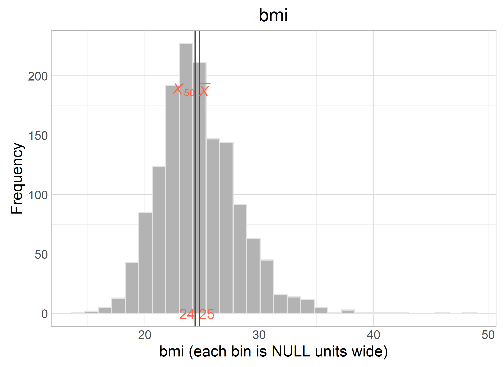

# Harmonize: physique

<!-- These two chunks should be added in the beginning of every .Rmd that you want to source an .R script -->
<!--  The 1st mandatory chunck  -->
<!--  Set the working directory to the repository's base directory -->


<!--  The 2nd mandatory chunck  -->
<!-- Set the report-wide options, and point to the external code file. -->


This report lists the candidate variable for DataScheme variables of the construct **physique**.

<!-- Load 'sourced' R files.  Suppress the output when loading packages. --> 


<!-- Load the sources.  Suppress the output when loading sources. --> 


<!-- Load any Global functions and variables declared in the R file.  Suppress the output. --> 


<!-- Declare any global functions specific to a Rmd output.  Suppress the output. --> 

# (I) Exposition

> This report is a record of interaction with a data transfer object (dto) produced by `./manipulation/0-ellis-island.R`. 

The next section recaps this script, exposes the architecture of the DTO, and demonstrates the language of interacting with it.   

## (I.A) Ellis Island

> All data land on Ellis Island.

The script `0-ellis-island.R` is the first script in the analytic workflow. It accomplished the following: 

- (1) Reads in raw data files from the candidate studies   
- (2) Extract, combines, and exports their metadata (specifically, variable names and labels, if provided) into `./data/shared/derived/meta-data-live.csv`, which is updated every time Ellis Island script is executed.   
- (3) Augments raw metadata with instructions for renaming and classifying variables. The instructions are provided as manually entered values in `./data/shared/meta-data-map.csv`. They are used by automatic scripts in later harmonization and analysis.  
- (4) Combines unit and metadata into a single DTO to serve as a starting point to all subsequent analyses.   

<!-- Load the datasets.   -->

```r
# load the product of 0-ellis-island.R,  a list object containing data and metadata
dto <- readRDS("./data/unshared/derived/dto.rds")
```

<!-- Inspect the datasets.   -->

```r
# the list is composed of the following elements
names(dto)
```

```
[1] "studyName" "filePath"  "unitData"  "metaData" 
```

```r
# 1st element - names of the studies as character vector
dto[["studyName"]]
```

```
[1] "alsa"  "lbsl"  "satsa" "share" "tilda"
```

```r
# 2nd element - file paths of the data files for each study as character vector
dto[["filePath"]]
```

```
[1] "./data/unshared/raw/ALSA-Wave1.Final.sav"         "./data/unshared/raw/LBSL-Panel2-Wave1.Final.sav" 
[3] "./data/unshared/raw/SATSA-Q3.Final.sav"           "./data/unshared/raw/SHARE-Israel-Wave1.Final.sav"
[5] "./data/unshared/raw/TILDA-Wave1.Final.sav"       
```

```r
# 3rd element - is a list object containing the following elements
names(dto[["unitData"]])
```

```
[1] "alsa"  "lbsl"  "satsa" "share" "tilda"
```

```r
# each of these elements is a raw data set of a corresponding study, for example
dplyr::tbl_df(dto[["unitData"]][["lbsl"]]) 
```

```
Source: local data frame [656 x 38]

        id AGE94 SEX94  MSTAT94 EDUC94     NOWRK94  SMK94                                         SMOKE
     (int) (int) (int)   (fctr)  (int)      (fctr) (fctr)                                        (fctr)
1  4001026    68     1 divorced     16 no, retired     no                                  never smoked
2  4012015    94     2  widowed     12 no, retired     no                                  never smoked
3  4012032    94     2  widowed     20 no, retired     no don't smoke at present but smoked in the past
4  4022004    93     2       NA     NA          NA     NA                                  never smoked
5  4022026    93     2  widowed     12 no, retired     no                                  never smoked
6  4031031    92     1  married      8 no, retired     no don't smoke at present but smoked in the past
7  4031035    92     1  widowed     13 no, retired     no don't smoke at present but smoked in the past
8  4032201    92     2       NA     NA          NA     NA don't smoke at present but smoked in the past
9  4041062    91     1  widowed      7          NA     no don't smoke at present but smoked in the past
10 4042057    91     2       NA     NA          NA     NA                                            NA
..     ...   ...   ...      ...    ...         ...    ...                                           ...
Variables not shown: ALCOHOL (fctr), WINE (int), BEER (int), HARDLIQ (int), SPORT94 (int), FIT94 (int), WALK94 (int),
  SPEC94 (int), DANCE94 (int), CHORE94 (int), EXCERTOT (int), EXCERWK (int), HEIGHT94 (int), WEIGHT94 (int), HWEIGHT
  (int), HHEIGHT (int), SRHEALTH (fctr), smoke_now (lgl), smoked_ever (lgl), year_of_wave (dbl), age_in_years (dbl),
  year_born (dbl), female (lgl), marital (chr), single (lgl), educ3 (chr), current_work_2 (lgl), current_drink (lgl),
  sedentary (lgl), poor_health (lgl)
```


### Meta

```r
# 4th element - a dataset names and labels of raw variables + added metadata for all studies
dto[["metaData"]] %>% dplyr::select(study_name, name, item, construct, type, categories, label_short, label) %>% 
  DT::datatable(
    class   = 'cell-border stripe',
    caption = "This is the primary metadata file. Edit at `./data/shared/meta-data-map.csv",
    filter  = "top",
    options = list(pageLength = 6, autoWidth = TRUE)
  )
```

<!--html_preserve--><div id="htmlwidget-272" style="width:100%;height:auto;" class="datatables html-widget"></div>
<script type="application/json" data-for="htmlwidget-272">{"x":{"filter":"top","filterHTML":"<tr>\n  <td>\u003c/td>\n  <td data-type=\"factor\" style=\"vertical-align: top;\">\n    <div class=\"form-group has-feedback\" style=\"margin-bottom: auto;\">\n      <input type=\"search\" placeholder=\"All\" class=\"form-control\" style=\"width: 100%;\"/>\n      <span class=\"glyphicon glyphicon-remove-circle form-control-feedback\">\u003c/span>\n    \u003c/div>\n    <div style=\"width: 100%; display: none;\">\n      <select multiple=\"multiple\" style=\"width: 100%;\">\n        <option value=\"alsa\">alsa\u003c/option>\n        <option value=\"lbsl\">lbsl\u003c/option>\n        <option value=\"satsa\">satsa\u003c/option>\n        <option value=\"share\">share\u003c/option>\n        <option value=\"tilda\">tilda\u003c/option>\n      \u003c/select>\n    \u003c/div>\n  \u003c/td>\n  <td data-type=\"factor\" style=\"vertical-align: top;\">\n    <div class=\"form-group has-feedback\" style=\"margin-bottom: auto;\">\n      <input type=\"search\" placeholder=\"All\" class=\"form-control\" style=\"width: 100%;\"/>\n      <span class=\"glyphicon glyphicon-remove-circle form-control-feedback\">\u003c/span>\n    \u003c/div>\n    <div style=\"width: 100%; display: none;\">\n      <select multiple=\"multiple\" style=\"width: 100%;\">\n        <option value=\"AGE\">AGE\u003c/option>\n        <option value=\"AGE94\">AGE94\u003c/option>\n        <option value=\"ALCOHOL\">ALCOHOL\u003c/option>\n        <option value=\"BEER\">BEER\u003c/option>\n        <option value=\"BEHALC.DRINKSPERDAY\">BEHALC.DRINKSPERDAY\u003c/option>\n        <option value=\"BEHALC.DRINKSPERWEEK\">BEHALC.DRINKSPERWEEK\u003c/option>\n        <option value=\"BEHALC.FREQ.WEEK\">BEHALC.FREQ.WEEK\u003c/option>\n        <option value=\"BEHSMOKER\">BEHSMOKER\u003c/option>\n        <option value=\"BH001\">BH001\u003c/option>\n        <option value=\"BH002\">BH002\u003c/option>\n        <option value=\"BH003\">BH003\u003c/option>\n        <option value=\"BH101\">BH101\u003c/option>\n        <option value=\"BH102\">BH102\u003c/option>\n        <option value=\"BH102A\">BH102A\u003c/option>\n        <option value=\"BH103\">BH103\u003c/option>\n        <option value=\"BH104\">BH104\u003c/option>\n        <option value=\"BH104A\">BH104A\u003c/option>\n        <option value=\"BH105\">BH105\u003c/option>\n        <option value=\"BH106\">BH106\u003c/option>\n        <option value=\"BH106A\">BH106A\u003c/option>\n        <option value=\"BH107\">BH107\u003c/option>\n        <option value=\"BH107A\">BH107A\u003c/option>\n        <option value=\"BR0010\">BR0010\u003c/option>\n        <option value=\"BR0020\">BR0020\u003c/option>\n        <option value=\"BR0030\">BR0030\u003c/option>\n        <option value=\"BR0100\">BR0100\u003c/option>\n        <option value=\"BR0110\">BR0110\u003c/option>\n        <option value=\"BR0120\">BR0120\u003c/option>\n        <option value=\"BR0130\">BR0130\u003c/option>\n        <option value=\"BR0150\">BR0150\u003c/option>\n        <option value=\"BR0160\">BR0160\u003c/option>\n        <option value=\"BTSM12MN\">BTSM12MN\u003c/option>\n        <option value=\"CHORE94\">CHORE94\u003c/option>\n        <option value=\"CS006\">CS006\u003c/option>\n        <option value=\"CURRWORK\">CURRWORK\u003c/option>\n        <option value=\"DANCE94\">DANCE94\u003c/option>\n        <option value=\"DM001\">DM001\u003c/option>\n        <option value=\"DN0030\">DN0030\u003c/option>\n        <option value=\"DN0100\">DN0100\u003c/option>\n        <option value=\"DN012D01\">DN012D01\u003c/option>\n        <option value=\"DN012D02\">DN012D02\u003c/option>\n        <option value=\"DN012D03\">DN012D03\u003c/option>\n        <option value=\"DN012D04\">DN012D04\u003c/option>\n        <option value=\"DN012D05\">DN012D05\u003c/option>\n        <option value=\"DN012D09\">DN012D09\u003c/option>\n        <option value=\"DN012DDK\">DN012DDK\u003c/option>\n        <option value=\"DN012DNO\">DN012DNO\u003c/option>\n        <option value=\"DN012DOT\">DN012DOT\u003c/option>\n        <option value=\"DN012DRF\">DN012DRF\u003c/option>\n        <option value=\"DN0140\">DN0140\u003c/option>\n        <option value=\"EDUC\">EDUC\u003c/option>\n        <option value=\"EDUC94\">EDUC94\u003c/option>\n        <option value=\"EP0050\">EP0050\u003c/option>\n        <option value=\"EXCERTOT\">EXCERTOT\u003c/option>\n        <option value=\"EXCERWK\">EXCERWK\u003c/option>\n        <option value=\"EXRTHOUS\">EXRTHOUS\u003c/option>\n        <option value=\"FIT94\">FIT94\u003c/option>\n        <option value=\"FR6ORMOR\">FR6ORMOR\u003c/option>\n        <option value=\"FREQALCH\">FREQALCH\u003c/option>\n        <option value=\"GALCOHOL\">GALCOHOL\u003c/option>\n        <option value=\"GAMTWORK\">GAMTWORK\u003c/option>\n        <option value=\"GBEERX\">GBEERX\u003c/option>\n        <option value=\"GBOTVIN\">GBOTVIN\u003c/option>\n        <option value=\"GD002\">GD002\u003c/option>\n        <option value=\"GDRLOTS\">GDRLOTS\u003c/option>\n        <option value=\"GENDER\">GENDER\u003c/option>\n        <option value=\"GEVRALK\">GEVRALK\u003c/option>\n        <option value=\"GEVRSMK\">GEVRSMK\u003c/option>\n        <option value=\"GEVRSNS\">GEVRSNS\u003c/option>\n        <option value=\"GEXERCIS\">GEXERCIS\u003c/option>\n        <option value=\"GFREQBER\">GFREQBER\u003c/option>\n        <option value=\"GFREQLIQ\">GFREQLIQ\u003c/option>\n        <option value=\"GFREQVIN\">GFREQVIN\u003c/option>\n        <option value=\"GGENHLTH\">GGENHLTH\u003c/option>\n        <option value=\"GHLTHOTH\">GHLTHOTH\u003c/option>\n        <option value=\"GHTCM\">GHTCM\u003c/option>\n        <option value=\"GLIQX\">GLIQX\u003c/option>\n        <option value=\"GMARITAL\">GMARITAL\u003c/option>\n        <option value=\"GPI\">GPI\u003c/option>\n        <option value=\"GSMOKNOW\">GSMOKNOW\u003c/option>\n        <option value=\"GSTOPALK\">GSTOPALK\u003c/option>\n        <option value=\"GVINX\">GVINX\u003c/option>\n        <option value=\"GWTKG\">GWTKG\u003c/option>\n        <option value=\"HARDLIQ\">HARDLIQ\u003c/option>\n        <option value=\"HEIGHT\">HEIGHT\u003c/option>\n        <option value=\"HEIGHT94\">HEIGHT94\u003c/option>\n        <option value=\"HHEIGHT\">HHEIGHT\u003c/option>\n        <option value=\"HLTHBTSM\">HLTHBTSM\u003c/option>\n        <option value=\"HLTHLIFE\">HLTHLIFE\u003c/option>\n        <option value=\"HWEIGHT\">HWEIGHT\u003c/option>\n        <option value=\"HWMNWK2W\">HWMNWK2W\u003c/option>\n        <option value=\"ID\">ID\u003c/option>\n        <option value=\"INT.YEAR\">INT.YEAR\u003c/option>\n        <option value=\"IPAQEXERCISE3\">IPAQEXERCISE3\u003c/option>\n        <option value=\"IPAQMETMINUTES\">IPAQMETMINUTES\u003c/option>\n        <option value=\"LSVEXC2W\">LSVEXC2W\u003c/option>\n        <option value=\"LSVIGEXC\">LSVIGEXC\u003c/option>\n        <option value=\"MAR_4\">MAR_4\u003c/option>\n        <option value=\"MARITST\">MARITST\u003c/option>\n        <option value=\"MSTAT94\">MSTAT94\u003c/option>\n        <option value=\"NOSTDRNK\">NOSTDRNK\u003c/option>\n        <option value=\"NOWRK94\">NOWRK94\u003c/option>\n        <option value=\"PH001\">PH001\u003c/option>\n        <option value=\"PH0020\">PH0020\u003c/option>\n        <option value=\"PH0030\">PH0030\u003c/option>\n        <option value=\"PH009\">PH009\u003c/option>\n        <option value=\"PH0120\">PH0120\u003c/option>\n        <option value=\"PH0130\">PH0130\u003c/option>\n        <option value=\"PH0520\">PH0520\u003c/option>\n        <option value=\"PH0530\">PH0530\u003c/option>\n        <option value=\"PIPCIGAR\">PIPCIGAR\u003c/option>\n        <option value=\"QAGE3\">QAGE3\u003c/option>\n        <option value=\"RETIRED\">RETIRED\u003c/option>\n        <option value=\"SAMPID.rec\">SAMPID.rec\u003c/option>\n        <option value=\"SCHOOL\">SCHOOL\u003c/option>\n        <option value=\"SCQALCOFREQ\">SCQALCOFREQ\u003c/option>\n        <option value=\"SCQALCOHOL\">SCQALCOHOL\u003c/option>\n        <option value=\"SCQALCONO1\">SCQALCONO1\u003c/option>\n        <option value=\"SCQALCONO2\">SCQALCONO2\u003c/option>\n        <option value=\"SEQNUM\">SEQNUM\u003c/option>\n        <option value=\"SEX\">SEX\u003c/option>\n        <option value=\"SEX94\">SEX94\u003c/option>\n        <option value=\"SMK94\">SMK94\u003c/option>\n        <option value=\"SMOKE\">SMOKE\u003c/option>\n        <option value=\"SMOKER\">SMOKER\u003c/option>\n        <option value=\"SOCMARRIED\">SOCMARRIED\u003c/option>\n        <option value=\"SPEC94\">SPEC94\u003c/option>\n        <option value=\"SPORT94\">SPORT94\u003c/option>\n        <option value=\"SR.HEIGHT.CENTIMETRES\">SR.HEIGHT.CENTIMETRES\u003c/option>\n        <option value=\"SR.WEIGHT.KILOGRAMMES\">SR.WEIGHT.KILOGRAMMES\u003c/option>\n        <option value=\"SRHEALTH\">SRHEALTH\u003c/option>\n        <option value=\"TMHVYEXR\">TMHVYEXR\u003c/option>\n        <option value=\"TMVEXC2W\">TMVEXC2W\u003c/option>\n        <option value=\"TYPQUAL\">TYPQUAL\u003c/option>\n        <option value=\"VIGEXC2W\">VIGEXC2W\u003c/option>\n        <option value=\"VIGEXCS\">VIGEXCS\u003c/option>\n        <option value=\"WALK2WKS\">WALK2WKS\u003c/option>\n        <option value=\"WALK94\">WALK94\u003c/option>\n        <option value=\"WE001\">WE001\u003c/option>\n        <option value=\"WE003\">WE003\u003c/option>\n        <option value=\"WEIGHT\">WEIGHT\u003c/option>\n        <option value=\"WEIGHT94\">WEIGHT94\u003c/option>\n        <option value=\"WINE\">WINE\u003c/option>\n        <option value=\"YRBORN\">YRBORN\u003c/option>\n      \u003c/select>\n    \u003c/div>\n  \u003c/td>\n  <td data-type=\"factor\" style=\"vertical-align: top;\">\n    <div class=\"form-group has-feedback\" style=\"margin-bottom: auto;\">\n      <input type=\"search\" placeholder=\"All\" class=\"form-control\" style=\"width: 100%;\"/>\n      <span class=\"glyphicon glyphicon-remove-circle form-control-feedback\">\u003c/span>\n    \u003c/div>\n    <div style=\"width: 100%; display: none;\">\n      <select multiple=\"multiple\" style=\"width: 100%;\">\n        <option value=\"\">\u003c/option>\n        <option value=\"age\">age\u003c/option>\n        <option value=\"age_1994\">age_1994\u003c/option>\n        <option value=\"age_interview\">age_interview\u003c/option>\n        <option value=\"age_left_school\">age_left_school\u003c/option>\n        <option value=\"age_q3\">age_q3\u003c/option>\n        <option value=\"born_year\">born_year\u003c/option>\n        <option value=\"current_job\">current_job\u003c/option>\n        <option value=\"edu\">edu\u003c/option>\n        <option value=\"edu_highest\">edu_highest\u003c/option>\n        <option value=\"edu_hight\">edu_hight\u003c/option>\n        <option value=\"employed\">employed\u003c/option>\n        <option value=\"healt_self\">healt_self\u003c/option>\n        <option value=\"health_12ago\">health_12ago\u003c/option>\n        <option value=\"health_others\">health_others\u003c/option>\n        <option value=\"height_in\">height_in\u003c/option>\n        <option value=\"height_in_sr\">height_in_sr\u003c/option>\n        <option value=\"id\">id\u003c/option>\n        <option value=\"marital\">marital\u003c/option>\n        <option value=\"marital_2\">marital_2\u003c/option>\n        <option value=\"marital_4\">marital_4\u003c/option>\n        <option value=\"marital_6\">marital_6\u003c/option>\n        <option value=\"retired\">retired\u003c/option>\n        <option value=\"school_years\">school_years\u003c/option>\n        <option value=\"sex\">sex\u003c/option>\n        <option value=\"sex_gender\">sex_gender\u003c/option>\n        <option value=\"smoke_age\">smoke_age\u003c/option>\n        <option value=\"smoke_history\">smoke_history\u003c/option>\n        <option value=\"smoke_history2\">smoke_history2\u003c/option>\n        <option value=\"smoke_now\">smoke_now\u003c/option>\n        <option value=\"smoke_pipecigar\">smoke_pipecigar\u003c/option>\n        <option value=\"smoke_years\">smoke_years\u003c/option>\n        <option value=\"snuff_history\">snuff_history\u003c/option>\n        <option value=\"twin_id\">twin_id\u003c/option>\n        <option value=\"weight_kg\">weight_kg\u003c/option>\n        <option value=\"weight_lb\">weight_lb\u003c/option>\n        <option value=\"weight_lb_sr\">weight_lb_sr\u003c/option>\n        <option value=\"work_extra\">work_extra\u003c/option>\n        <option value=\"work_status\">work_status\u003c/option>\n        <option value=\"year_born\">year_born\u003c/option>\n      \u003c/select>\n    \u003c/div>\n  \u003c/td>\n  <td data-type=\"factor\" style=\"vertical-align: top;\">\n    <div class=\"form-group has-feedback\" style=\"margin-bottom: auto;\">\n      <input type=\"search\" placeholder=\"All\" class=\"form-control\" style=\"width: 100%;\"/>\n      <span class=\"glyphicon glyphicon-remove-circle form-control-feedback\">\u003c/span>\n    \u003c/div>\n    <div style=\"width: 100%; display: none;\">\n      <select multiple=\"multiple\" style=\"width: 100%;\">\n        <option value=\"age\">age\u003c/option>\n        <option value=\"alcohol\">alcohol\u003c/option>\n        <option value=\"education\">education\u003c/option>\n        <option value=\"health\">health\u003c/option>\n        <option value=\"id\">id\u003c/option>\n        <option value=\"marital\">marital\u003c/option>\n        <option value=\"physact\">physact\u003c/option>\n        <option value=\"physique\">physique\u003c/option>\n        <option value=\"sex\">sex\u003c/option>\n        <option value=\"smoking\">smoking\u003c/option>\n        <option value=\"work_status\">work_status\u003c/option>\n        <option value=\"year\">year\u003c/option>\n      \u003c/select>\n    \u003c/div>\n  \u003c/td>\n  <td data-type=\"factor\" style=\"vertical-align: top;\">\n    <div class=\"form-group has-feedback\" style=\"margin-bottom: auto;\">\n      <input type=\"search\" placeholder=\"All\" class=\"form-control\" style=\"width: 100%;\"/>\n      <span class=\"glyphicon glyphicon-remove-circle form-control-feedback\">\u003c/span>\n    \u003c/div>\n    <div style=\"width: 100%; display: none;\">\n      <select multiple=\"multiple\" style=\"width: 100%;\">\n        <option value=\"activity\">activity\u003c/option>\n        <option value=\"demo\">demo\u003c/option>\n        <option value=\"physical\">physical\u003c/option>\n        <option value=\"substance\">substance\u003c/option>\n      \u003c/select>\n    \u003c/div>\n  \u003c/td>\n  <td data-type=\"integer\" style=\"vertical-align: top;\">\n    <div class=\"form-group has-feedback\" style=\"margin-bottom: auto;\">\n      <input type=\"search\" placeholder=\"All\" class=\"form-control\" style=\"width: 100%;\"/>\n      <span class=\"glyphicon glyphicon-remove-circle form-control-feedback\">\u003c/span>\n    \u003c/div>\n    <div style=\"display: none; position: absolute; width: 200px;\">\n      <div data-min=\"2\" data-max=\"8504\">\u003c/div>\n      <span style=\"float: left;\">\u003c/span>\n      <span style=\"float: right;\">\u003c/span>\n    \u003c/div>\n  \u003c/td>\n  <td data-type=\"factor\" style=\"vertical-align: top;\">\n    <div class=\"form-group has-feedback\" style=\"margin-bottom: auto;\">\n      <input type=\"search\" placeholder=\"All\" class=\"form-control\" style=\"width: 100%;\"/>\n      <span class=\"glyphicon glyphicon-remove-circle form-control-feedback\">\u003c/span>\n    \u003c/div>\n    <div style=\"width: 100%; display: none;\">\n      <select multiple=\"multiple\" style=\"width: 100%;\">\n        <option value=\"\">\u003c/option>\n        <option value=\"…more than 1 bottle\">…more than 1 bottle\u003c/option>\n        <option value=\"activities requiring a moderate level of energy\">activities requiring a moderate level of energy\u003c/option>\n        <option value=\"Age\">Age\u003c/option>\n        <option value=\"Age at current wave\">Age at current wave\u003c/option>\n        <option value=\"Age in 1994\">Age in 1994\u003c/option>\n        <option value=\"Age left school\">Age left school\u003c/option>\n        <option value=\"Age when stopped smoking\">Age when stopped smoking\u003c/option>\n        <option value=\"Alcohol use\">Alcohol use\u003c/option>\n        <option value=\"Alcoholic drinks\">Alcoholic drinks\u003c/option>\n        <option value=\"Anonymised ID\">Anonymised ID\u003c/option>\n        <option value=\"Any paid work last week?\">Any paid work last week?\u003c/option>\n        <option value=\"Are you retired from your last job?\">Are you retired from your last job?\u003c/option>\n        <option value=\"Average times drinking per week\">Average times drinking per week\u003c/option>\n        <option value=\"beverages consumed last 6 months\">beverages consumed last 6 months\u003c/option>\n        <option value=\"Compared to others  your age,  your health is\">Compared to others  your age,  your health is\u003c/option>\n        <option value=\"Current job situation\">Current job situation\u003c/option>\n        <option value=\"Currently smoke?\">Currently smoke?\u003c/option>\n        <option value=\"Currently working\">Currently working\u003c/option>\n        <option value=\"Dancing\">Dancing\u003c/option>\n        <option value=\"Describe current job situation\">Describe current job situation\u003c/option>\n        <option value=\"Describe current work/retirement situation\">Describe current work/retirement situation\u003c/option>\n        <option value=\"Do you currently smoke cigarettes?\">Do you currently smoke cigarettes?\u003c/option>\n        <option value=\"Do you ever drink alcoholic beverages?\">Do you ever drink alcoholic beverages?\u003c/option>\n        <option value=\"Do you ever drink alcoholic drinks? - Yes\">Do you ever drink alcoholic drinks? - Yes\u003c/option>\n        <option value=\"Do you ever drink alcoholic drinks? -No I quit. When? 19__\">Do you ever drink alcoholic drinks? -No I quit. When? 19__\u003c/option>\n        <option value=\"Do you regularly smoke pipe or cigar?\">Do you regularly smoke pipe or cigar?\u003c/option>\n        <option value=\"Do you smoke tobacco?\">Do you smoke tobacco?\u003c/option>\n        <option value=\"Do you take snuff?\">Do you take snuff?\u003c/option>\n        <option value=\"Doing household chores (hrs/wk)\">Doing household chores (hrs/wk)\u003c/option>\n        <option value=\"dont know\">dont know\u003c/option>\n        <option value=\"During the last 7 days, how much time did you spend sitting on a week day? HO?\">During the last 7 days, how much time did you spend sitting on a week day? HO?\u003c/option>\n        <option value=\"During the last 7 days, how much time did you spend sitting on a week day? MINS\">During the last 7 days, how much time did you spend sitting on a week day? MINS\u003c/option>\n        <option value=\"During the last 7 days, on how many days did you do moderate physical activit?\">During the last 7 days, on how many days did you do moderate physical activit?\u003c/option>\n        <option value=\"During the last 7 days, on how many days did you do vigorous physical activit?\">During the last 7 days, on how many days did you do vigorous physical activit?\u003c/option>\n        <option value=\"During the last 7 days, on how many days did you walk for at least 10 minutes?\">During the last 7 days, on how many days did you walk for at least 10 minutes?\u003c/option>\n        <option value=\"Edcuation\">Edcuation\u003c/option>\n        <option value=\"Education\">Education\u003c/option>\n        <option value=\"Ever smoked tobacco daily for a year?\">Ever smoked tobacco daily for a year?\u003c/option>\n        <option value=\"Exercised or played sports (oc/wk)\">Exercised or played sports (oc/wk)\u003c/option>\n        <option value=\"Exercising for shape/fun (hrs/wk)\">Exercising for shape/fun (hrs/wk)\u003c/option>\n        <option value=\"Exertion around house\">Exertion around house\u003c/option>\n        <option value=\"freq more than 2 glasses beer in a day\">freq more than 2 glasses beer in a day\u003c/option>\n        <option value=\"freq more than 2 glasses wine in a day\">freq more than 2 glasses wine in a day\u003c/option>\n        <option value=\"freq more than 2 hard liquor in a day\">freq more than 2 hard liquor in a day\u003c/option>\n        <option value=\"Frequency alcohol\">Frequency alcohol\u003c/option>\n        <option value=\"Frequency of drinking alcohol\">Frequency of drinking alcohol\u003c/option>\n        <option value=\"Frequency six or more drinks\">Frequency six or more drinks\u003c/option>\n        <option value=\"Gender\">Gender\u003c/option>\n        <option value=\"Health comp with 12mths ago\">Health comp with 12mths ago\u003c/option>\n        <option value=\"Health compared to others\">Health compared to others\u003c/option>\n        <option value=\"health in general question v 1\">health in general question v 1\u003c/option>\n        <option value=\"health in general question v 2\">health in general question v 2\u003c/option>\n        <option value=\"Height Centimetres\">Height Centimetres\u003c/option>\n        <option value=\"Height in Inches\">Height in Inches\u003c/option>\n        <option value=\"Highest qualification\">Highest qualification\u003c/option>\n        <option value=\"How do you judge your general state of health?\">How do you judge your general state of health?\u003c/option>\n        <option value=\"How many drinks consumed on days drink taken\">How many drinks consumed on days drink taken\u003c/option>\n        <option value=\"How many years smoked?\">How many years smoked?\u003c/option>\n        <option value=\"How much beer do you usually drink at a time?\">How much beer do you usually drink at a time?\u003c/option>\n        <option value=\"How much hard liquot do you usually drink at time?\">How much hard liquot do you usually drink at time?\u003c/option>\n        <option value=\"How much time did you usually spend doing moderate physical activities on one?\">How much time did you usually spend doing moderate physical activities on one?\u003c/option>\n        <option value=\"How much time did you usually spend doing vigorous physical activities on one?\">How much time did you usually spend doing vigorous physical activities on one?\u003c/option>\n        <option value=\"How much time did you usually spend walking on one of those days? HOURS\">How much time did you usually spend walking on one of those days? HOURS\u003c/option>\n        <option value=\"How much time did you usually spend walking on one of those days? MINS\">How much time did you usually spend walking on one of those days? MINS\u003c/option>\n        <option value=\"How much wine do you usually drink at a time?\">How much wine do you usually drink at a time?\u003c/option>\n        <option value=\"How often do you drink beer (not light beer)?\">How often do you drink beer (not light beer)?\u003c/option>\n        <option value=\"How often do you usually drink hard liquor?\">How often do you usually drink hard liquor?\u003c/option>\n        <option value=\"How often do you usually drink wine (red or white)?\">How often do you usually drink wine (red or white)?\u003c/option>\n        <option value=\"How often more than 5 beers?\">How often more than 5 beers?\u003c/option>\n        <option value=\"how tall are you?\">how tall are you?\u003c/option>\n        <option value=\"id\">id\u003c/option>\n        <option value=\"Id\">Id\u003c/option>\n        <option value=\"interview year\">interview year\u003c/option>\n        <option value=\"Judge your health compared to others your age?\">Judge your health compared to others your age?\u003c/option>\n        <option value=\"Less vigor past 2 weeks\">Less vigor past 2 weeks\u003c/option>\n        <option value=\"Less vigor sessions last 2 weeks\">Less vigor sessions last 2 weeks\u003c/option>\n        <option value=\"Male or Female?\">Male or Female?\u003c/option>\n        <option value=\"Marital status\">Marital status\u003c/option>\n        <option value=\"Marital Status\">Marital Status\u003c/option>\n        <option value=\"Marital Status in 1994\">Marital Status in 1994\u003c/option>\n        <option value=\"More than 2 drinks/day\">More than 2 drinks/day\u003c/option>\n        <option value=\"no further education\">no further education\u003c/option>\n        <option value=\"Number of cans/bottles of beer last week\">Number of cans/bottles of beer last week\u003c/option>\n        <option value=\"Number of drinks containing hard liquor last week\">Number of drinks containing hard liquor last week\u003c/option>\n        <option value=\"Number of glasses of wine last week\">Number of glasses of wine last week\u003c/option>\n        <option value=\"Number of standard drinks\">Number of standard drinks\u003c/option>\n        <option value=\"nursing school\">nursing school\u003c/option>\n        <option value=\"other further education\">other further education\u003c/option>\n        <option value=\"Participant sports, number of hours\">Participant sports, number of hours\u003c/option>\n        <option value=\"Physical activity met (minutes)\">Physical activity met (minutes)\u003c/option>\n        <option value=\"Physical fitness, number of hours each week\">Physical fitness, number of hours each week\u003c/option>\n        <option value=\"polytechnic\">polytechnic\u003c/option>\n        <option value=\"refused\">refused\u003c/option>\n        <option value=\"Respondent height\">Respondent height\u003c/option>\n        <option value=\"Respondent is a smoker\">Respondent is a smoker\u003c/option>\n        <option value=\"Respondent weight\">Respondent weight\u003c/option>\n        <option value=\"Self-rated health\">Self-rated health\u003c/option>\n        <option value=\"Self-reported health compared to age peers\">Self-reported health compared to age peers\u003c/option>\n        <option value=\"Self-reported height in inches\">Self-reported height in inches\u003c/option>\n        <option value=\"Self-reported weight in pounds\">Self-reported weight in pounds\u003c/option>\n        <option value=\"Sequence Number\">Sequence Number\u003c/option>\n        <option value=\"Sex\">Sex\u003c/option>\n        <option value=\"Smoke at present?\">Smoke at present?\u003c/option>\n        <option value=\"Smoke, tobacco use\">Smoke, tobacco use\u003c/option>\n        <option value=\"Smoked some last month?\">Smoked some last month?\u003c/option>\n        <option value=\"Spectator sports, number of hours spent per week\">Spectator sports, number of hours spent per week\u003c/option>\n        <option value=\"sports or activities that are vigorous\">sports or activities that are vigorous\u003c/option>\n        <option value=\"Standard drinks a week\">Standard drinks a week\u003c/option>\n        <option value=\"Standard drinks per day\">Standard drinks per day\u003c/option>\n        <option value=\"still in further education or training\">still in further education or training\u003c/option>\n        <option value=\"Time heavy physical exertion\">Time heavy physical exertion\u003c/option>\n        <option value=\"Times walked in past two weeks\">Times walked in past two weeks\u003c/option>\n        <option value=\"Twin number\">Twin number\u003c/option>\n        <option value=\"university, Bachelors degree\">university, Bachelors degree\u003c/option>\n        <option value=\"university, graduate degree\">university, graduate degree\u003c/option>\n        <option value=\"Vigor Sessions in past 2 weeks\">Vigor Sessions in past 2 weeks\u003c/option>\n        <option value=\"Vigor Time past 2 weeks\">Vigor Time past 2 weeks\u003c/option>\n        <option value=\"Vigorous exercise\">Vigorous exercise\u003c/option>\n        <option value=\"Walking past 2 weeks\">Walking past 2 weeks\u003c/option>\n        <option value=\"Walking, number of hours per week\">Walking, number of hours per week\u003c/option>\n        <option value=\"Weight in kilograms\">Weight in kilograms\u003c/option>\n        <option value=\"Weight in Pounds\">Weight in Pounds\u003c/option>\n        <option value=\"Weight Kilogrammes\">Weight Kilogrammes\u003c/option>\n        <option value=\"weight of respondent\">weight of respondent\u003c/option>\n        <option value=\"What about your health.  Would you say ?\">What about your health.  Would you say ?\u003c/option>\n        <option value=\"What is your marital status?\">What is your marital status?\u003c/option>\n        <option value=\"What option best describes your exercise on a yearly basis?\">What option best describes your exercise on a yearly basis?\u003c/option>\n        <option value=\"Working at present time?\">Working at present time?\u003c/option>\n        <option value=\"Year born\">Year born\u003c/option>\n        <option value=\"Years of school completed\">Years of school completed\u003c/option>\n        <option value=\"yeshiva, religious high institution\">yeshiva, religious high institution\u003c/option>\n      \u003c/select>\n    \u003c/div>\n  \u003c/td>\n  <td data-type=\"factor\" style=\"vertical-align: top;\">\n    <div class=\"form-group has-feedback\" style=\"margin-bottom: auto;\">\n      <input type=\"search\" placeholder=\"All\" class=\"form-control\" style=\"width: 100%;\"/>\n      <span class=\"glyphicon glyphicon-remove-circle form-control-feedback\">\u003c/span>\n    \u003c/div>\n    <div style=\"width: 100%; display: none;\">\n      <select multiple=\"multiple\" style=\"width: 100%;\">\n        <option value=\"..more than 1 bottle, i.e.____bottles (state number of bottles): GBOTVIN\">..more than 1 bottle, i.e.____bottles (state number of bottles): GBOTVIN\u003c/option>\n        <option value=\"activities requiring a moderate level of energy\">activities requiring a moderate level of energy\u003c/option>\n        <option value=\"Age\">Age\u003c/option>\n        <option value=\"Age at interview assuming DOB is 1st of specified month\">Age at interview assuming DOB is 1st of specified month\u003c/option>\n        <option value=\"age at Q3\">age at Q3\u003c/option>\n        <option value=\"Age in 1994\">Age in 1994\u003c/option>\n        <option value=\"Age left school\">Age left school\u003c/option>\n        <option value=\"Alcohol use\">Alcohol use\u003c/option>\n        <option value=\"Anonymised ID\">Anonymised ID\u003c/option>\n        <option value=\"Are you retired from your last job?\">Are you retired from your last job?\u003c/option>\n        <option value=\"BEHalc_drinksperday  Standard drinks per day\">BEHalc_drinksperday  Standard drinks per day\u003c/option>\n        <option value=\"BEHalc_drinksperweek  Standard drinks a week\">BEHalc_drinksperweek  Standard drinks a week\u003c/option>\n        <option value=\"BEHalc_freq_week  Average times drinking per week\">BEHalc_freq_week  Average times drinking per week\u003c/option>\n        <option value=\"BEHsmoker  Smoker\">BEHsmoker  Smoker\u003c/option>\n        <option value=\"beverages consumed last 6 months\">beverages consumed last 6 months\u003c/option>\n        <option value=\"bh001  Have you ever smoked cigarettes, cigars, cigarillos or a pipe daily for a per?\">bh001  Have you ever smoked cigarettes, cigars, cigarillos or a pipe daily for a per?\u003c/option>\n        <option value=\"bh002  Do you smoke at the present time?\">bh002  Do you smoke at the present time?\u003c/option>\n        <option value=\"bh003  How old were you when you stopped smoking?\">bh003  How old were you when you stopped smoking?\u003c/option>\n        <option value=\"bh101  During the last 7 days, on how many days did you do vigorous physical activit?\">bh101  During the last 7 days, on how many days did you do vigorous physical activit?\u003c/option>\n        <option value=\"bh102  How much time did you usually spend doing vigorous physical activities on one?\">bh102  How much time did you usually spend doing vigorous physical activities on one?\u003c/option>\n        <option value=\"bh102a  How much time did you usually spend doing vigorous physical activities on one?\">bh102a  How much time did you usually spend doing vigorous physical activities on one?\u003c/option>\n        <option value=\"bh103  During the last 7 days, on how many days did you do moderate physical activit?\">bh103  During the last 7 days, on how many days did you do moderate physical activit?\u003c/option>\n        <option value=\"bh104  How much time did you usually spend doing moderate physical activities on one?\">bh104  How much time did you usually spend doing moderate physical activities on one?\u003c/option>\n        <option value=\"bh104a  How much time did you usually spend doing moderate physical activities on one?\">bh104a  How much time did you usually spend doing moderate physical activities on one?\u003c/option>\n        <option value=\"bh105  During the last 7 days, on how many days did you walk for at least 10 minutes?\">bh105  During the last 7 days, on how many days did you walk for at least 10 minutes?\u003c/option>\n        <option value=\"bh106  How much time did you usually spend walking on one of those days? HOURS\">bh106  How much time did you usually spend walking on one of those days? HOURS\u003c/option>\n        <option value=\"bh106a  How much time did you usually spend walking on one of those days? MINS\">bh106a  How much time did you usually spend walking on one of those days? MINS\u003c/option>\n        <option value=\"bh107  During the last 7 days, how much time did you spend sitting on a week day? HO?\">bh107  During the last 7 days, how much time did you spend sitting on a week day? HO?\u003c/option>\n        <option value=\"bh107a  During the last 7 days, how much time did you spend sitting on a week day? MINS\">bh107a  During the last 7 days, how much time did you spend sitting on a week day? MINS\u003c/option>\n        <option value=\"BMI ((htcm/100)^2)\">BMI ((htcm/100)^2)\u003c/option>\n        <option value=\"cs006  Are you...?\">cs006  Are you...?\u003c/option>\n        <option value=\"current job situation\">current job situation\u003c/option>\n        <option value=\"Currently smoke?\">Currently smoke?\u003c/option>\n        <option value=\"Currently working\">Currently working\u003c/option>\n        <option value=\"Dancing\">Dancing\u003c/option>\n        <option value=\"Did you, nevertheless, do any paid work during the last week, either as an em?\">Did you, nevertheless, do any paid work during the last week, either as an em?\u003c/option>\n        <option value=\"dm001  What is the highest level of education you have completed\">dm001  What is the highest level of education you have completed\u003c/option>\n        <option value=\"Do you currently smoke cigarettes?\">Do you currently smoke cigarettes?\u003c/option>\n        <option value=\"Do you ever drink alcoholic beverages?\">Do you ever drink alcoholic beverages?\u003c/option>\n        <option value=\"Do you ever drink alcoholic drinks? - Yes\">Do you ever drink alcoholic drinks? - Yes\u003c/option>\n        <option value=\"Do you ever drink alcoholic drinks? -No I quit. When? 19__\">Do you ever drink alcoholic drinks? -No I quit. When? 19__\u003c/option>\n        <option value=\"Do you regularly smoke pipe or cigar?\">Do you regularly smoke pipe or cigar?\u003c/option>\n        <option value=\"Do you smoke cigarettes, cigars or a pipe? - Yes\">Do you smoke cigarettes, cigars or a pipe? - Yes\u003c/option>\n        <option value=\"Do you take snuff? - Yes\">Do you take snuff? - Yes\u003c/option>\n        <option value=\"Doing household chores, number of hours spent per week\">Doing household chores, number of hours spent per week\u003c/option>\n        <option value=\"dont know\">dont know\u003c/option>\n        <option value=\"Education\">Education\u003c/option>\n        <option value=\"ever smoked daily\">ever smoked daily\u003c/option>\n        <option value=\"Exertion around house\">Exertion around house\u003c/option>\n        <option value=\"freq more than 2 glasses beer in a day\">freq more than 2 glasses beer in a day\u003c/option>\n        <option value=\"freq more than 2 glasses wine in a day\">freq more than 2 glasses wine in a day\u003c/option>\n        <option value=\"freq more than 2 hard liquor in a day\">freq more than 2 hard liquor in a day\u003c/option>\n        <option value=\"Frequency alcohol\">Frequency alcohol\u003c/option>\n        <option value=\"Frequency six or more drinks\">Frequency six or more drinks\u003c/option>\n        <option value=\"gd002 - Is this respondent male or female?\">gd002 - Is this respondent male or female?\u003c/option>\n        <option value=\"Gender\">Gender\u003c/option>\n        <option value=\"Have you smoked more than 6 cigarettes, 4 cigars or used pipe tobacco or snuff during the last month?\">Have you smoked more than 6 cigarettes, 4 cigars or used pipe tobacco or snuff during the last month?\u003c/option>\n        <option value=\"Health comp with 12mths ago\">Health comp with 12mths ago\u003c/option>\n        <option value=\"Health compared to others\">Health compared to others\u003c/option>\n        <option value=\"health in general question v 1\">health in general question v 1\u003c/option>\n        <option value=\"health in general question v 2\">health in general question v 2\u003c/option>\n        <option value=\"Height in Inches\">Height in Inches\u003c/option>\n        <option value=\"Here are seven different options concerning exercise during your leisure time. Which one of these options best fits how you yourself exercise on a yearly basis?\">Here are seven different options concerning exercise during your leisure time. Which one of these options best fits how you yourself exercise on a yearly basis?\u003c/option>\n        <option value=\"highest educational degree obtained\">highest educational degree obtained\u003c/option>\n        <option value=\"Highest qualification\">Highest qualification\u003c/option>\n        <option value=\"How do you judge your general state of health compared to other people your age?\">How do you judge your general state of health compared to other people your age?\u003c/option>\n        <option value=\"How do you judge your general state of health?\">How do you judge your general state of health?\u003c/option>\n        <option value=\"how many years smoked\">how many years smoked\u003c/option>\n        <option value=\"How much beer do you usually drink at a time?\">How much beer do you usually drink at a time?\u003c/option>\n        <option value=\"How much do you weigh? (kg)\">How much do you weigh? (kg)\u003c/option>\n        <option value=\"How much hard liquot do you usually drink at time?\">How much hard liquot do you usually drink at time?\u003c/option>\n        <option value=\"How much wine do you usually drink at a time?\">How much wine do you usually drink at a time?\u003c/option>\n        <option value=\"How often do you consume more than five bottles of beer or more than one bottle of wine or more than 1/2 bottle liquot at one occasion?\">How often do you consume more than five bottles of beer or more than one bottle of wine or more than 1/2 bottle liquot at one occasion?\u003c/option>\n        <option value=\"How often do you drink beer (not light beer)?\">How often do you drink beer (not light beer)?\u003c/option>\n        <option value=\"How often do you usually drink hard liquor? (e.g. aquavit, whiskey, gin, brandy, punsch. Also liquot in cocktails and long drinks)\">How often do you usually drink hard liquor? (e.g. aquavit, whiskey, gin, brandy, punsch. Also liquot in cocktails and long drinks)\u003c/option>\n        <option value=\"How often do you usually drink wine (red or white)?\">How often do you usually drink wine (red or white)?\u003c/option>\n        <option value=\"how tall are you?\">how tall are you?\u003c/option>\n        <option value=\"How tall are you? (cm)\">How tall are you? (cm)\u003c/option>\n        <option value=\"interview year\">interview year\u003c/option>\n        <option value=\"IPAQmetminutes  Phsyical activity met-minutes\">IPAQmetminutes  Phsyical activity met-minutes\u003c/option>\n        <option value=\"Less vigor past 2 weeks\">Less vigor past 2 weeks\u003c/option>\n        <option value=\"Less vigor sessions last 2 weeks\">Less vigor sessions last 2 weeks\u003c/option>\n        <option value=\"male or female\">male or female\u003c/option>\n        <option value=\"mar4  Marital Status\">mar4  Marital Status\u003c/option>\n        <option value=\"marital status\">marital status\u003c/option>\n        <option value=\"Marital status\">Marital status\u003c/option>\n        <option value=\"Marital Status in 1994\">Marital Status in 1994\u003c/option>\n        <option value=\"no further education\">no further education\u003c/option>\n        <option value=\"Number of cans/bottles of beer last week\">Number of cans/bottles of beer last week\u003c/option>\n        <option value=\"Number of drinks containing hard liquor last week\">Number of drinks containing hard liquor last week\u003c/option>\n        <option value=\"Number of glasses of wine last week\">Number of glasses of wine last week\u003c/option>\n        <option value=\"Number of standard drinks\">Number of standard drinks\u003c/option>\n        <option value=\"Number of times in past week exercised or played sports\">Number of times in past week exercised or played sports\u003c/option>\n        <option value=\"Number of total hours in an average week exercising for shape/fun (not housework)\">Number of total hours in an average week exercising for shape/fun (not housework)\u003c/option>\n        <option value=\"Number of Years of school completed (1-20)\">Number of Years of school completed (1-20)\u003c/option>\n        <option value=\"nursing school\">nursing school\u003c/option>\n        <option value=\"other further education\">other further education\u003c/option>\n        <option value=\"Participant sports, number of hours\">Participant sports, number of hours\u003c/option>\n        <option value=\"ph001  Now I would like to ask you some questions about your health.  Would you say ?\">ph001  Now I would like to ask you some questions about your health.  Would you say ?\u003c/option>\n        <option value=\"ph009  In general, compared to other people your age, would you say your health is\">ph009  In general, compared to other people your age, would you say your health is\u003c/option>\n        <option value=\"Physical fitness, number of hours each week\">Physical fitness, number of hours each week\u003c/option>\n        <option value=\"polytechnic\">polytechnic\u003c/option>\n        <option value=\"refused\">refused\u003c/option>\n        <option value=\"Respondent height\">Respondent height\u003c/option>\n        <option value=\"Respondent weight\">Respondent weight\u003c/option>\n        <option value=\"SCQalcofreq  frequency of drinking alcohol\">SCQalcofreq  frequency of drinking alcohol\u003c/option>\n        <option value=\"SCQalcohol  drink alcohol\">SCQalcohol  drink alcohol\u003c/option>\n        <option value=\"SCQalcono1  more than two drinks in a single day\">SCQalcono1  more than two drinks in a single day\u003c/option>\n        <option value=\"SCQalcono2  How many drinks consumed on days drink taken\">SCQalcono2  How many drinks consumed on days drink taken\u003c/option>\n        <option value=\"Self-rated health\">Self-rated health\u003c/option>\n        <option value=\"Self-reported health compared to age peers\">Self-reported health compared to age peers\u003c/option>\n        <option value=\"Self-reported height in inches\">Self-reported height in inches\u003c/option>\n        <option value=\"Self-reported weight in pounds\">Self-reported weight in pounds\u003c/option>\n        <option value=\"Sequence Number\">Sequence Number\u003c/option>\n        <option value=\"Sex\">Sex\u003c/option>\n        <option value=\"smoke at the present time\">smoke at the present time\u003c/option>\n        <option value=\"Smoke, tobacco use\">Smoke, tobacco use\u003c/option>\n        <option value=\"SOCmarried  Currently married\">SOCmarried  Currently married\u003c/option>\n        <option value=\"Spectator sports, number of hours spent per week\">Spectator sports, number of hours spent per week\u003c/option>\n        <option value=\"sports or activities that are vigorous\">sports or activities that are vigorous\u003c/option>\n        <option value=\"SR_Height_Centimetres\">SR_Height_Centimetres\u003c/option>\n        <option value=\"SR_Weight_Kilogrammes\">SR_Weight_Kilogrammes\u003c/option>\n        <option value=\"still in further education or training\">still in further education or training\u003c/option>\n        <option value=\"Time heavy physical exertion\">Time heavy physical exertion\u003c/option>\n        <option value=\"Times walked in past two weeks\">Times walked in past two weeks\u003c/option>\n        <option value=\"Twin number\">Twin number\u003c/option>\n        <option value=\"university, Bachelors degree\">university, Bachelors degree\u003c/option>\n        <option value=\"university, graduate degree\">university, graduate degree\u003c/option>\n        <option value=\"Vigor Sessions in past 2 weeks\">Vigor Sessions in past 2 weeks\u003c/option>\n        <option value=\"Vigor Time past 2 weeks\">Vigor Time past 2 weeks\u003c/option>\n        <option value=\"Vigorous exercise\">Vigorous exercise\u003c/option>\n        <option value=\"Walking past 2 weeks\">Walking past 2 weeks\u003c/option>\n        <option value=\"Walking, number of hours per week\">Walking, number of hours per week\u003c/option>\n        <option value=\"Weight in kilograms\">Weight in kilograms\u003c/option>\n        <option value=\"Weight in Pounds\">Weight in Pounds\u003c/option>\n        <option value=\"weight of respondent\">weight of respondent\u003c/option>\n        <option value=\"What is your marital status?\">What is your marital status?\u003c/option>\n        <option value=\"Which of the following alternatives best describes your current work/retirement situation?\">Which of the following alternatives best describes your current work/retirement situation?\u003c/option>\n        <option value=\"Which one of these would you say best describes your current situation?\">Which one of these would you say best describes your current situation?\u003c/option>\n        <option value=\"Working at present time?\">Working at present time?\u003c/option>\n        <option value=\"year of birth\">year of birth\u003c/option>\n        <option value=\"yeshiva, religious high institution\">yeshiva, religious high institution\u003c/option>\n      \u003c/select>\n    \u003c/div>\n  \u003c/td>\n\u003c/tr>","caption":"<caption>This is the primary metadata file. Edit at `./data/shared/meta-data-map.csv\u003c/caption>","data":[["1","2","3","4","5","6","7","8","9","10","11","12","13","14","15","16","17","18","19","20","21","22","23","24","25","26","27","28","29","30","31","32","33","34","35","36","37","38","39","40","41","42","43","44","45","46","47","48","49","50","51","52","53","54","55","56","57","58","59","60","61","62","63","64","65","66","67","68","69","70","71","72","73","74","75","76","77","78","79","80","81","82","83","84","85","86","87","88","89","90","91","92","93","94","95","96","97","98","99","100","101","102","103","104","105","106","107","108","109","110","111","112","113","114","115","116","117","118","119","120","121","122","123","124","125","126","127","128","129","130","131","132","133","134","135","136","137","138","139","140","141","142","143","144","145","146","147","148","149","150"],["alsa","alsa","alsa","alsa","alsa","alsa","alsa","alsa","alsa","alsa","alsa","alsa","alsa","alsa","alsa","alsa","alsa","alsa","alsa","alsa","alsa","alsa","alsa","alsa","alsa","alsa","lbsl","lbsl","lbsl","lbsl","lbsl","lbsl","lbsl","lbsl","lbsl","lbsl","lbsl","lbsl","lbsl","lbsl","lbsl","lbsl","lbsl","lbsl","lbsl","lbsl","lbsl","lbsl","lbsl","lbsl","lbsl","satsa","satsa","satsa","satsa","satsa","satsa","satsa","satsa","satsa","satsa","satsa","satsa","satsa","satsa","satsa","satsa","satsa","satsa","satsa","satsa","satsa","satsa","satsa","satsa","satsa","satsa","satsa","share","share","share","share","share","share","share","share","share","share","share","share","share","share","share","share","share","share","share","share","share","share","share","share","share","share","share","share","share","share","share","share","tilda","tilda","tilda","tilda","tilda","tilda","tilda","tilda","tilda","tilda","tilda","tilda","tilda","tilda","tilda","tilda","tilda","tilda","tilda","tilda","tilda","tilda","tilda","tilda","tilda","tilda","tilda","tilda","tilda","tilda","tilda","tilda","tilda","tilda","tilda","tilda","tilda","tilda","tilda","tilda"],["SEQNUM","EXRTHOUS","HWMNWK2W","LSVEXC2W","LSVIGEXC","TMHVYEXR","TMVEXC2W","VIGEXC2W","VIGEXCS","WALK2WKS","BTSM12MN","HLTHBTSM","HLTHLIFE","AGE","SEX","MARITST","SCHOOL","TYPQUAL","RETIRED","SMOKER","FR6ORMOR","NOSTDRNK","FREQALCH","WEIGHT","PIPCIGAR","CURRWORK","ID","AGE94","SEX94","MSTAT94","EDUC94","NOWRK94","SMK94","SMOKE","ALCOHOL","WINE","BEER","HARDLIQ","SPORT94","FIT94","WALK94","SPEC94","DANCE94","CHORE94","EXCERTOT","EXCERWK","HEIGHT94","WEIGHT94","HWEIGHT","HHEIGHT","SRHEALTH","ID","GMARITAL","GAMTWORK","GEVRSMK","GEVRSNS","GSMOKNOW","GALCOHOL","GBEERX","GBOTVIN","GDRLOTS","GEVRALK","GFREQBER","GFREQLIQ","GFREQVIN","GLIQX","GSTOPALK","GVINX","GEXERCIS","GHTCM","GWTKG","GHLTHOTH","GGENHLTH","GPI","SEX","YRBORN","QAGE3","EDUC","SAMPID.rec","DN0030","GENDER","DN0140","DN0100","EP0050","BR0010","BR0020","BR0030","BR0100","BR0110","BR0120","BR0130","BR0150","BR0160","PH0130","PH0120","PH0020","PH0030","PH0520","PH0530","INT.YEAR","DN012D01","DN012D02","DN012D03","DN012D04","DN012D05","DN012D09","DN012DNO","DN012DOT","DN012DRF","DN012DDK","ID","AGE","SEX","GD002","SOCMARRIED","CS006","MAR_4","DM001","WE001","WE003","BH001","BH002","BH003","BEHSMOKER","BEHALC.DRINKSPERDAY","BEHALC.DRINKSPERWEEK","BEHALC.FREQ.WEEK","SCQALCOFREQ","SCQALCOHOL","SCQALCONO1","SCQALCONO2","BH101","BH102","BH102A","BH103","BH104","BH104A","BH105","BH106","BH106A","BH107","BH107A","IPAQMETMINUTES","IPAQEXERCISE3","SR.HEIGHT.CENTIMETRES","HEIGHT","SR.WEIGHT.KILOGRAMMES","WEIGHT","PH001","PH009"],["id","","","","","","","","","","health_12ago","health_others","healt_self","age","sex","marital","age_left_school","edu_hight","retired","smoke_now","","","","weight_kg","smoke_pipecigar","employed","id","age_1994","sex","marital","school_years","employed","smoke_now","smoke_history","","","","","","","","","","","","","height_in","weight_lb","weight_lb_sr","height_in_sr","","twin_id","marital","work_status","smoke_history","snuff_history","smoke_now","","","","","","","","","","","","","height_in","weight_kg","","","","sex","year_born","age_q3","edu","id","born_year","sex","marital","edu","current_job","smoke_history","smoke_now","smoke_years","","","","","","","","","","","","","","","","","","","","","","","","id","age_interview","sex","sex_gender","marital_2","marital_6","marital_4","edu_highest","work_status","work_extra","smoke_history","smoke_now","smoke_age","smoke_history2","","","","","","","","","","","","","","","","","","","","","","","","","",""],["id","physact","physact","physact","physact","physact","physact","physact","physact","physact","health","health","health","age","sex","marital","education","education","work_status","smoking","alcohol","alcohol","alcohol","physique","smoking","work_status","id","age","sex","marital","education","work_status","smoking","smoking","alcohol","alcohol","alcohol","alcohol","physact","physact","physact","physact","physact","physact","physact","physact","physique","physique","physique","physique","health","id","marital","work_status","smoking","smoking","smoking","alcohol","alcohol","alcohol","alcohol","alcohol","alcohol","alcohol","alcohol","alcohol","alcohol","alcohol","physact","physique","physique","health","health","physique","sex","age","age","education","id","age","sex","marital","education","work_status","smoking","smoking","smoking","alcohol","alcohol","alcohol","alcohol","physact","physact","physique","physique","health","health","health","health","year","education","education","education","education","education","education","education","education","education","education","id","age","sex","sex","marital","marital","marital","education","work_status","work_status","smoking","smoking","smoking","smoking","alcohol","alcohol","alcohol","alcohol","alcohol","alcohol","alcohol","physact","physact","physact","physact","physact","physact","physact","physact","physact","physact","physact","physact","physact","physique","physique","physique","physique","health","health"],["demo","activity","activity","activity","activity","activity","activity","activity","activity","activity","physical","physical","physical","demo","demo","demo","demo","demo","demo","substance","substance","substance","substance","physical","substance","demo","demo","demo","demo","demo","demo","demo","substance","substance","substance","substance","substance","substance","activity","activity","activity","activity","activity","activity","activity","activity","physical","physical","physical","physical","physical","demo","demo","demo","substance","substance","substance","substance","substance","substance","substance","substance","substance","substance","substance","substance","substance","substance","activity","physical","physical","physical","physical","physical","demo","demo","demo","demo","demo","demo","demo","demo","demo","demo","substance","substance","substance","substance","substance","substance","substance","activity","activity","physical","physical","physical","physical","physical","physical","demo","demo","demo","demo","demo","demo","demo","demo","demo","demo","demo","demo","demo","demo","demo","demo","demo","demo","demo","demo","demo","substance","substance","substance","substance","substance","substance","substance","substance","substance","substance","substance","activity","activity","activity","activity","activity","activity","activity","activity","activity","activity","activity","activity","activity","physical","physical","physical","physical","physical","physical"],[2087,null,null,null,null,null,null,null,null,null,null,null,null,38,2,7,8,10,2,2,5,5,5,null,2,null,656,65,2,6,18,9,2,3,7,17,16,15,null,null,null,null,null,null,null,null,null,null,null,null,null,1498,5,11,3,3,2,2,7,4,8,3,9,9,9,8,32,6,null,null,null,null,null,null,2,62,879,4,2598,57,2,9,13,10,2,2,null,7,7,8,8,null,null,null,null,null,null,null,null,null,null,null,null,null,null,null,null,null,null,null,8504,33,2,2,2,6,4,4,9,9,2,2,null,3,35,120,7,7,2,7,19,null,null,null,null,null,null,null,null,null,null,null,null,null,null,null,null,null,null,null],["Sequence Number","Exertion around house","Times walked in past two weeks","Less vigor sessions last 2 weeks","Less vigor past 2 weeks","Time heavy physical exertion","Vigor Time past 2 weeks","Vigor Sessions in past 2 weeks","Vigorous exercise","Walking past 2 weeks","Health comp with 12mths ago","Health compared to others","Self-rated health","Age","Sex","Marital status","Age left school","Highest qualification","Are you retired from your last job?","Do you currently smoke cigarettes?","Frequency six or more drinks","Number of standard drinks","Frequency alcohol","Weight in kilograms","Do you regularly smoke pipe or cigar?","Currently working","Id","Age in 1994","Sex","Marital Status in 1994","Years of school completed","Working at present time?","Currently smoke?","Smoke, tobacco use","Alcohol use","Number of glasses of wine last week","Number of cans/bottles of beer last week","Number of drinks containing hard liquor last week","Participant sports, number of hours","Physical fitness, number of hours each week","Walking, number of hours per week","Spectator sports, number of hours spent per week","Dancing","Doing household chores (hrs/wk)","Exercising for shape/fun (hrs/wk)","Exercised or played sports (oc/wk)","Height in Inches","Weight in Pounds","Self-reported weight in pounds","Self-reported height in inches","Self-reported health compared to age peers","Twin number","What is your marital status?","Describe current work/retirement situation","Do you smoke tobacco?","Do you take snuff?","Smoked some last month?","Do you ever drink alcoholic beverages?","How much beer do you usually drink at a time?","…more than 1 bottle","How often more than 5 beers?","Do you ever drink alcoholic drinks? - Yes","How often do you drink beer (not light beer)?","How often do you usually drink hard liquor?","How often do you usually drink wine (red or white)?","How much hard liquot do you usually drink at time?","Do you ever drink alcoholic drinks? -No I quit. When? 19__","How much wine do you usually drink at a time?","What option best describes your exercise on a yearly basis?","","","Judge your health compared to others your age?","How do you judge your general state of health?","","Sex","Year born","Age at current wave","Education","id","Year born","Sex","Marital Status","Edcuation","Current job situation","Ever smoked tobacco daily for a year?","Smoke at present?","How many years smoked?","beverages consumed last 6 months","freq more than 2 glasses beer in a day","freq more than 2 glasses wine in a day","freq more than 2 hard liquor in a day","sports or activities that are vigorous","activities requiring a moderate level of energy","how tall are you?","weight of respondent","health in general question v 1","health in general question v 2","health in general question v 2","health in general question v 1","interview year","yeshiva, religious high institution","nursing school","polytechnic","university, Bachelors degree","university, graduate degree","still in further education or training","no further education","other further education","refused","dont know","Anonymised ID","","Gender","Male or Female?","","","","","Describe current job situation","Any paid work last week?","Ever smoked tobacco daily for a year?","Smoke at present?","Age when stopped smoking","Respondent is a smoker","Standard drinks per day","Standard drinks a week","Average times drinking per week","Frequency of drinking alcohol","Alcoholic drinks","More than 2 drinks/day","How many drinks consumed on days drink taken","During the last 7 days, on how many days did you do vigorous physical activit?","How much time did you usually spend doing vigorous physical activities on one?","How much time did you usually spend doing vigorous physical activities on one?","During the last 7 days, on how many days did you do moderate physical activit?","How much time did you usually spend doing moderate physical activities on one?","How much time did you usually spend doing moderate physical activities on one?","During the last 7 days, on how many days did you walk for at least 10 minutes?","How much time did you usually spend walking on one of those days? HOURS","How much time did you usually spend walking on one of those days? MINS","During the last 7 days, how much time did you spend sitting on a week day? HO?","During the last 7 days, how much time did you spend sitting on a week day? MINS","Physical activity met (minutes)","Physical activity met (minutes)","Height Centimetres","Respondent height","Weight Kilogrammes","Respondent weight","What about your health.  Would you say ?","Compared to others  your age,  your health is"],["Sequence Number","Exertion around house","Times walked in past two weeks","Less vigor sessions last 2 weeks","Less vigor past 2 weeks","Time heavy physical exertion","Vigor Time past 2 weeks","Vigor Sessions in past 2 weeks","Vigorous exercise","Walking past 2 weeks","Health comp with 12mths ago","Health compared to others","Self-rated health","Age","Sex","Marital status","Age left school","Highest qualification","Are you retired from your last job?","Do you currently smoke cigarettes?","Frequency six or more drinks","Number of standard drinks","Frequency alcohol","Weight in kilograms","Do you regularly smoke pipe or cigar?","Currently working",null,"Age in 1994","Sex","Marital Status in 1994","Number of Years of school completed (1-20)","Working at present time?","Currently smoke?","Smoke, tobacco use","Alcohol use","Number of glasses of wine last week","Number of cans/bottles of beer last week","Number of drinks containing hard liquor last week","Participant sports, number of hours","Physical fitness, number of hours each week","Walking, number of hours per week","Spectator sports, number of hours spent per week","Dancing","Doing household chores, number of hours spent per week","Number of total hours in an average week exercising for shape/fun (not housework)","Number of times in past week exercised or played sports","Height in Inches","Weight in Pounds","Self-reported weight in pounds","Self-reported height in inches","Self-reported health compared to age peers","Twin number","What is your marital status?","Which of the following alternatives best describes your current work/retirement situation?","Do you smoke cigarettes, cigars or a pipe? - Yes","Do you take snuff? - Yes","Have you smoked more than 6 cigarettes, 4 cigars or used pipe tobacco or snuff during the last month?","Do you ever drink alcoholic beverages?","How much beer do you usually drink at a time?","..more than 1 bottle, i.e.____bottles (state number of bottles): GBOTVIN","How often do you consume more than five bottles of beer or more than one bottle of wine or more than 1/2 bottle liquot at one occasion?","Do you ever drink alcoholic drinks? - Yes","How often do you drink beer (not light beer)?","How often do you usually drink hard liquor? (e.g. aquavit, whiskey, gin, brandy, punsch. Also liquot in cocktails and long drinks)","How often do you usually drink wine (red or white)?","How much hard liquot do you usually drink at time?","Do you ever drink alcoholic drinks? -No I quit. When? 19__","How much wine do you usually drink at a time?","Here are seven different options concerning exercise during your leisure time. Which one of these options best fits how you yourself exercise on a yearly basis?","How tall are you? (cm)","How much do you weigh? (kg)","How do you judge your general state of health compared to other people your age?","How do you judge your general state of health?","BMI ((htcm/100)^2)",null,null,"age at Q3","Education",null,"year of birth","male or female","marital status","highest educational degree obtained","current job situation","ever smoked daily","smoke at the present time","how many years smoked","beverages consumed last 6 months","freq more than 2 glasses beer in a day","freq more than 2 glasses wine in a day","freq more than 2 hard liquor in a day","sports or activities that are vigorous","activities requiring a moderate level of energy","how tall are you?","weight of respondent","health in general question v 1","health in general question v 2","health in general question v 2","health in general question v 1","interview year","yeshiva, religious high institution","nursing school","polytechnic","university, Bachelors degree","university, graduate degree","still in further education or training","no further education","other further education","refused","dont know","Anonymised ID","Age at interview assuming DOB is 1st of specified month","Gender","gd002 - Is this respondent male or female?","SOCmarried  Currently married","cs006  Are you...?","mar4  Marital Status","dm001  What is the highest level of education you have completed","Which one of these would you say best describes your current situation?","Did you, nevertheless, do any paid work during the last week, either as an em?","bh001  Have you ever smoked cigarettes, cigars, cigarillos or a pipe daily for a per?","bh002  Do you smoke at the present time?","bh003  How old were you when you stopped smoking?","BEHsmoker  Smoker","BEHalc_drinksperday  Standard drinks per day","BEHalc_drinksperweek  Standard drinks a week","BEHalc_freq_week  Average times drinking per week","SCQalcofreq  frequency of drinking alcohol","SCQalcohol  drink alcohol","SCQalcono1  more than two drinks in a single day","SCQalcono2  How many drinks consumed on days drink taken","bh101  During the last 7 days, on how many days did you do vigorous physical activit?","bh102  How much time did you usually spend doing vigorous physical activities on one?","bh102a  How much time did you usually spend doing vigorous physical activities on one?","bh103  During the last 7 days, on how many days did you do moderate physical activit?","bh104  How much time did you usually spend doing moderate physical activities on one?","bh104a  How much time did you usually spend doing moderate physical activities on one?","bh105  During the last 7 days, on how many days did you walk for at least 10 minutes?","bh106  How much time did you usually spend walking on one of those days? HOURS","bh106a  How much time did you usually spend walking on one of those days? MINS","bh107  During the last 7 days, how much time did you spend sitting on a week day? HO?","bh107a  During the last 7 days, how much time did you spend sitting on a week day? MINS","IPAQmetminutes  Phsyical activity met-minutes","IPAQmetminutes  Phsyical activity met-minutes","SR_Height_Centimetres","Respondent height","SR_Weight_Kilogrammes","Respondent weight","ph001  Now I would like to ask you some questions about your health.  Would you say ?","ph009  In general, compared to other people your age, would you say your health is"]],"container":"<table class=\"cell-border stripe\">\n  <thead>\n    <tr>\n      <th> \u003c/th>\n      <th>study_name\u003c/th>\n      <th>name\u003c/th>\n      <th>item\u003c/th>\n      <th>construct\u003c/th>\n      <th>type\u003c/th>\n      <th>categories\u003c/th>\n      <th>label_short\u003c/th>\n      <th>label\u003c/th>\n    \u003c/tr>\n  \u003c/thead>\n\u003c/table>","options":{"pageLength":6,"autoWidth":true,"columnDefs":[{"className":"dt-right","targets":6},{"orderable":false,"targets":0}],"order":[],"orderClasses":false,"orderCellsTop":true,"lengthMenu":[6,10,25,50,100]}},"evals":[],"jsHooks":[]}</script><!--/html_preserve-->

<!-- Tweak the datasets.   -->


<!-- Basic table view.   -->


## (I.B) Target-H

> Everybody wants to be somebody.

We query metadata set to retrieve all variables potentially tapping the construct `physique`. These are the candidates to enter the DataSchema and contribute to  computing harmonized variables. 

***NOTE***: what is being retrieved depends on the manually entered values in the column `construct` of the metadata file `./data/shared/meta-data-map.csv`. To specify a different group of variables, edit the  metadata, not the script. 


```r
meta_data <- dto[["metaData"]] %>%
  dplyr::filter(construct %in% c('physique')) %>% 
  dplyr::select(study_name, name, construct, label_short, categories, url) %>%
  dplyr::arrange(construct, study_name)
knitr::kable(meta_data)
```


study_name   name                    construct   label_short                       categories  url 
-----------  ----------------------  ----------  -------------------------------  -----------  ----
alsa         WEIGHT                  physique    Weight in kilograms                       NA      
lbsl         HEIGHT94                physique    Height in Inches                          NA      
lbsl         WEIGHT94                physique    Weight in Pounds                          NA      
lbsl         HWEIGHT                 physique    Self-reported weight in pounds            NA      
lbsl         HHEIGHT                 physique    Self-reported height in inches            NA      
satsa        GHTCM                   physique                                              NA      
satsa        GWTKG                   physique                                              NA      
satsa        GPI                     physique                                              NA      
share        PH0130                  physique    how tall are you?                         NA      
share        PH0120                  physique    weight of respondent                      NA      
tilda        SR.HEIGHT.CENTIMETRES   physique    Height Centimetres                        NA      
tilda        HEIGHT                  physique    Respondent height                         NA      
tilda        SR.WEIGHT.KILOGRAMMES   physique    Weight Kilogrammes                        NA      
tilda        WEIGHT                  physique    Respondent weight                         NA      

View [descriptives : physique](https://rawgit.com/IALSA/ialsa-2016-groningen-public/master/describe-physique.html) for closer examination of each candidate. 

After reviewing descriptives and relevant codebooks, the following operationalization of the harmonized variables for `physique` have been adopted:


#### Target (1) : `bmi`   

from metric:

```r
bmi = weight_kg / height_m ^ 2
```

from imperial

```r
bmi = weight_lb * 703 / height_in ^ 2
```
  

These variables will be generated next, in the Development section. 

# (II) Development

The particulare goal of this section is to ensure that the schema to encode the values for the `physique` variable is consisten across studies. 

In this section we will define the schema sets for harmonizing `physique` construct (i.e.  specify which variables from which studies will be contributing to computing harmonized variables ). Each of these schema sets will have a particular pattern of possible response values to these variables, which we will export for inspection as `.csv` tables. We then will manually edit these `.csv` tables, populating new columns that will map values of harmonized variables to the specific response pattern of the schema set variables. We then will import harmonization algorithms encoded in `.csv` tables and apply them to compute harmonized variables in the dataset combining raw and harmonized variables for `physique` construct across studies.

## (II.A) 


### (1) Schema sets
Having all potential variables in categorical format we have defined the sets of data schema variables thus: 


## (II.B) `bmi`

from metric:

```r
bmi = weight_kg / height_m ^ 2
```

from imperial

```r
bmi = weight_lb * 703 / height_in ^ 2
```

### ALSA

Items that can contribute to generating values for the harmonized variable `bmi`  are:

```r
dto[["metaData"]] %>%
  dplyr::filter(study_name=="alsa", construct %in% c("physique")) %>%
  dplyr::select(study_name, name, label,categories)
```

```
  study_name   name               label categories
1       alsa WEIGHT Weight in kilograms         NA
```

ALSA is lacking the measure of height. It is not possible to calculate `bmi` for this study. 

```r
dto[["unitData"]][["alsa"]] <- dto[["unitData"]][["alsa"]] %>% 
    dplyr::mutate(
      HIEGHT = NA,
      bmi = (WEIGHT)/ (HIEGHT^2))
# verify
dto[["unitData"]][["alsa"]] %>%
  dplyr::filter(id %in% sample(unique(id),10)) %>%
  dplyr::select_("id", "WEIGHT","HIEGHT", "bmi")
```

```
      id WEIGHT HIEGHT bmi
1   3822   57.3     NA  NA
2   5691   60.5     NA  NA
3   9152   63.6     NA  NA
4  12981   70.0     NA  NA
5  24731   60.0     NA  NA
6  27021   84.0     NA  NA
7  28092   75.5     NA  NA
8  28501   76.4     NA  NA
9  35731     NA     NA  NA
10 40762   65.9     NA  NA
```


### LBSL
Items that can contribute to generating values for the harmonized variable `bmi`  are:

```r
dto[["metaData"]] %>%
  dplyr::filter(study_name == "lbsl", construct == "physique") %>%
  dplyr::select(study_name, name, label_short,categories)
```

```
  study_name     name                    label_short categories
1       lbsl HEIGHT94               Height in Inches         NA
2       lbsl WEIGHT94               Weight in Pounds         NA
3       lbsl  HWEIGHT Self-reported weight in pounds         NA
4       lbsl  HHEIGHT Self-reported height in inches         NA
```
We compute `bmi` according to the declared formula:  

```r
dto[["unitData"]][["lbsl"]] <- dto[["unitData"]][["lbsl"]] %>% 
  dplyr::mutate(bmi = (WEIGHT94 * 703)/ (HEIGHT94^2))
# verify
dto[["unitData"]][["lbsl"]] %>%
  dplyr::filter(id %in% sample(unique(id),10)) %>%
  dplyr::select_("id", "WEIGHT94","HEIGHT94", "bmi")
```

```
        id WEIGHT94 HEIGHT94      bmi
1  4102156      150       60 29.29167
2  4131061       NA       NA       NA
3  4152078      160       61 30.22843
4  4191085      165       64 28.31909
5  4192096       NA       NA       NA
6  4282018       NA       62       NA
7  4312076      110       58 22.98751
8  4391047       NA       NA       NA
9  4411036      315       70 45.19286
10 4432039       NA       NA       NA
```

```r
# graph
histogram_continuous(dto[["unitData"]][["lbsl"]],"bmi")
```

```
`stat_bin()` using `bins = 30`. Pick better value with `binwidth`.
`stat_bin()` using `bins = 30`. Pick better value with `binwidth`.
```


### SATSA

Items that can contribute to generating values for the harmonized variable `bmi`  are:

```r
dto[["metaData"]] %>%
  dplyr::filter(study_name == "satsa", construct == "physique") %>%
  dplyr::select(study_name, name, label_short,categories)
```

```
  study_name  name label_short categories
1      satsa GHTCM                     NA
2      satsa GWTKG                     NA
3      satsa   GPI                     NA
```
We compute `bmi` according to the declared formula:  

```r
dto[["unitData"]][["satsa"]] <- dto[["unitData"]][["satsa"]] %>% 
  dplyr::mutate(bmi = (GWTKG)/ ((GHTCM/100)^2))
# verify
dto[["unitData"]][["satsa"]] %>%
  dplyr::filter(id %in% sample(unique(id),10)) %>%
  dplyr::select_("id", "GWTKG","GHTCM","GPI", "bmi")
```

```
        id GWTKG GHTCM      GPI      bmi
1   132821    49   153 20.92969 20.93212
2   133131    54   154 22.76562 22.76944
3   169822    76   182 22.94141 22.94409
4   177212    70   177 22.33984 22.34352
5   179861    95   175 31.01953 31.02041
6   191801    64   157 25.96094 25.96454
7  2105661    75   170 25.94922 25.95156
8  2115422    53   158 21.23047 21.23057
9  2388481    65   164 24.16406 24.16716
10 2393821    60   181 18.31250 18.31446
```

```r
# graph
histogram_continuous(dto[["unitData"]][["satsa"]],"bmi")
```

```
`stat_bin()` using `bins = 30`. Pick better value with `binwidth`.
`stat_bin()` using `bins = 30`. Pick better value with `binwidth`.
```



### SHARE

Items that can contribute to generating values for the harmonized variable `bmi`  are:

```r
dto[["metaData"]] %>%
  dplyr::filter(study_name == "share", construct == "physique") %>%
  dplyr::select(study_name, name, label_short,categories)
```

```
  study_name   name          label_short categories
1      share PH0130    how tall are you?         NA
2      share PH0120 weight of respondent         NA
```
We compute `bmi` according to the declared formula:  

```r
# recode non-numeric flags
ds <- dto[["unitData"]][["share"]]
str(ds$PH0130); summary(ds$PH0130); table(ds$PH0130)
```

```
Classes 'labelled', 'numeric'  atomic [1:2598] 182 160 164 165 173 168 165 154 165 175 ...
  ..- attr(*, "value.labels")= Named num [1:2] 1e+07 1e+07
  .. ..- attr(*, "names")= chr [1:2] "don't know" "refusal"
  ..- attr(*, "label")= Named chr "how tall are you?"
  .. ..- attr(*, "names")= chr "PH0130"
```

```
    Min.  1st Qu.   Median     Mean  3rd Qu.     Max.     NA's 
     140      160      167   196800      172 10000000        4 
```

```

    140     143     145     146     147     148     149     150     151     152     153     154     155     156     157 
      2       1       9       1       5       6       1      64       5      29      17      26      70      50      45 
    158     159     160     161     162     163     164     165     166     167     168     169     170     171     172 
     94      20     245      22     106      80     101     246      44     109     137      38     249      23     109 
    173     174     175     176     177     178     179     180     181     182     183     184     185     186     187 
     62      65     111      59      20      60      17      65      12      27      22       6      26      12      10 
    188     190     191     192     194     198     204 9999998 9999999 
      2       4       3       3       1       1       1       1      50 
```

```r
ds$PH0130 <- as.numeric(ds$PH0130)
ds$PH0130 <- car::recode(ds$PH0130, "
            c(9999998,9999999) = NA
            ")
str(ds$PH0120); summary(ds$PH0120); table(ds$PH0120)
```

```
Classes 'labelled', 'numeric'  atomic [1:2598] 110 100 110 100 75 64 90 58 83 94 ...
  ..- attr(*, "value.labels")= Named num [1:2] 1e+07 1e+07
  .. ..- attr(*, "names")= chr [1:2] "don't know" "refusal"
  ..- attr(*, "label")= Named chr "weight of respondent"
  .. ..- attr(*, "names")= chr "PH0120"
```

```
   Min. 1st Qu.  Median    Mean 3rd Qu.    Max.    NA's 
      0      65      74   18190      83 1000000       4 
```

```

      0      10      32      41      42      43      44      45      46      47      48      49      50      51      52 
      2       1       1       1       3       3       2       1       1       1       4       5      32      10      23 
     53      54      55      56      57      58      59      60      61      62      63      64      65      66      67 
     32      29      43      21      31      48      26     106      28      53      61      60     131      31      55 
     68      69      70      71      72      73      74      75      76      77      78      79      80      81      82 
     68      19     185      23      86      63      70     156      37      36      82      24     149      12      60 
     83      84      85      86      87      88      89      90      91      92      93      94      95      96      97 
     41      42     102      21      28      30      13      95       2      23      17      11      42      16       9 
     98      99     100     101     102     103     104     105     106     107     108     109     110     112     114 
     17       2      47       1       5       2       1      14       1       1       4       1      14       2       2 
    115     117     118     120     125     128     130     135     140     146     150 1000000 
      5       1       2       8       2       1       3       1       1       1       1      47 
```

```r
ds$PH0120 <- car::recode(ds$PH0120, "
            c(0,10, 1000000) = NA
            ")
ds <- ds %>% 
  dplyr::mutate(bmi = (PH0120)/ ((PH0130/100)^2))
dto[["unitData"]][["share"]] <- ds
# verify
dto[["unitData"]][["share"]] %>%
  dplyr::filter(id %in% sample(unique(id),10)) %>%
  dplyr::select_("id", "PH0120" ,"PH0130", "bmi")
```

```
             id PH0120 PH0130      bmi
1  2.505214e+12     74    164 27.51338
2  2.505221e+12     71    170 24.56747
3  2.505238e+12     66    162 25.14861
4  2.505240e+12    118    179 36.82781
5  2.505246e+12     50    155 20.81165
6  2.505247e+12     65    156 26.70940
7  2.505248e+12     81    165 29.75207
8  2.505282e+12     84    160 32.81250
9  2.505297e+12    100    177 31.91931
10 2.705288e+12     68    156 27.94214
```

```r
# graph
histogram_continuous(dto[["unitData"]][["share"]],"bmi")
```

```
`stat_bin()` using `bins = 30`. Pick better value with `binwidth`.
`stat_bin()` using `bins = 30`. Pick better value with `binwidth`.
```


### TILDA

Items that can contribute to generating values for the harmonized variable `bmi`  are:

```r
dto[["metaData"]] %>%
  dplyr::filter(study_name == "tilda", construct == "physique") %>%
  dplyr::select(study_name, name, label_short,categories)
```

```
  study_name                  name        label_short categories
1      tilda SR.HEIGHT.CENTIMETRES Height Centimetres         NA
2      tilda                HEIGHT  Respondent height         NA
3      tilda SR.WEIGHT.KILOGRAMMES Weight Kilogrammes         NA
4      tilda                WEIGHT  Respondent weight         NA
```
We compute `bmi` according to the declared formula:  

```r
ds <- dto[["unitData"]][["tilda"]]
ds <- ds %>% 
  dplyr::mutate(
    weight = ifelse(
    !is.na(WEIGHT), WEIGHT, ifelse(
      !is.na(SR.WEIGHT.KILOGRAMMES),SR.WEIGHT.KILOGRAMMES, NA)),
    height = ifelse(
      !is.na(HEIGHT), HEIGHT, ifelse(
        !is.na(SR.HEIGHT.CENTIMETRES),SR.HEIGHT.CENTIMETRES, NA))
  ) 
ds <- ds %>%
  dplyr::mutate(bmi = (weight)/ ((height/100)^2))
dto[["unitData"]][["tilda"]] <- ds
# verify
dto[["unitData"]][["tilda"]] %>%
  dplyr::filter(id %in% sample(unique(id),10)) %>%
  dplyr::select_("id","weight", "height", "bmi")
```

```
                   id weight height      bmi
1  85091               67.95  156.4 27.77896
2  174651                 NA     NA       NA
3  269051              51.50  156.8 20.94668
4  341091              62.50  150.6 27.55688
5  355731              88.20  185.0 25.77063
6  390411                 NA     NA       NA
7  400051              59.40  149.2 26.68387
8  446412              61.90  148.7 27.99424
9  484361              73.20  172.9 24.48618
10 532501              63.80  158.8 25.29995
```

```r
# graph
histogram_continuous(dto[["unitData"]][["tilda"]],"bmi")
```

```
`stat_bin()` using `bins = 30`. Pick better value with `binwidth`.
`stat_bin()` using `bins = 30`. Pick better value with `binwidth`.
```


# (III) Recapitulation 

At this point the `dto[["unitData"]]` elements (raw data files for each study) have been augmented with the harmonized variable `bmi`. 


```r
dumlist <- list()
for(s in dto[["studyName"]]){
  ds <- dto[["unitData"]][[s]]
  dumlist[[s]] <- ds[,c("id","bmi")]
}
ds <- plyr::ldply(dumlist,data.frame,.id = "study_name")
head(ds)
```

```
  study_name  id bmi
1       alsa  41  NA
2       alsa  42  NA
3       alsa  61  NA
4       alsa  71  NA
5       alsa  91  NA
6       alsa 121  NA
```

```r
ds$id <- 1:nrow(ds) # some ids values might be identical, replace
for(s in dto[["studyName"]]){
  print(s)
  print(summary(dto[["unitData"]][[s]]$bmi))
}
```

```
[1] "alsa"
   Min. 1st Qu.  Median    Mean 3rd Qu.    Max.    NA's 
     NA      NA      NA     NaN      NA      NA    2087 
[1] "lbsl"
   Min. 1st Qu.  Median    Mean 3rd Qu.    Max.    NA's 
  9.683  23.050  25.740  26.540  29.210  48.820     105 
[1] "satsa"
   Min. 1st Qu.  Median    Mean 3rd Qu.    Max.    NA's 
  14.70   22.45   24.39   24.75   26.78   48.90      46 
[1] "share"
   Min. 1st Qu.  Median    Mean 3rd Qu.    Max.    NA's 
  14.69   23.88   26.09   26.67   29.00   53.78      82 
[1] "tilda"
   Min. 1st Qu.  Median    Mean 3rd Qu.    Max.    NA's 
  16.46   25.23   28.09   28.64   31.36   56.77    2372 
```


Finally, we have added the newly created, harmonized variables to the raw source objects and save the data transfer object.


```r
# Save as a compress, binary R dataset.  It's no longer readable with a text editor, but it saves metadata (eg, factor information).
saveRDS(dto, file="./data/unshared/derived/dto.rds", compress="xz")
```


