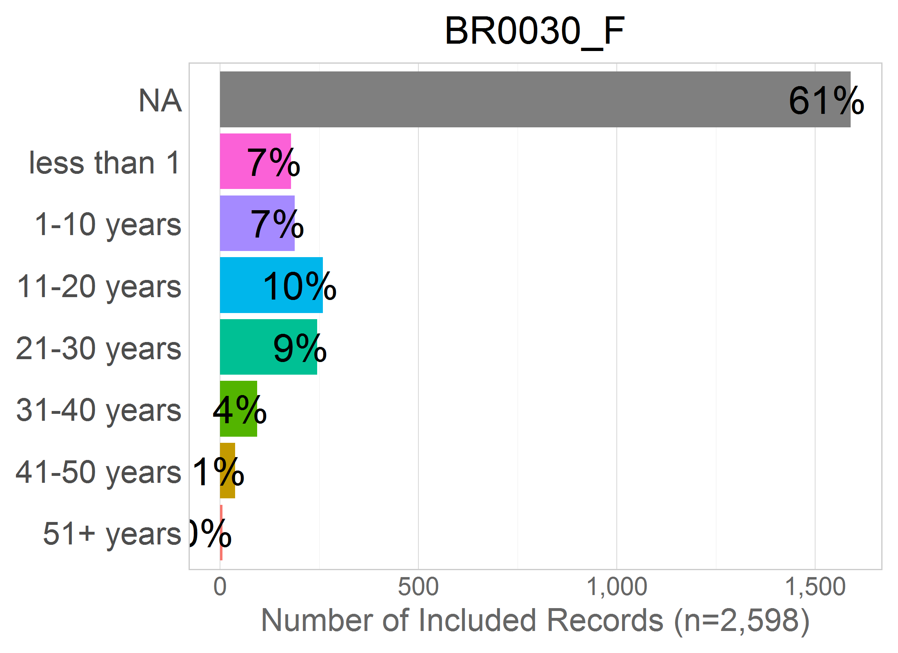

# Harmonize: smoking

<!-- These two chunks should be added in the beginning of every .Rmd that you want to source an .R script -->
<!--  The 1st mandatory chunck  -->
<!--  Set the working directory to the repository's base directory -->


<!--  The 2nd mandatory chunck  -->
<!-- Set the report-wide options, and point to the external code file. -->


This report lists the candidate variable for DataScheme variables of the construct **smoking**.

<!-- Load 'sourced' R files.  Suppress the output when loading packages. --> 


<!-- Load the sources.  Suppress the output when loading sources. --> 


<!-- Load any Global functions and variables declared in the R file.  Suppress the output. --> 


<!-- Declare any global functions specific to a Rmd output.  Suppress the output. --> 

# (I) Exposition

> This report is a record of interaction with a data transfer object (dto) produced by `./manipulation/0-ellis-island.R`. 

The next section recaps this script, exposes the architecture of the DTO, and demonstrates the language of interacting with it.   

## (I.A) Ellis Island

> All data land on Ellis Island.

The script `0-ellis-island.R` is the first script in the analytic workflow. It accomplished the following: 

- (1) Reads in raw data files from the candidate studies   
- (2) Extract, combines, and exports their metadata (specifically, variable names and labels, if provided) into `./data/meta/names-labels-live/names-labels-live.csv`, which is updated every time Ellis Island script is executed.   
- (3) Augments raw metadata with instructions for renaming and classifying variables. The instructions are provided as manually entered values in `./data/meta/meta-data-map.csv`. They are used by automatic scripts in later harmonization and analysis.  
- (4) Combines unit and metadata into a single DTO to serve as a starting point to all subsequent analyses.   

<!-- Load the datasets.   -->

```r
# load the product of 0-ellis-island.R,  a list object containing data and metadata
dto <- readRDS("./data/unshared/derived/dto.rds")
```

<!-- Inspect the datasets.   -->

```r
# the list is composed of the following elements
names(dto)
```

```
[1] "studyName" "filePath"  "unitData"  "metaData" 
```

```r
# 1st element - names of the studies as character vector
dto[["studyName"]]
```

```
[1] "alsa"  "lbsl"  "satsa" "share" "tilda"
```

```r
# 2nd element - file paths of the data files for each study as character vector
dto[["filePath"]]
```

```
[1] "./data/unshared/raw/ALSA-Wave1.Final.sav"         "./data/unshared/raw/LBSL-Panel2-Wave1.Final.sav" 
[3] "./data/unshared/raw/SATSA-Q3.Final.sav"           "./data/unshared/raw/SHARE-Israel-Wave1.Final.sav"
[5] "./data/unshared/raw/TILDA-Wave1.Final.sav"       
```

```r
# 3rd element - is a list object containing the following elements
names(dto[["unitData"]])
```

```
[1] "alsa"  "lbsl"  "satsa" "share" "tilda"
```

```r
# each of these elements is a raw data set of a corresponding study, for example
dplyr::tbl_df(dto[["unitData"]][["lbsl"]]) 
```

```
Source: local data frame [656 x 26]

        id AGE94 SEX94  MSTAT94 EDUC94     NOWRK94  SMK94                                         SMOKE
     (int) (int) (int)   (fctr)  (int)      (fctr) (fctr)                                        (fctr)
1  4001026    68     1 divorced     16 no, retired     no                                  never smoked
2  4012015    94     2  widowed     12 no, retired     no                                  never smoked
3  4012032    94     2  widowed     20 no, retired     no don't smoke at present but smoked in the past
4  4022004    93     2       NA     NA          NA     NA                                  never smoked
5  4022026    93     2  widowed     12 no, retired     no                                  never smoked
6  4031031    92     1  married      8 no, retired     no don't smoke at present but smoked in the past
7  4031035    92     1  widowed     13 no, retired     no don't smoke at present but smoked in the past
8  4032201    92     2       NA     NA          NA     NA don't smoke at present but smoked in the past
9  4041062    91     1  widowed      7          NA     no don't smoke at present but smoked in the past
10 4042057    91     2       NA     NA          NA     NA                                            NA
..     ...   ...   ...      ...    ...         ...    ...                                           ...
Variables not shown: ALCOHOL (fctr), WINE (int), BEER (int), HARDLIQ (int), SPORT94 (int), FIT94 (int), WALK94 (int),
  SPEC94 (int), DANCE94 (int), CHORE94 (int), EXCERTOT (int), EXCERWK (int), HEIGHT94 (int), WEIGHT94 (int), HWEIGHT
  (int), HHEIGHT (int), SRHEALTH (fctr), year_of_wave (dbl)
```


### Meta

```r
# 4th element - a dataset names and labels of raw variables + added metadata for all studies
dto[["metaData"]] %>% dplyr::select(study_name, name, item, construct, type, categories, label_short, label) %>% 
  DT::datatable(
    class   = 'cell-border stripe',
    caption = "This is the primary metadata file. Edit at `./data/shared/meta-data-map.csv",
    filter  = "top",
    options = list(pageLength = 6, autoWidth = TRUE)
  )
```

<!--html_preserve--><div id="htmlwidget-7025" style="width:100%;height:auto;" class="datatables html-widget"></div>
<script type="application/json" data-for="htmlwidget-7025">{"x":{"filter":"top","filterHTML":"<tr>\n  <td>\u003c/td>\n  <td data-type=\"factor\" style=\"vertical-align: top;\">\n    <div class=\"form-group has-feedback\" style=\"margin-bottom: auto;\">\n      <input type=\"search\" placeholder=\"All\" class=\"form-control\" style=\"width: 100%;\"/>\n      <span class=\"glyphicon glyphicon-remove-circle form-control-feedback\">\u003c/span>\n    \u003c/div>\n    <div style=\"width: 100%; display: none;\">\n      <select multiple=\"multiple\" style=\"width: 100%;\">\n        <option value=\"alsa\">alsa\u003c/option>\n        <option value=\"lbsl\">lbsl\u003c/option>\n        <option value=\"satsa\">satsa\u003c/option>\n        <option value=\"share\">share\u003c/option>\n        <option value=\"tilda\">tilda\u003c/option>\n      \u003c/select>\n    \u003c/div>\n  \u003c/td>\n  <td data-type=\"factor\" style=\"vertical-align: top;\">\n    <div class=\"form-group has-feedback\" style=\"margin-bottom: auto;\">\n      <input type=\"search\" placeholder=\"All\" class=\"form-control\" style=\"width: 100%;\"/>\n      <span class=\"glyphicon glyphicon-remove-circle form-control-feedback\">\u003c/span>\n    \u003c/div>\n    <div style=\"width: 100%; display: none;\">\n      <select multiple=\"multiple\" style=\"width: 100%;\">\n        <option value=\"AGE\">AGE\u003c/option>\n        <option value=\"AGE94\">AGE94\u003c/option>\n        <option value=\"ALCOHOL\">ALCOHOL\u003c/option>\n        <option value=\"BEER\">BEER\u003c/option>\n        <option value=\"BEHALC.DRINKSPERDAY\">BEHALC.DRINKSPERDAY\u003c/option>\n        <option value=\"BEHALC.DRINKSPERWEEK\">BEHALC.DRINKSPERWEEK\u003c/option>\n        <option value=\"BEHALC.FREQ.WEEK\">BEHALC.FREQ.WEEK\u003c/option>\n        <option value=\"BEHSMOKER\">BEHSMOKER\u003c/option>\n        <option value=\"BH001\">BH001\u003c/option>\n        <option value=\"BH002\">BH002\u003c/option>\n        <option value=\"BH003\">BH003\u003c/option>\n        <option value=\"BH101\">BH101\u003c/option>\n        <option value=\"BH102\">BH102\u003c/option>\n        <option value=\"BH102A\">BH102A\u003c/option>\n        <option value=\"BH103\">BH103\u003c/option>\n        <option value=\"BH104\">BH104\u003c/option>\n        <option value=\"BH104A\">BH104A\u003c/option>\n        <option value=\"BH105\">BH105\u003c/option>\n        <option value=\"BH106\">BH106\u003c/option>\n        <option value=\"BH106A\">BH106A\u003c/option>\n        <option value=\"BH107\">BH107\u003c/option>\n        <option value=\"BH107A\">BH107A\u003c/option>\n        <option value=\"BR0010\">BR0010\u003c/option>\n        <option value=\"BR0020\">BR0020\u003c/option>\n        <option value=\"BR0030\">BR0030\u003c/option>\n        <option value=\"BR0100\">BR0100\u003c/option>\n        <option value=\"BR0110\">BR0110\u003c/option>\n        <option value=\"BR0120\">BR0120\u003c/option>\n        <option value=\"BR0130\">BR0130\u003c/option>\n        <option value=\"BR0150\">BR0150\u003c/option>\n        <option value=\"BR0160\">BR0160\u003c/option>\n        <option value=\"BTSM12MN\">BTSM12MN\u003c/option>\n        <option value=\"CHORE94\">CHORE94\u003c/option>\n        <option value=\"CS006\">CS006\u003c/option>\n        <option value=\"CURRWORK\">CURRWORK\u003c/option>\n        <option value=\"DANCE94\">DANCE94\u003c/option>\n        <option value=\"DM001\">DM001\u003c/option>\n        <option value=\"DN0030\">DN0030\u003c/option>\n        <option value=\"DN0100\">DN0100\u003c/option>\n        <option value=\"DN012D01\">DN012D01\u003c/option>\n        <option value=\"DN012D02\">DN012D02\u003c/option>\n        <option value=\"DN012D03\">DN012D03\u003c/option>\n        <option value=\"DN012D04\">DN012D04\u003c/option>\n        <option value=\"DN012D05\">DN012D05\u003c/option>\n        <option value=\"DN012D09\">DN012D09\u003c/option>\n        <option value=\"DN012DDK\">DN012DDK\u003c/option>\n        <option value=\"DN012DNO\">DN012DNO\u003c/option>\n        <option value=\"DN012DOT\">DN012DOT\u003c/option>\n        <option value=\"DN012DRF\">DN012DRF\u003c/option>\n        <option value=\"DN0140\">DN0140\u003c/option>\n        <option value=\"EDUC\">EDUC\u003c/option>\n        <option value=\"EDUC94\">EDUC94\u003c/option>\n        <option value=\"EP0050\">EP0050\u003c/option>\n        <option value=\"EXCERTOT\">EXCERTOT\u003c/option>\n        <option value=\"EXCERWK\">EXCERWK\u003c/option>\n        <option value=\"EXRTHOUS\">EXRTHOUS\u003c/option>\n        <option value=\"FIT94\">FIT94\u003c/option>\n        <option value=\"FR6ORMOR\">FR6ORMOR\u003c/option>\n        <option value=\"FREQALCH\">FREQALCH\u003c/option>\n        <option value=\"GALCOHOL\">GALCOHOL\u003c/option>\n        <option value=\"GAMTWORK\">GAMTWORK\u003c/option>\n        <option value=\"GBEERX\">GBEERX\u003c/option>\n        <option value=\"GBOTVIN\">GBOTVIN\u003c/option>\n        <option value=\"GD002\">GD002\u003c/option>\n        <option value=\"GDRLOTS\">GDRLOTS\u003c/option>\n        <option value=\"GENDER\">GENDER\u003c/option>\n        <option value=\"GEVRALK\">GEVRALK\u003c/option>\n        <option value=\"GEVRSMK\">GEVRSMK\u003c/option>\n        <option value=\"GEVRSNS\">GEVRSNS\u003c/option>\n        <option value=\"GEXERCIS\">GEXERCIS\u003c/option>\n        <option value=\"GFREQBER\">GFREQBER\u003c/option>\n        <option value=\"GFREQLIQ\">GFREQLIQ\u003c/option>\n        <option value=\"GFREQVIN\">GFREQVIN\u003c/option>\n        <option value=\"GGENHLTH\">GGENHLTH\u003c/option>\n        <option value=\"GHLTHOTH\">GHLTHOTH\u003c/option>\n        <option value=\"GHTCM\">GHTCM\u003c/option>\n        <option value=\"GLIQX\">GLIQX\u003c/option>\n        <option value=\"GMARITAL\">GMARITAL\u003c/option>\n        <option value=\"GPI\">GPI\u003c/option>\n        <option value=\"GSMOKNOW\">GSMOKNOW\u003c/option>\n        <option value=\"GSTOPALK\">GSTOPALK\u003c/option>\n        <option value=\"GVINX\">GVINX\u003c/option>\n        <option value=\"GWTKG\">GWTKG\u003c/option>\n        <option value=\"HARDLIQ\">HARDLIQ\u003c/option>\n        <option value=\"HEIGHT\">HEIGHT\u003c/option>\n        <option value=\"HEIGHT94\">HEIGHT94\u003c/option>\n        <option value=\"HHEIGHT\">HHEIGHT\u003c/option>\n        <option value=\"HLTHBTSM\">HLTHBTSM\u003c/option>\n        <option value=\"HLTHLIFE\">HLTHLIFE\u003c/option>\n        <option value=\"HWEIGHT\">HWEIGHT\u003c/option>\n        <option value=\"HWMNWK2W\">HWMNWK2W\u003c/option>\n        <option value=\"ID\">ID\u003c/option>\n        <option value=\"INT.YEAR\">INT.YEAR\u003c/option>\n        <option value=\"IPAQEXERCISE3\">IPAQEXERCISE3\u003c/option>\n        <option value=\"IPAQMETMINUTES\">IPAQMETMINUTES\u003c/option>\n        <option value=\"LSVEXC2W\">LSVEXC2W\u003c/option>\n        <option value=\"LSVIGEXC\">LSVIGEXC\u003c/option>\n        <option value=\"marital4\">marital4\u003c/option>\n        <option value=\"MARITST\">MARITST\u003c/option>\n        <option value=\"MSTAT94\">MSTAT94\u003c/option>\n        <option value=\"NOSTDRNK\">NOSTDRNK\u003c/option>\n        <option value=\"NOWRK94\">NOWRK94\u003c/option>\n        <option value=\"PH001\">PH001\u003c/option>\n        <option value=\"PH0020\">PH0020\u003c/option>\n        <option value=\"PH0030\">PH0030\u003c/option>\n        <option value=\"PH009\">PH009\u003c/option>\n        <option value=\"PH0120\">PH0120\u003c/option>\n        <option value=\"PH0130\">PH0130\u003c/option>\n        <option value=\"PH0520\">PH0520\u003c/option>\n        <option value=\"PH0530\">PH0530\u003c/option>\n        <option value=\"PIPCIGAR\">PIPCIGAR\u003c/option>\n        <option value=\"QAGE3\">QAGE3\u003c/option>\n        <option value=\"RETIRED\">RETIRED\u003c/option>\n        <option value=\"SAMPID.rec\">SAMPID.rec\u003c/option>\n        <option value=\"SCHOOL\">SCHOOL\u003c/option>\n        <option value=\"SCQALCOFREQ\">SCQALCOFREQ\u003c/option>\n        <option value=\"SCQALCOHOL\">SCQALCOHOL\u003c/option>\n        <option value=\"SCQALCONO1\">SCQALCONO1\u003c/option>\n        <option value=\"SCQALCONO2\">SCQALCONO2\u003c/option>\n        <option value=\"SEQNUM\">SEQNUM\u003c/option>\n        <option value=\"SEX\">SEX\u003c/option>\n        <option value=\"SEX94\">SEX94\u003c/option>\n        <option value=\"SMK94\">SMK94\u003c/option>\n        <option value=\"SMOKE\">SMOKE\u003c/option>\n        <option value=\"SMOKER\">SMOKER\u003c/option>\n        <option value=\"SOCMARRIED\">SOCMARRIED\u003c/option>\n        <option value=\"SPEC94\">SPEC94\u003c/option>\n        <option value=\"SPORT94\">SPORT94\u003c/option>\n        <option value=\"SR.HEIGHT.CENTIMETRES\">SR.HEIGHT.CENTIMETRES\u003c/option>\n        <option value=\"SR.WEIGHT.KILOGRAMMES\">SR.WEIGHT.KILOGRAMMES\u003c/option>\n        <option value=\"SRHEALTH\">SRHEALTH\u003c/option>\n        <option value=\"TMHVYEXR\">TMHVYEXR\u003c/option>\n        <option value=\"TMVEXC2W\">TMVEXC2W\u003c/option>\n        <option value=\"TYPQUAL\">TYPQUAL\u003c/option>\n        <option value=\"VIGEXC2W\">VIGEXC2W\u003c/option>\n        <option value=\"VIGEXCS\">VIGEXCS\u003c/option>\n        <option value=\"WALK2WKS\">WALK2WKS\u003c/option>\n        <option value=\"WALK94\">WALK94\u003c/option>\n        <option value=\"WE001\">WE001\u003c/option>\n        <option value=\"WE003\">WE003\u003c/option>\n        <option value=\"WEIGHT\">WEIGHT\u003c/option>\n        <option value=\"WEIGHT94\">WEIGHT94\u003c/option>\n        <option value=\"WINE\">WINE\u003c/option>\n        <option value=\"YRBORN\">YRBORN\u003c/option>\n      \u003c/select>\n    \u003c/div>\n  \u003c/td>\n  <td data-type=\"factor\" style=\"vertical-align: top;\">\n    <div class=\"form-group has-feedback\" style=\"margin-bottom: auto;\">\n      <input type=\"search\" placeholder=\"All\" class=\"form-control\" style=\"width: 100%;\"/>\n      <span class=\"glyphicon glyphicon-remove-circle form-control-feedback\">\u003c/span>\n    \u003c/div>\n    <div style=\"width: 100%; display: none;\">\n      <select multiple=\"multiple\" style=\"width: 100%;\">\n        <option value=\"\">\u003c/option>\n        <option value=\"age\">age\u003c/option>\n        <option value=\"age_1994\">age_1994\u003c/option>\n        <option value=\"age_interview\">age_interview\u003c/option>\n        <option value=\"age_left_school\">age_left_school\u003c/option>\n        <option value=\"age_q3\">age_q3\u003c/option>\n        <option value=\"born_year\">born_year\u003c/option>\n        <option value=\"current_job\">current_job\u003c/option>\n        <option value=\"edu\">edu\u003c/option>\n        <option value=\"edu_highest\">edu_highest\u003c/option>\n        <option value=\"edu_hight\">edu_hight\u003c/option>\n        <option value=\"employed\">employed\u003c/option>\n        <option value=\"exertion\">exertion\u003c/option>\n        <option value=\"healt_self\">healt_self\u003c/option>\n        <option value=\"health_12ago\">health_12ago\u003c/option>\n        <option value=\"health_others\">health_others\u003c/option>\n        <option value=\"height_in\">height_in\u003c/option>\n        <option value=\"height_in_sr\">height_in_sr\u003c/option>\n        <option value=\"id\">id\u003c/option>\n        <option value=\"marital\">marital\u003c/option>\n        <option value=\"marital_2\">marital_2\u003c/option>\n        <option value=\"marital_4\">marital_4\u003c/option>\n        <option value=\"marital_6\">marital_6\u003c/option>\n        <option value=\"retired\">retired\u003c/option>\n        <option value=\"school_years\">school_years\u003c/option>\n        <option value=\"sex\">sex\u003c/option>\n        <option value=\"sex_gender\">sex_gender\u003c/option>\n        <option value=\"smoke_age\">smoke_age\u003c/option>\n        <option value=\"smoke_history\">smoke_history\u003c/option>\n        <option value=\"smoke_history2\">smoke_history2\u003c/option>\n        <option value=\"smoke_now\">smoke_now\u003c/option>\n        <option value=\"smoke_pipecigar\">smoke_pipecigar\u003c/option>\n        <option value=\"smoke_years\">smoke_years\u003c/option>\n        <option value=\"snuff_history\">snuff_history\u003c/option>\n        <option value=\"twin_id\">twin_id\u003c/option>\n        <option value=\"walking\">walking\u003c/option>\n        <option value=\"weight_kg\">weight_kg\u003c/option>\n        <option value=\"weight_lb\">weight_lb\u003c/option>\n        <option value=\"weight_lb_sr\">weight_lb_sr\u003c/option>\n        <option value=\"work_extra\">work_extra\u003c/option>\n        <option value=\"work_status\">work_status\u003c/option>\n        <option value=\"year_born\">year_born\u003c/option>\n      \u003c/select>\n    \u003c/div>\n  \u003c/td>\n  <td data-type=\"factor\" style=\"vertical-align: top;\">\n    <div class=\"form-group has-feedback\" style=\"margin-bottom: auto;\">\n      <input type=\"search\" placeholder=\"All\" class=\"form-control\" style=\"width: 100%;\"/>\n      <span class=\"glyphicon glyphicon-remove-circle form-control-feedback\">\u003c/span>\n    \u003c/div>\n    <div style=\"width: 100%; display: none;\">\n      <select multiple=\"multiple\" style=\"width: 100%;\">\n        <option value=\"\">\u003c/option>\n        <option value=\"age\">age\u003c/option>\n        <option value=\"alcohol\">alcohol\u003c/option>\n        <option value=\"education\">education\u003c/option>\n        <option value=\"employment\">employment\u003c/option>\n        <option value=\"health\">health\u003c/option>\n        <option value=\"height\">height\u003c/option>\n        <option value=\"id\">id\u003c/option>\n        <option value=\"marital\">marital\u003c/option>\n        <option value=\"sex\">sex\u003c/option>\n        <option value=\"smoking\">smoking\u003c/option>\n        <option value=\"weight\">weight\u003c/option>\n        <option value=\"work_status\">work_status\u003c/option>\n        <option value=\"year\">year\u003c/option>\n      \u003c/select>\n    \u003c/div>\n  \u003c/td>\n  <td data-type=\"factor\" style=\"vertical-align: top;\">\n    <div class=\"form-group has-feedback\" style=\"margin-bottom: auto;\">\n      <input type=\"search\" placeholder=\"All\" class=\"form-control\" style=\"width: 100%;\"/>\n      <span class=\"glyphicon glyphicon-remove-circle form-control-feedback\">\u003c/span>\n    \u003c/div>\n    <div style=\"width: 100%; display: none;\">\n      <select multiple=\"multiple\" style=\"width: 100%;\">\n        <option value=\"activity\">activity\u003c/option>\n        <option value=\"demo\">demo\u003c/option>\n        <option value=\"physical\">physical\u003c/option>\n        <option value=\"substance\">substance\u003c/option>\n      \u003c/select>\n    \u003c/div>\n  \u003c/td>\n  <td data-type=\"integer\" style=\"vertical-align: top;\">\n    <div class=\"form-group has-feedback\" style=\"margin-bottom: auto;\">\n      <input type=\"search\" placeholder=\"All\" class=\"form-control\" style=\"width: 100%;\"/>\n      <span class=\"glyphicon glyphicon-remove-circle form-control-feedback\">\u003c/span>\n    \u003c/div>\n    <div style=\"display: none; position: absolute; width: 200px;\">\n      <div data-min=\"2\" data-max=\"8504\">\u003c/div>\n      <span style=\"float: left;\">\u003c/span>\n      <span style=\"float: right;\">\u003c/span>\n    \u003c/div>\n  \u003c/td>\n  <td data-type=\"factor\" style=\"vertical-align: top;\">\n    <div class=\"form-group has-feedback\" style=\"margin-bottom: auto;\">\n      <input type=\"search\" placeholder=\"All\" class=\"form-control\" style=\"width: 100%;\"/>\n      <span class=\"glyphicon glyphicon-remove-circle form-control-feedback\">\u003c/span>\n    \u003c/div>\n    <div style=\"width: 100%; display: none;\">\n      <select multiple=\"multiple\" style=\"width: 100%;\">\n        <option value=\"\">\u003c/option>\n        <option value=\"activities requiring a moderate level of energy\">activities requiring a moderate level of energy\u003c/option>\n        <option value=\"Age\">Age\u003c/option>\n        <option value=\"Age at current wave\">Age at current wave\u003c/option>\n        <option value=\"Age in 1994\">Age in 1994\u003c/option>\n        <option value=\"Age left school\">Age left school\u003c/option>\n        <option value=\"Age when stopped smoking\">Age when stopped smoking\u003c/option>\n        <option value=\"Alcohol use\">Alcohol use\u003c/option>\n        <option value=\"Anonymised ID\">Anonymised ID\u003c/option>\n        <option value=\"Are you retired from your last job?\">Are you retired from your last job?\u003c/option>\n        <option value=\"beverages consumed last 6 months\">beverages consumed last 6 months\u003c/option>\n        <option value=\"Current job situation\">Current job situation\u003c/option>\n        <option value=\"Currently smoke?\">Currently smoke?\u003c/option>\n        <option value=\"Currently working\">Currently working\u003c/option>\n        <option value=\"Dancing\">Dancing\u003c/option>\n        <option value=\"Do you currently smoke cigarettes?\">Do you currently smoke cigarettes?\u003c/option>\n        <option value=\"Do you regularly smoke pipe or cigar?\">Do you regularly smoke pipe or cigar?\u003c/option>\n        <option value=\"Do you smoke tobacco?\">Do you smoke tobacco?\u003c/option>\n        <option value=\"Do you take snuff?\">Do you take snuff?\u003c/option>\n        <option value=\"Doing household chores (hrs/wk)\">Doing household chores (hrs/wk)\u003c/option>\n        <option value=\"dont know\">dont know\u003c/option>\n        <option value=\"Edcuation\">Edcuation\u003c/option>\n        <option value=\"Education\">Education\u003c/option>\n        <option value=\"Ever smoked tobacco daily for a year?\">Ever smoked tobacco daily for a year?\u003c/option>\n        <option value=\"Exercised or played sports (oc/wk)\">Exercised or played sports (oc/wk)\u003c/option>\n        <option value=\"Exercising for shape/fun (hrs/wk)\">Exercising for shape/fun (hrs/wk)\u003c/option>\n        <option value=\"Exertion around house\">Exertion around house\u003c/option>\n        <option value=\"freq more than 2 glasses beer in a day\">freq more than 2 glasses beer in a day\u003c/option>\n        <option value=\"freq more than 2 glasses wine in a day\">freq more than 2 glasses wine in a day\u003c/option>\n        <option value=\"freq more than 2 hard liquor in a day\">freq more than 2 hard liquor in a day\u003c/option>\n        <option value=\"Frequency alcohol\">Frequency alcohol\u003c/option>\n        <option value=\"Frequency six or more drinks\">Frequency six or more drinks\u003c/option>\n        <option value=\"Gender\">Gender\u003c/option>\n        <option value=\"Health comp with 12mths ago\">Health comp with 12mths ago\u003c/option>\n        <option value=\"Health compared to others\">Health compared to others\u003c/option>\n        <option value=\"health in general question v 1\">health in general question v 1\u003c/option>\n        <option value=\"health in general question v 2\">health in general question v 2\u003c/option>\n        <option value=\"Height in Inches\">Height in Inches\u003c/option>\n        <option value=\"Highest qualification\">Highest qualification\u003c/option>\n        <option value=\"How many years smoked?\">How many years smoked?\u003c/option>\n        <option value=\"how tall are you?\">how tall are you?\u003c/option>\n        <option value=\"id\">id\u003c/option>\n        <option value=\"Id\">Id\u003c/option>\n        <option value=\"interview year\">interview year\u003c/option>\n        <option value=\"Less vigor past 2 weeks\">Less vigor past 2 weeks\u003c/option>\n        <option value=\"Less vigor sessions last 2 weeks\">Less vigor sessions last 2 weeks\u003c/option>\n        <option value=\"Male or Female?\">Male or Female?\u003c/option>\n        <option value=\"Marital status\">Marital status\u003c/option>\n        <option value=\"Marital Status\">Marital Status\u003c/option>\n        <option value=\"Marital Status in 1994\">Marital Status in 1994\u003c/option>\n        <option value=\"no further education\">no further education\u003c/option>\n        <option value=\"Number of cans/bottles of beer last week\">Number of cans/bottles of beer last week\u003c/option>\n        <option value=\"Number of drinks containing hard liquor last week\">Number of drinks containing hard liquor last week\u003c/option>\n        <option value=\"Number of glasses of wine last week\">Number of glasses of wine last week\u003c/option>\n        <option value=\"Number of standard drinks\">Number of standard drinks\u003c/option>\n        <option value=\"nursing school\">nursing school\u003c/option>\n        <option value=\"other further education\">other further education\u003c/option>\n        <option value=\"Participant sports, number of hours\">Participant sports, number of hours\u003c/option>\n        <option value=\"Physical fitness, number of hours each week\">Physical fitness, number of hours each week\u003c/option>\n        <option value=\"polytechnic\">polytechnic\u003c/option>\n        <option value=\"refused\">refused\u003c/option>\n        <option value=\"Respondent is a smoker\">Respondent is a smoker\u003c/option>\n        <option value=\"Self-rated health\">Self-rated health\u003c/option>\n        <option value=\"Self-reported health compared to age peers\">Self-reported health compared to age peers\u003c/option>\n        <option value=\"Self-reported height in inches\">Self-reported height in inches\u003c/option>\n        <option value=\"Self-reported weight in pounds\">Self-reported weight in pounds\u003c/option>\n        <option value=\"Sequence Number\">Sequence Number\u003c/option>\n        <option value=\"Sex\">Sex\u003c/option>\n        <option value=\"Smoke at present?\">Smoke at present?\u003c/option>\n        <option value=\"Smoke, tobacco use\">Smoke, tobacco use\u003c/option>\n        <option value=\"Smoked some last month?\">Smoked some last month?\u003c/option>\n        <option value=\"Spectator sports, number of hours spent per week\">Spectator sports, number of hours spent per week\u003c/option>\n        <option value=\"sports or activities that are vigorous\">sports or activities that are vigorous\u003c/option>\n        <option value=\"still in further education or training\">still in further education or training\u003c/option>\n        <option value=\"Time heavy physical exertion\">Time heavy physical exertion\u003c/option>\n        <option value=\"Times walked in past two weeks\">Times walked in past two weeks\u003c/option>\n        <option value=\"Twin number\">Twin number\u003c/option>\n        <option value=\"university, Bachelors degree\">university, Bachelors degree\u003c/option>\n        <option value=\"university, graduate degree\">university, graduate degree\u003c/option>\n        <option value=\"Vigor Sessions in past 2 weeks\">Vigor Sessions in past 2 weeks\u003c/option>\n        <option value=\"Vigor Time past 2 weeks\">Vigor Time past 2 weeks\u003c/option>\n        <option value=\"Vigorous exercise\">Vigorous exercise\u003c/option>\n        <option value=\"Walking past 2 weeks\">Walking past 2 weeks\u003c/option>\n        <option value=\"Walking, number of hours per week\">Walking, number of hours per week\u003c/option>\n        <option value=\"Weight in kilograms\">Weight in kilograms\u003c/option>\n        <option value=\"Weight in Pounds\">Weight in Pounds\u003c/option>\n        <option value=\"weight of respondent\">weight of respondent\u003c/option>\n        <option value=\"What is your marital status?\">What is your marital status?\u003c/option>\n        <option value=\"Which of the following alternatives best describes your current work/retirement situation?\">Which of the following alternatives best describes your current work/retirement situation?\u003c/option>\n        <option value=\"Working at present time?\">Working at present time?\u003c/option>\n        <option value=\"Year born\">Year born\u003c/option>\n        <option value=\"Years of school completed\">Years of school completed\u003c/option>\n        <option value=\"yeshiva, religious high institution\">yeshiva, religious high institution\u003c/option>\n      \u003c/select>\n    \u003c/div>\n  \u003c/td>\n  <td data-type=\"factor\" style=\"vertical-align: top;\">\n    <div class=\"form-group has-feedback\" style=\"margin-bottom: auto;\">\n      <input type=\"search\" placeholder=\"All\" class=\"form-control\" style=\"width: 100%;\"/>\n      <span class=\"glyphicon glyphicon-remove-circle form-control-feedback\">\u003c/span>\n    \u003c/div>\n    <div style=\"width: 100%; display: none;\">\n      <select multiple=\"multiple\" style=\"width: 100%;\">\n        <option value=\"..more than 1 bottle, i.e.____bottles (state number of bottles): GBOTVIN\">..more than 1 bottle, i.e.____bottles (state number of bottles): GBOTVIN\u003c/option>\n        <option value=\"activities requiring a moderate level of energy\">activities requiring a moderate level of energy\u003c/option>\n        <option value=\"Age\">Age\u003c/option>\n        <option value=\"Age at interview assuming DOB is 1st of specified month\">Age at interview assuming DOB is 1st of specified month\u003c/option>\n        <option value=\"age at Q3\">age at Q3\u003c/option>\n        <option value=\"Age in 1994\">Age in 1994\u003c/option>\n        <option value=\"Age left school\">Age left school\u003c/option>\n        <option value=\"Alcohol use\">Alcohol use\u003c/option>\n        <option value=\"Anonymised ID\">Anonymised ID\u003c/option>\n        <option value=\"Are you retired from your last job?\">Are you retired from your last job?\u003c/option>\n        <option value=\"BEHalc_drinksperday  Standard drinks per day\">BEHalc_drinksperday  Standard drinks per day\u003c/option>\n        <option value=\"BEHalc_drinksperweek  Standard drinks a week\">BEHalc_drinksperweek  Standard drinks a week\u003c/option>\n        <option value=\"BEHalc_freq_week  Average times drinking per week\">BEHalc_freq_week  Average times drinking per week\u003c/option>\n        <option value=\"BEHsmoker  Smoker\">BEHsmoker  Smoker\u003c/option>\n        <option value=\"beverages consumed last 6 months\">beverages consumed last 6 months\u003c/option>\n        <option value=\"bh001  Have you ever smoked cigarettes, cigars, cigarillos or a pipe daily for a per?\">bh001  Have you ever smoked cigarettes, cigars, cigarillos or a pipe daily for a per?\u003c/option>\n        <option value=\"bh002  Do you smoke at the present time?\">bh002  Do you smoke at the present time?\u003c/option>\n        <option value=\"bh003  How old were you when you stopped smoking?\">bh003  How old were you when you stopped smoking?\u003c/option>\n        <option value=\"bh101  During the last 7 days, on how many days did you do vigorous physical activit?\">bh101  During the last 7 days, on how many days did you do vigorous physical activit?\u003c/option>\n        <option value=\"bh102  How much time did you usually spend doing vigorous physical activities on one?\">bh102  How much time did you usually spend doing vigorous physical activities on one?\u003c/option>\n        <option value=\"bh102a  How much time did you usually spend doing vigorous physical activities on one?\">bh102a  How much time did you usually spend doing vigorous physical activities on one?\u003c/option>\n        <option value=\"bh103  During the last 7 days, on how many days did you do moderate physical activit?\">bh103  During the last 7 days, on how many days did you do moderate physical activit?\u003c/option>\n        <option value=\"bh104  How much time did you usually spend doing moderate physical activities on one?\">bh104  How much time did you usually spend doing moderate physical activities on one?\u003c/option>\n        <option value=\"bh104a  How much time did you usually spend doing moderate physical activities on one?\">bh104a  How much time did you usually spend doing moderate physical activities on one?\u003c/option>\n        <option value=\"bh105  During the last 7 days, on how many days did you walk for at least 10 minutes?\">bh105  During the last 7 days, on how many days did you walk for at least 10 minutes?\u003c/option>\n        <option value=\"bh106  How much time did you usually spend walking on one of those days? HOURS\">bh106  How much time did you usually spend walking on one of those days? HOURS\u003c/option>\n        <option value=\"bh106a  How much time did you usually spend walking on one of those days? MINS\">bh106a  How much time did you usually spend walking on one of those days? MINS\u003c/option>\n        <option value=\"bh107  During the last 7 days, how much time did you spend sitting on a week day? HO?\">bh107  During the last 7 days, how much time did you spend sitting on a week day? HO?\u003c/option>\n        <option value=\"bh107a  During the last 7 days, how much time did you spend sitting on a week day? MINS\">bh107a  During the last 7 days, how much time did you spend sitting on a week day? MINS\u003c/option>\n        <option value=\"BMI ((htcm/100)^2)\">BMI ((htcm/100)^2)\u003c/option>\n        <option value=\"cs006  Are you...?\">cs006  Are you...?\u003c/option>\n        <option value=\"current job situation\">current job situation\u003c/option>\n        <option value=\"Currently smoke?\">Currently smoke?\u003c/option>\n        <option value=\"Currently working\">Currently working\u003c/option>\n        <option value=\"Dancing\">Dancing\u003c/option>\n        <option value=\"dm001  What is the highest level of education you have completed\">dm001  What is the highest level of education you have completed\u003c/option>\n        <option value=\"Do you currently smoke cigarettes?\">Do you currently smoke cigarettes?\u003c/option>\n        <option value=\"Do you ever drink alcoholic beverages?\">Do you ever drink alcoholic beverages?\u003c/option>\n        <option value=\"Do you ever drink alcoholic drinks? - Yes\">Do you ever drink alcoholic drinks? - Yes\u003c/option>\n        <option value=\"Do you ever drink alcoholic drinks? -No I quit. When? 19__\">Do you ever drink alcoholic drinks? -No I quit. When? 19__\u003c/option>\n        <option value=\"Do you regularly smoke pipe or cigar?\">Do you regularly smoke pipe or cigar?\u003c/option>\n        <option value=\"Do you smoke cigarettes, cigars or a pipe? - Yes\">Do you smoke cigarettes, cigars or a pipe? - Yes\u003c/option>\n        <option value=\"Do you take snuff? - Yes\">Do you take snuff? - Yes\u003c/option>\n        <option value=\"Doing household chores, number of hours spent per week\">Doing household chores, number of hours spent per week\u003c/option>\n        <option value=\"dont know\">dont know\u003c/option>\n        <option value=\"Education\">Education\u003c/option>\n        <option value=\"ever smoked daily\">ever smoked daily\u003c/option>\n        <option value=\"Exertion around house\">Exertion around house\u003c/option>\n        <option value=\"freq more than 2 glasses beer in a day\">freq more than 2 glasses beer in a day\u003c/option>\n        <option value=\"freq more than 2 glasses wine in a day\">freq more than 2 glasses wine in a day\u003c/option>\n        <option value=\"freq more than 2 hard liquor in a day\">freq more than 2 hard liquor in a day\u003c/option>\n        <option value=\"Frequency alcohol\">Frequency alcohol\u003c/option>\n        <option value=\"Frequency six or more drinks\">Frequency six or more drinks\u003c/option>\n        <option value=\"gd002 - Is this respondent male or female?\">gd002 - Is this respondent male or female?\u003c/option>\n        <option value=\"Gender\">Gender\u003c/option>\n        <option value=\"Have you smoked more than 6 cigarettes, 4 cigars or used pipe tobacco or snuff during the last month?\">Have you smoked more than 6 cigarettes, 4 cigars or used pipe tobacco or snuff during the last month?\u003c/option>\n        <option value=\"Health comp with 12mths ago\">Health comp with 12mths ago\u003c/option>\n        <option value=\"Health compared to others\">Health compared to others\u003c/option>\n        <option value=\"health in general question v 1\">health in general question v 1\u003c/option>\n        <option value=\"health in general question v 2\">health in general question v 2\u003c/option>\n        <option value=\"Height in Inches\">Height in Inches\u003c/option>\n        <option value=\"Here are seven different options concerning exercise during your leisure time. Which one of these options best fits how you yourself exercise on a yearly basis?\">Here are seven different options concerning exercise during your leisure time. Which one of these options best fits how you yourself exercise on a yearly basis?\u003c/option>\n        <option value=\"highest educational degree obtained\">highest educational degree obtained\u003c/option>\n        <option value=\"Highest qualification\">Highest qualification\u003c/option>\n        <option value=\"How do you judge your general state of health compared to other people your age?\">How do you judge your general state of health compared to other people your age?\u003c/option>\n        <option value=\"How do you judge your general state of health?\">How do you judge your general state of health?\u003c/option>\n        <option value=\"how many years smoked\">how many years smoked\u003c/option>\n        <option value=\"How much beer do you usually drink at a time?\">How much beer do you usually drink at a time?\u003c/option>\n        <option value=\"How much do you weigh? (kg)\">How much do you weigh? (kg)\u003c/option>\n        <option value=\"How much hard liquot do you usually drink at time?\">How much hard liquot do you usually drink at time?\u003c/option>\n        <option value=\"How much wine do you usually drink at a time?\">How much wine do you usually drink at a time?\u003c/option>\n        <option value=\"How often do you consume more than five bottles of beer or more than one bottle of wine or more than 1/2 bottle liquot at one occasion?\">How often do you consume more than five bottles of beer or more than one bottle of wine or more than 1/2 bottle liquot at one occasion?\u003c/option>\n        <option value=\"How often do you drink beer (not light beer)?\">How often do you drink beer (not light beer)?\u003c/option>\n        <option value=\"How often do you usually drink hard liquor? (e.g. aquavit, whiskey, gin, brandy, punsch. Also liquot in cocktails and long drinks)\">How often do you usually drink hard liquor? (e.g. aquavit, whiskey, gin, brandy, punsch. Also liquot in cocktails and long drinks)\u003c/option>\n        <option value=\"How often do you usually drink wine (red or white)?\">How often do you usually drink wine (red or white)?\u003c/option>\n        <option value=\"how tall are you?\">how tall are you?\u003c/option>\n        <option value=\"How tall are you? (cm)\">How tall are you? (cm)\u003c/option>\n        <option value=\"interview year\">interview year\u003c/option>\n        <option value=\"IPAQmetminutes  Phsyical activity met-minutes\">IPAQmetminutes  Phsyical activity met-minutes\u003c/option>\n        <option value=\"Less vigor past 2 weeks\">Less vigor past 2 weeks\u003c/option>\n        <option value=\"Less vigor sessions last 2 weeks\">Less vigor sessions last 2 weeks\u003c/option>\n        <option value=\"male or female\">male or female\u003c/option>\n        <option value=\"mar4  Marital Status\">mar4  Marital Status\u003c/option>\n        <option value=\"marital status\">marital status\u003c/option>\n        <option value=\"Marital status\">Marital status\u003c/option>\n        <option value=\"Marital Status in 1994\">Marital Status in 1994\u003c/option>\n        <option value=\"no further education\">no further education\u003c/option>\n        <option value=\"Number of cans/bottles of beer last week\">Number of cans/bottles of beer last week\u003c/option>\n        <option value=\"Number of drinks containing hard liquor last week\">Number of drinks containing hard liquor last week\u003c/option>\n        <option value=\"Number of glasses of wine last week\">Number of glasses of wine last week\u003c/option>\n        <option value=\"Number of standard drinks\">Number of standard drinks\u003c/option>\n        <option value=\"Number of times in past week exercised or played sports\">Number of times in past week exercised or played sports\u003c/option>\n        <option value=\"Number of total hours in an average week exercising for shape/fun (not housework)\">Number of total hours in an average week exercising for shape/fun (not housework)\u003c/option>\n        <option value=\"Number of Years of school completed (1-20)\">Number of Years of school completed (1-20)\u003c/option>\n        <option value=\"nursing school\">nursing school\u003c/option>\n        <option value=\"other further education\">other further education\u003c/option>\n        <option value=\"Participant sports, number of hours\">Participant sports, number of hours\u003c/option>\n        <option value=\"ph001  Now I would like to ask you some questions about your health.  Would you say ?\">ph001  Now I would like to ask you some questions about your health.  Would you say ?\u003c/option>\n        <option value=\"ph009  In general, compared to other people your age, would you say your health is\">ph009  In general, compared to other people your age, would you say your health is\u003c/option>\n        <option value=\"Physical fitness, number of hours each week\">Physical fitness, number of hours each week\u003c/option>\n        <option value=\"polytechnic\">polytechnic\u003c/option>\n        <option value=\"refused\">refused\u003c/option>\n        <option value=\"Respondent height\">Respondent height\u003c/option>\n        <option value=\"Respondent weight\">Respondent weight\u003c/option>\n        <option value=\"SCQalcofreq  frequency of drinking alcohol\">SCQalcofreq  frequency of drinking alcohol\u003c/option>\n        <option value=\"SCQalcohol  drink alcohol\">SCQalcohol  drink alcohol\u003c/option>\n        <option value=\"SCQalcono1  more than two drinks in a single day\">SCQalcono1  more than two drinks in a single day\u003c/option>\n        <option value=\"SCQalcono2  How many drinks consumed on days drink taken\">SCQalcono2  How many drinks consumed on days drink taken\u003c/option>\n        <option value=\"Self-rated health\">Self-rated health\u003c/option>\n        <option value=\"Self-reported health compared to age peers\">Self-reported health compared to age peers\u003c/option>\n        <option value=\"Self-reported height in inches\">Self-reported height in inches\u003c/option>\n        <option value=\"Self-reported weight in pounds\">Self-reported weight in pounds\u003c/option>\n        <option value=\"Sequence Number\">Sequence Number\u003c/option>\n        <option value=\"Sex\">Sex\u003c/option>\n        <option value=\"smoke at the present time\">smoke at the present time\u003c/option>\n        <option value=\"Smoke, tobacco use\">Smoke, tobacco use\u003c/option>\n        <option value=\"SOCmarried  Currently married\">SOCmarried  Currently married\u003c/option>\n        <option value=\"Spectator sports, number of hours spent per week\">Spectator sports, number of hours spent per week\u003c/option>\n        <option value=\"sports or activities that are vigorous\">sports or activities that are vigorous\u003c/option>\n        <option value=\"SR_Height_Centimetres\">SR_Height_Centimetres\u003c/option>\n        <option value=\"SR_Weight_Kilogrammes\">SR_Weight_Kilogrammes\u003c/option>\n        <option value=\"still in further education or training\">still in further education or training\u003c/option>\n        <option value=\"Time heavy physical exertion\">Time heavy physical exertion\u003c/option>\n        <option value=\"Times walked in past two weeks\">Times walked in past two weeks\u003c/option>\n        <option value=\"Twin number\">Twin number\u003c/option>\n        <option value=\"university, Bachelors degree\">university, Bachelors degree\u003c/option>\n        <option value=\"university, graduate degree\">university, graduate degree\u003c/option>\n        <option value=\"Vigor Sessions in past 2 weeks\">Vigor Sessions in past 2 weeks\u003c/option>\n        <option value=\"Vigor Time past 2 weeks\">Vigor Time past 2 weeks\u003c/option>\n        <option value=\"Vigorous exercise\">Vigorous exercise\u003c/option>\n        <option value=\"Walking past 2 weeks\">Walking past 2 weeks\u003c/option>\n        <option value=\"Walking, number of hours per week\">Walking, number of hours per week\u003c/option>\n        <option value=\"we001  Which one of these would you say best describes your current situation?\">we001  Which one of these would you say best describes your current situation?\u003c/option>\n        <option value=\"we003  Did you, nevertheless, do any paid work during the last week, either as an em?\">we003  Did you, nevertheless, do any paid work during the last week, either as an em?\u003c/option>\n        <option value=\"Weight in kilograms\">Weight in kilograms\u003c/option>\n        <option value=\"Weight in Pounds\">Weight in Pounds\u003c/option>\n        <option value=\"weight of respondent\">weight of respondent\u003c/option>\n        <option value=\"What is your marital status?\">What is your marital status?\u003c/option>\n        <option value=\"Which of the following alternatives best describes your current work/retirement situation?\">Which of the following alternatives best describes your current work/retirement situation?\u003c/option>\n        <option value=\"Working at present time?\">Working at present time?\u003c/option>\n        <option value=\"year of birth\">year of birth\u003c/option>\n        <option value=\"yeshiva, religious high institution\">yeshiva, religious high institution\u003c/option>\n      \u003c/select>\n    \u003c/div>\n  \u003c/td>\n\u003c/tr>","caption":"<caption>This is the primary metadata file. Edit at `./data/shared/meta-data-map.csv\u003c/caption>","data":[["1","2","3","4","5","6","7","8","9","10","11","12","13","14","15","16","17","18","19","20","21","22","23","24","25","26","27","28","29","30","31","32","33","34","35","36","37","38","39","40","41","42","43","44","45","46","47","48","49","50","51","52","53","54","55","56","57","58","59","60","61","62","63","64","65","66","67","68","69","70","71","72","73","74","75","76","77","78","79","80","81","82","83","84","85","86","87","88","89","90","91","92","93","94","95","96","97","98","99","100","101","102","103","104","105","106","107","108","109","110","111","112","113","114","115","116","117","118","119","120","121","122","123","124","125","126","127","128","129","130","131","132","133","134","135","136","137","138","139","140","141","142","143","144","145","146","147","148","149","150"],["alsa","alsa","alsa","alsa","alsa","alsa","alsa","alsa","alsa","alsa","alsa","alsa","alsa","alsa","alsa","alsa","alsa","alsa","alsa","alsa","alsa","alsa","alsa","alsa","alsa","alsa","lbsl","lbsl","lbsl","lbsl","lbsl","lbsl","lbsl","lbsl","lbsl","lbsl","lbsl","lbsl","lbsl","lbsl","lbsl","lbsl","lbsl","lbsl","lbsl","lbsl","lbsl","lbsl","lbsl","lbsl","lbsl","satsa","satsa","satsa","satsa","satsa","satsa","satsa","satsa","satsa","satsa","satsa","satsa","satsa","satsa","satsa","satsa","satsa","satsa","satsa","satsa","satsa","satsa","satsa","satsa","satsa","satsa","satsa","share","share","share","share","share","share","share","share","share","share","share","share","share","share","share","share","share","share","share","share","share","share","share","share","share","share","share","share","share","share","share","share","tilda","tilda","tilda","tilda","tilda","tilda","tilda","tilda","tilda","tilda","tilda","tilda","tilda","tilda","tilda","tilda","tilda","tilda","tilda","tilda","tilda","tilda","tilda","tilda","tilda","tilda","tilda","tilda","tilda","tilda","tilda","tilda","tilda","tilda","tilda","tilda","tilda","tilda","tilda","tilda"],["SEQNUM","EXRTHOUS","HWMNWK2W","LSVEXC2W","LSVIGEXC","TMHVYEXR","TMVEXC2W","VIGEXC2W","VIGEXCS","WALK2WKS","BTSM12MN","HLTHBTSM","HLTHLIFE","AGE","SEX","MARITST","SCHOOL","TYPQUAL","RETIRED","SMOKER","FR6ORMOR","NOSTDRNK","FREQALCH","WEIGHT","PIPCIGAR","CURRWORK","ID","AGE94","SEX94","MSTAT94","EDUC94","NOWRK94","SMK94","SMOKE","ALCOHOL","WINE","BEER","HARDLIQ","SPORT94","FIT94","WALK94","SPEC94","DANCE94","CHORE94","EXCERTOT","EXCERWK","HEIGHT94","WEIGHT94","HWEIGHT","HHEIGHT","SRHEALTH","ID","GMARITAL","GAMTWORK","GEVRSMK","GEVRSNS","GSMOKNOW","GBOTVIN","GALCOHOL","GEVRALK","GSTOPALK","GBEERX","GLIQX","GVINX","GDRLOTS","GFREQBER","GFREQLIQ","GFREQVIN","GEXERCIS","GHTCM","GWTKG","GHLTHOTH","GGENHLTH","GPI","SEX","YRBORN","QAGE3","EDUC","SAMPID.rec","DN0030","GENDER","DN0140","DN0100","EP0050","BR0010","BR0020","BR0030","BR0100","BR0110","BR0120","BR0130","BR0150","BR0160","PH0130","PH0120","PH0020","PH0030","PH0520","PH0530","INT.YEAR","DN012D01","DN012D02","DN012D03","DN012D04","DN012D05","DN012D09","DN012DNO","DN012DOT","DN012DRF","DN012DDK","ID","AGE","SEX","GD002","SOCMARRIED","CS006","marital4","DM001","WE001","WE003","BH001","BH002","BH003","BEHSMOKER","SCQALCOHOL","SCQALCOFREQ","SCQALCONO1","SCQALCONO2","BEHALC.FREQ.WEEK","BEHALC.DRINKSPERDAY","BEHALC.DRINKSPERWEEK","BH101","BH102","BH102A","BH103","BH104","BH104A","BH105","BH106","BH106A","BH107","BH107A","IPAQMETMINUTES","IPAQEXERCISE3","SR.HEIGHT.CENTIMETRES","HEIGHT","SR.WEIGHT.KILOGRAMMES","WEIGHT","PH001","PH009"],["id","exertion","walking","","","","","","","","health_12ago","health_others","healt_self","age","sex","marital","age_left_school","edu_hight","retired","smoke_now","","","","weight_kg","smoke_pipecigar","employed","id","age_1994","sex","marital","school_years","employed","smoke_now","smoke_history","","","","","","","","","","","","","height_in","weight_lb","weight_lb_sr","height_in_sr","","twin_id","marital","work_status","smoke_history","snuff_history","smoke_now","","","","","","","","","","","","","","","","","","sex","year_born","age_q3","edu","id","born_year","sex","marital","edu","current_job","smoke_history","smoke_now","smoke_years","","","","","","","","","","","","","","","","","","","","","","","","id","age_interview","sex","sex_gender","marital_2","marital_6","marital_4","edu_highest","work_status","work_extra","smoke_history","smoke_now","smoke_age","smoke_history2","","","","","","","","","","","","","","","","","","","","","","","","","",""],["id","","","","","","","","","","health","health","health","age","sex","marital","education","education","work_status","smoking","alcohol","alcohol","alcohol","weight","smoking","work_status","id","age","sex","marital","education","work_status","smoking","smoking","alcohol","alcohol","alcohol","alcohol","","","","","","","","","height","weight","weight","height","health","id","marital","work_status","smoking","smoking","smoking","alcohol","alcohol","alcohol","alcohol","alcohol","alcohol","alcohol","alcohol","alcohol","alcohol","alcohol","","","","","","","sex","age","age","education","id","age","sex","marital","education","employment","smoking","smoking","smoking","alcohol","alcohol","alcohol","alcohol","","","height","weight","health","health","health","health","year","education","education","education","education","education","education","education","education","education","education","id","age","sex","sex","marital","marital","marital","education","employment","employment","smoking","smoking","smoking","smoking","","","","","","","","","","","","","","","","","","","","","","","","","",""],["demo","activity","activity","activity","activity","activity","activity","activity","activity","activity","physical","physical","physical","demo","demo","demo","demo","demo","demo","substance","substance","substance","substance","physical","substance","demo","demo","demo","demo","demo","demo","demo","substance","substance","substance","substance","substance","substance","activity","activity","activity","activity","activity","activity","activity","activity","physical","physical","physical","physical","physical","demo","demo","demo","substance","substance","substance","substance","substance","substance","substance","substance","substance","substance","substance","substance","substance","substance","activity","physical","physical","physical","physical","physical","demo","demo","demo","demo","demo","demo","demo","demo","demo","demo","substance","substance","substance","substance","substance","substance","substance","activity","activity","physical","physical","physical","physical","physical","physical","demo","demo","demo","demo","demo","demo","demo","demo","demo","demo","demo","demo","demo","demo","demo","demo","demo","demo","demo","demo","demo","substance","substance","substance","substance","substance","substance","substance","substance","substance","substance","substance","activity","activity","activity","activity","activity","activity","activity","activity","activity","activity","activity","activity","activity","physical","physical","physical","physical","physical","physical"],[2087,null,null,null,null,null,null,null,null,null,null,null,null,38,2,7,8,10,2,2,null,null,null,null,2,null,656,65,2,6,18,9,2,3,null,null,null,null,null,null,null,null,null,null,null,null,null,null,null,null,null,1498,5,11,3,3,2,null,null,null,null,null,null,null,null,null,null,null,null,null,null,null,null,null,2,62,879,4,2598,57,2,9,13,10,2,2,null,null,null,null,null,null,null,null,null,null,null,null,null,null,null,null,null,null,null,null,null,null,null,null,8504,33,2,2,2,2,6,4,9,9,2,2,null,3,null,null,null,null,null,null,null,null,null,null,null,null,null,null,null,null,null,null,null,null,null,null,null,null,null,null],["Sequence Number","Exertion around house","Times walked in past two weeks","Less vigor sessions last 2 weeks","Less vigor past 2 weeks","Time heavy physical exertion","Vigor Time past 2 weeks","Vigor Sessions in past 2 weeks","Vigorous exercise","Walking past 2 weeks","Health comp with 12mths ago","Health compared to others","Self-rated health","Age","Sex","Marital status","Age left school","Highest qualification","Are you retired from your last job?","Do you currently smoke cigarettes?","Frequency six or more drinks","Number of standard drinks","Frequency alcohol","Weight in kilograms","Do you regularly smoke pipe or cigar?","Currently working","Id","Age in 1994","Sex","Marital Status in 1994","Years of school completed","Working at present time?","Currently smoke?","Smoke, tobacco use","Alcohol use","Number of glasses of wine last week","Number of cans/bottles of beer last week","Number of drinks containing hard liquor last week","Participant sports, number of hours","Physical fitness, number of hours each week","Walking, number of hours per week","Spectator sports, number of hours spent per week","Dancing","Doing household chores (hrs/wk)","Exercising for shape/fun (hrs/wk)","Exercised or played sports (oc/wk)","Height in Inches","Weight in Pounds","Self-reported weight in pounds","Self-reported height in inches","Self-reported health compared to age peers","Twin number","What is your marital status?","Which of the following alternatives best describes your current work/retirement situation?","Do you smoke tobacco?","Do you take snuff?","Smoked some last month?","","","","","","","","","","","","","","","","","","Sex","Year born","Age at current wave","Education","id","Year born","Sex","Marital Status","Edcuation","Current job situation","Ever smoked tobacco daily for a year?","Smoke at present?","How many years smoked?","beverages consumed last 6 months","freq more than 2 glasses beer in a day","freq more than 2 glasses wine in a day","freq more than 2 hard liquor in a day","sports or activities that are vigorous","activities requiring a moderate level of energy","how tall are you?","weight of respondent","health in general question v 1","health in general question v 2","health in general question v 2","health in general question v 1","interview year","yeshiva, religious high institution","nursing school","polytechnic","university, Bachelors degree","university, graduate degree","still in further education or training","no further education","other further education","refused","dont know","Anonymised ID","","Gender","Male or Female?","","","","","","","Ever smoked tobacco daily for a year?","Smoke at present?","Age when stopped smoking","Respondent is a smoker","","","","","","","","","","","","","","","","","","","","","","","","","",""],["Sequence Number","Exertion around house","Times walked in past two weeks","Less vigor sessions last 2 weeks","Less vigor past 2 weeks","Time heavy physical exertion","Vigor Time past 2 weeks","Vigor Sessions in past 2 weeks","Vigorous exercise","Walking past 2 weeks","Health comp with 12mths ago","Health compared to others","Self-rated health","Age","Sex","Marital status","Age left school","Highest qualification","Are you retired from your last job?","Do you currently smoke cigarettes?","Frequency six or more drinks","Number of standard drinks","Frequency alcohol","Weight in kilograms","Do you regularly smoke pipe or cigar?","Currently working",null,"Age in 1994","Sex","Marital Status in 1994","Number of Years of school completed (1-20)","Working at present time?","Currently smoke?","Smoke, tobacco use","Alcohol use","Number of glasses of wine last week","Number of cans/bottles of beer last week","Number of drinks containing hard liquor last week","Participant sports, number of hours","Physical fitness, number of hours each week","Walking, number of hours per week","Spectator sports, number of hours spent per week","Dancing","Doing household chores, number of hours spent per week","Number of total hours in an average week exercising for shape/fun (not housework)","Number of times in past week exercised or played sports","Height in Inches","Weight in Pounds","Self-reported weight in pounds","Self-reported height in inches","Self-reported health compared to age peers","Twin number","What is your marital status?","Which of the following alternatives best describes your current work/retirement situation?","Do you smoke cigarettes, cigars or a pipe? - Yes","Do you take snuff? - Yes","Have you smoked more than 6 cigarettes, 4 cigars or used pipe tobacco or snuff during the last month?","..more than 1 bottle, i.e.____bottles (state number of bottles): GBOTVIN","Do you ever drink alcoholic beverages?","Do you ever drink alcoholic drinks? - Yes","Do you ever drink alcoholic drinks? -No I quit. When? 19__","How much beer do you usually drink at a time?","How much hard liquot do you usually drink at time?","How much wine do you usually drink at a time?","How often do you consume more than five bottles of beer or more than one bottle of wine or more than 1/2 bottle liquot at one occasion?","How often do you drink beer (not light beer)?","How often do you usually drink hard liquor? (e.g. aquavit, whiskey, gin, brandy, punsch. Also liquot in cocktails and long drinks)","How often do you usually drink wine (red or white)?","Here are seven different options concerning exercise during your leisure time. Which one of these options best fits how you yourself exercise on a yearly basis?","How tall are you? (cm)","How much do you weigh? (kg)","How do you judge your general state of health compared to other people your age?","How do you judge your general state of health?","BMI ((htcm/100)^2)",null,null,"age at Q3","Education",null,"year of birth","male or female","marital status","highest educational degree obtained","current job situation","ever smoked daily","smoke at the present time","how many years smoked","beverages consumed last 6 months","freq more than 2 glasses beer in a day","freq more than 2 glasses wine in a day","freq more than 2 hard liquor in a day","sports or activities that are vigorous","activities requiring a moderate level of energy","how tall are you?","weight of respondent","health in general question v 1","health in general question v 2","health in general question v 2","health in general question v 1","interview year","yeshiva, religious high institution","nursing school","polytechnic","university, Bachelors degree","university, graduate degree","still in further education or training","no further education","other further education","refused","dont know","Anonymised ID","Age at interview assuming DOB is 1st of specified month","Gender","gd002 - Is this respondent male or female?","SOCmarried  Currently married","cs006  Are you...?","mar4  Marital Status","dm001  What is the highest level of education you have completed","we001  Which one of these would you say best describes your current situation?","we003  Did you, nevertheless, do any paid work during the last week, either as an em?","bh001  Have you ever smoked cigarettes, cigars, cigarillos or a pipe daily for a per?","bh002  Do you smoke at the present time?","bh003  How old were you when you stopped smoking?","BEHsmoker  Smoker","SCQalcohol  drink alcohol","SCQalcofreq  frequency of drinking alcohol","SCQalcono1  more than two drinks in a single day","SCQalcono2  How many drinks consumed on days drink taken","BEHalc_freq_week  Average times drinking per week","BEHalc_drinksperday  Standard drinks per day","BEHalc_drinksperweek  Standard drinks a week","bh101  During the last 7 days, on how many days did you do vigorous physical activit?","bh102  How much time did you usually spend doing vigorous physical activities on one?","bh102a  How much time did you usually spend doing vigorous physical activities on one?","bh103  During the last 7 days, on how many days did you do moderate physical activit?","bh104  How much time did you usually spend doing moderate physical activities on one?","bh104a  How much time did you usually spend doing moderate physical activities on one?","bh105  During the last 7 days, on how many days did you walk for at least 10 minutes?","bh106  How much time did you usually spend walking on one of those days? HOURS","bh106a  How much time did you usually spend walking on one of those days? MINS","bh107  During the last 7 days, how much time did you spend sitting on a week day? HO?","bh107a  During the last 7 days, how much time did you spend sitting on a week day? MINS","IPAQmetminutes  Phsyical activity met-minutes","IPAQmetminutes  Phsyical activity met-minutes","SR_Height_Centimetres","Respondent height","SR_Weight_Kilogrammes","Respondent weight","ph001  Now I would like to ask you some questions about your health.  Would you say ?","ph009  In general, compared to other people your age, would you say your health is"]],"container":"<table class=\"cell-border stripe\">\n  <thead>\n    <tr>\n      <th> \u003c/th>\n      <th>study_name\u003c/th>\n      <th>name\u003c/th>\n      <th>item\u003c/th>\n      <th>construct\u003c/th>\n      <th>type\u003c/th>\n      <th>categories\u003c/th>\n      <th>label_short\u003c/th>\n      <th>label\u003c/th>\n    \u003c/tr>\n  \u003c/thead>\n\u003c/table>","options":{"pageLength":6,"autoWidth":true,"columnDefs":[{"className":"dt-right","targets":6},{"orderable":false,"targets":0}],"order":[],"orderClasses":false,"orderCellsTop":true,"lengthMenu":[6,10,25,50,100]}},"evals":[],"jsHooks":[]}</script><!--/html_preserve-->

<!-- Tweak the datasets.   -->


<!-- Basic table view.   -->


## (I.B) Target-H

> Everybody wants to be somebody.

We query metadata set to retrieve all variables potentially tapping the construct `smoking`. These are the candidates to enter the DataSchema and contribute to  computing harmonized variables. 

***NOTE***: what is being retrieved depends on the manually entered values in the column `construct` of the metadata file `./data/shared/meta-data-map.csv`. To specify a different group of variables, edit the  metadata, not the script. 


```r
meta_data <- dto[["metaData"]] %>%
  dplyr::filter(construct %in% c('smoking')) %>% 
  dplyr::select(study_name, name, construct, label_short, categories, url) %>%
  dplyr::arrange(construct, study_name)
knitr::kable(meta_data)
```


study_name   name        construct   label_short                              categories  url                                                                                                                         
-----------  ----------  ----------  --------------------------------------  -----------  ----------------------------------------------------------------------------------------------------------------------------
alsa         SMOKER      smoking     Do you currently smoke cigarettes?                2  [link](https://www.maelstrom-research.org/mica/variable/alsa_wave1%3Asmoker%3AStudy)                                        
alsa         PIPCIGAR    smoking     Do you regularly smoke pipe or cigar?             2  [link](https://www.maelstrom-research.org/mica/variable/alsa_wave1%3Apipcigar%3AStudy)                                      
lbsl         SMK94       smoking     Currently smoke?                                  2  [link](https://www.maelstrom-research.org/mica/variable/lbls-1994%3ASMK%5Byear%5D%3AStudy)                                  
lbsl         SMOKE       smoking     Smoke, tobacco use                                3  [link](https://www.maelstrom-research.org/mica/variable/lbls-1994%3ASMOKE%5Byear%5D%3AStudy)                                
satsa        GEVRSMK     smoking     Do you smoke tobacco?                             3  [link](https://www.maelstrom-research.org/mica/variable/satsa_q3%3AGEVRSMK%3AStudy)                                         
satsa        GEVRSNS     smoking     Do you take snuff?                                3  [link](https://www.maelstrom-research.org/mica/variable/satsa_q3%3AGEVRSNS%3AStudy )                                        
satsa        GSMOKNOW    smoking     Smoked some last month?                           2  [link](https://www.maelstrom-research.org/mica/variable/satsa_q3%3AGSMOKNOW%3AStudy)                                        
share        BR0010      smoking     Ever smoked tobacco daily for a year?             2  [link](http://wiki.obiba.org/display/MHSA2016/The+Survey+of+Health%2C+Ageing+and+Retirement+in+Europe+%28SHARE%29+-+Israel) 
share        BR0020      smoking     Smoke at present?                                 2  [link](http://wiki.obiba.org/display/MHSA2016/The+Survey+of+Health%2C+Ageing+and+Retirement+in+Europe+%28SHARE%29+-+Israel) 
share        BR0030      smoking     How many years smoked?                           NA                                                                                                                              
tilda        BH001       smoking     Ever smoked tobacco daily for a year?             2  [link](https://www.maelstrom-research.org/mica/variable/tilda-wave1%3Abh001%3AStudy)                                        
tilda        BH002       smoking     Smoke at present?                                 2  [link](https://www.maelstrom-research.org/mica/variable/tilda-wave1%3Abh002%3AStudy)                                        
tilda        BH003       smoking     Age when stopped smoking                         NA                                                                                                                              
tilda        BEHSMOKER   smoking     Respondent is a smoker                            3  [link](https://www.maelstrom-research.org/mica/variable/tilda-wave1%3ABEHsmoker%3AStudy)                                    

View [descriptives : smoking](/reports/harmonization-smoking/harmonization-smoking-basic-graphs.md) for closer examination of each candidate.  After reviewing  these descriptives and relevant codebooks, the following operationalization of the harmonized variables for `smoking` have been adopted:

#### (1) `smoke_now` :  **Are you a smoker presently?**  
  - `0` - NO - *healthy choice*  
  - `1` - YES - *unhealthy choice*     
  
#### (2) `smoked_ever` **Have you ever smoked?**  
  - `0` - NO - *healthy choice*  
  - `1` - YES - *unhealthy choice*  

These two variables will be manufactured by qualitative harmonization in the Development section. 
 
# (II) Development

In this section we will define the schema sets for harmonizing `smoking` construct (i.e.  specify which variables from which studies will be contributing to computing harmonized variables ). Each of these schema sets (e.g. `"alsa" = c("SMOKER", "PIPCIGAR")`) will have a particular pattern of possible response values to these variables(e.g. "id_1" = c("SMOKER"="YES", "PIPCIGAR"="NO")), which we will export for inspection as `.csv` tables. We then will manually edit these `.csv` tables, populating new columns that will map values of harmonized variables to the specific response pattern of the schema set variables. We then will import harmonization algorithms encoded in `.csv` tables and apply them to compute harmonized variables in the dataset combining raw and harmonized variables for `smoking` construct across studies.

## (II.A) 

### (1) Categorization

Preliminary inspection of the schema sets variables revealed two continuous measures: 


```r
dto[["metaData"]] %>% dplyr::filter(study_name=="share", name=="BR0030") %>% dplyr::select(name,label)
```

```
    name                 label
1 BR0030 how many years smoked
```

```r
dto[["metaData"]] %>% dplyr::filter(study_name=="tilda", name=="BH003") %>% dplyr::select(name,label)
```

```
   name                                             label
1 BH003 bh003  How old were you when you stopped smoking?
```

After examining their distribution and consulting relevant literature, we have constructed the following rules for transforming these continuous variables into categorical. 
</br>

#### Recode variable `BR0030` in SHARE

```r
dto[["unitData"]][["share"]] %>% dplyr::filter(!BR0030==9999) %>% histogram_continuous("BR0030", bin_width=1)
```


```r
# categorize continuous variable BR0030 of SHARE
ds <- dto[["unitData"]][["share"]]

ds$BR0030_F[ds$BR0030 == 0]                      <- "less than 1"
ds$BR0030_F[ds$BR0030 > 1  & ds$BR0030 <= 10   ] <- "1-10 years"
ds$BR0030_F[ds$BR0030 > 11 & ds$BR0030 <= 20  ] <- "11-20 years"
ds$BR0030_F[ds$BR0030 > 21 & ds$BR0030 <= 30  ] <- "21-30 years"
ds$BR0030_F[ds$BR0030 > 31 & ds$BR0030 <= 40  ] <- "31-40 years"
ds$BR0030_F[ds$BR0030 > 41 & ds$BR0030 <= 50  ] <- "41-50 years"
ds$BR0030_F[ds$BR0030 > 51                    ] <- "51+ years"
ds$BR0030_F[ds$BR0030 == 9999                  ] <- NA
# convert to an ordered factor
order_in_factor <- c("less than 1","1-10 years","11-20 years","21-30 years","31-40 years","41-50 years","51+ years")
ds$BR0030_F <- ordered(ds$BR0030_F, labels = order_in_factor)
ds %>% dplyr::group_by(BR0030_F) %>% dplyr::summarize(count=n())
```

```
Source: local data frame [8 x 2]

     BR0030_F count
       (fctr) (int)
1 less than 1   179
2  1-10 years   188
3 11-20 years   259
4 21-30 years   245
5 31-40 years    94
6 41-50 years    38
7   51+ years     6
8          NA  1589
```

```r
# attach modified dataset to dto, local to this report
dto[["unitData"]][["share"]] <- ds
dto[["unitData"]][["share"]] %>% histogram_discrete("BR0030_F")
```


</br>

#### Recode variable `BH003` in TILDA 


```r
dto[["unitData"]][["tilda"]] %>% dplyr::filter(!BH003==-1) %>% histogram_continuous("BH003", bin_width=1)
```


```r
# categorize continuous variable BH003 of TILDA
ds <- dto[["unitData"]][["tilda"]]
ds$BH003_F <- car::Recode(ds$BH003, "  -1 = NA; 
                                    lo:25 ='YOUNG'; 
                                    26:50 = 'ADULT'; 
                                    51:75 = 'MIDDLEAGED'; 
                                    75:hi = 'OLD'")
# convert to an ordered factor
order_in_factor <- c("YOUNG","ADULT","MIDDLEAGED","OLD")
ds$BH003_F <- ordered(ds$BH003_F, labels = order_in_factor)
ds %>% dplyr::group_by(BH003_F) %>% dplyr::summarize(count=n())
```

```
Source: local data frame [5 x 2]

     BH003_F count
      (fctr) (int)
1      YOUNG  1945
2      ADULT   790
3 MIDDLEAGED    19
4        OLD   434
5         NA  5316
```

```r
# attach modified dataset to dto, local to this report
dto[["unitData"]][["tilda"]] <- ds
dto[["unitData"]][["tilda"]] %>% histogram_discrete("BH003_F")
```


### (2) Schema sets
Having all potential variables in categorical format we have defined the sets of data schema variables thus: 

```r
schema_sets <- list(
  "alsa" = c("SMOKER", "PIPCIGAR"),
  "lbsl" = c("SMK94","SMOKE"),
  "satsa" = c("GSMOKNOW", "GEVRSMK","GEVRSNS"),
  "share" = c("BR0010","BR0020","BR0030_F" ), # "BR0030" is continuous
  "tilda" = c("BH001","BH002", "BEHSMOKER","BH003_F") # "BH003" is continuous
)
```
Each of these schema sets  have a particular pattern of possible response values, for example:


```r
# view the joint profile of responses
dto[["unitData"]][["alsa"]] %>% 
  dplyr::group_by(SMOKER, PIPCIGAR) %>% 
  dplyr::summarize(count = n()) 
```

```
Source: local data frame [5 x 3]
Groups: SMOKER [?]

  SMOKER PIPCIGAR count
  (fctr)   (fctr) (int)
1    Yes      Yes     7
2    Yes       No   169
3     No      Yes    41
4     No       NA  1851
5     NA       NA    19
```
We output these tables into self-standing `.csv` files, so we can manually provide the logic of computing harmonized variables.


```r
# define function to extract profiles
response_profile <- function(dto, h_target, study, varnames_values){
  ds <- dto[["unitData"]][[study]]
  varnames_values <- lapply(varnames_values, as.symbol)   # Convert character vector to list of symbols
  d <- ds %>% 
    dplyr::group_by_(.dots=varnames_values) %>% 
    dplyr::summarize(count = n()) 
  write.csv(d,paste0("./data/meta/response-profiles-live/",h_target,"-",study,".csv"))
}
# extract response profile for data schema set from each study
for(s in names(schema_sets)){
  response_profile(dto,
                   study = s,
                   h_target = 'smoking',
                   varnames_values = schema_sets[[s]]
                   )
}
```

You can examine them in [`./data/meta/response-profiles-live/](https://github.com/IALSA/ialsa-2016-groningen/tree/master/data/meta/response-profiles-live)

## (II.B) `smoke_now`


####  **Are you a smoker presently?**  
  - `0` - NO - *healthy choice*  
  - `1` - YES - *unhealthy choice   

### ALSA

Items that can contribute to generating values for the harmonized variable `smoke_now`  are:

```r
dto[["metaData"]] %>%
  dplyr::filter(name %in% c("SMOKER", "PIPCIGAR")) %>%
  dplyr::select(study_name, name, label,categories)
```

```
  study_name     name                                 label categories
1       alsa   SMOKER    Do you currently smoke cigarettes?          2
2       alsa PIPCIGAR Do you regularly smoke pipe or cigar?          2
```
We encode the harmonization rule by manually editing the values in a corresponding `.csv` file located in  `./data/meta/h-rules/`. Then, we apply the recoding logic it contains and append the newly created, harmonized variable to the initial data set. 

```r
study_name <- "alsa"
path_to_hrule <- "./data/meta/h-rules/h-rules-smoking-alsa.csv"
dto[["unitData"]][[study_name]] <- recode_with_hrule(
  dto,
  study_name = study_name, 
  variable_names = c("SMOKER", "PIPCIGAR"), 
  harmony_name = "smoke_now"
)
```

```
Source: local data frame [5 x 4]
Groups: SMOKER, PIPCIGAR [?]

  SMOKER PIPCIGAR smoke_now     n
   (chr)    (chr)     (lgl) (int)
1     No      Yes      TRUE    41
2     No       NA     FALSE  1851
3    Yes       No      TRUE   169
4    Yes      Yes      TRUE     7
5     NA       NA        NA    19
```

```r
# verify
dto[["unitData"]][["alsa"]] %>%
  dplyr::filter(id %in% sample(unique(id),10)) %>%
  dplyr::select_("id", "SMOKER", "PIPCIGAR", "smoke_now")
```

```
      id SMOKER PIPCIGAR smoke_now
1    612     No     <NA>     FALSE
2   2882     No     <NA>     FALSE
3   6011     No     <NA>     FALSE
4   6171     No     <NA>     FALSE
5  14452     No     <NA>     FALSE
6  16332     No     <NA>     FALSE
7  21801     No     <NA>     FALSE
8  26501     No     <NA>     FALSE
9  27241     No     <NA>     FALSE
10 28571     No     <NA>     FALSE
```


### LBSL
Items that can contribute to generating values for the harmonized variable `smoke_now`  are:

```r
dto[["metaData"]] %>%
  dplyr::filter(study_name == "lbsl", construct == "smoking") %>%
  # dplyr::filter(name %in% c("SMK94", "SMOKE")) %>%
  dplyr::select(study_name, name, label_short,categories)
```

```
  study_name  name        label_short categories
1       lbsl SMK94   Currently smoke?          2
2       lbsl SMOKE Smoke, tobacco use          3
```
We encode the harmonization rule by manually editing the values in a corresponding `.csv` file located in  `./data/meta/h-rules/`. Then, we apply the recoding logic it contains and append the newly created, harmonized variable to the initial data set. 

```r
study_name <- "lbsl"
path_to_hrule <- "./data/meta/h-rules/h-rules-smoking-lbsl.csv"
dto[["unitData"]][[study_name]] <- recode_with_hrule(
  dto,
  study_name = study_name, 
  variable_names = c("SMK94", "SMOKE"), 
  harmony_name = "smoke_now"
)
```

```
Source: local data frame [9 x 4]
Groups: SMK94, SMOKE [?]

  SMK94                                         SMOKE smoke_now     n
  (chr)                                         (chr)     (lgl) (int)
1    no don't smoke at present but smoked in the past     FALSE   272
2    no                                  never smoked     FALSE   205
3    no                         smoke at present time      TRUE     3
4    no                                            NA     FALSE     3
5   yes don't smoke at present but smoked in the past      TRUE     3
6   yes                         smoke at present time      TRUE    71
7    NA don't smoke at present but smoked in the past        NA     8
8    NA                                  never smoked        NA     2
9    NA                                            NA        NA    89
```

```r
# verify
dto[["unitData"]][["lbsl"]] %>%
  dplyr::filter(id %in% sample(unique(id),10)) %>%
  dplyr::select_("id", "SMK94", "SMOKE", "smoke_now")
```

```
        id SMK94                                         SMOKE smoke_now
1  4052012    no                                  never smoked     FALSE
2  4191088  <NA>                                          <NA>        NA
3  4191089    no don't smoke at present but smoked in the past     FALSE
4  4202074    no don't smoke at present but smoked in the past     FALSE
5  4212078   yes                         smoke at present time      TRUE
6  4232079    no                                  never smoked     FALSE
7  4271078    no                                  never smoked     FALSE
8  4282024    no                                  never smoked     FALSE
9  4462042    no don't smoke at present but smoked in the past     FALSE
10 4601006    no don't smoke at present but smoked in the past     FALSE
```


### SATSA

Items that can contribute to generating values for the harmonized variable `smoke_now`  are:

```r
dto[["metaData"]] %>%
  dplyr::filter(study_name == "satsa", construct == "smoking") %>%
  # dplyr::filter(name %in% c("SMK94", "SMOKE")) %>%
  dplyr::select(study_name, name, label_short,categories)
```

```
  study_name     name             label_short categories
1      satsa  GEVRSMK   Do you smoke tobacco?          3
2      satsa  GEVRSNS      Do you take snuff?          3
3      satsa GSMOKNOW Smoked some last month?          2
```
We encode the harmonization rule by manually editing the values in a corresponding `.csv` file located in  `./data/meta/h-rules/`. Then, we apply the recoding logic it contains and append the newly created, harmonized variable to the initial data set. 

```r
study_name <- "satsa"
path_to_hrule <- "./data/meta/h-rules/h-rules-smoking-satsa.csv"
dto[["unitData"]][[study_name]] <- recode_with_hrule(
  dto,
  study_name = study_name, 
  variable_names = c("GEVRSMK", "GEVRSNS","GSMOKNOW"), 
  harmony_name = "smoke_now"
)
```

```
Source: local data frame [33 x 5]
Groups: GEVRSMK, GEVRSNS, GSMOKNOW [?]

                   GEVRSMK                      GEVRSNS GSMOKNOW smoke_now     n
                     (chr)                        (chr)    (chr)     (lgl) (int)
1  No, I have never smoked No, I have never taken snuff       No     FALSE    56
2  No, I have never smoked No, I have never taken snuff      Yes      TRUE     1
3  No, I have never smoked No, I have never taken snuff       NA        NA   635
4  No, I have never smoked                  No, I quit.       No     FALSE     1
5  No, I have never smoked                  No, I quit.       NA        NA     6
6  No, I have never smoked                          Yes       No     FALSE     2
7  No, I have never smoked                          Yes      Yes      TRUE    13
8  No, I have never smoked                           NA       NA        NA     6
9              No, I quit. No, I have never taken snuff       No     FALSE    66
10             No, I quit. No, I have never taken snuff      Yes      TRUE     6
11             No, I quit. No, I have never taken snuff       NA        NA   206
12             No, I quit.                  No, I quit.       No     FALSE    13
13             No, I quit.                  No, I quit.       NA        NA    25
14             No, I quit.                          Yes       No     FALSE    10
15             No, I quit.                          Yes      Yes      TRUE    34
16             No, I quit.                          Yes       NA        NA     3
17             No, I quit.                           NA       No     FALSE     1
18             No, I quit.                           NA      Yes      TRUE     2
19             No, I quit.                           NA       NA        NA     3
20                     Yes No, I have never taken snuff       No     FALSE    24
21                     Yes No, I have never taken snuff      Yes      TRUE   249
22                     Yes No, I have never taken snuff       NA        NA     8
23                     Yes                  No, I quit.       No     FALSE     1
24                     Yes                  No, I quit.      Yes      TRUE    13
25                     Yes                          Yes      Yes      TRUE    26
26                     Yes                           NA      Yes      TRUE     6
27                      NA No, I have never taken snuff      Yes      TRUE     1
28                      NA No, I have never taken snuff       NA        NA     2
29                      NA                          Yes      Yes      TRUE     2
30                      NA                          Yes       NA        NA     1
31                      NA                           NA       No     FALSE     9
32                      NA                           NA      Yes      TRUE    12
33                      NA                           NA       NA        NA    54
```

```r
# verify
dto[["unitData"]][["satsa"]] %>%
  dplyr::filter(id %in% sample(unique(id),10)) %>%
  dplyr::select_("id", "GEVRSMK", "GEVRSNS","GSMOKNOW", "smoke_now")
```

```
        id                 GEVRSMK                      GEVRSNS GSMOKNOW smoke_now
1    24191                     Yes No, I have never taken snuff      Yes      TRUE
2   118112             No, I quit. No, I have never taken snuff       No     FALSE
3   146901             No, I quit. No, I have never taken snuff     <NA>        NA
4   159461                     Yes No, I have never taken snuff      Yes      TRUE
5   225242 No, I have never smoked No, I have never taken snuff     <NA>        NA
6   260402 No, I have never smoked No, I have never taken snuff     <NA>        NA
7  2133601 No, I have never smoked No, I have never taken snuff     <NA>        NA
8  2182701                     Yes No, I have never taken snuff      Yes      TRUE
9  2183702             No, I quit.                  No, I quit.       No     FALSE
10 2236202                     Yes No, I have never taken snuff      Yes      TRUE
```

### SHARE

Items that can contribute to generating values for the harmonized variable `smoke_now`  are:

```r
dto[["metaData"]] %>%
  dplyr::filter(study_name == "share", construct == "smoking") %>%
  # dplyr::filter(name %in% c("SMK94", "SMOKE")) %>%
  dplyr::select(study_name, name, label_short,categories)
```

```
  study_name   name                           label_short categories
1      share BR0010 Ever smoked tobacco daily for a year?          2
2      share BR0020                     Smoke at present?          2
3      share BR0030                How many years smoked?         NA
```
We encode the harmonization rule by manually editing the values in a corresponding `.csv` file located in  `./data/meta/h-rules/`. Then, we apply the recoding logic it contains and append the newly created, harmonized variable to the initial data set. 

```r
study_name <- "share"
path_to_hrule <- "./data/meta/h-rules/h-rules-smoking-share.csv"
dto[["unitData"]][[study_name]] <- recode_with_hrule(
  dto,
  study_name = study_name, 
  variable_names = c("BR0010", "BR0020","BR0030_F"), 
  harmony_name = "smoke_now"
)
```

```
Source: local data frame [17 x 5]
Groups: BR0010, BR0020, BR0030_F [?]

   BR0010             BR0020    BR0030_F smoke_now     n
    (chr)              (chr)       (chr)     (lgl) (int)
1      no                 NA          NA     FALSE  1542
2     yes no, i have stopped  1-10 years     FALSE   154
3     yes no, i have stopped 11-20 years     FALSE   143
4     yes no, i have stopped 21-30 years     FALSE   106
5     yes no, i have stopped 31-40 years     FALSE    38
6     yes no, i have stopped 41-50 years     FALSE     6
7     yes no, i have stopped   51+ years     FALSE     6
8     yes no, i have stopped less than 1     FALSE   160
9     yes no, i have stopped          NA     FALSE    31
10    yes                yes  1-10 years      TRUE    34
11    yes                yes 11-20 years      TRUE   116
12    yes                yes 21-30 years      TRUE   139
13    yes                yes 31-40 years      TRUE    56
14    yes                yes 41-50 years      TRUE    32
15    yes                yes less than 1      TRUE    19
16    yes                yes          NA      TRUE    12
17     NA                 NA          NA        NA     4
```

```r
# verify
dto[["unitData"]][["share"]] %>%
  dplyr::filter(id %in% sample(unique(id),10)) %>%
  dplyr::select_("id", "BR0010", "BR0020","BR0030_F", "smoke_now")
```

```
             id BR0010             BR0020    BR0030_F smoke_now
1  2.505215e+12    yes                yes 11-20 years      TRUE
2  2.505216e+12     no               <NA>        <NA>     FALSE
3  2.505220e+12    yes no, i have stopped 11-20 years     FALSE
4  2.505262e+12     no               <NA>        <NA>     FALSE
5  2.505276e+12     no               <NA>        <NA>     FALSE
6  2.505277e+12    yes no, i have stopped 11-20 years     FALSE
7  2.605241e+12    yes no, i have stopped  1-10 years     FALSE
8  2.605279e+12     no               <NA>        <NA>     FALSE
9  2.605295e+12     no               <NA>        <NA>     FALSE
10 2.705274e+12     no               <NA>        <NA>     FALSE
```


### TILDA

Items that can contribute to generating values for the harmonized variable `smoke_now`  are:

```r
dto[["metaData"]] %>%
  dplyr::filter(study_name == "tilda", construct == "smoking") %>%
  # dplyr::filter(name %in% c("SMK94", "SMOKE")) %>%
  dplyr::select(study_name, name, label_short,categories)
```

```
  study_name      name                           label_short categories
1      tilda     BH001 Ever smoked tobacco daily for a year?          2
2      tilda     BH002                     Smoke at present?          2
3      tilda     BH003              Age when stopped smoking         NA
4      tilda BEHSMOKER                Respondent is a smoker          3
```
We encode the harmonization rule by manually editing the values in a corresponding `.csv` file located in  `./data/meta/h-rules/`. Then, we apply the recoding logic it contains and append the newly created, harmonized variable to the initial data set. 

```r
study_name <- "tilda"
path_to_hrule <- "./data/meta/h-rules/h-rules-smoking-tilda.csv"
dto[["unitData"]][[study_name]] <- recode_with_hrule(
  dto,
  study_name = study_name, 
  variable_names = c("BH001", "BH002","BEHSMOKER","BH003_F" ), 
  harmony_name = "smoke_now"
)
```

```
Source: local data frame [8 x 6]
Groups: BH001, BH002, BEHSMOKER, BH003_F [?]

  BH001              BH002 BEHSMOKER    BH003_F smoke_now     n
  (chr)              (chr)     (chr)      (chr)     (lgl) (int)
1    No  UNDOCUMENTED CODE     Never         NA        NA  3726
2   Yes No, I have stopped      Past      ADULT     FALSE   790
3   Yes No, I have stopped      Past MIDDLEAGED     FALSE    19
4   Yes No, I have stopped      Past        OLD     FALSE   434
5   Yes No, I have stopped      Past      YOUNG     FALSE  1945
6   Yes No, I have stopped      Past         NA     FALSE    25
7   Yes                Yes   Current         NA      TRUE  1564
8    NA  UNDOCUMENTED CODE        NA         NA        NA     1
```

```r
# verify
dto[["unitData"]][["tilda"]] %>%
  dplyr::filter(id %in% sample(unique(id),10)) %>%
  dplyr::select_("id", "BH001", "BH002","BEHSMOKER","BH003_F", "smoke_now")
```

```
                   id BH001              BH002 BEHSMOKER BH003_F smoke_now
1  20681                Yes                Yes   Current    <NA>      TRUE
2  34032                 No  UNDOCUMENTED CODE     Never    <NA>        NA
3  48571                Yes No, I have stopped      Past   YOUNG     FALSE
4  63631                Yes                Yes   Current    <NA>      TRUE
5  273281               Yes                Yes   Current    <NA>      TRUE
6  282522               Yes No, I have stopped      Past   ADULT     FALSE
7  418911                No  UNDOCUMENTED CODE     Never    <NA>        NA
8  482631                No  UNDOCUMENTED CODE     Never    <NA>        NA
9  568381                No  UNDOCUMENTED CODE     Never    <NA>        NA
10 598152               Yes No, I have stopped      Past   YOUNG     FALSE
```


## (II.C) `smoked_ever`

> Have you ever smoked?

### ALSA
Items that can contribute to generating values for the harmonized variable `smoked_ever`  are:

```r
dto[["metaData"]] %>%
  dplyr::filter(name %in% c("SMOKER", "PIPCIGAR")) %>%
  dplyr::select(study_name, name, label,categories)
```

```
  study_name     name                                 label categories
1       alsa   SMOKER    Do you currently smoke cigarettes?          2
2       alsa PIPCIGAR Do you regularly smoke pipe or cigar?          2
```
We encode the harmonization rule by manually editing the values in a corresponding `.csv` file located in  `./data/meta/h-rules/`. Then, we apply the recoding logic it contains and append the newly created, harmonized variable to the initial data set. 

```r
study_name <- "alsa"
path_to_hrule <- "./data/meta/h-rules/h-rules-smoking-alsa.csv"
dto[["unitData"]][[study_name]] <- recode_with_hrule(
  dto,
  study_name = study_name, 
  variable_names = c("SMOKER", "PIPCIGAR"), 
  harmony_name = "smoked_ever"
)
```

```
Source: local data frame [5 x 4]
Groups: SMOKER, PIPCIGAR [?]

  SMOKER PIPCIGAR smoked_ever     n
   (chr)    (chr)       (lgl) (int)
1     No      Yes        TRUE    41
2     No       NA       FALSE  1851
3    Yes       No        TRUE   169
4    Yes      Yes        TRUE     7
5     NA       NA          NA    19
```

```r
# verify
dto[["unitData"]][["alsa"]] %>%
  dplyr::filter(id %in% sample(unique(id),10)) %>%
  dplyr::select_("id", "SMOKER", "PIPCIGAR", "smoked_ever")
```

```
      id SMOKER PIPCIGAR smoked_ever
1   4711     No     <NA>       FALSE
2   5511     No      Yes        TRUE
3   8441     No     <NA>       FALSE
4  17161     No     <NA>       FALSE
5  18421     No     <NA>       FALSE
6  20981     No     <NA>       FALSE
7  23642     No     <NA>       FALSE
8  24031     No     <NA>       FALSE
9  27372     No     <NA>       FALSE
10 39172     No     <NA>       FALSE
```

### LBSL
Items that can contribute to generating values for the harmonized variable `smoked_ever`  are:

```r
dto[["metaData"]] %>%
  dplyr::filter(study_name == "lbsl", construct == "smoking") %>%
  # dplyr::filter(name %in% c("SMK94", "SMOKE")) %>%
  dplyr::select(study_name, name, label_short,categories)
```

```
  study_name  name        label_short categories
1       lbsl SMK94   Currently smoke?          2
2       lbsl SMOKE Smoke, tobacco use          3
```
We encode the harmonization rule by manually editing the values in a corresponding `.csv` file located in  `./data/meta/h-rules/`. Then, we apply the recoding logic it contains and append the newly created, harmonized variable to the initial data set. 

```r
study_name <- "lbsl"
path_to_hrule <- "./data/meta/h-rules/h-rules-smoking-lbsl.csv"
dto[["unitData"]][[study_name]] <- recode_with_hrule(
  dto,
  study_name = study_name, 
  variable_names = c("SMK94", "SMOKE"), 
  harmony_name = "smoked_ever"
)
```

```
Source: local data frame [9 x 4]
Groups: SMK94, SMOKE [?]

  SMK94                                         SMOKE smoked_ever     n
  (chr)                                         (chr)       (lgl) (int)
1    no don't smoke at present but smoked in the past        TRUE   272
2    no                                  never smoked       FALSE   205
3    no                         smoke at present time        TRUE     3
4    no                                            NA          NA     3
5   yes don't smoke at present but smoked in the past       FALSE     3
6   yes                         smoke at present time        TRUE    71
7    NA don't smoke at present but smoked in the past        TRUE     8
8    NA                                  never smoked       FALSE     2
9    NA                                            NA          NA    89
```

```r
# verify
dto[["unitData"]][["lbsl"]] %>%
  dplyr::filter(id %in% sample(unique(id),10)) %>%
  dplyr::select_("id", "SMK94", "SMOKE", "smoked_ever")
```

```
        id SMK94                                         SMOKE smoked_ever
1  4191093    no                                  never smoked       FALSE
2  4231093    no don't smoke at present but smoked in the past        TRUE
3  4251085    no don't smoke at present but smoked in the past        TRUE
4  4281033    no don't smoke at present but smoked in the past        TRUE
5  4311081    no don't smoke at present but smoked in the past        TRUE
6  4312027    no don't smoke at present but smoked in the past        TRUE
7  4312076   yes                         smoke at present time        TRUE
8  4452035    no                                  never smoked       FALSE
9  4521032    no don't smoke at present but smoked in the past        TRUE
10 4562007    no                                  never smoked       FALSE
```


### SATSA

Items that can contribute to generating values for the harmonized variable `smoked_ever`  are:

```r
dto[["metaData"]] %>%
  dplyr::filter(study_name == "satsa", construct == "smoking") %>%
  # dplyr::filter(name %in% c("SMK94", "SMOKE")) %>%
  dplyr::select(study_name, name, label_short,categories)
```

```
  study_name     name             label_short categories
1      satsa  GEVRSMK   Do you smoke tobacco?          3
2      satsa  GEVRSNS      Do you take snuff?          3
3      satsa GSMOKNOW Smoked some last month?          2
```
We encode the harmonization rule by manually editing the values in a corresponding `.csv` file located in  `./data/meta/h-rules/`. Then, we apply the recoding logic it contains and append the newly created, harmonized variable to the initial data set. 

```r
study_name <- "satsa"
path_to_hrule <- "./data/meta/h-rules/h-rules-smoking-satsa.csv"
dto[["unitData"]][[study_name]] <- recode_with_hrule(
  dto,
  study_name = study_name, 
  variable_names = c("GEVRSMK", "GEVRSNS","GSMOKNOW"), 
  harmony_name = "smoked_ever"
)
```

```
Source: local data frame [33 x 5]
Groups: GEVRSMK, GEVRSNS, GSMOKNOW [?]

                   GEVRSMK                      GEVRSNS GSMOKNOW smoked_ever     n
                     (chr)                        (chr)    (chr)       (lgl) (int)
1  No, I have never smoked No, I have never taken snuff       No       FALSE    56
2  No, I have never smoked No, I have never taken snuff      Yes          NA     1
3  No, I have never smoked No, I have never taken snuff       NA          NA   635
4  No, I have never smoked                  No, I quit.       No       FALSE     1
5  No, I have never smoked                  No, I quit.       NA          NA     6
6  No, I have never smoked                          Yes       No       FALSE     2
7  No, I have never smoked                          Yes      Yes          NA    13
8  No, I have never smoked                           NA       NA          NA     6
9              No, I quit. No, I have never taken snuff       No        TRUE    66
10             No, I quit. No, I have never taken snuff      Yes          NA     6
11             No, I quit. No, I have never taken snuff       NA          NA   206
12             No, I quit.                  No, I quit.       No        TRUE    13
13             No, I quit.                  No, I quit.       NA          NA    25
14             No, I quit.                          Yes       No        TRUE    10
15             No, I quit.                          Yes      Yes          NA    34
16             No, I quit.                          Yes       NA          NA     3
17             No, I quit.                           NA       No        TRUE     1
18             No, I quit.                           NA      Yes          NA     2
19             No, I quit.                           NA       NA          NA     3
20                     Yes No, I have never taken snuff       No        TRUE    24
21                     Yes No, I have never taken snuff      Yes        TRUE   249
22                     Yes No, I have never taken snuff       NA        TRUE     8
23                     Yes                  No, I quit.       No        TRUE     1
24                     Yes                  No, I quit.      Yes        TRUE    13
25                     Yes                          Yes      Yes        TRUE    26
26                     Yes                           NA      Yes        TRUE     6
27                      NA No, I have never taken snuff      Yes          NA     1
28                      NA No, I have never taken snuff       NA          NA     2
29                      NA                          Yes      Yes          NA     2
30                      NA                          Yes       NA          NA     1
31                      NA                           NA       No          NA     9
32                      NA                           NA      Yes          NA    12
33                      NA                           NA       NA          NA    54
```

```r
# verify
dto[["unitData"]][["satsa"]] %>%
  dplyr::filter(id %in% sample(unique(id),10)) %>%
  dplyr::select_("id", "GEVRSMK", "GEVRSNS","GSMOKNOW", "smoked_ever")
```

```
        id                 GEVRSMK                      GEVRSNS GSMOKNOW smoked_ever
1    19702 No, I have never smoked No, I have never taken snuff     <NA>          NA
2   121642 No, I have never smoked No, I have never taken snuff     <NA>          NA
3   132102 No, I have never smoked No, I have never taken snuff     <NA>          NA
4   166531             No, I quit.                         <NA>       No        TRUE
5   178601 No, I have never smoked No, I have never taken snuff     <NA>          NA
6  2138102             No, I quit. No, I have never taken snuff     <NA>          NA
7  2192302                     Yes No, I have never taken snuff      Yes        TRUE
8  2212402             No, I quit. No, I have never taken snuff     <NA>          NA
9  2282592 No, I have never smoked No, I have never taken snuff     <NA>          NA
10 2376322                     Yes No, I have never taken snuff      Yes        TRUE
```


### SHARE

Items that can contribute to generating values for the harmonized variable `smoked_ever`  are:

```r
dto[["metaData"]] %>%
  dplyr::filter(study_name == "share", construct == "smoking") %>%
  # dplyr::filter(name %in% c("SMK94", "SMOKE")) %>%
  dplyr::select(study_name, name, label_short,categories)
```

```
  study_name   name                           label_short categories
1      share BR0010 Ever smoked tobacco daily for a year?          2
2      share BR0020                     Smoke at present?          2
3      share BR0030                How many years smoked?         NA
```
We encode the harmonization rule by manually editing the values in a corresponding `.csv` file located in  `./data/meta/h-rules/`. Then, we apply the recoding logic it contains and append the newly created, harmonized variable to the initial data set. 

```r
study_name <- "share"
path_to_hrule <- "./data/meta/h-rules/h-rules-smoking-share.csv"
dto[["unitData"]][[study_name]] <- recode_with_hrule(
  dto,
  study_name = study_name, 
  variable_names = c("BR0010", "BR0020","BR0030_F"), 
  harmony_name = "smoked_ever"
)
```

```
Source: local data frame [17 x 5]
Groups: BR0010, BR0020, BR0030_F [?]

   BR0010             BR0020    BR0030_F smoked_ever     n
    (chr)              (chr)       (chr)       (lgl) (int)
1      no                 NA          NA       FALSE  1542
2     yes no, i have stopped  1-10 years        TRUE   154
3     yes no, i have stopped 11-20 years        TRUE   143
4     yes no, i have stopped 21-30 years        TRUE   106
5     yes no, i have stopped 31-40 years        TRUE    38
6     yes no, i have stopped 41-50 years        TRUE     6
7     yes no, i have stopped   51+ years        TRUE     6
8     yes no, i have stopped less than 1        TRUE   160
9     yes no, i have stopped          NA        TRUE    31
10    yes                yes  1-10 years        TRUE    34
11    yes                yes 11-20 years        TRUE   116
12    yes                yes 21-30 years        TRUE   139
13    yes                yes 31-40 years        TRUE    56
14    yes                yes 41-50 years        TRUE    32
15    yes                yes less than 1        TRUE    19
16    yes                yes          NA        TRUE    12
17     NA                 NA          NA          NA     4
```

```r
# verify
dto[["unitData"]][["share"]] %>%
  dplyr::filter(id %in% sample(unique(id),10)) %>%
  dplyr::select_("id", "BR0010", "BR0020","BR0030_F", "smoked_ever")
```

```
             id BR0010             BR0020    BR0030_F smoked_ever
1  2.505203e+12     no               <NA>        <NA>       FALSE
2  2.505225e+12    yes                yes 11-20 years        TRUE
3  2.505229e+12     no               <NA>        <NA>       FALSE
4  2.505251e+12    yes                yes 21-30 years        TRUE
5  2.505252e+12     no               <NA>        <NA>       FALSE
6  2.505253e+12     no               <NA>        <NA>       FALSE
7  2.505262e+12     no               <NA>        <NA>       FALSE
8  2.505278e+12    yes no, i have stopped less than 1        TRUE
9  2.505295e+12    yes no, i have stopped 21-30 years        TRUE
10 2.605251e+12    yes no, i have stopped        <NA>        TRUE
```

### TILDA

Items that can contribute to generating values for the harmonized variable `smoked_ever`  are:

```r
dto[["metaData"]] %>%
  dplyr::filter(study_name == "tilda", construct == "smoking") %>%
  # dplyr::filter(name %in% c("SMK94", "SMOKE")) %>%
  dplyr::select(study_name, name, label_short,categories)
```

```
  study_name      name                           label_short categories
1      tilda     BH001 Ever smoked tobacco daily for a year?          2
2      tilda     BH002                     Smoke at present?          2
3      tilda     BH003              Age when stopped smoking         NA
4      tilda BEHSMOKER                Respondent is a smoker          3
```
We encode the harmonization rule by manually editing the values in a corresponding `.csv` file located in  `./data/meta/h-rules/`. Then, we apply the recoding logic it contains and append the newly created, harmonized variable to the initial data set. 

```r
study_name <- "tilda"
path_to_hrule <- "./data/meta/h-rules/h-rules-smoking-tilda.csv"
dto[["unitData"]][[study_name]] <- recode_with_hrule(
  dto,
  study_name = study_name, 
  variable_names = c("BH001", "BH002","BEHSMOKER","BH003_F" ), 
  harmony_name = "smoked_ever"
)
```

```
Source: local data frame [8 x 6]
Groups: BH001, BH002, BEHSMOKER, BH003_F [?]

  BH001              BH002 BEHSMOKER    BH003_F smoked_ever     n
  (chr)              (chr)     (chr)      (chr)       (lgl) (int)
1    No  UNDOCUMENTED CODE     Never         NA       FALSE  3726
2   Yes No, I have stopped      Past      ADULT        TRUE   790
3   Yes No, I have stopped      Past MIDDLEAGED        TRUE    19
4   Yes No, I have stopped      Past        OLD        TRUE   434
5   Yes No, I have stopped      Past      YOUNG        TRUE  1945
6   Yes No, I have stopped      Past         NA        TRUE    25
7   Yes                Yes   Current         NA        TRUE  1564
8    NA  UNDOCUMENTED CODE        NA         NA          NA     1
```

```r
# verify
dto[["unitData"]][["tilda"]] %>%
  dplyr::filter(id %in% sample(unique(id),10)) %>%
  dplyr::select_("id", "BH001", "BH002","BEHSMOKER","BH003_F", "smoked_ever")
```

```
                   id BH001              BH002 BEHSMOKER BH003_F smoked_ever
1  94591                Yes No, I have stopped      Past   ADULT        TRUE
2  168911               Yes No, I have stopped      Past   YOUNG        TRUE
3  177772                No  UNDOCUMENTED CODE     Never    <NA>       FALSE
4  203221               Yes No, I have stopped      Past   ADULT        TRUE
5  237221               Yes No, I have stopped      Past   ADULT        TRUE
6  267891                No  UNDOCUMENTED CODE     Never    <NA>       FALSE
7  359321                No  UNDOCUMENTED CODE     Never    <NA>       FALSE
8  383091                No  UNDOCUMENTED CODE     Never    <NA>       FALSE
9  486091               Yes                Yes   Current    <NA>        TRUE
10 617071               Yes No, I have stopped      Past     OLD        TRUE
```

```r
names(dto[['unitData']][["tilda"]])
```

```
 [1] "id"                    "AGE"                   "SEX"                   "GD002"                
 [5] "SOCMARRIED"            "CS006"                 "marital4"              "DM001"                
 [9] "WE001"                 "WE003"                 "BH001"                 "BH002"                
[13] "BH003"                 "BEHSMOKER"             "SCQALCOHOL"            "SCQALCOFREQ"          
[17] "SCQALCONO1"            "SCQALCONO2"            "BEHALC.FREQ.WEEK"      "BEHALC.DRINKSPERDAY"  
[21] "BEHALC.DRINKSPERWEEK"  "BH101"                 "BH102"                 "BH102A"               
[25] "BH103"                 "BH104"                 "BH104A"                "BH105"                
[29] "BH106"                 "BH106A"                "BH107"                 "BH107A"               
[33] "IPAQMETMINUTES"        "IPAQEXERCISE3"         "SR.HEIGHT.CENTIMETRES" "HEIGHT"               
[37] "SR.WEIGHT.KILOGRAMMES" "WEIGHT"                "PH001"                 "PH009"                
[41] "year_of_wave"          "BH003_F"               "smoke_now"             "smoked_ever"          
```


# (III) Recapitulation 

At this point the `dto[["unitData"]]` elements (raw data files for each study) have been augmented with the harmonized variables `smoke_now` and `smoked_ever`. We retrieve harmonized variables to view frequency counts across studies: 


```r
dumlist <- list()
for(s in dto[["studyName"]]){
  ds <- dto[["unitData"]][[s]]
  dumlist[[s]] <- ds[,c("id","smoke_now","smoked_ever")]
}
ds <- plyr::ldply(dumlist,data.frame,.id = "study_name")
head(ds)
```

```
  study_name  id smoke_now smoked_ever
1       alsa  41     FALSE       FALSE
2       alsa  42     FALSE       FALSE
3       alsa  61     FALSE       FALSE
4       alsa  71     FALSE       FALSE
5       alsa  91     FALSE       FALSE
6       alsa 121     FALSE       FALSE
```

```r
ds$id <- 1:nrow(ds) # some ids values might be identical, replace
table( ds$smoke_now, ds$study_name)
```

```
       
        alsa lbsl satsa share tilda
  FALSE 1851  480   183  2186  3213
  TRUE   217   77   365   408  1564
```

```r
table( ds$smoked_ever, ds$study_name)
```

```
       
        alsa lbsl satsa share tilda
  FALSE 1851  210    59  1542  3726
  TRUE   217  354   417  1052  4777
```


