# Harmonization exposition : smoking

<!-- These two chunks should be added in the beginning of every .Rmd that you want to source an .R script -->
<!--  The 1st mandatory chunck  -->
<!--  Set the working directory to the repository's base directory -->


<!--  The 2nd mandatory chunck  -->
<!-- Set the report-wide options, and point to the external code file. -->


This report lists the candidate variable for DataScheme variables of the construct **smoking**.

<!-- Load 'sourced' R files.  Suppress the output when loading packages. --> 


<!-- Load the sources.  Suppress the output when loading sources. --> 


<!-- Load any Global functions and variables declared in the R file.  Suppress the output. --> 


<!-- Declare any global functions specific to a Rmd output.  Suppress the output. --> 

# Exposition

> This report is meant to be compiled after having executed the script `./manipulation/0-ellis-island.R`, which prepares the necessary data transfer object (DTO). We begin with a brief recap of this script and the DTO it produces.  

## Ellis Island

> All data arrive to Ellis Island. 

The script `0-ellis-island.R` is the first script in the analytic workflow. It accomplished the following: 

- (1) Reads in raw data files from the candidate studies   
- (2) Extract, combines, and exports their metadata (specifically, variable names and labels, if provided) into `./data/shared/derived/meta-data-live.csv`, which is updated every time Ellis Island script is executed.   
- (3) Augments raw metadata with instructions for renaming and classifying variables. The instructions are provided as manually entered values in `./data/shared/meta-data-map.csv`. They are used by automatic scripts in later harmonization and analysis.  
- (4) Combines unit and metadata into a single DTO to serve as a starting point to all subsequent analyses.   

<!-- Load the datasets.   -->

```r
# load the product of 0-ellis-island.R,  a list object containing data and metadata
main_list <- readRDS("./data/unshared/derived/main_list.rds")
```

<!-- Inspect the datasets.   -->

```r
# the list is composed of the following elements
names(main_list)
```

```
[1] "studyName" "filePath"  "unitData"  "metaData" 
```

```r
# 1st element - names of the studies as character vector
(studyNames <- main_list[["studyName"]])
```

```
[1] "alsa"  "lbsl"  "satsa" "share" "tilda"
```

```r
# 2nd element - file paths of the data files for each study as character vector
main_list[["filePath"]]
```

```
[1] "./data/unshared/raw/ALSA-Wave1.Final.sav"         "./data/unshared/raw/LBSL-Panel2-Wave1.Final.sav" 
[3] "./data/unshared/raw/SATSA-Q3.Final.sav"           "./data/unshared/raw/SHARE-Israel-Wave1.Final.sav"
[5] "./data/unshared/raw/TILDA-Wave1.Final.sav"       
```

```r
# 3rd element - list objects with the following elements
names(main_list[["unitData"]])
```

```
[1] "alsa"  "lbsl"  "satsa" "share" "tilda"
```

```r
# each of these elements is a raw data set of a corresponding study, for example
dplyr::tbl_df(main_list[["unitData"]][["alsa"]]) 
```

```
Source: local data frame [2,087 x 26]

   SEQNUM EXRTHOUS HWMNWK2W LSVEXC2W LSVIGEXC TMHVYEXR TMVEXC2W VIGEXC2W VIGEXCS WALK2WKS        BTSM12MN HLTHBTSM
    (int)   (fctr)    (int)    (int)   (fctr)    (int)    (int)    (int)  (fctr)   (fctr)          (fctr)   (fctr)
1      41       No       14       NA       No       NA       NA       NA      No      Yes  About the same     Same
2      42       No       14        4      Yes       NA       NA       NA      No      Yes Not as good now   Better
3      61       No       NA       NA       No       NA       NA       NA      No       No  About the same   Better
4      71       No       14       NA       No       NA       NA       NA      No      Yes  About the same     Same
5      91       No       28       NA       No       NA       NA       NA      No      Yes  About the same   Better
6     121       No       NA       NA       No       NA       NA       NA      No       No      Better now     Same
7     181       No       NA       NA       No       NA       NA       NA      No       No  About the same     Same
8     201       No       NA       NA       No       NA       NA       NA      No       No Not as good now   Better
9     221       No       NA       NA       No       NA       NA       NA      No       No Not as good now   Better
10    261       No       NA       NA       No       NA       NA       NA      No       No  About the same   Better
..    ...      ...      ...      ...      ...      ...      ...      ...     ...      ...             ...      ...
Variables not shown: HLTHLIFE (fctr), AGE (int), SEX (fctr), MARITST (fctr), SCHOOL (fctr), TYPQUAL (fctr), RETIRED
  (fctr), SMOKER (fctr), FR6ORMOR (fctr), NOSTDRNK (fctr), FREQALCH (fctr), WEIGHT (dbl), PIPCIGAR (fctr), CURRWORK
  (fctr)
```

```r
# 4th element - a dataset names and labels of raw variables + added metadata for all studies
mds <- main_list[["metaData"]]; dplyr::tbl_df(mds)
```

```
Source: local data frame [150 x 11]

       X study_name     name label_short     item construct     type categories                            label    url
   (int)     (fctr)   (fctr)      (fctr)   (fctr)    (fctr)   (fctr)      (int)                           (fctr) (fctr)
1      1       alsa   SEQNUM                   id        id     demo       2087                  Sequence Number       
2      2       alsa EXRTHOUS             exertion           activity         NA            Exertion around house       
3      3       alsa HWMNWK2W              walking           activity         NA   Times walked in past two weeks       
4      4       alsa LSVEXC2W                                activity         NA Less vigor sessions last 2 weeks       
5      5       alsa LSVIGEXC                                activity         NA          Less vigor past 2 weeks       
6      6       alsa TMHVYEXR                                activity         NA     Time heavy physical exertion       
7      7       alsa TMVEXC2W                                activity         NA          Vigor Time past 2 weeks       
8      8       alsa VIGEXC2W                                activity         NA   Vigor Sessions in past 2 weeks       
9      9       alsa  VIGEXCS                                activity         NA                Vigorous exercise       
10    10       alsa WALK2WKS                                activity         NA             Walking past 2 weeks       
..   ...        ...      ...         ...      ...       ...      ...        ...                              ...    ...
Variables not shown: notes (fctr)
```

```r
dto <- main_list
```

<!-- Tweak the datasets.   -->


<!-- Basic table view.   -->


# ALSA

## SMOKER

```r
dto[["metaData"]] %>% dplyr::filter(study_name=="alsa", name=="SMOKER") %>% dplyr::select(name,label)
```

```
    name                              label
1 SMOKER Do you currently smoke cigarettes?
```

```r
dto[["unitData"]][["alsa"]] %>% histogram_discrete("SMOKER")
```

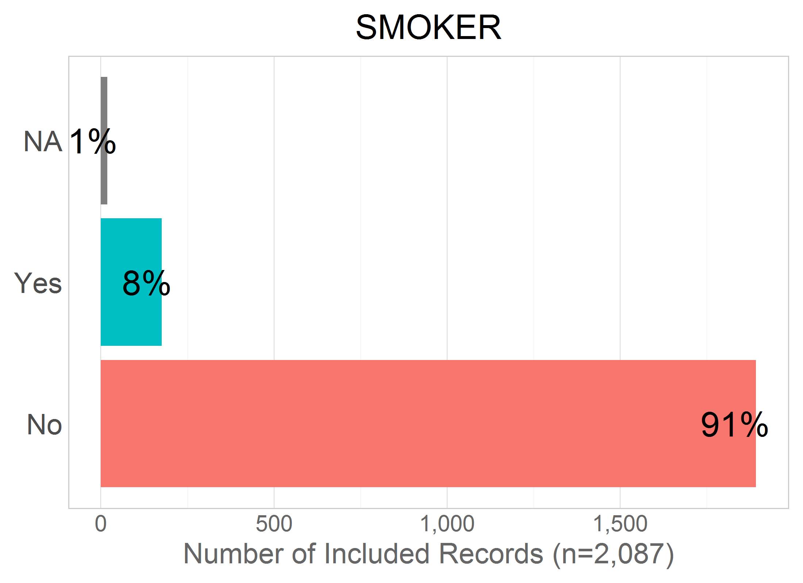

## PIPCIGAR

```r
dto[["metaData"]] %>% dplyr::filter(study_name=="alsa", name=="PIPCIGAR") %>% dplyr::select(name,label)
```

```
      name                                 label
1 PIPCIGAR Do you regularly smoke pipe or cigar?
```

```r
dto[["unitData"]][["alsa"]] %>% histogram_discrete("PIPCIGAR")
```

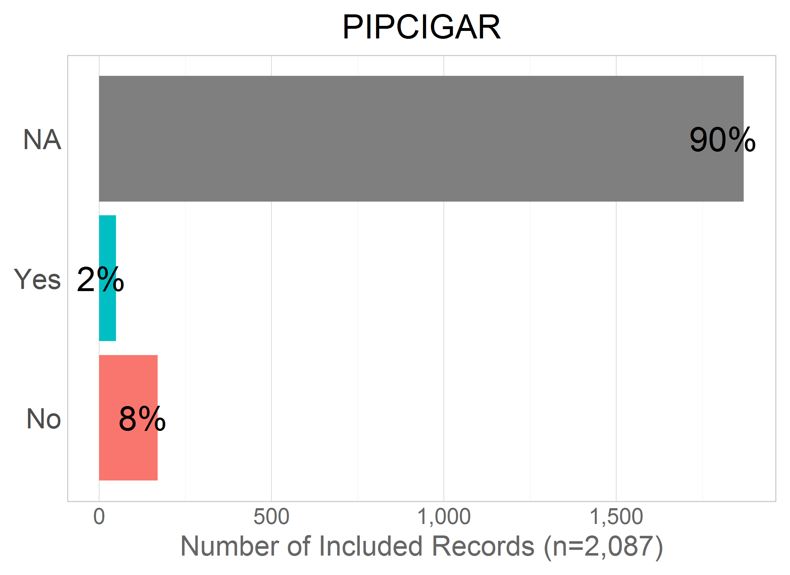


# LBSL

## SMK94

```r
dto[["metaData"]] %>% dplyr::filter(study_name=="lbsl", name=="SMK94") %>% dplyr::select(name,label)
```

```
   name            label
1 SMK94 Currently smoke?
```

```r
dto[["unitData"]][["lbsl"]] %>% histogram_discrete("SMK94")
```

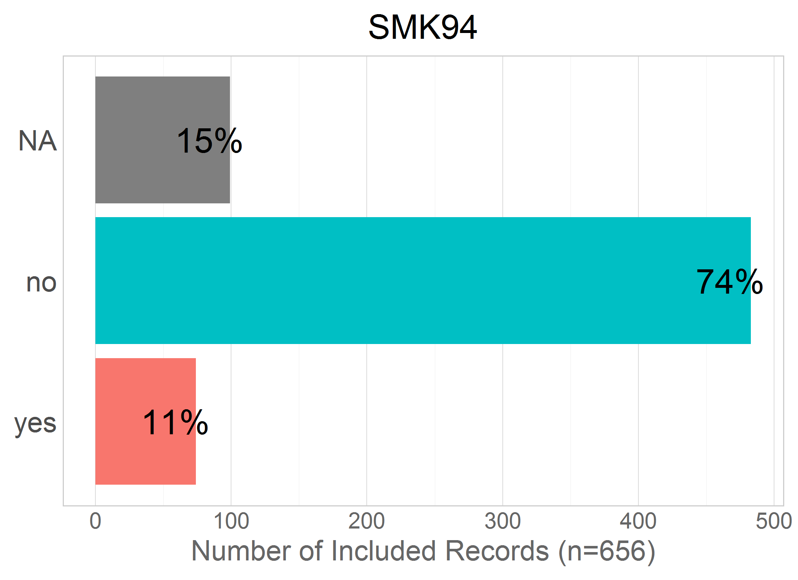

## SMOKE

```r
dto[["metaData"]] %>% dplyr::filter(study_name=="lbsl", name=="SMOKE") %>% dplyr::select(name,label)
```

```
   name              label
1 SMOKE Smoke, tobacco use
```

```r
dto[["unitData"]][["lbsl"]] %>% histogram_discrete("SMOKE")
```

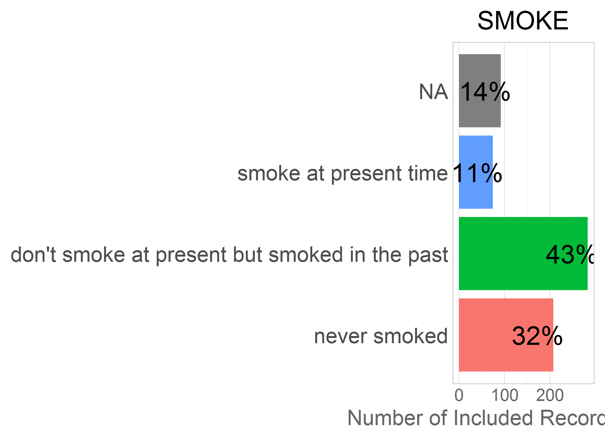


# SATSA

## GSMOKNOW

```r
dto[["metaData"]] %>% dplyr::filter(study_name=="satsa", name=="GSMOKNOW") %>% dplyr::select(name,label)
```

```
      name                                                                                                 label
1 GSMOKNOW Have you smoked more than 6 cigarettes, 4 cigars or used pipe tobacco or snuff during the last month?
```

```r
dto[["unitData"]][["satsa"]] %>% histogram_discrete("GSMOKNOW")
```

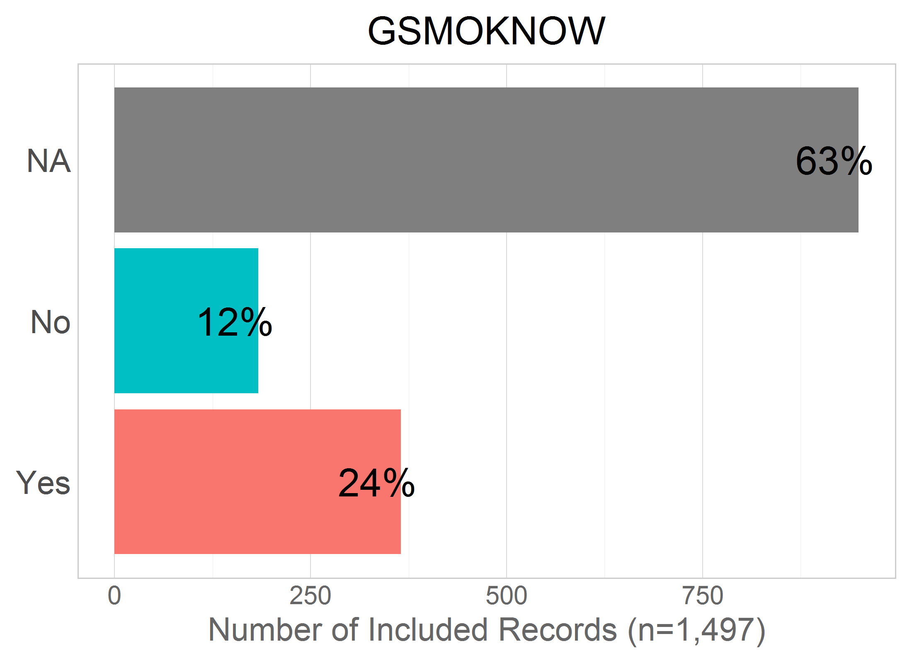

## GEVRSMK

```r
dto[["metaData"]] %>% dplyr::filter(study_name=="satsa", name=="GEVRSMK") %>% dplyr::select(name,label)
```

```
     name                                            label
1 GEVRSMK Do you smoke cigarettes, cigars or a pipe? - Yes
```

```r
dto[["unitData"]][["satsa"]] %>% histogram_discrete("GEVRSMK")
```

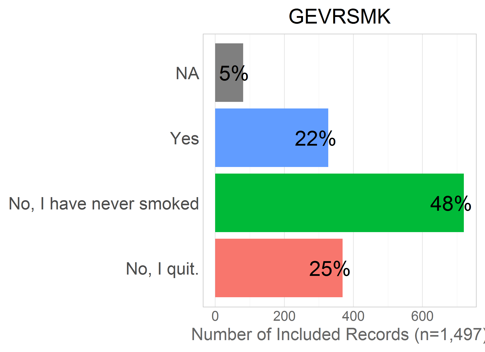

## GEVRSNS

```r
dto[["metaData"]] %>% dplyr::filter(study_name=="satsa", name=="GEVRSNS") %>% dplyr::select(name,label)
```

```
     name                    label
1 GEVRSNS Do you take snuff? - Yes
```

```r
dto[["unitData"]][["satsa"]] %>% histogram_discrete("GEVRSNS")
```

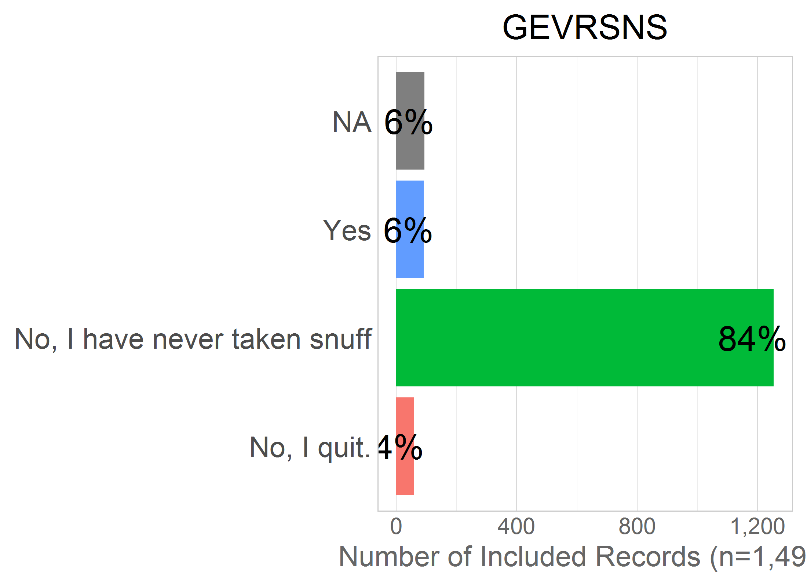


# SHARE

## BR0010

```r
dto[["metaData"]] %>% dplyr::filter(study_name=="share", name=="BR0010") %>% dplyr::select(name,label)
```

```
    name             label
1 BR0010 ever smoked daily
```

```r
dto[["unitData"]][["share"]] %>% histogram_discrete("BR0010")
```

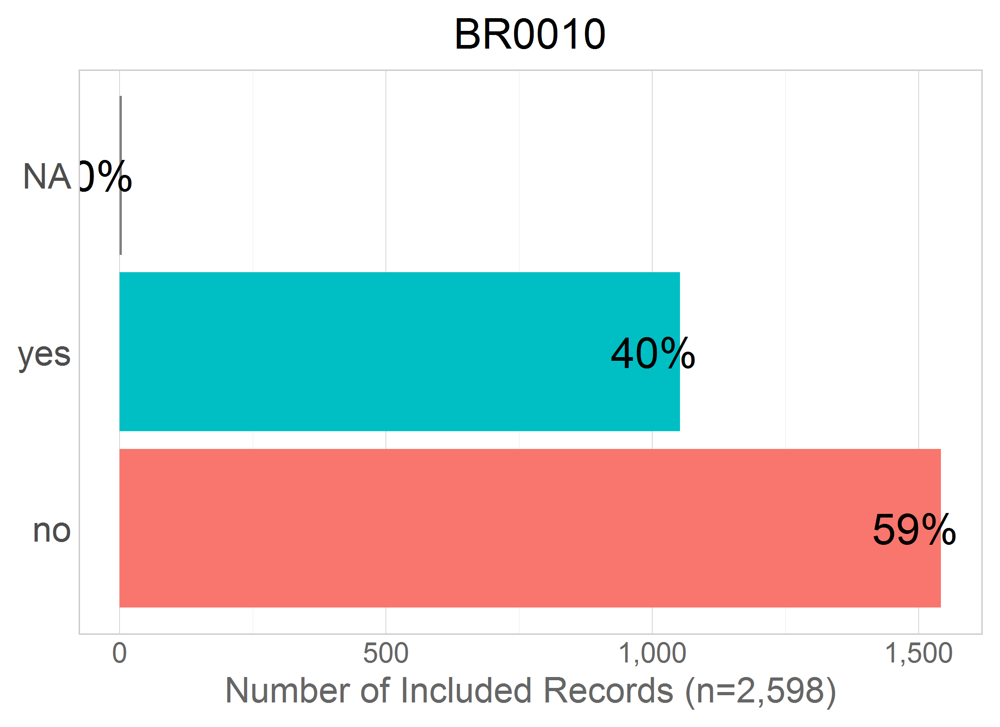
## BR0020

```r
dto[["metaData"]] %>% dplyr::filter(study_name=="share", name=="BR0020") %>% dplyr::select(name,label)
```

```
    name                     label
1 BR0020 smoke at the present time
```

```r
dto[["unitData"]][["share"]] %>% histogram_discrete("BR0020")
```

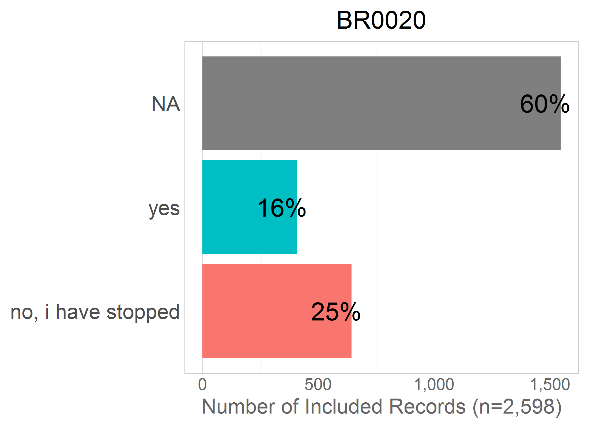
## BR0030

```r
dto[["metaData"]] %>% dplyr::filter(study_name=="share", name=="BR0030") %>% dplyr::select(name,label)
```

```
    name                 label
1 BR0030 how many years smoked
```

```r
dto[["unitData"]][["share"]] %>% dplyr::filter(!BR0030 == 9999) %>% histogram_continuous("BR0030", bin_width = 5)
```

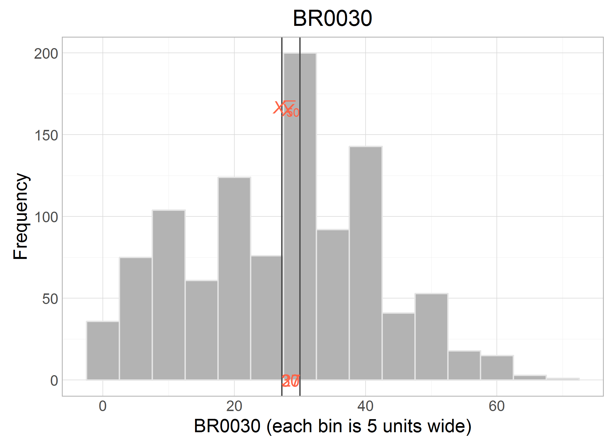


# TILDA

## BH001

```r
ds %>% dplyr::filter(study_name == "tilda") %>% histogram_discrete("BH001")
```


```r
dto[["metaData"]] %>% dplyr::filter(study_name=="tilda", name=="BH001") %>% dplyr::select(name,label)
```

```
   name                                                                                 label
1 BH001 bh001  Have you ever smoked cigarettes, cigars, cigarillos or a pipe daily for a per?
```

```r
dto[["unitData"]][["tilda"]] %>% histogram_discrete("BH001")
```

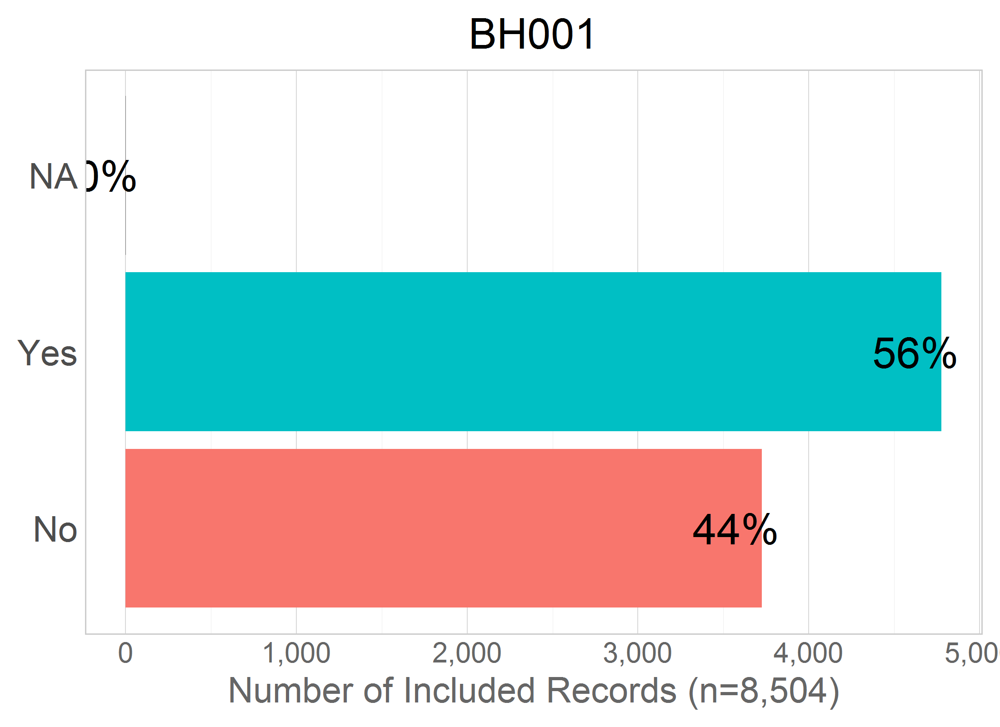

## BH002

```r
ds %>% dplyr::filter(study_name == "tilda") %>% histogram_discrete("BH002")
```

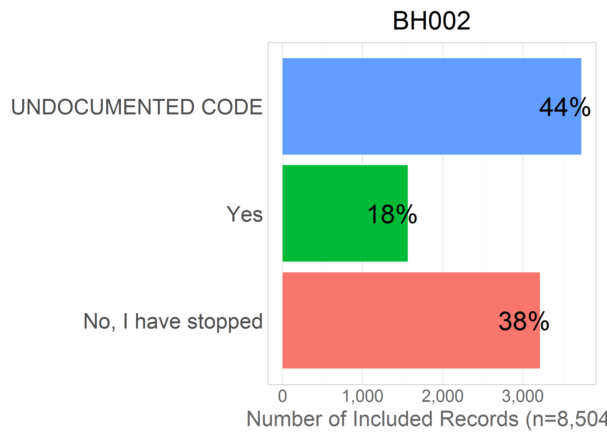

```r
dto[["metaData"]] %>% dplyr::filter(study_name=="tilda", name=="BH002") %>% dplyr::select(name,label)
```

```
   name                                    label
1 BH002 bh002  Do you smoke at the present time?
```

```r
dto[["unitData"]][["tilda"]] %>% histogram_discrete("BH002")
```


## BH003

```r
ds %>% dplyr::filter(study_name == "tilda") %>% histogram_discrete("BH002")
```


```r
dto[["metaData"]] %>% dplyr::filter(study_name=="tilda", name=="BH002") %>% dplyr::select(name,label)
```

```
   name                                    label
1 BH002 bh002  Do you smoke at the present time?
```

```r
dto[["unitData"]][["tilda"]] %>% histogram_discrete("BH002")
```


## BEHSMOKER

```r
dto[["metaData"]] %>% dplyr::filter(study_name=="tilda", name=="BEHSMOKER") %>% dplyr::select(name,label)
```

```
       name             label
1 BEHSMOKER BEHsmoker  Smoker
```

```r
dto[["unitData"]][["tilda"]] %>% histogram_discrete("BEHSMOKER")
```

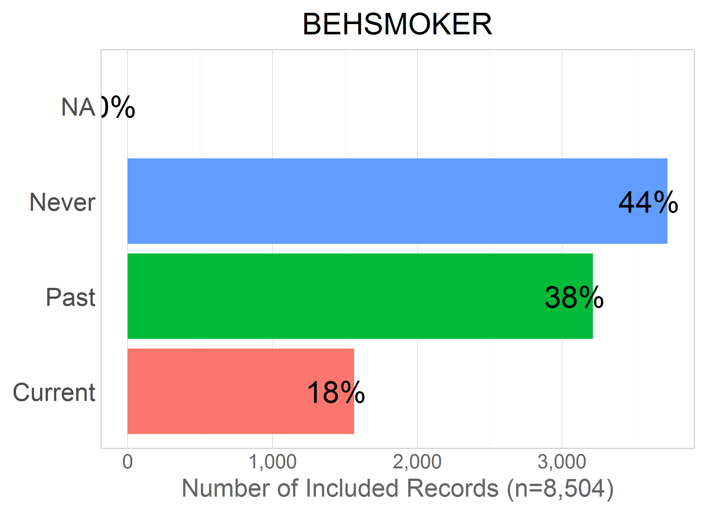


