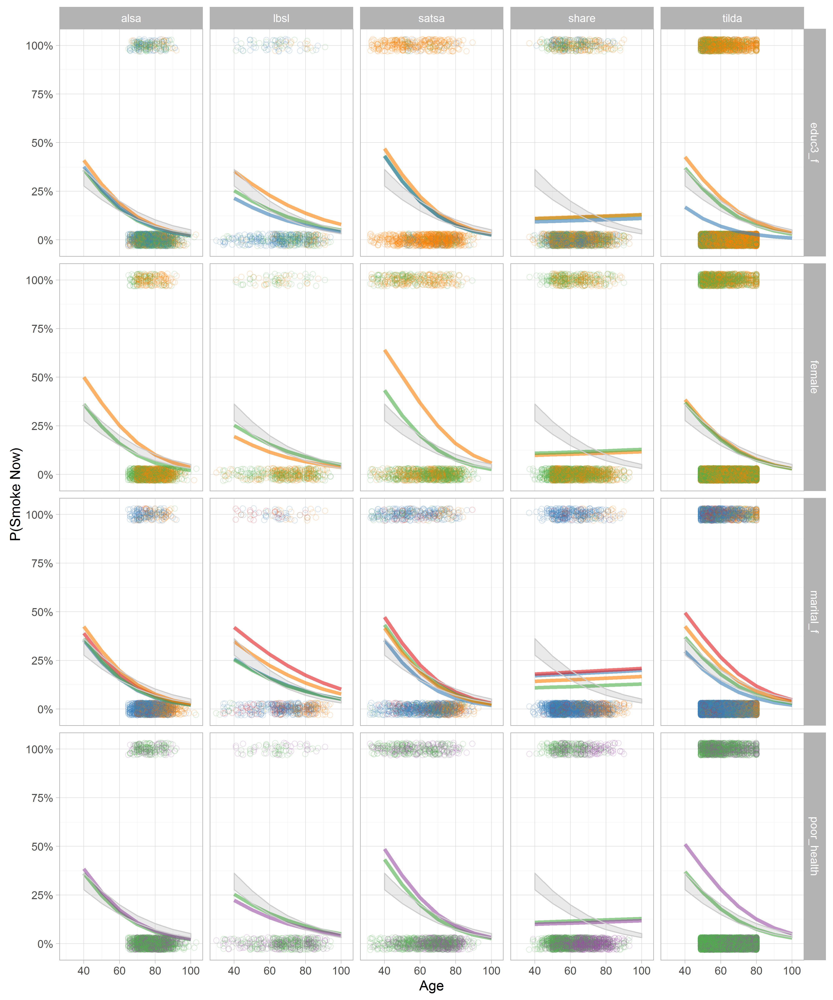

# Visualizing logistic regression

<!-- These two chunks should be added in the beginning of every .Rmd that you want to source an .R script -->
<!--  The 1st mandatory chunck  -->
<!--  Set the working directory to the repository's base directory -->


<!--  The 2nd mandatory chunck  -->
<!-- Set the report-wide options, and point to the external code file. -->


This report explores possible visualization solution for logistic regression modeling.  


<!-- Load 'sourced' R files.  Suppress the output when loading packages. --> 


<!-- Load the sources.  Suppress the output when loading sources. --> 


<!-- Load any Global functions and variables declared in the R file.  Suppress the output. --> 


<!-- Declare any global functions specific to a Rmd output.  Suppress the output. --> 

# (I) Exposition

> This report is a record of interaction with a data transfer object (dto) produced by `./manipulation/0-ellis-island.R`. 

The next section recaps this script, exposes the architecture of the DTO, and demonstrates the language of interacting with it.   

## (I.A) Ellis Island

> All data land on Ellis Island.

The script `0-ellis-island.R` is the first script in the analytic workflow. It accomplished the following: 

- (1) Reads in raw data files from the candidate studies   
- (2) Extract, combines, and exports their metadata (specifically, variable names and labels, if provided) into `./data/shared/derived/meta-data-live.csv`, which is updated every time Ellis Island script is executed.   
- (3) Augments raw metadata with instructions for renaming and classifying variables. The instructions are provided as manually entered values in `./data/shared/meta-data-map.csv`. They are used by automatic scripts in later harmonization and analysis.  
- (4) Combines unit and metadata into a single DTO to serve as a starting point to all subsequent analyses.   

<!-- Load the datasets.   -->

```r
# load the product of 0-ellis-island.R,  a list object containing data and metadata
dto <- readRDS("./data/unshared/derived/dto.rds")
```

<!-- Inspect the datasets.   -->

```r
# the list is composed of the following elements
names(dto)
```

```
[1] "studyName" "filePath"  "unitData"  "metaData" 
```

```r
# 1st element - names of the studies as character vector
dto[["studyName"]]
```

```
[1] "alsa"  "lbsl"  "satsa" "share" "tilda"
```

```r
# 2nd element - file paths of the data files for each study as character vector
dto[["filePath"]]
```

```
[1] "./data/unshared/raw/ALSA-Wave1.Final.sav"         "./data/unshared/raw/LBSL-Panel2-Wave1.Final.sav" 
[3] "./data/unshared/raw/SATSA-Q3.Final.sav"           "./data/unshared/raw/SHARE-Israel-Wave1.Final.sav"
[5] "./data/unshared/raw/TILDA-Wave1.Final.sav"       
```

```r
# 3rd element - is a list object containing the following elements
names(dto[["unitData"]])
```

```
[1] "alsa"  "lbsl"  "satsa" "share" "tilda"
```

```r
# each of these elements is a raw data set of a corresponding study, for example
dplyr::tbl_df(dto[["unitData"]][["lbsl"]]) 
```

```
Source: local data frame [656 x 38]

        id AGE94 SEX94  MSTAT94 EDUC94     NOWRK94  SMK94                                         SMOKE
     (int) (int) (int)   (fctr)  (int)      (fctr) (fctr)                                        (fctr)
1  4001026    68     1 divorced     16 no, retired     no                                  never smoked
2  4012015    94     2  widowed     12 no, retired     no                                  never smoked
3  4012032    94     2  widowed     20 no, retired     no don't smoke at present but smoked in the past
4  4022004    93     2       NA     NA          NA     NA                                  never smoked
5  4022026    93     2  widowed     12 no, retired     no                                  never smoked
6  4031031    92     1  married      8 no, retired     no don't smoke at present but smoked in the past
7  4031035    92     1  widowed     13 no, retired     no don't smoke at present but smoked in the past
8  4032201    92     2       NA     NA          NA     NA don't smoke at present but smoked in the past
9  4041062    91     1  widowed      7          NA     no don't smoke at present but smoked in the past
10 4042057    91     2       NA     NA          NA     NA                                            NA
..     ...   ...   ...      ...    ...         ...    ...                                           ...
Variables not shown: ALCOHOL (fctr), WINE (int), BEER (int), HARDLIQ (int), SPORT94 (int), FIT94 (int), WALK94 (int),
  SPEC94 (int), DANCE94 (int), CHORE94 (int), EXCERTOT (int), EXCERWK (int), HEIGHT94 (int), WEIGHT94 (int), HWEIGHT
  (int), HHEIGHT (int), SRHEALTH (fctr), smoke_now (lgl), smoked_ever (lgl), year_of_wave (dbl), age_in_years (dbl),
  year_born (dbl), female (lgl), marital (chr), educ3 (chr), current_work_2 (lgl), current_drink (lgl), sedentary
  (lgl), poor_health (lgl), bmi (dbl)
```


###  Meta

```r
# 4th element - a dataset names and labels of raw variables + added metadata for all studies
# dto[["metaData"]] %>% 
#   dplyr::select(study_name, name, item, construct, type, categories, label_short, label) %>%
#   DT::datatable(
#     class   = 'cell-border stripe',
#     caption = "This is the primary metadata file. Edit at `./data/shared/meta-data-map.csv",
#     filter  = "top",
#     options = list(pageLength = 6, autoWidth = TRUE)
#   )
```

<!-- Tweak the datasets.   -->


<!-- Basic table view.   -->


# (II) Development

## (II.A) Pre-Assembly

### Combined data


```r
dmls <- list() # dummy list
for(s in dto[["studyName"]]){
  ds <- dto[["unitData"]][[s]] # get study data from dto
  get_these_variables <- c(
    "id",
    "year_of_wave","age_in_years","year_born",
    "female",
    "marital",
    "educ3",
    "smoke_now","smoked_ever",
    "current_work_2",
    "current_drink",
    "sedentary",
    "poor_health",
    "bmi"
  )
  variables_present <- colnames(ds) %in% get_these_variables # variables on the list
  dmls[[s]] <- ds[, variables_present] # keep only them
}
lapply(dmls, names) # view the contents of the list object
```

```
$alsa
 [1] "id"             "smoke_now"      "smoked_ever"    "year_of_wave"   "age_in_years"   "year_born"     
 [7] "female"         "marital"        "educ3"          "current_work_2" "current_drink"  "sedentary"     
[13] "poor_health"    "bmi"           

$lbsl
 [1] "id"             "smoke_now"      "smoked_ever"    "year_of_wave"   "age_in_years"   "year_born"     
 [7] "female"         "marital"        "educ3"          "current_work_2" "current_drink"  "sedentary"     
[13] "poor_health"    "bmi"           

$satsa
 [1] "id"             "smoke_now"      "smoked_ever"    "year_of_wave"   "age_in_years"   "year_born"     
 [7] "female"         "marital"        "educ3"          "current_work_2" "current_drink"  "sedentary"     
[13] "poor_health"    "bmi"           

$share
 [1] "id"             "smoke_now"      "smoked_ever"    "year_of_wave"   "year_born"      "age_in_years"  
 [7] "female"         "marital"        "educ3"          "current_work_2" "current_drink"  "sedentary"     
[13] "poor_health"    "bmi"           

$tilda
 [1] "id"             "smoke_now"      "smoked_ever"    "year_of_wave"   "age_in_years"   "year_born"     
 [7] "female"         "marital"        "educ3"          "current_work_2" "current_drink"  "sedentary"     
[13] "poor_health"    "bmi"           
```

```r
ds <- plyr::ldply(dmls,data.frame,.id = "study_name")
ds$id <- 1:nrow(ds) # some ids values might be identical, replace
ds %>% dplyr::glimpse()
```

```
Observations: 15,342
Variables: 15
$ study_name     (fctr) alsa, alsa, alsa, alsa, alsa, alsa, alsa, alsa, alsa, alsa, alsa, alsa, alsa, alsa, alsa, a...
$ id             (int) 1, 2, 3, 4, 5, 6, 7, 8, 9, 10, 11, 12, 13, 14, 15, 16, 17, 18, 19, 20, 21, 22, 23, 24, 25, 2...
$ smoke_now      (lgl) FALSE, FALSE, FALSE, FALSE, FALSE, FALSE, FALSE, FALSE, FALSE, FALSE, FALSE, FALSE, FALSE, T...
$ smoked_ever    (lgl) FALSE, FALSE, FALSE, FALSE, FALSE, FALSE, FALSE, FALSE, FALSE, FALSE, FALSE, FALSE, FALSE, T...
$ year_of_wave   (dbl) 1992, 1992, 1992, 1992, 1992, 1992, 1992, 1992, 1992, 1992, 1992, 1992, 1992, 1992, 1992, 19...
$ age_in_years   (dbl) 86, 78, 89, 78, 85, 92, 74, 80, 99, 85, 84, 87, 78, 91, 80, 76, 82, 70, 77, 78, 75, 85, 72, ...
$ year_born      (dbl) 1906, 1914, 1903, 1914, 1907, 1900, 1918, 1912, 1893, 1907, 1908, 1905, 1914, 1901, 1912, 19...
$ female         (lgl) FALSE, TRUE, TRUE, FALSE, FALSE, TRUE, TRUE, TRUE, TRUE, FALSE, FALSE, TRUE, TRUE, FALSE, FA...
$ marital        (chr) "mar_cohab", "mar_cohab", "widowed", "widowed", "widowed", "widowed", "widowed", "single", "...
$ educ3          (chr) "more than high school", "high school", "high school", "high school", "more than high school...
$ current_work_2 (lgl) FALSE, FALSE, FALSE, TRUE, FALSE, FALSE, FALSE, FALSE, FALSE, FALSE, FALSE, FALSE, FALSE, FA...
$ current_drink  (lgl) TRUE, TRUE, TRUE, TRUE, TRUE, TRUE, TRUE, TRUE, FALSE, TRUE, TRUE, FALSE, TRUE, TRUE, TRUE, ...
$ sedentary      (lgl) FALSE, FALSE, TRUE, FALSE, FALSE, TRUE, TRUE, TRUE, TRUE, TRUE, TRUE, FALSE, TRUE, TRUE, FAL...
$ poor_health    (lgl) FALSE, FALSE, FALSE, TRUE, FALSE, FALSE, FALSE, FALSE, FALSE, FALSE, TRUE, FALSE, FALSE, FAL...
$ bmi            (dbl) NA, NA, NA, NA, NA, NA, NA, NA, NA, NA, NA, NA, NA, NA, NA, NA, NA, NA, NA, NA, NA, NA, NA, ...
```

### Basic info

```r
# age summary across studies
ds %>%  
  dplyr::group_by(study_name) %>%
  na.omit() %>% 
  dplyr::summarize(
    mean_age     = round(mean(age_in_years),1),
    sd_age       = round(sd(age_in_years),2),
    observed     = n(),
    min_born     = min(year_born),
    med_born     = median(year_born),
    max_born     = max(year_born)
  ) %>% 
  dplyr::ungroup()
```

```
Source: local data frame [4 x 7]

  study_name mean_age sd_age observed min_born med_born max_born
      (fctr)    (dbl)  (dbl)    (int)    (dbl)    (dbl)    (dbl)
1       lbsl     68.0  13.11      516     1900     1925     1964
2      satsa     63.1  12.67     1283     1900     1925     1998
3      share     62.0   9.97     2481     1911     1944     1967
4      tilda     62.6   9.12     4531     1929     1947     1960
```
## (II.B) Frequencies

### `age_in_years`

```
            
             alsa lbsl satsa share tilda <NA>
  (-Inf,40]  .    25   73    8     .     .   
  (40,45]    .    25   69    39    .     .   
  (45,50]    .    30   114   221   663   .   
  (50,55]    .    45   162   526   1637  .   
  (55,60]    .    28   126   489   1590  .   
  (60,65]    13   87   168   361   1388  .   
  (65,70]    258  101  222   389   1138  .   
  (70,75]    552  81   235   263   884   .   
  (75,80]    513  67   198   162   1192  .   
  (80,85]    425  110  96    98    .     .   
  (85,90]    254  43   28    33    .     .   
  (90,95]    58   13   4     6     .     .   
  (95,100]   12   1    1     .     .     .   
  (100, Inf] 2    .    .     .     .     .   
  <NA>       .    .    1     3     12    .   
```
### Criteria

### `smoke_now`

```
       
        FALSE TRUE <NA>
  alsa  1851  217  19  
  lbsl  480   71   105 
  satsa 1067  365  65  
  share 2186  408  4   
  tilda 6939  1564 1   
  <NA>  .     .    .   
```

### `smoked_ever`

```
       
        FALSE TRUE <NA>
  alsa  1851  217  19  
  lbsl  207   351  98  
  satsa 700   696  101 
  share 1542  1052 4   
  tilda 3726  4777 1   
  <NA>  .     .    .   
```

### `female`

```
       
        FALSE TRUE <NA>
  alsa  1056  1031 .   
  lbsl  314   342  .   
  satsa 610   887  .   
  share 1139  1459 .   
  tilda 3780  4724 .   
  <NA>  .     .    .   
```

### `marital`

```
       
        mar_cohab sep_divorced single widowed <NA>
  alsa  1367      49           76     594     1   
  lbsl  326       77           22     134     97  
  satsa 961       113          149    259     15  
  share 2049      159          51     336     3   
  tilda 5966      552          791    1195    .   
  <NA>  .         .            .      .       .   
```

### `educ3`

```
       
        high school less than high school more than high school <NA>
  alsa  819         337                   905                   26  
  lbsl  170         74                    310                   102 
  satsa 121         1239                  109                   28  
  share 889         965                   717                   27  
  tilda 2795        5222                  483                   4   
  <NA>  .           .                     .                     .   
```

## (II.C) Modeling

### Declarations


```r
dv_name <- "smoke_now"
dv_label <- "P(Smoke Now)"
dv_label_odds <- "Odds(Smoke Now)"

ds2 <- ds %>% 
  dplyr::select_("id", "study_name", "smoke_now", "age_in_years", "female", "marital", "educ3","poor_health") %>%
  # dplyr::select_(.dots = selected_variables) %>%
  na.omit() %>% 
  dplyr::mutate(
    marital_f         = as.factor(marital),
    educ3_f           = as.factor(educ3)
  ) %>% 
  dplyr::rename_(
    "dv" = dv_name
  ) 
 
time_scale <- "age_in_years"
control_covar <- c("female + educ3_f + marital_f")
focal_covar <- "poor_health"

reference_group <- c(
  "female"        = TRUE,
  "educ3_f"       = "high school",
  "marital_f"     = "single",
  "poor_health"   = FALSE
)
```
### Specification

```r
# eq <- as.formula(paste0("dv ~ -1 + age_in_years + female + educ3_f + poor_health + marital_f"))
eq <- as.formula(paste0("dv ~ -1 + ",time_scale, " + ", control_covar, " + ", focal_covar))
model_global <- glm(eq, data = ds2, family = binomial(link="logit")) 
summary(model_global)
```

```

Call:
glm(formula = eq, family = binomial(link = "logit"), data = ds2)

Deviance Residuals: 
    Min       1Q   Median       3Q      Max  
-1.2865  -0.6578  -0.5483  -0.4180   2.5184  

Coefficients:
                             Estimate Std. Error z value Pr(>|z|)    
age_in_years                 -0.04018    0.00231 -17.396  < 2e-16 ***
femaleFALSE                   0.75634    0.14925   5.068 4.03e-07 ***
femaleTRUE                    0.58007    0.14262   4.067 4.76e-05 ***
educ3_fless than high school  0.26112    0.04975   5.249 1.53e-07 ***
educ3_fmore than high school -0.31917    0.07553  -4.226 2.38e-05 ***
marital_fsep_divorced         0.66063    0.07824   8.444  < 2e-16 ***
marital_fsingle               0.26743    0.08175   3.272  0.00107 ** 
marital_fwidowed              0.37453    0.06979   5.366 8.03e-08 ***
poor_healthTRUE               0.33798    0.04728   7.148 8.77e-13 ***
---
Signif. codes:  0 '***' 0.001 '**' 0.01 '*' 0.05 '.' 0.1 ' ' 1

(Dispersion parameter for binomial family taken to be 1)

    Null deviance: 20836  on 15030  degrees of freedom
Residual deviance: 13286  on 15021  degrees of freedom
AIC: 13304

Number of Fisher Scoring iterations: 4
```

### Computation

#### Global 
`study_name` is entered as a factor.  


```r
ds2$dv_p <- predict(model_global)

ds_predicted_global <- expand.grid(
  study_name       = sort(unique(ds2$study_name)), #For the sake of repeating the same global line in all studies/panels in the facetted graphs
  age_in_years     = seq.int(40, 100, 10),
  female           = sort(unique(ds2$female)),
  educ3_f          = sort(unique(ds2$educ3_f)),
  marital_f        = sort(unique(ds2$marital_f)),
  poor_health      = sort(unique(ds2$poor_health)),
  stringsAsFactors = FALSE
) 

predicted_global                  <- predict(model_global, newdata=ds_predicted_global, se.fit=TRUE) 
ds_predicted_global$dv_hat        <- predicted_global$fit #logged-odds of probability (ie, linear)
ds_predicted_global$dv_upper      <- predicted_global$fit + 1.96*predicted_global$se.fit
ds_predicted_global$dv_lower      <- predicted_global$fit - 1.96*predicted_global$se.fit 
ds_predicted_global$dv_hat_p      <- plogis(ds_predicted_global$dv_hat) 
ds_predicted_global$dv_upper_p    <- plogis(ds_predicted_global$dv_upper) 
ds_predicted_global$dv_lower_p    <- plogis(ds_predicted_global$dv_lower) 

ds_predicted_global %>% dplyr::glimpse()
```

```
Observations: 1,680
Variables: 12
$ study_name   (fctr) alsa, lbsl, satsa, share, tilda, alsa, lbsl, satsa, share, tilda, alsa, lbsl, satsa, share, t...
$ age_in_years (dbl) 40, 40, 40, 40, 40, 50, 50, 50, 50, 50, 60, 60, 60, 60, 60, 70, 70, 70, 70, 70, 80, 80, 80, 80...
$ female       (lgl) FALSE, FALSE, FALSE, FALSE, FALSE, FALSE, FALSE, FALSE, FALSE, FALSE, FALSE, FALSE, FALSE, FAL...
$ educ3_f      (fctr) high school, high school, high school, high school, high school, high school, high school, hi...
$ marital_f    (fctr) mar_cohab, mar_cohab, mar_cohab, mar_cohab, mar_cohab, mar_cohab, mar_cohab, mar_cohab, mar_c...
$ poor_health  (lgl) FALSE, FALSE, FALSE, FALSE, FALSE, FALSE, FALSE, FALSE, FALSE, FALSE, FALSE, FALSE, FALSE, FAL...
$ dv_hat       (dbl) -0.8509939, -0.8509939, -0.8509939, -0.8509939, -0.8509939, -1.2528275, -1.2528275, -1.2528275...
$ dv_upper     (dbl) -0.7143121, -0.7143121, -0.7143121, -0.7143121, -0.7143121, -1.1423390, -1.1423390, -1.1423390...
$ dv_lower     (dbl) -0.9876756, -0.9876756, -0.9876756, -0.9876756, -0.9876756, -1.3633159, -1.3633159, -1.3633159...
$ dv_hat_p     (dbl) 0.29922441, 0.29922441, 0.29922441, 0.29922441, 0.29922441, 0.22221108, 0.22221108, 0.22221108...
$ dv_upper_p   (dbl) 0.32864672, 0.32864672, 0.32864672, 0.32864672, 0.32864672, 0.24189117, 0.24189117, 0.24189117...
$ dv_lower_p   (dbl) 0.27137143, 0.27137143, 0.27137143, 0.27137143, 0.27137143, 0.20370191, 0.20370191, 0.20370191...
```

```r
head(ds_predicted_global)
```

```
  study_name age_in_years female     educ3_f marital_f poor_health     dv_hat   dv_upper   dv_lower  dv_hat_p
1       alsa           40  FALSE high school mar_cohab       FALSE -0.8509939 -0.7143121 -0.9876756 0.2992244
2       lbsl           40  FALSE high school mar_cohab       FALSE -0.8509939 -0.7143121 -0.9876756 0.2992244
3      satsa           40  FALSE high school mar_cohab       FALSE -0.8509939 -0.7143121 -0.9876756 0.2992244
4      share           40  FALSE high school mar_cohab       FALSE -0.8509939 -0.7143121 -0.9876756 0.2992244
5      tilda           40  FALSE high school mar_cohab       FALSE -0.8509939 -0.7143121 -0.9876756 0.2992244
6       alsa           50  FALSE high school mar_cohab       FALSE -1.2528275 -1.1423390 -1.3633159 0.2222111
  dv_upper_p dv_lower_p
1  0.3286467  0.2713714
2  0.3286467  0.2713714
3  0.3286467  0.2713714
4  0.3286467  0.2713714
5  0.3286467  0.2713714
6  0.2418912  0.2037019
```

#### Local 

`study_name` defines clusters for separate estimation. 

```r
ds_predicted_study_list <- list()
model_study_list <- list()
for( study_name_ in dto[["studyName"]] ) {
  d_study <- ds2[ds2$study_name==study_name_, ]
  model_study <- glm(eq, data=d_study,  family=binomial(link="logit")) 
  model_study_list[[study_name_]] <- model_study
  
  d_predicted <- expand.grid(
    age_in_years     = seq.int(40, 100, 10),
    female           = sort(unique(ds2$female)),
    educ3_f          = sort(unique(ds2$educ3_f)),
    marital_f        = sort(unique(ds2$marital_f)),
    poor_health      = sort(unique(ds2$poor_health)),
    stringsAsFactors = FALSE
  ) 
  
  # d_predicted$dv_hat      <- as.numeric(predict(model_study, newdata=d_predicted)) #logged-odds of probability (ie, linear)
  # d_predicted$dv_hat_p    <- plogis(d_predicted$dv_hat)                            #probability (ie, s-curve)
  
  predicted_study           <- predict(model_study, newdata=d_predicted, se.fit=TRUE) 
  d_predicted$dv_hat        <- predicted_study$fit #logged-odds of probability (ie, linear)
  d_predicted$dv_upper      <- predicted_study$fit + 1.96*predicted_study$se.fit
  d_predicted$dv_lower      <- predicted_study$fit - 1.96*predicted_study$se.fit 
  d_predicted$dv_hat_p      <- plogis(d_predicted$dv_hat) 
  d_predicted$dv_upper_p    <- plogis(d_predicted$dv_upper) 
  d_predicted$dv_lower_p    <- plogis(d_predicted$dv_lower) 
  
  ds_predicted_study_list[[study_name_]] <- d_predicted
}

ds_predicted_study <- ds_predicted_study_list %>% 
  dplyr::bind_rows(.id="study_name")

ds_predicted_study %>% dplyr::glimpse()
```

```
Observations: 1,680
Variables: 12
$ study_name   (chr) "alsa", "alsa", "alsa", "alsa", "alsa", "alsa", "alsa", "alsa", "alsa", "alsa", "alsa", "alsa"...
$ age_in_years (dbl) 40, 50, 60, 70, 80, 90, 100, 40, 50, 60, 70, 80, 90, 100, 40, 50, 60, 70, 80, 90, 100, 40, 50,...
$ female       (lgl) FALSE, FALSE, FALSE, FALSE, FALSE, FALSE, FALSE, TRUE, TRUE, TRUE, TRUE, TRUE, TRUE, TRUE, FAL...
$ educ3_f      (fctr) high school, high school, high school, high school, high school, high school, high school, hi...
$ marital_f    (fctr) mar_cohab, mar_cohab, mar_cohab, mar_cohab, mar_cohab, mar_cohab, mar_cohab, mar_cohab, mar_c...
$ poor_health  (lgl) FALSE, FALSE, FALSE, FALSE, FALSE, FALSE, FALSE, FALSE, FALSE, FALSE, FALSE, FALSE, FALSE, FAL...
$ dv_hat       (dbl) -0.02995342, -0.57747206, -1.12499070, -1.67250933, -2.22002797, -2.76754660, -3.31506524, -0....
$ dv_upper     (dbl) 0.9207836, 0.1364415, -0.6311321, -1.3460551, -1.9074570, -2.3014124, -2.6329262, 0.2964262, -...
$ dv_lower     (dbl) -0.9806904, -1.2913856, -1.6188493, -1.9989636, -2.5325990, -3.2336808, -3.9972043, -1.5066818...
$ dv_hat_p     (dbl) 0.49251220, 0.35951448, 0.24508673, 0.15808991, 0.09796633, 0.05910330, 0.03505796, 0.35317141...
$ dv_upper_p   (dbl) 0.71520174, 0.53405754, 0.34725389, 0.20651607, 0.12926682, 0.09100605, 0.06704917, 0.57356863...
$ dv_lower_p   (dbl) 0.272754809, 0.215618380, 0.165363623, 0.119311780, 0.073604235, 0.037917744, 0.018035656, 0.1...
```

```r
head(ds_predicted_study)
```

```
Source: local data frame [6 x 12]

  study_name age_in_years female     educ3_f marital_f poor_health      dv_hat   dv_upper   dv_lower   dv_hat_p
       (chr)        (dbl)  (lgl)      (fctr)    (fctr)       (lgl)       (dbl)      (dbl)      (dbl)      (dbl)
1       alsa           40  FALSE high school mar_cohab       FALSE -0.02995342  0.9207836 -0.9806904 0.49251220
2       alsa           50  FALSE high school mar_cohab       FALSE -0.57747206  0.1364415 -1.2913856 0.35951448
3       alsa           60  FALSE high school mar_cohab       FALSE -1.12499070 -0.6311321 -1.6188493 0.24508673
4       alsa           70  FALSE high school mar_cohab       FALSE -1.67250933 -1.3460551 -1.9989636 0.15808991
5       alsa           80  FALSE high school mar_cohab       FALSE -2.22002797 -1.9074570 -2.5325990 0.09796633
6       alsa           90  FALSE high school mar_cohab       FALSE -2.76754660 -2.3014124 -3.2336808 0.05910330
Variables not shown: dv_upper_p (dbl), dv_lower_p (dbl)
```


### Coloring


## (II.D) Assembly

### Global

### Local 


### Combined Graph




### Study as factor


### Study as cluster


