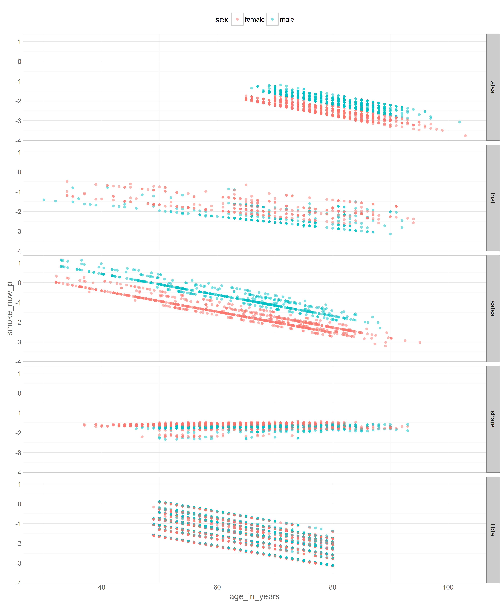

# Harmonized Data

<!-- These two chunks should be added in the beginning of every .Rmd that you want to source an .R script -->
<!--  The 1st mandatory chunck  -->
<!--  Set the working directory to the repository's base directory -->


<!--  The 2nd mandatory chunck  -->
<!-- Set the report-wide options, and point to the external code file. -->


This report explores possible visualization solution for logistic regression modeling.  


<!-- Load 'sourced' R files.  Suppress the output when loading packages. --> 


<!-- Load the sources.  Suppress the output when loading sources. --> 


<!-- Load any Global functions and variables declared in the R file.  Suppress the output. --> 


<!-- Declare any global functions specific to a Rmd output.  Suppress the output. --> 

# (I) Exposition

> This report is a record of interaction with a data transfer object (dto) produced by `./manipulation/0-ellis-island.R`. 

The next section recaps this script, exposes the architecture of the DTO, and demonstrates the language of interacting with it.   

## (I.A) Ellis Island

> All data land on Ellis Island.

The script `0-ellis-island.R` is the first script in the analytic workflow. It accomplished the following: 

- (1) Reads in raw data files from the candidate studies   
- (2) Extract, combines, and exports their metadata (specifically, variable names and labels, if provided) into `./data/shared/derived/meta-data-live.csv`, which is updated every time Ellis Island script is executed.   
- (3) Augments raw metadata with instructions for renaming and classifying variables. The instructions are provided as manually entered values in `./data/shared/meta-data-map.csv`. They are used by automatic scripts in later harmonization and analysis.  
- (4) Combines unit and metadata into a single DTO to serve as a starting point to all subsequent analyses.   

<!-- Load the datasets.   -->

```r
# load the product of 0-ellis-island.R,  a list object containing data and metadata
dto <- readRDS("./data/unshared/derived/dto.rds")
```

<!-- Inspect the datasets.   -->

```r
# the list is composed of the following elements
names(dto)
```

```
[1] "studyName" "filePath"  "unitData"  "metaData" 
```

```r
# 1st element - names of the studies as character vector
dto[["studyName"]]
```

```
[1] "alsa"  "lbsl"  "satsa" "share" "tilda"
```

```r
# 2nd element - file paths of the data files for each study as character vector
dto[["filePath"]]
```

```
[1] "./data/unshared/raw/ALSA-Wave1.Final.sav"         "./data/unshared/raw/LBSL-Panel2-Wave1.Final.sav" 
[3] "./data/unshared/raw/SATSA-Q3.Final.sav"           "./data/unshared/raw/SHARE-Israel-Wave1.Final.sav"
[5] "./data/unshared/raw/TILDA-Wave1.Final.sav"       
```

```r
# 3rd element - is a list object containing the following elements
names(dto[["unitData"]])
```

```
[1] "alsa"  "lbsl"  "satsa" "share" "tilda"
```

```r
# each of these elements is a raw data set of a corresponding study, for example
dplyr::tbl_df(dto[["unitData"]][["lbsl"]]) 
```

```
Source: local data frame [656 x 33]

        id AGE94 SEX94  MSTAT94 EDUC94     NOWRK94  SMK94                                         SMOKE
     (int) (int) (int)   (fctr)  (int)      (fctr) (fctr)                                        (fctr)
1  4001026    68     1 divorced     16 no, retired     no                                  never smoked
2  4012015    94     2  widowed     12 no, retired     no                                  never smoked
3  4012032    94     2  widowed     20 no, retired     no don't smoke at present but smoked in the past
4  4022004    93     2       NA     NA          NA     NA                                  never smoked
5  4022026    93     2  widowed     12 no, retired     no                                  never smoked
6  4031031    92     1  married      8 no, retired     no don't smoke at present but smoked in the past
7  4031035    92     1  widowed     13 no, retired     no don't smoke at present but smoked in the past
8  4032201    92     2       NA     NA          NA     NA don't smoke at present but smoked in the past
9  4041062    91     1  widowed      7          NA     no don't smoke at present but smoked in the past
10 4042057    91     2       NA     NA          NA     NA                                            NA
..     ...   ...   ...      ...    ...         ...    ...                                           ...
Variables not shown: ALCOHOL (fctr), WINE (int), BEER (int), HARDLIQ (int), SPORT94 (int), FIT94 (int), WALK94 (int),
  SPEC94 (int), DANCE94 (int), CHORE94 (int), EXCERTOT (int), EXCERWK (int), HEIGHT94 (int), WEIGHT94 (int), HWEIGHT
  (int), HHEIGHT (int), SRHEALTH (fctr), smoke_now (lgl), smoked_ever (lgl), year_of_wave (dbl), age_in_years (dbl),
  year_born (dbl), sex (chr), marital (chr), educ3 (chr)
```


###  Meta

```r
# # 4th element - a dataset names and labels of raw variables + added metadata for all studies
# dto[["metaData"]] %>% dplyr::select(study_name, name, item, construct, type, categories, label_short, label) %>% 
#   DT::datatable(
#     class   = 'cell-border stripe',
#     caption = "This is the primary metadata file. Edit at `./data/shared/meta-data-map.csv",
#     filter  = "top",
#     options = list(pageLength = 6, autoWidth = TRUE)
#   )
```

<!-- Tweak the datasets.   -->


<!-- Basic table view.   -->


### Combined data


```r
dmls <- list() # dummy list
for(s in dto[["studyName"]]){
  ds <- dto[["unitData"]][[s]] # get study data from dto
  (varnames <- names(ds)) # see what variables there are
  (get_these_variables <- c("id",
                            "year_of_wave","age_in_years","year_born",
                            "sex",
                            "marital",
                            "educ3",
                            "smoke_now","smoked_ever")) 
  (variables_present <- varnames %in% get_these_variables) # variables on the list
  dmls[[s]] <- ds[,variables_present] # keep only them
}
lapply(dmls, names) # view the contents of the list object
```

```
$alsa
[1] "id"           "smoke_now"    "smoked_ever"  "year_of_wave" "age_in_years" "year_born"    "sex"         
[8] "marital"      "educ3"       

$lbsl
[1] "id"           "smoke_now"    "smoked_ever"  "year_of_wave" "age_in_years" "year_born"    "sex"         
[8] "marital"      "educ3"       

$satsa
[1] "id"           "smoke_now"    "smoked_ever"  "year_of_wave" "age_in_years" "year_born"    "sex"         
[8] "marital"      "educ3"       

$share
[1] "id"           "smoke_now"    "smoked_ever"  "year_of_wave" "year_born"    "age_in_years" "sex"         
[8] "marital"      "educ3"       

$tilda
[1] "id"           "smoke_now"    "smoked_ever"  "year_of_wave" "age_in_years" "year_born"    "sex"         
[8] "marital"      "educ3"       
```

```r
ds <- plyr::ldply(dmls,data.frame,.id = "study_name")
ds$id <- 1:nrow(ds) # some ids values might be identical, replace
head(ds)
```

```
  study_name id smoke_now smoked_ever year_of_wave age_in_years year_born    sex   marital                 educ3
1       alsa  1     FALSE       FALSE         1992           86      1906   male mar_cohab more than high school
2       alsa  2     FALSE       FALSE         1992           78      1914 female mar_cohab           high school
3       alsa  3     FALSE       FALSE         1992           89      1903 female   widowed           high school
4       alsa  4     FALSE       FALSE         1992           78      1914   male   widowed           high school
5       alsa  5     FALSE       FALSE         1992           85      1907   male   widowed more than high school
6       alsa  6     FALSE       FALSE         1992           92      1900 female   widowed           high school
```

### Basic info

```r
# age summary across studies
ds %>%  
  dplyr::group_by(study_name) %>%
  na.omit() %>% 
  dplyr::summarize(mean_age = round(mean(age_in_years),1),
                   sd_age = round(sd(age_in_years),2),
                   observed = n(),
                   min_born = min(year_born),
                   med_born = median(year_born),
                   max_born = max(year_born)) 
```

```
Source: local data frame [5 x 7]

  study_name mean_age sd_age observed min_born med_born max_born
      (fctr)    (dbl)  (dbl)    (int)    (dbl)    (dbl)    (dbl)
1       alsa     78.1   6.65     2059     1889     1915     1927
2       lbsl     68.3  13.34      542     1900     1925     1964
3      satsa     63.5  12.78     1352     1900     1925     1998
4      share     62.1  10.07     2556     1911     1943     1967
5      tilda     63.0   9.40     8487     1929     1947     1960
```

```r
# see counts across age groups and studies 
t <- table(
  cut(ds$age_in_years,breaks = c(-Inf,seq(from=40,to=100,by=5), Inf)),
  ds$study_name, 
  useNA = "always"
); t[t==0] <- "."; t
```

```
            
             alsa lbsl satsa share tilda <NA>
  (-Inf,40]  .    25   73    8     .     .   
  (40,45]    .    25   69    39    .     .   
  (45,50]    .    30   114   221   663   .   
  (50,55]    .    45   162   526   1637  .   
  (55,60]    .    28   126   489   1590  .   
  (60,65]    13   87   168   361   1388  .   
  (65,70]    258  101  222   389   1138  .   
  (70,75]    552  81   235   263   884   .   
  (75,80]    513  67   198   162   1192  .   
  (80,85]    425  110  96    98    .     .   
  (85,90]    254  43   28    33    .     .   
  (90,95]    58   13   4     6     .     .   
  (95,100]   12   1    1     .     .     .   
  (100, Inf] 2    .    .     .     .     .   
  <NA>       .    .    1     3     12    .   
```

```r
# basic counts
table(ds$study_name, ds$smoke_now, useNA = "always")
```

```
       
        FALSE TRUE <NA>
  alsa   1851  217   19
  lbsl    480   71  105
  satsa  1067  365   65
  share  2186  408    4
  tilda  6939 1564    1
  <NA>      0    0    0
```

```r
table(ds$study_name, ds$smoked_ever, useNA = "always")
```

```
       
        FALSE TRUE <NA>
  alsa   1851  217   19
  lbsl    207  351   98
  satsa   700  696  101
  share  1542 1052    4
  tilda  3726 4777    1
  <NA>      0    0    0
```

```r
table(ds$study_name, ds$sex, useNA = "always")
```

```
       
        female male <NA>
  alsa    1031 1056    0
  lbsl     342  314    0
  satsa    887  610    0
  share   1459 1139    0
  tilda   4724 3780    0
  <NA>       0    0    0
```

```r
table(ds$study_name, ds$marital, useNA = "always")
```

```
       
        mar_cohab sep_divorced single widowed <NA>
  alsa       1367           49     76     594    1
  lbsl        326           77     22     134   97
  satsa       961          113    149     259   15
  share      2049          159     51     336    3
  tilda      5966          552    791    1195    0
  <NA>          0            0      0       0    0
```

```r
table(ds$study_name, ds$educ3, useNA = "always")
```

```
       
        high school less than high school more than high school <NA>
  alsa          819                   337                   905   26
  lbsl          170                    74                   310  102
  satsa         121                  1239                   109   28
  share         506                   746                  1312   34
  tilda        1460                  4492                  2548    4
  <NA>            0                     0                     0    0
```


### Graphical functions


```r
graph_logistic_simple <- function(ds, x_name, y_name, color_group, alpha_level=.5){
  g <- ggplot2::ggplot(ds, aes_string(x=x_name)) +
    geom_point(aes_string(y=y_name, color=color_group), shape=16, alpha=alpha_level) +
    facet_grid(study_name ~ .) + 
    main_theme +
    theme(
      legend.position="top"
    )
  # return(g)
}
# g <- graph_logistic_simple(ds=d,"age_in_years", "smoke_now_p", "sex", .3)
# g
```


```r
graph_logistic_complex_3 <- function(
  ds, 
  x_name, 
  y_name, 
  alpha_level
){
  g_sex <- graph_logistic_simple(ds,x_name, y_name, "sex", alpha_level)
  g_marital <- graph_logistic_simple(ds,x_name, y_name, "marital", alpha_level)
  g_educ <- graph_logistic_simple(ds,x_name, y_name, "educ3", alpha_level)
  
  grid::grid.newpage()    
  #Defnie the relative proportions among the panels in the mosaic.
  layout <- grid::grid.layout(nrow=1, ncol=3,
                              widths=grid::unit(c(.333, .333, .333) ,c("null","null","null")),
                              heights=grid::unit(c(1), c("null"))
  )
  grid::pushViewport(grid::viewport(layout=layout))
  print(g_sex,     vp=grid::viewport(layout.pos.row=1, layout.pos.col=1 ))
  print(g_marital, vp=grid::viewport(layout.pos.row=1, layout.pos.col=2 ))
  print(g_educ,    vp=grid::viewport(layout.pos.row=1, layout.pos.col=3 ))
  grid::popViewport(0)
  
} 
# graph_logistic_complex_3(ds=d,"age_in_years", "smoke_now_p", .3)
```


```r
graph_logistic_complex_8 <- function(
  ds, 
  x_name, 
  y_name, 
  alpha_level
){
  g_sex <- graph_logistic_simple(ds,x_name, y_name, "sex", alpha_level)
  g_marital <- graph_logistic_simple(ds,x_name, y_name, "marital", alpha_level)
  g_educ <- graph_logistic_simple(ds,x_name, y_name, "educ3", alpha_level)
  
  grid::grid.newpage()    
  #Defnie the relative proportions among the panels in the mosaic.
  layout <- grid::grid.layout(nrow=1, ncol=8,
                              widths=grid::unit(c(.125, .125, .125, .125,
                                                  .125, .125, .125, .125) ,
                                                c("null","null","null","null",
                                                  "null","null","null","null")),
                              heights=grid::unit(c(1), c("null"))
  )
  grid::pushViewport(grid::viewport(layout=layout))
  print(g_sex,     vp=grid::viewport(layout.pos.row=1, layout.pos.col=1 ))
  print(g_marital, vp=grid::viewport(layout.pos.row=1, layout.pos.col=2 ))
  print(g_educ,    vp=grid::viewport(layout.pos.row=1, layout.pos.col=3 ))
  grid::popViewport(0)
  
} 
# graph_logistic_complex_8(ds=d,"age_in_years", "smoke_now_p", .3)
```

### Study as factor

```r
str(ds)
```

```
'data.frame':	15342 obs. of  10 variables:
 $ study_name  : Factor w/ 5 levels "alsa","lbsl",..: 1 1 1 1 1 1 1 1 1 1 ...
 $ id          : int  1 2 3 4 5 6 7 8 9 10 ...
 $ smoke_now   : logi  FALSE FALSE FALSE FALSE FALSE FALSE ...
 $ smoked_ever : logi  FALSE FALSE FALSE FALSE FALSE FALSE ...
 $ year_of_wave: num  1992 1992 1992 1992 1992 ...
 $ age_in_years: num  86 78 89 78 85 92 74 80 99 85 ...
 $ year_born   : num  1906 1914 1903 1914 1907 ...
 $ sex         : chr  "male" "female" "female" "male" ...
 $ marital     : chr  "mar_cohab" "mar_cohab" "widowed" "widowed" ...
 $ educ3       : chr  "more than high school" "high school" "high school" "high school" ...
```

```r
d <- ds %>% na.omit()
mdl <- glm(
  formula = smoke_now ~ -1 + study_name + age_in_years +sex + marital + educ3,
  # formula = smoke_now ~ -1 + study_name + age_in_years + sex ,
  data = d
);summary(mdl)
```

```

Call:
glm(formula = smoke_now ~ -1 + study_name + age_in_years + sex + 
    marital + educ3, data = d)

Deviance Residuals: 
     Min        1Q    Median        3Q       Max  
-0.48686  -0.19834  -0.14488  -0.07231   1.02053  

Coefficients:
                             Estimate Std. Error t value Pr(>|t|)    
study_namealsa              0.5270836  0.0272830  19.319  < 2e-16 ***
study_namelbsl              0.4932490  0.0281830  17.502  < 2e-16 ***
study_namesatsa             0.5357163  0.0239202  22.396  < 2e-16 ***
study_nameshare             0.4924739  0.0226480  21.745  < 2e-16 ***
study_nametilda             0.5008046  0.0218800  22.889  < 2e-16 ***
age_in_years               -0.0056815  0.0003427 -16.580  < 2e-16 ***
sexmale                     0.0224698  0.0062308   3.606 0.000312 ***
maritalsep_divorced         0.1165635  0.0126649   9.204  < 2e-16 ***
maritalsingle               0.0374964  0.0120124   3.121 0.001803 ** 
maritalwidowed              0.0488754  0.0092184   5.302 1.16e-07 ***
educ3less than high school  0.0443624  0.0085649   5.180 2.25e-07 ***
educ3more than high school -0.0355050  0.0085084  -4.173 3.02e-05 ***
---
Signif. codes:  0 '***' 0.001 '**' 0.01 '*' 0.05 '.' 0.1 ' ' 1

(Dispersion parameter for gaussian family taken to be 0.1369426)

    Null deviance: 2575.0  on 14996  degrees of freedom
Residual deviance: 2051.9  on 14984  degrees of freedom
AIC: 12756

Number of Fisher Scoring iterations: 2
```

```r
d$smoke_now_p <- predict(mdl)
d <- d %>%  dplyr::select(id, study_name, age_in_years, sex, marital, educ3, smoke_now_p)
# summary(mdl) # model summary
# coefficients(mdl) # point estimates of model parameters (aka "model solution")
# knitr::kable(vcov(mdl)) # covariance matrix of model parameters (inspect for colliniarity)
# knitr::kable(cov2cor(vcov(mdl))) # view the correlation matrix of model parameters
# confint(mdl, level=0.95) # confidence intervals for the estimated parameters

graph_logistic_complex_3(ds=d,"age_in_years", "smoke_now_p", .3)
```


```r
graph_logistic_complex_8(ds=d,"age_in_years", "smoke_now_p", .3)
```


### Study as cluster

```r
model_outcome <- "smoke_now"
model_predictors <- c("age_in_years", "sex", "marital", "educ3")

ml <- list() # create a model list object to contain model estimation and modeled data
for(s in dto[["studyName"]]){
  d <- dto[['unitData']][[s]] %>% 
    dplyr::select_(.dots=c("id",model_outcome, model_predictors)) %>% 
    na.omit()
  mdl <- stats::glm( # fit model
    formula = smoke_now ~ age_in_years +sex + marital + educ3,
    data = d, family="binomial"
  ); summary(mdl); 
  modeled_response_name <- paste0(model_outcome,"_p")
  d[,modeled_response_name] <- predict(mdl)
  ml[["data"]][[s]] <- d
  ml[["model"]][[s]] <- mdl
}
names(ml[["data"]])
```

```
[1] "alsa"  "lbsl"  "satsa" "share" "tilda"
```

```r
names(ml[["model"]])
```

```
[1] "alsa"  "lbsl"  "satsa" "share" "tilda"
```

```r
d <- plyr::ldply(ml[["data"]],data.frame,.id = "study_name")
d$id <- 1:nrow(d) # some ids values might be identical, replace
head(d)
```

```
  study_name id smoke_now age_in_years    sex   marital                 educ3 smoke_now_p
1       alsa  1     FALSE           86   male mar_cohab more than high school   -2.431959
2       alsa  2     FALSE           78 female mar_cohab           high school   -2.653937
3       alsa  3     FALSE           89 female   widowed           high school   -2.956567
4       alsa  4     FALSE           78   male   widowed           high school   -1.782158
5       alsa  5     FALSE           85   male   widowed more than high school   -2.089123
6       alsa  6     FALSE           92 female   widowed           high school   -3.117933
```

```r
g <- graph_logistic_simple(ds=d, "age_in_years","smoke_now_p","sex")
g 
```



```r
graph_logistic_complex_3(ds=d, "age_in_years","smoke_now_p",.3)
```


```r
graph_logistic_complex_8(ds=d, "age_in_years","smoke_now_p",.3)
```


